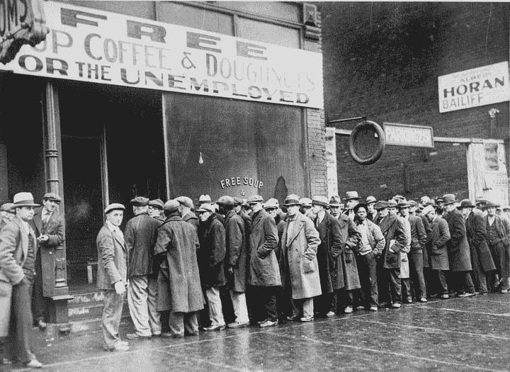

> 作者：[臧大为](https://www.zhihu.com/question/320288592/answer/652467092)

违法就是违法。不管把996粉饰的再好都是违法行为。令人奇怪的是，那么多大公司违法996，劳动部门却毫无作为，一声不吭，这就比较奇怪了。

996让公司违法获得了竞争优势，是不正当竞争。违法的996，降低了人工成本，淘汰了那些遵守劳动法，尊重员工休息时间的老实公司、好公司，这就是劣币驱逐良币。996让老板成了富豪，打击了竞争对手。但是从社会角度看，我们损失了什么？从社会角度看，其它公司为了活下去，也必须让员工开始996，也必须更加严厉的剥削员工，结果就是从此996开始蔓延起来，人人996、是个it公司都在996。

在资本主义自由竞争市场体制下，有一个公司开始作妖，比如你一家公司开始996，那另一家也必须开始996，否则我的成本就比你高，我就要被市场淘汰。有一个公司开始降薪，比如你降薪5%，我也跟着降薪。这就是资本主义的囚徒困境。如果没有法律加以限制，劳动者的休息时间和收入会被不断剥夺，直到最后终日劳动，所得却食不果腹，然后整个社会的主体劳动阶级由于分配太少，导致社会失去消费能力，产品和服务卖不出去，工厂企业倒闭，经济全面崩溃，工人大规模失业，社会面临动荡，这就是典型的资本主义经济危机产生的原因。

上个世纪1930年代的西方的经济大萧条和社会主义革命的根源就在于此，简而言之，市场经济不仅仅是比拼效率的制度，也是一个比烂的制度，谁最烂，谁的下限最低，谁剥削工人最狠，谁给工人工资最低，谁就能生存下去，获得竞争优势，最后赢家通吃，过上人上人的生活。所以资本主义企业家为什么喜欢给员工灌鸡汤？资本主义企业家必须尽量少给员工工资和尽量让员工延厂工作时间，还必须保证不能比其他企业狠太多，但是为了弥补自己出价低的劣势，那就得鸡汤补了，给员工灌迷魂汤，省得员工跑路。

员工不会被一下剥光，但是会一点点腐蚀，昨天阿里996还是独家，今天已经成为标配。昨天你不喜欢阿里的996还可以辞职换工作，今天你已经没得选了，任何一家it公司基本都是996了。那么下面会发生什么事情？会9106，反正都是996，某家公司再剥削狠一点又如何呢？然后企业家可以猛灌员工一点奋斗逼精神，弥补自己剥削更严重的劣势。然后其他公司也会慢慢的改成9106，直到成为业界标配。如果没有法律约束，这种对工人的剥削会慢慢达到极致，直到工人被剥削得精光。

Men stand in line outside a depression soup kitchen, 1931\. NARA

美国大萧条期间领救济食物的队伍。是他们工作不够努力吃不上饭吗？不是。他们一天工作20个小时。是美国的生产力不足吃不上饭吗？美国生产力吊打全世界。是没法法律的约束，资本家无止境的降低工人工资，最终工人分配太少，加上股灾吸干了工人最后的剩余，整个社会大众没钱进行消费，产品卖不出去，工人倒闭，工人大规模失业。经济危机爆发，席卷整个西方世界。

人民无饭可吃，社会面临暴力革命，资本主义危在旦夕。政治与商业领袖都害怕即将发生革命以及后续的无政府状态。在大萧条期间仍旧很富裕的老约瑟夫·P·肯尼迪在数年之后说道：

> “在那些日子里，我曾说过我愿意分出一半的财产──如果我可以确定法律与秩序能让我保有剩下的一半的话。”

罗斯福临危受命，制定一周工时40小时、最低工资、工人的补偿、失业补偿、禁止童工的联邦法律、直接来自于联邦的失业救济、社会安全法案、再兴劳工委员会与健康保健。并通过货币政策剥夺了富人的部分财富，设立政府项目雇佣工人，发放工资，平抑财富差距。使得社会普通大众重新有钱进行消费，多管齐下，挽救了美国经济，也挽救了资本主义世界。

所以，劳动法是上百年劳资双方博弈斗争的结果，使用原子弹飞机大炮和无数人头和鲜血换来的，也是历史教训的总结，不是可有可无的。如果不严格执行劳动法，大家一起比烂，最终这个经济要完蛋，社会也会跟着完蛋。苏联中国式的暴力革命难免不重演。真到那时候可没有无辜的资本家，就像土改时没有无辜的地主一样。

资本主义国家经过上百年的运作，已经形成基本的劳动者法律保护制度，避免了像经济大萧条这种严重经济危机的重演。欧洲干脆就转变成了民主社会主义国家，对富人极高的税负和普遍的福利系统，其目的就是平抑资本主义贫富分化差距的。由于中国施行自由经济制度时间有限，反而这这方面缺失很严重，外贸经济时代当然差点也许更有竞争力，但是随着中国经济体量加大，内需已经是经济增长的重心，再漠视劳动者分配和权益保护后果将会很严重。中国的资本主义已经由90年代的自由竞争阶段，渐渐转变为现在的资本巨头垄断阶段，我们面临的选择也越来越少。

996对任何人都没有好处，对工人对企业都是如此。但是自由竞争体制下，企业不能摆脱这个囚徒困境——你不996，总有企业996，你就失去竞争力被淘汰。所以必须从全局的法律政策方面入手，谁违规处罚谁，谁996处罚谁，大家遵守游戏规则，正当竞争，这样才能继续玩下去。

超时工作压榨工人导致经济危机还是小的，超时工作还导致了没时间过夫妻生活，没时间结婚，没时间养育子女，从而导致生育率下降，比如日本，几百年后人口都会灭绝了。所以严重点说不惩罚违法996，会导致亡国灭种也不为过。

所以，我强烈建议劳动部门应该迅速进驻这些企业，强制执行劳动法条款，任何人都别想违规获得竞争优势，保护工人应有的权益和休闲时间，才能缓解我国目前越来越严峻的经济形势。其他中小企业可以先不管，但是龙头企业一定要严格执行劳动法，这关系到我国的长治久安！

* * *

消灭996还有一个办法是改变生产关系，由工人自己创业，自己管理，自己分配企业，也就是国际上流行的工人合作社企业，感兴趣的可以加群（229434453）讨论下。