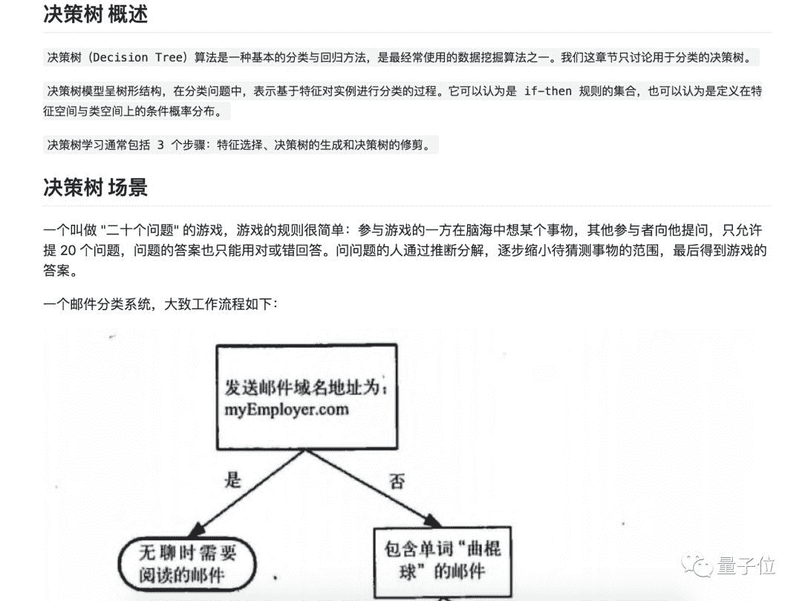

> 来源：[量子位](https://mp.weixin.qq.com/s?timestamp=1555895447&src=3&ver=1&signature=3GEcWr7aheM5AZuvTqwx0peTrDS2AUoirRYVeC82ZRd1sdUH08Evp0YXUz3K*TgX3m6*HTOXnz0RiO5icubMu9S0RvwEabNuKmYbQWXp23VrTfI9ev7vTG5ol5Qk33mi5mg08uw7XxclYjOF4suDyxwT0drawn6dUmwnXD*acg8=)

再也不用在学机器学习之前先恶补英语了，这儿有一套超热门的优质中文资源可以选择。

这套名叫AI Learning的GitHub资源，汇集了30多名贡献者的集体智慧，把学习机器学习的路线图、视频、电子书、学习建议等中文资料全部都整理好了。

目前资源在GitHub上已经有一万颗Star，微博网友：好人一生平安。

事不宜迟，来看看这里面有啥。

从入门到大牛

很多初学者都会遇到这样的问题：入门机器学习应该从哪里学起？

这些过来人表示，学习路径分三步，先学机器学习基础，然后攻克深度学习基础，最后学习自然语言处理（NLP）相关知识。贡献者表示：按照这个流程来学习，你可以当大牛。

在机器学习基础部分，贡献者给出的学习路线图是这样的：

1.  机器学习基础
2.  KNN近邻算法
3.  决策树
4.  朴素贝叶斯
5.  逻辑回归
6.  SVM支持向量机
7.  集成方法
8.  回归
9.  树回归
10.  K-Means聚类
11.  利用Apriori算法进行关联分析
12.  FP-growth高效发现频繁项集
13.  利用PCA来简化数据
14.  利用SVD来简化数据
15.  大数据与MapReduce
16.  推荐系统

在上面16个学习模块中，是知识点介绍、常用工具和实战项目等不同类型的学习资源的整合版。点进去就是具体学习资料，非常方便。

比如决策树模块，先介绍了概念与主要场景：

然后介绍了具体的项目案例和开发流程代码：

每个模块还有配套视频，一并服用效果更好：

即使以后出现了新的学习资源，这套方法论也可以用上。

深度学习基础部分在第一部分的基础上，继续扩展了反向传播、CNN原理、RNN原理和LSTM四个知识点：

每个知识点对应一个口碑介绍帖，内文图文并茂。

NLP内容的学习路径偏向于实际应用，在文本分类、语言建模、图像字幕、机器翻译、问答系统、语音识别、自动文摘7个领域极少，还一并放上了大量相关数据集：

省去了为找数据集跑断腿的烦恼。

机器学习零食库

除了能get到完整学习路径持续通关，还能在里面找到人们机器学习资料“单品”。

有经典口碑英文视频吴恩达篇：

有入门专项训练篇等任君挑选：

整理好的电子书，直接下载PDF即可使用：

最后，这个神奇的页面还自带贡献者们自己摸爬滚打的心路历程和学习建议。

看来这个资源，够你用很久了↓↓

## 传送门

GitHub地址：[https://github.com/apachecn/AiLearning](https://github.com/apachecn/AiLearning)