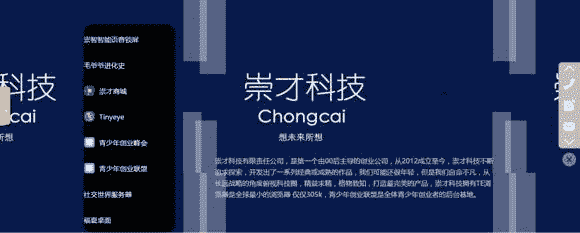
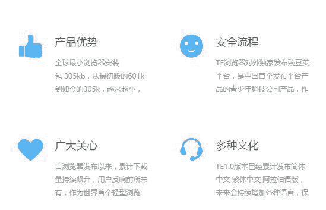
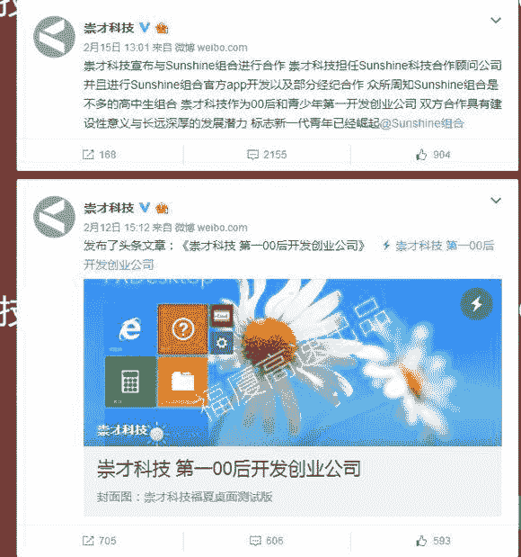
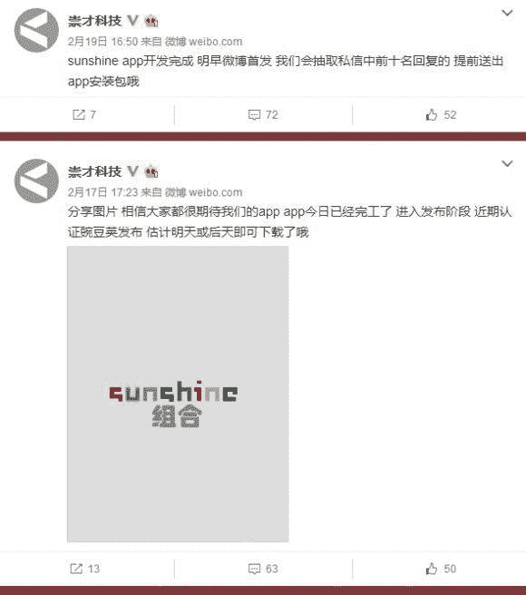
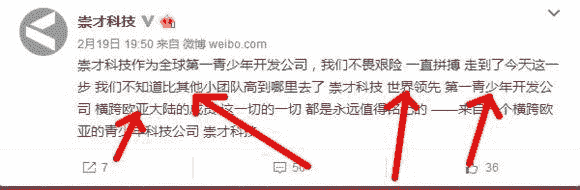

> 作者：[Themaxmaxmax](https://zhuanlan.zhihu.com/p/33272021)

ROUND 1 首先我们先来看看，崇才科技自己官网上的描述　chongcai.win

好的，其中有一句：“开发出了一系列经典或成熟的作品”

“一系列”，对不对？？

旁边是不是有一串所谓“产品”的列表？

如果你仔细去看，只有点击“Tinyeye”才有反应，其他好像都没发布，没有链接…点击“Tinyeye”后，进入的不知道是smg…

看上去似乎高大上，但是这个暑假好像下载人数不超过10

所以，又有什么用呢？？？还阿拉伯语…

ROUND 3 这个不用说了~~~大家在VB吧里都看过 【搬运】 @4520383 [http://weibo.com/p/1006065492125404](https://link.zhihu.com/?target=http%3A//weibo.com/p/1006065492125404) 哈哈哈哈哈一堆00后靠着老爹的50w竟然创造了一个公司？你家老爹挖煤矿的吧。问题是还有一堆煞笔加了进去！与sunshine（楼主都不知道这是smg）合作哈哈哈，他们未经@福厦高速 的许可私自以自己的产品的名义发布FXDesktop哈哈。6666666。自以为代表00后的明天

貌似只会VB

（而且技术很差） 中国“说大话”第一名！ 附几张图：

被崇才所谓“高到哪里去的”团队就是偶们的行随意动，至少我们有许多产品且从不夸张高调

[www.xsyds.cn](https://link.zhihu.com/?target=http%3A//www.xsyds.cn)

ROUND 4

现在市场上已经几乎见不到崇才的产品真身了

但是从用户反馈来说，所谓TE浏览器的UI…

然而图片传不上来（以后我会补图）

”不如安卓自带的“

”就一个浏览框“

……

既然就一个浏览框就能做出世界最小手机浏览器，

那么广义上来说，我们可以：

建立一个VB.NET项目，就放一个网页框、一个文本框、一个按钮，然后加入自适应大小代码，然后生成，再用微软刚刚发布的转换器转换成UMP，这样我们就可以在WP上使用我们自己的”世界最小手机浏览器”

By_行随意动、max