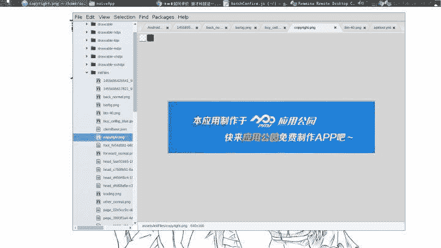
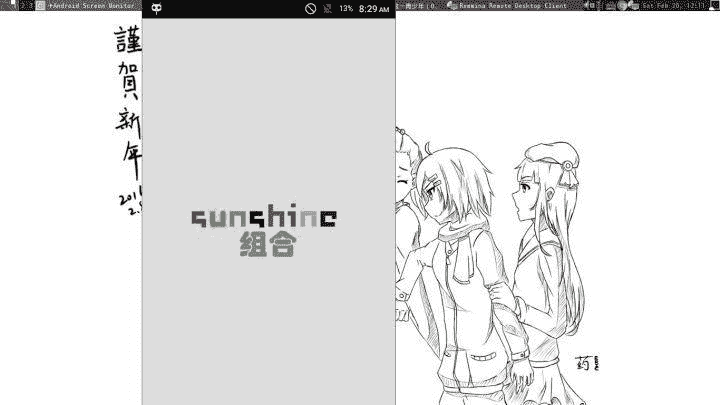
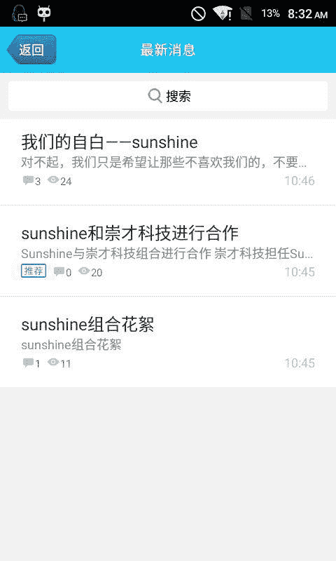

> 作者：[金少海](https://www.zhihu.com/question/27827350/answer/57115213)

*–以下2017.09.07 11:50*

来看看崇才的“公关”，十分简单粗暴哦！


昨天有大佬在崇才群里当着他们的面扒皮，然后被暴力rm了。


所以他们遇到被说抄袭，不是急着公关，而是把对方rm出自己的视线。

*–以下2017.09.05 13:40*

以及喷着Windows用着Windows


今天又想起来一个抄袭的作品。[中国青少年首个轻博客开源产品发布 00后CEO讲话](https://link.zhihu.com/?target=http%3A//m.sohu.com/a/154705865_590558/%3Fpvid%3D000115_3w_a)

> 崇才轻博客可以用于各方面，包括公司官网，个人博客，甚至下载网站，这都是可以的，最重要的是，用我们开发者的话说，我们摆脱了传统网站以及博客源码对mySQL数据库的依赖，我们解决了这个问题，我们用的txt系统录入全部信息，这是先进的，便于无基础人员更改的，甚至无基础的人直接解包对接就可以开一个自己的网站了。

实际上改的就是这个：[BlogMi：不需要数据库的迷你博客程序 | 倡萌的自留地](https://link.zhihu.com/?target=https%3A//www.cmhello.com/blogmi.html)。

*–以下2017.09.04*

想知道他们的姿势水平？就是抄啊！

两个月前他们需要发布一个“不需要数据库的博客”（其实就是改了一个开源项目的版权），然后搞了个“崇才网盘”，我当时也看了，其实就是拿汉化破解版的Veno File Manager改的_(:3

当时看了就没管了，后来发现这个站被大佬爆破出配置文件了。


*–以下2017.09.03*

很嚣张的说那些企业家已经老了，未来属于00后！雷总默默笑了。

说有很多app，其实不还都是改别人的代码。

其实这一波宣传做得他们自己也很满意。


下面是sunshine相关的了…

*–最新版本：2016-02-22*

他们居然还有官方网站了! [崇才科技 | 欢迎访问崇才科技官方门户网站！](https://link.zhihu.com/?target=http%3A//www.chongcai.net/)


然后看了一下whois信息,有点年头了。

```
Domain Name: CHONGCAI.NET
Registrar: SHANGHAI MEICHENG TECHNOLOGY INFORMATION DEVELOPMENT CO., LTD.
Sponsoring Registrar IANA ID: 1621
Whois Server: grs-whois.cndns.com
Referral URL: http://www.cndns.com
Name Server: LV3NS1.FFDNS.NET
Name Server: LV3NS2.FFDNS.NET
Name Server: LV3NS3.FFDNS.NET
Name Server: LV3NS4.FFDNS.NET
Status: ok https://www.icann.org/epp#OK
Updated Date: 21-feb-2016
Creation Date: 24-may-2015
Expiration Date: 24-may-2016 
```

只能说拭目以待了。

*–以下2016-02-20午*

崇才终于发布了传说中的app。

拿到app首先用apktool反编译咯。


然后我们打开来看看，首先打开AndroidManifest.xml就注意到了包名


apppark，有意思。

随后简单翻了一下。完全是apppark的痕迹。




所以嘞这个app只是一个简单的用apppark生成的玩意儿。

接下来具体看看。因为genymotion上不能正常运行，我就拿了真机来测试。

先adb install安装上。哇这个logo好可怕……挺难看清这到底是什么玩意儿……


闪屏



主屏


到这里我才想起来我可以用手机截图（扶额）

最新信息



专门宣传崇才的崇才新闻……


你爱给自己打几分就打几分


评论区也大部分是吐槽。

试用完毕。

*–以下2016-02-19晚*

中午崇才发了条微博，大意是我们很支持有梦想的团队啊blahblah然后公布了一下公关信息


下午大部分时间在做(chao)作(da)业(an)，所以没怎么关注崇才，吃饭前我打开崇才的微博瞟了一眼，发现他们终于发布了关于app的信息了，就等着明天看这个app到底是什么个样子好了。（想想那个上个年代的splash screen就知道了）拭目以待

然后有了这条微博。


觉得有些不对劲了，注意到李一龙at了begin Studio，就点进去，发现这么多年没动静的beginStudio居然更新了！


文章在这里 [关于崇才科技和娱乐圈合作的真相](https://link.zhihu.com/?target=http%3A//weibo.com/ttarticle/p/show%3Fid%3D2309403944283563536290)

从文章中看起来，早上的3Miracle有可能不是她们的个人意愿。但到底是什么情况，仅凭这些没法完全判断出来。

倘若真的按照文章中的一样，那么崇才的行为的确是恶劣了。

*–以下2016-02-19早上*

今早起床后日常刷微博，发现那个大V黄宏量发了一遍文章，[“逼”要装，“度”要有——送给崇才科技的某些小朋友](https://link.zhihu.com/?target=http%3A//weibo.com/p/1001603944103225225453)，我马上点进去看了。致崇才科技的某些小朋友那一段我觉得写的还是很好的，当时转发了，并且希望崇才能看见这篇文章，能好好考虑一下自己。

崇才的确看了

看了以后应该好好思考过了

但是

**他们又搞了个大新闻啊！**


我一看卧槽这又是什么鬼！

3Miracle是什么鬼！

吓得我刚才连miracle都不会拼了！

顺手点开了他们的微博又看到了2条


先看福厦那一个。首先福厦是叫福厦。你连自己成员的作品名字都不尊重。这都要打错。下面还打成了福厦周末，这是有多心急啊。

后来一想，这一条应该是针对我之前发的一个评论发的。


后来我又去找了一下，当初福厦高速的发布在这里，[【跟风丨超越】FXDesktop【福厦桌面】0.1开发者预览版高调发布_vb吧](https://link.zhihu.com/?target=http%3A//tieba.baidu.com/p/3752614231)，日期15年，好……是在下输了。

我想说这个同学其实还是不错的，站错队而已。

再看第二条。

大v原文有一句

> “00后和青年开发创业第一公司”还不知花落谁家呢？不要再整天“00后”“第一”地吹了。

但是看起来崇才不听啊！照样我行我素，继续吹。那些什么第一第一第一把我砸的眼花缭乱的。

最后引用那篇文章里的一句话来结束这次更新

> 不好好学习，以后ABBY被壁咚的墙就是你砌的！

_–以下2016-02-18

_到这一次修改(18/02/16 10:30)为止，今天崇才没有搞出任何大新闻。

昨天团队里一个人提醒了我，当初崇才的CEO有问我，有一个项目问我要不要加入，崇才可以给我们投资200……没错是200软妹币……

Martian大大在微博上发表关于要DDoS崇才即将发布的Sunshine组合App的服务器，崇才微博上也马上回应，说某QQ骚扰性加好友啊……探听情况啊……夜间电话恐吓啊……（一次性就挂了3个人……）


有意思的是有一个还是新浪黄V也在其中

但是崇才的anhui48真的被炸了啊！崇才马上进行危机公关


说什么让新成员入驻官网抵御攻击啊……还说这是做样子，是演习，后方有他们精锐呢！

你一sae应用怎么让成员抵御攻击！还在后方准备了精锐！

坑爹啊！讲的你有权限进入你的sae应用对应的服务器一样的……

那么请问为什么你们的页面还宕着呢……


他们把这个叫做崇才首次中小学训练科目……

最后还不忘扯一下国际装个逼……这叫做“全球首次大规模实战化的青少年防黑演练”


当然不能忘了让合作放心……


然后Martian大大就和崇才撕了起来……


大V忍不了了……表示本来不想这么闹的，但是鉴于崇才这么嚣张于是……


至此……崇才多能装逼大家也都知道了……

顺便求崇才把[www.anhui48.com](https://link.zhihu.com/?target=http%3A//www.anhui48.com/)恢复吧……既然有50w充点云豆也没什么的吧……嫌sae云豆不靠谱就搞个vps什么的

有别的想到再更新。

*–以下2016-02-17*

之前是一个begin studio，现在是一个崇才。（虽然听说过以前那个begin也是崇才当初的傀儡什么的，这里不讨论）

我自己手下有个团队，名气不大，叫做天海信息科技。成员也不多，但我要拿出来说是因为我们团队和这个崇才公司还是有共同点的，那就是我们成员大部分是高一及以下的。学生团队有一个很明显的缺点，比如因为之前我和另外一个成员刚好要中考，所以有个项目耽搁了一年。（其实还有个原因是我有拖延症（误））学生团队就是这样：**因为学习肯定得摆在第一位，所以很容易让开发周期变长。**

这个崇才科技，中二病十分严重。甚至比我还严重_(:3 （毕竟soha还是自认为很中二的人）。因为和他们认识的早，之前还莫名其妙卷进一场内讧（不确定是不是内讧）。[http://weibo.com/5565492644/CfRxGFHbP](https://link.zhihu.com/?target=http%3A//weibo.com/5565492644/CfRxGFHbP)


而且我们团队一直叫天海信息科技，从来不叫天海studio。

在找这条微博的时候还发现一条微博，引用在下面。

> “崇才科技的使命是改变世界，成为科技界的王者” 自大也得有个度ok？让大家都瞧不起你就不好。如果你认为，凭你就可以改变世界 就凭参加了几个会议就想改变世界 那么不是自大是什么？

我也算是看着崇才这一年发展的人。他们注册了公司，他们开了官方微博拿了认证。他们派人去了俄罗斯（不过并不知道干了什么），然后就出现了俄罗斯分部什么东西。

tiny eye那个浏览器我见过，当时觉得还不错，直到我看到了包名。


你改了这么多！好歹改一下包名啊！

再看他们官方发的一条微博。


再多说一句……我笨……这个浏览器我用不来……

崇才和sunshine合作这个我知道以后我就去翻了他们微博…找到了那个anhui48（我就想到了大AKB48）打开网页感叹他们的前端技术终于变好了，然后我顺手点开了源码，一眼戳中html lang=“en”。然后又仔细读了一下……又是抄模板啊！

这抄的的确有点低逼格了，我几年前没开始搞Web开发的时候不会做网页就抄模板（黑历史orz，其实现在烂也抄），都知道去掉lang=“en”，然后删掉注释…

还有几个抠图…白边都没抠干净…用的是sae，现在貌似被耗光云豆了。


暂时扯到这里…别的想到再更

*–以上2016.02.17*

不想做过多评价，虽然我也有一个团队，但是对于崇才和begin我只想说，乱，太乱。

*–以上2015.07.30*