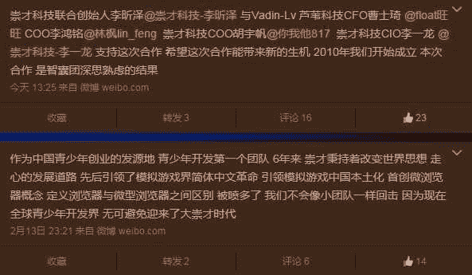
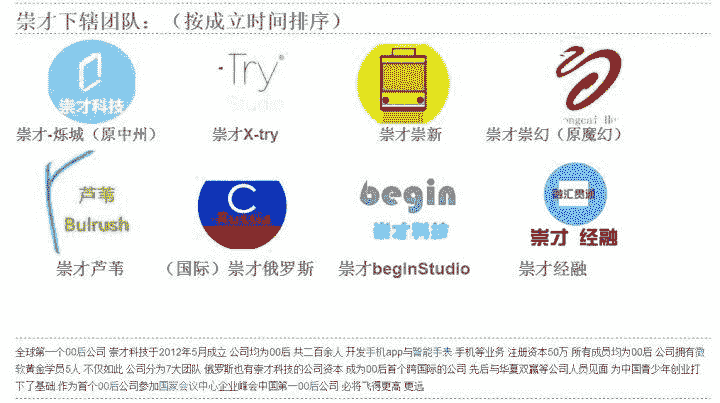

> 作者：[尧以俊德](https://www.zhihu.com/question/40403595/answer/86406748)

如何看待 Sunshine 组合和崇才科技的合作？

这个不好说，但是从目前的情况来看，**中二。**

我几天前就在关注“崇才科技”这个“公司”（

[@Joy Neop](//www.zhihu.com/people/fe79932882911a80c924c8cfffac0926)

关注了他们官博所以我看到了），以及它周边的几个主要的头儿（“CEO”）。我最吃惊的不是这个“00 后公司”（貌似）是经过了工商注册的，而是这几个微博号看来注册时间都不长，却就在这几天里搞了个大新闻。（虽然此公司声称其创建于 2012 年 5 月（有的地方又写 2010 年））
**更正：崇才科技刚刚发微博澄清了这个问题：2010 年是工作室成立，当时并没有名字；2012 年是工作室命名对外公布，2014 年是开始完全性开发，2015 年成立公司。**


多的我不说，首先**产品没有做出来就在吹**，看起来是高大上得不得了。加上到现在为止都一直在发的浮夸的言论：


> ***Talk is cheap, show me the code.** —— Linus Torvalds*


这位同学，错别字啊。



（我是点赞狂魔）
看起来异常高大上，**可是和中科院那帮老家伙有什么区别？**

说到这里不得不提在微博上发现的此公司的几个项目：


先不说微软会不会告死你的问题，点开大图会发现有块 Tile 上有 XML 代码，什么鬼。我特意下载试用了一下。这台机子不是我的。


我的分辨率是不是被吃了。


做工极差，标题有个仿 Windows 8 的动画，非常生硬。背景图片是微软专有。调用 CMD 的函数错了（你们一定用的 ShellExecute 什么的吧，麻烦把弹出的窗口设成弹出，搁后面鬼看得见）。有个锁屏双击解锁，注销功能除了关闭本身还真的调用了注销（喂要不是知乎会保存草稿啊真是亦可赛艇）。其他都是调用系统命令。


```
signed int a;
signed int b;
printf("%d", a+b); // 这程序 VB 作品吧 
```

拜托，小学信息学奥林匹克都会高精度四则运算吧。
如果一个公司拿出这样的产品做招牌，我觉得不如倒闭算了。“崇才科技”既然要立志做大公司，拿什么说话？实力。**而技术公司的实力体现就在产品上，不是磨磨嘴皮子功夫就能蛊惑大众的。**群众的眼睛是雪亮的。

其次，此“公司”打着“00 后”的旗帜到处宣传，各项数据也浮夸得很。



先不论这些数据是真是假。首先，[崇才科技](https://link.zhihu.com/?target=http%3A//chongcai.isitestar.cn/)这个网站在手机端的体验简直了。（图自

[@燒餅馮](//www.zhihu.com/people/a1d6cf50a019f8f597ac247f6ece635e)

我相信不会侵删的）


连网站都没有能力自己写，要套建站之星的模版。这些我也不说了，“崇才科技”下属团队的 LOGO 都是看不下去，mspaint 水平。网站是面子工程，这个至少得做好吧。就算是做成 [The GNU Operating System and the Free Software Movement](https://link.zhihu.com/?target=http%3A//www.gnu.org/) 那样我都不会说什么。

综上可见中二。这种事我见得多了：

*   2012 年的安同开源社区

*   天润 OS

以上我绝对没有黑的意思。混 Linux 吧的也许知道安同 OS 在 2012 年时候在贴吧的宣传就是这样浮夸，打着“学生党” 的旗号结果 QA 根本做不好；还有天润 OS 在各大贴吧宣传的“中国第二国产系统”其实是三十天自制操作系统。

**这样浮夸只会招致反感。**

如果实力摆在大家面前（比如，你公司有一到两款真正知名的 App 或者什么的），现在招致的怀疑也没有那么多。但是我们看到的“崇才科技”，仅仅是一个充满了浮夸风放卫星的“00 后”创业公司。
可能你公司的人会觉得我说得不对。是，我可以假设你公司的 5 名微软黄金学员是真的，七大跨国团队存在，**却不能假设一个并不能证明自己可以骑自行车的人可以驾驶波音飞机。**现在是市场经济，用户拥有选择权，如果你们的 App 作为 Sunshine 的门户在你们承诺的三天内做不好，我觉得很可能搞砸 Sunshine。（**更正：多谢评论区指正，Sunshine 并没有删博**）

说到中二，我们也曾中二过，谁不年少轻狂呢？安同开源社区也有黑历史，我们没删。[安同_新浪博客](https://link.zhihu.com/?target=http%3A//blog.sina.com.cn/u/2524408051)（谁 15 年贴的 Blog 我怎么不知道）贴吧的帖子应该也没删。
但是我们_作为长者，见得多了，身经百战了，确实是有一些这个，人生的经验，来告诉你_。要证明自己的实力给老师看，就要考好成绩；崇才科技要证明自己的实力给大家看，就要做好产品，让大家先信得过。龙芯吹了那么久就算是有成绩人们也不太相信，又何况贵公司成员组成特殊，又到处说些华而不实的话语？

我认识一个学长现在是某大学的研究生导师。他有一次跟我谈到，他给研究生分配项目，有一个说自己其实是有实力做好的，只是 balabala 而已。我学长就说，你说你有实力，明天晚上交货。结果这位研究生不能完成，我学长就说，你不是说你有实力吗，为什么别人能交货，你不行？**实力是秀肌肉不是绕口令**，崇才科技恰恰是给大众耍了嘴皮子，大众又没听过这“公司”，当然不买账。

截至我准备发布答案，我看到崇才科技给 Sunshine 制作的官网：[Sunshine组合全球官网](https://link.zhihu.com/?target=http%3A//www.anhui48.com/)。同样套了 Bootstrap 的模版，但是还是有自己做的痕迹，总算有个看得过去的样子。

我今天得罪了你们一番。不过，花言巧语都是“迷汤大全”；你们期待鲜花却得到鸡蛋，经过这种事情贵公司一定受到不小的打击。但重要的是，收拾心情审视自己，不要放卫星，**仰望星空的同时也要脚踏实地**。我很了解你们的心情。

> 你当我是浮夸吧
> 夸张只因我很怕
> 似木头似石头的话得到注意吗
> 其实怕被忘记至放大来演吧
> 很不安怎去优雅
> 世上还赞颂沉默吗不够爆炸
> 怎么有话题
> 让我夸
> 做大娱乐家
> ——陈奕迅《浮夸》

另外，也不要放弃你们的梦想。**“没人嘲笑你的梦想，他们只是嘲笑你的实力。”**这话是之前同样有人送给 Sunshine 的，我希望 Sunshine 也能认识到。