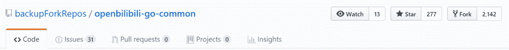

> 作者：[CSDN](https://mp.weixin.qq.com/s/Gx220w6YI0vV8jyRBx9hMw)

> “后院”都要失守了，就先别馋大碗宽面了——B 站，你可长点儿心吧！

“你的源代码泄露了，还搁这儿吃面？”

2019 年 4 月 22 日，B 站（bilibili 弹幕网）官方微博账号内一片风平浪静岁月静好，照常发着安利视频。蹭着吴亦凡的新歌热度，16:56 分的推送是一碗货真价实的“大碗宽面”，但评论里的画风却是清一色的跑题——集体喊话 B 站，“回家看看吧，你家后院被点炮了”！

吃面路人一脸迷惑，啥？B 站到底咋了你们说清楚？

**报！！B 站后台源码疑似泄露！**

今天下午四点前后，有网友在 GitHub 上发现了一个“疯狂的”repo——上线不到 6 小时，便斩获 5000+ Star，Fork 数也一路飙过 6000，而且完全没有暂缓的趋势。

这个 repo 内容介绍的一行字也足够简单粗暴——哔哩哔哩 bilibili 网站后台工程 源码。

吃瓜群众惊落一地瓜子：嚯！B 站这是把自家的核心代码开源了？！还是说只是开放了旧版源码？此番 B 站方面是主动开源还是无辜被泄露？

一时间各种猜测、讨论潮水般涌入各大论坛及社交平台，“B站 源码”、“B站 GitHub”等相关话题的热度也在不断攀升。

但大家很快发现，该项目并未托管在 B 站的官方组织域（[https://github.com/Bilibili）](https://github.com/Bilibili%EF%BC%89) 之下，而其作者 openbilibili 也是个今天刚加入 GitHub 的“不知名人士”。因此，这次“开源”大概率上不会是 B 站的官方操作。

而且该项目的 README 包括项目规范和负责人信息两部分，后者还涵盖了详细的业务、具体负责人等信息。由此看来，这可能更倾向于团队内部的章程文件。

随着讨论楼越搭越高，在一众 666 之声中，开始有人提出“这个 repo 是在非法泄露源代码”。类似的声音在该项目的 Issue 中也越来越多，B 站官方社交账号下的评论也开始紧急呼叫“takedown”。

知乎网友@林溪 在回忆项目正式关闭前的最后一段时间时写道：

出于看热闹的心态，我试着 Fork 这个仓库，提示仓库已经 Offline，无法 Fork；然而此时该仓库依旧可以 Clone，有不少围观群众成功将其下载到了本地。

又过了几分钟，该仓库页面彻底消失，Fork 和 Clone 皆无法进行。至于其他人先前的 Fork，也提示无法访问。

至此吃瓜结束？

不！似乎没有结束，在十多分钟后，又可以访问这个仓库了，所以还可以继续围观一会。

终于，在 17:30 左右，后知后觉的 B 站与 Github，彻底删除了这个仓库。

**代码被开源了，然后呢？**

Openbilibili？B 站在 Github 上公开了自己的后端源代码？

如何看待bilibili(b站)源码被上传Github？

这么一来可能会有哪些严重后果？

与网曝同步而来的，是知乎、V2EX 等论坛上拔地而起的高楼。捋完 B 站年度大戏的始末，就该来聊聊此次事件的后果了。

项目关闭了，但整个事件一时间恐怕还难以落幕。

官方终于出手了，但还是太晚了——

考虑到 Git 分布式的特点，该 repo 在过去 6 个小时内已然经历了“病毒式”的传播，惊人的 Fork 数量告诉我们，众多备份还在流传，删除了备份还有下载。更何况诸多“野生”备份在 disable 前，又各自积累了上千 Fork。

更有网友贴心地整理出了 B 站后端源码学习笔记，以供交流使用。可这么一整理也让大家发现了一个问题——这份代码相当“全面”，也正因此暴露了很多问题和隐患。

对此，有评论在分析后果时指出，“如果有人想通过 B 站后端代码攻击 B 站，无需再进行逆向工程进而猜测其运作原理和漏洞位置。现在可以直接阅读源码，从中找到很多尚未公开的漏洞”。而由此被黑灰产盯上拔毛也将是意料之中。

当然，对于早前带起的关于“B 站用户账号密码遭泄露”的节奏，也有不少评论表示代码中泄露的账号明显为内部测试账号，“不会有人把账号密码放在源码里，都放在数据库里了”。

****

**藏在代码里的秘密**

写注释的程序员可能不止是天使，还是段子手。此番泄露代码的注释，把 B 站程序员内心的吐槽能量，以及 B 站那些你不知道的潜规则“卖”了个干干净净。

**那些年你走过的 B 站的套路
**

抽奖不成功也要发送弹幕，概率 20%，造成一种很多人中奖的假象：

你是尊贵的大会员用户吗？

此外，后台直接定义虚假播放量、大数据杀熟源码等实锤也一一被曝，这于 B 站而言显然不是什么好事。

**静能敲代码，皮能写段子**

程序员：皮这一下，是真的很开心。

产品！爱我你怕了吗！

快乐膜法了解一下？

**本尊回应啦！**

就在各路讨论分析、求源码等等搅得一团乱时，B 站官方于晚间悄悄挂出声明，回应称“所泄代码属于历史版本，已主动防御并报案”。

尽管如此，仍有细心的网友从代码文件中发现了可能与其声明不符的“蛛丝马迹”，其中便包括拜年祭 2019 的代码，强行说这是“历史”，似乎并不能说得通。

但事实究竟如此，恐怕也只有吃了亏的 B 站能说清了。

随着瓜越吃越大，B 站官方似乎有意下场肃清，从知乎热帖到微博话题，都被悄悄“和谐”了。

场外群众也纷纷表态，声明“从未 Clone、下载或者以任何途径获得 bilibili 公司的任何非正常途径公开的代码”。

所谓一瓜未尽又添新瓜，关于故意泄露源码的“元凶”，有说是被裁程序员的报复，有说是开源反抗 996 的第一战，更有调侃者剑指粉丝群体，但无论真相几何，先不论其职业生涯葬送以及给黑灰产强行送人头的后果，单是一首《铁窗泪》，可能已经为其备下了。

那么，你有是如何看待此次 B 站“被开源”事件的呢？

声明：文中图片来源网络，文章独立观点，不代表 CSDN 立场。

参考链接：

[https://www.zhihu.com/question/321235026](https://www.zhihu.com/question/321235026)

[https://www.zhihu.com/question/321236142/answer/659624161](https://www.zhihu.com/question/321236142/answer/659624161)