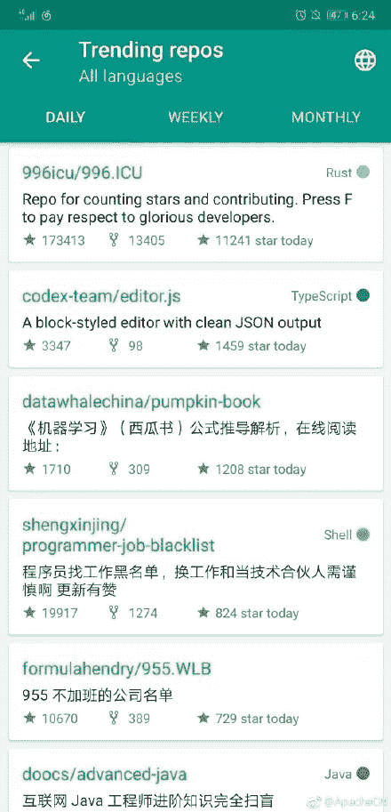

> 注意这个总结是不定期的，也就是重要的时间节点上会发这么一篇，告诉大家我们组织都做了什么。

1）首先，是组织的三大活动：

1.  学习活动完全交给 [Datawhale](https://weixin.sogou.com/weixin?query=datawhale) 处理，这样职责单一分工明确，效率更高一些。

    恭喜 Datawhale 被评为上海交大国家级创业项目。

    

2.  翻译活动即将暂停，因为翻译计划几乎全部完成了。[请大家为我们推荐新的翻译项目](http://bbs.apachecn.org/thread-77.htm)。

    今年开设/完成的已有翻译项目（不完全统计）：

    *   [PyTorch 1.0 中文文档和教程](https://github.com/apachecn/pytorch-doc-zh)
    *   [HBase 中文参考指南 3.0](https://github.com/apachecn/hbase-doc-zh)
    *   [OpenCV 4.0 中文文档](https://github.com/apachecn/opencv-doc-zh)
    *   [seaborn 0.9 中文文档](https://github.com/apachecn/seaborn-doc-zh)
    *   [Git 中文参考](https://github.com/apachecn/git-doc-zh)
    *   [Machine Learning Mastery 博客文章翻译](https://github.com/apachecn/ml-mastery-zh)
3.  比赛活动方面，我们和 [FlyAI] 合作，为大家提供了很多好玩的比赛项目，以及用于比赛的海量 GPU 资源，[并且带有奖励](http://home.apachecn.org/game/)。

4.  此外，恭喜 ApacheCN 的 [AILearning](https://github.com/apachecn/ailearning) 和 Datawhale 的[南瓜书](https://github.com/datawhalechina/pumpkin-book)喜提 Github trend。

    

    

2）然后是新增的项目或活动：

1.  我们把网站重新做了一遍，美化了 UI，包括[展示页](https://www.apachecn.org)，和即将完成的时间轴、友链和捐赠页面。这部分主要由算子和兔兔完成。

    如果你有兴趣参与，请联系片刻（QQ 529815144）。

2.  计算机电子书项目收录了 [Boyka](https://weibo.com/Boyka88?topnav=1&wvr=6&topsug=1) 整理的行业报告。感谢 Boyka 的付出。

    *   [行业报告归档 2017.3.21](http://it-ebooks.flygon.net/industry-reports-2017/)
    *   [行业报告归档 2018.3.28](http://it-ebooks.flygon.net/industry-reports-2018/)
    *   [行业报告归档 2019.2.8](http://it-ebooks.flygon.net/industry-reports-2019/)
3.  我们整理了[人工智能路线图（知识树）](https://github.com/apachecn/ai-roadmap)，近期还会有一次更新。

4.  我们组织了一个开源互助平台，方便开源组织领导者互相认识，互相帮助，整合资源。请发邮件到 apachecn@163.org 并注明组织信息来申请加入。

5.  我们开通了公众号 [ApacheCN](https://weixin.sogou.com/weixin?query=ApacheCN)。

3）最后是下个阶段的规划：

1.  为了探索新的内容创作方式，我们计划整理 CS224n 2019 版笔记，等到中文字幕翻译完毕后开始进行，如果你有兴趣，请等待我们的公告。

2.  此外，我们还将录制视频来讲解一些热门比赛的 WriteUp。

3.  为了使组织良性发展，我们需要与公益基金会（IT、教育类）合作，[欢迎大家提供帮助](https://www.zhihu.com/question/318287335)。