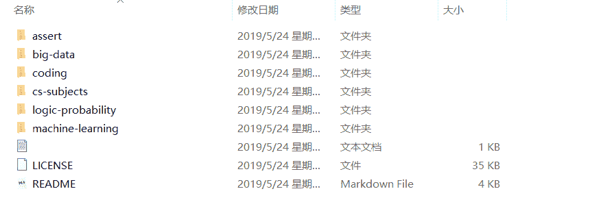
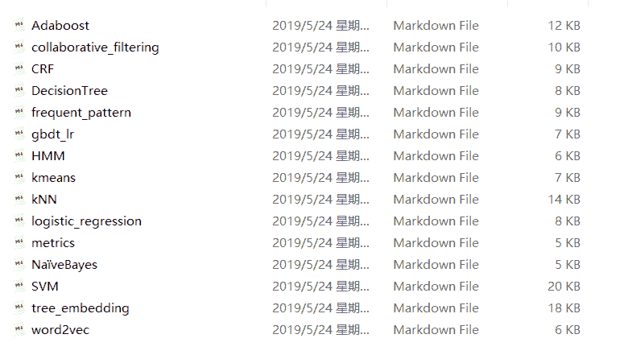
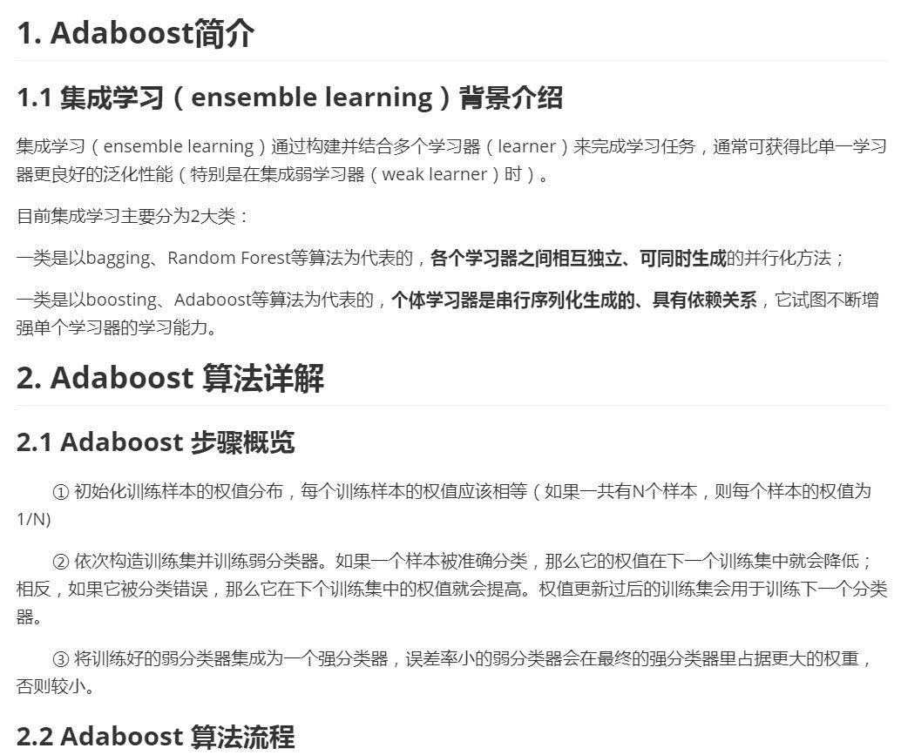
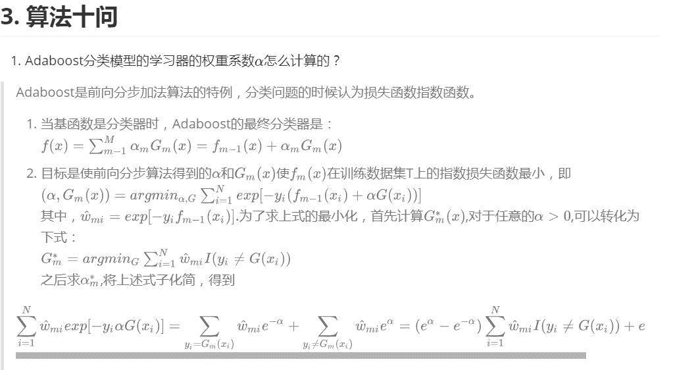
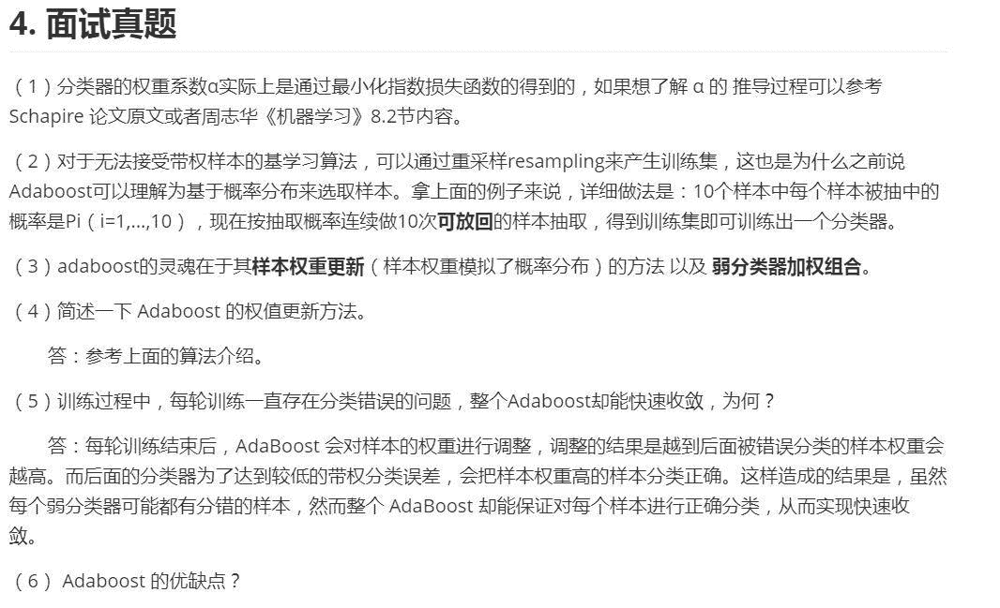
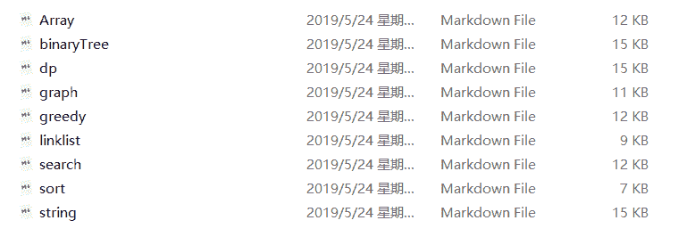
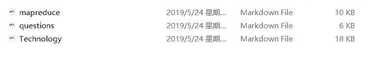
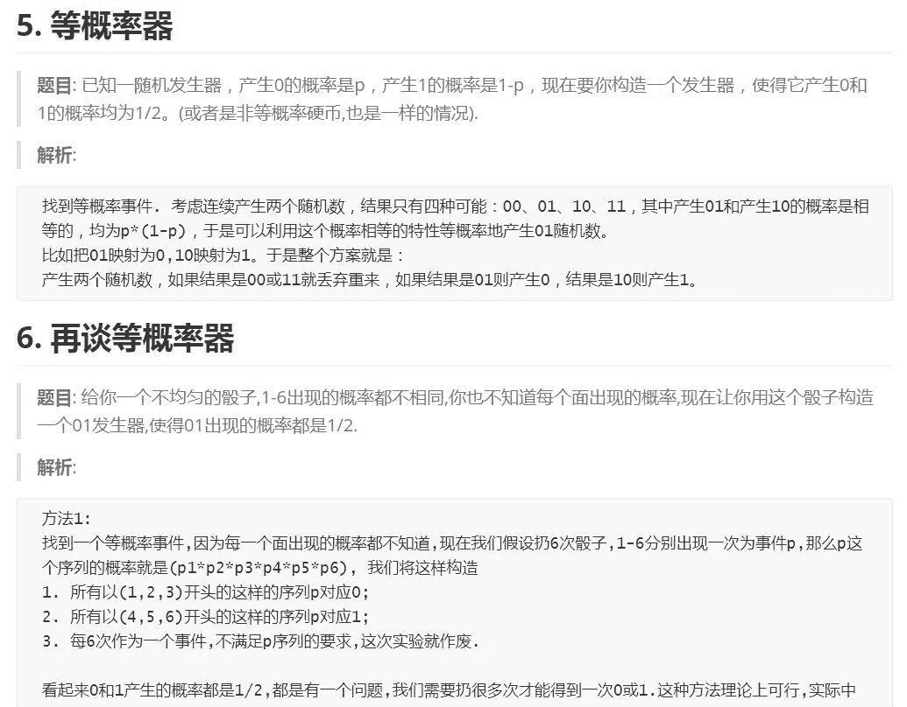
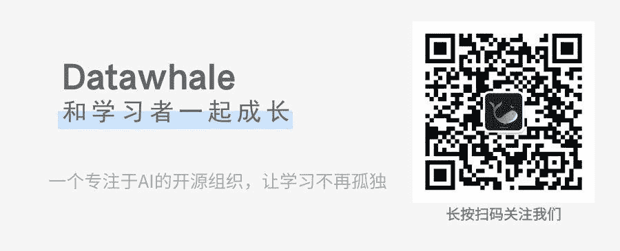

> 秋招变夏招，还没准备好？Datawhale团队成员offer收割机牵头，带领14名成员历时2个月，整理了一份机器学习算法工程师求职面经：Daily-interview。一份小而美的面经助您备战秋招，夏天来了，offer还会远吗？

金三银四的实习求职季已过，不知道屏幕对面的你有没有收到心仪的offer呢？如果你是offer拿到手软的大佬，不要懈怠，让优秀在人生长跑中成为一种习惯。但如果在求职中四处碰壁，与心仪的企业失之交臂，也不要整日眉头紧锁，你需要分析失败原因，修整心情，重新出发。

秋招马上要来啦！你的战甲准备好了吗？

## 何为战甲

一定有人会问，面试求职的战甲是什么呢？小编认为应该是一份属于自己的面经。

牛客网，知乎等众多网站上包含了数以百万计的面经，但往往大而散，面试者在准备面试时候去翻阅不但浪费时间，翻阅材料越多，越觉得自己很多知识点都没有掌握，造成心理上极大的压力，导致面试中不能发挥正常水平甚至面试失败。这就和高考前夕是一个道理，老师会告诫你：回归基础，不要再去做难题。回归基础为了以不变应万变，不做难题则是心理上的博弈。

那说到回归基础，每个人的做法又不同。有的人会拿起课本，将书中基础概念理论全部过一遍，没有针对性，没有侧重点。这时候就需要看看学霸们是怎么做的了，学霸会拿起自己的笔记本，上边全是重点难点易错点，是针对自己的学习情况总结出来的，这也是为什么每年状元的笔记本能卖出天价的原因之一吧。

其实，如果你是位有心人，那应该有自己的一份面试笔记，记录求职中常涉及到的知识点和自己做的项目中常被问到的问题。每次面试之前看一遍，做到举一反三，融会贯通，熟捻于心，方能在每次面试中汲取经验，最后从容应对。我个人就有自己的面试笔记，每次面试之前都会翻一遍，边看边想，但求好运。

但如果之前并没有意识到这一问题也没关系，Datawhale为你呈现一份小而美的面经。首先需要明白的是：这不是一份大而全，涵盖所有内容的面经，因为知识在不断更新迭代，做不到涵盖所有。同时不提供查漏补缺，因为每个人的短板不尽相同，需要面试者根据自己知识体系，多加思考，自己完善。 这是一份每一个面试者面试之前必看一遍的小面经，面试之前花半天时间，温故而知新。 如果你能根据自己的实际情况进行补充与修正，那可谓是如虎添翼，战甲升级了。

## 战甲现身

接下来看看这件战甲都由什么组成呢？也就是说这份面经应该怎么使用呢？

面经内容以岗位为划分，包含机器学习算法工程师，图像处理算法工程师，自然语言处理算法工程师三个岗位，目前只更新了机器学习算法工程师的面试指南，不过求职图像处理和自然语言处理的小伙伴也可以作为参考。

机器学习算法工程师面经共包含：ML、coding、Big Data、Logic & probability、cs subjects和DL六部分内容，涵盖计算机学科基础、逻辑思维、概率论基础、大数据、数据结构、机器学习及深度学习等知识，绝对是一份值得借鉴的面经啦。

01 Machine Learning

这部分介绍了机器学习常问算法的内容，包含了以下众多常用算法。每个子模块里介绍了基本思想后加入了算法十问和面试真题环节。

以Adaboost为例，首先介绍集成学习的基本知识

然后针对Adaboost经常出现的问题总结了：算法十问

最后给出了面试真题，关于面试真题，我建议大家将自己面试中遇到的问题加入进来，形成自己的面经小册子

02 Coding

这部分对常考数据结构与算法进行了介绍。

针对每一个细分环节，给出了十个经典题目参考学习，帮助学习理解。以sort为例，总结了快排、堆排、归并排序、多路归并排序、单链表插入排序与单链表归并排序的经典题目供大家学习，都是面试中常出现的点了，话不多说，你懂我意思吧。

03 Big Data

这部分包含了mapreduce、Technology与questions三部分内容，介绍了处理海量数据的相关技术和方法，最后同样给出了面试中经常出现的经典题目供大家参考。

04 Logic & probability

这部分内容包含了逻辑题目及概率题目两方面的内容。这部分也是面试中经常涉及到的题目了，这种题目没有什么技巧，只能够按照逻辑一点点分析，考察的是最基本的思维逻辑，做这类题目时只能沉心静气，慢慢分析但也要注意时间的把控。

05 CS Subject

这部分包含了计算机的一些基础知识，涉及操作系统、计算机网络和数据库等方面的知识，进程和线程具体是什么，Http和Https的区别等等内容，用心看上3遍，帮助你从容应对面试官提出的不经意的小问题啦！

[图片上传失败…(image-7f86bd-1558942151411)]

06 Deep Learning

这部分是关于深度学习的内容，该部分的内容还在更新完善中，大家可以先学习前边的内容，然后和小编一起期待后续内容的完善吧。

## 获取战甲

GitHub 地址：

[https://github.com/datawhalechina/Daily-interview](https://github.com/datawhalechina/Daily-interview)

点击阅读原文也可以直接浏览面经内容，别忘记star，关注后续更新内容啊。 除了收下这份面经使用指南外，还给大家带来了一个激动人心的好消息，针对这次总结的面经内容，我们正在筹备组队学习啦，带领大家一起备战秋招！

最后，希望每一份努力都有所收获。即将到来的秋招，你，准备好了吗？

贡献人员名单：

总负责人：xiaoran

监督&审核人：吕雪杰、康兵兵、程智超、xiaoran、咖喱

参与人员：李奇锋、程钰俊、Summer、莎莎、追风者、ZDou、地山谦、李文乐、Yvette明明就

感谢以上小伙伴为这次面经作出的努力~同时也欢迎优秀的你，为开源内容做一份贡献。

