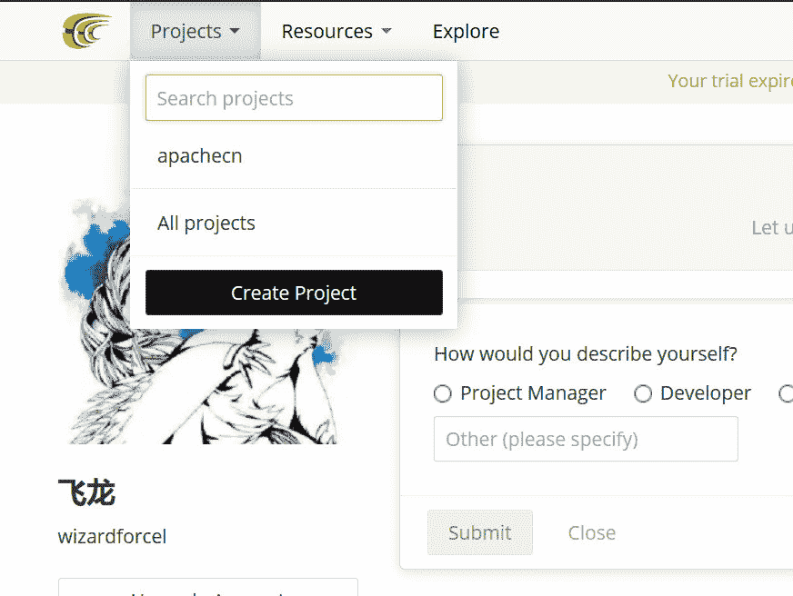
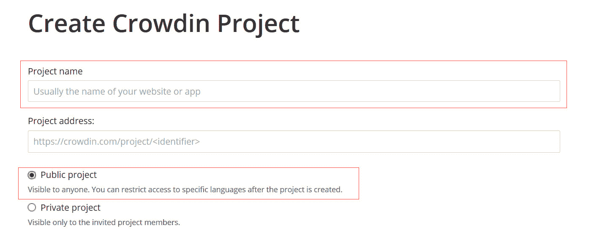
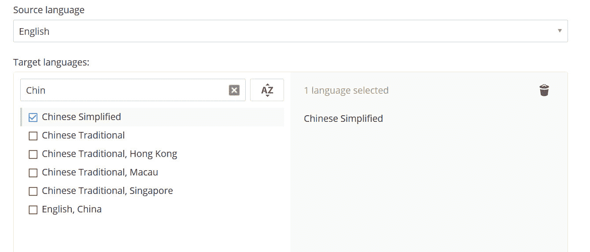
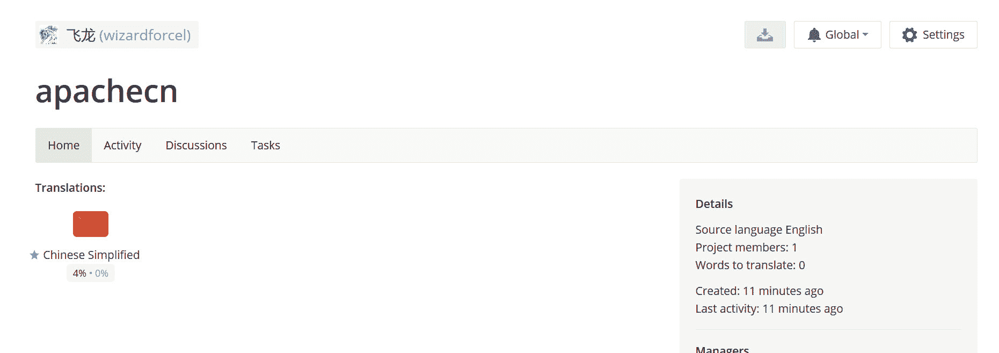
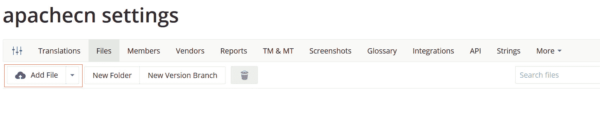
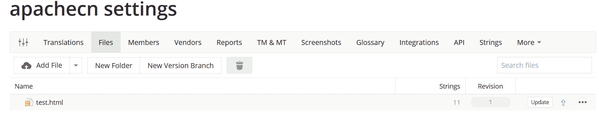
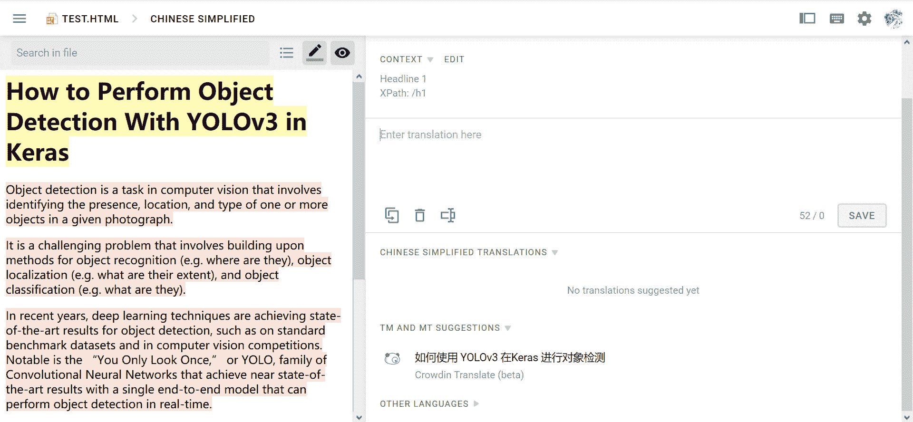
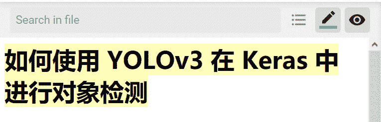

> 作者：[飞龙](https://github.com/wizardforcel)

## 创建项目

一、Github 登录

二、之后会跳到个人信息页，点击左上角的`Projects -> Create Projects`来创建项目。

三、在`Project name`填写项目名称，注意是全站唯一名称，和 Github 不一样。如果重复了可以加上`apachecn-`前缀。

如果你想让大家都看到的话，选择`Public project`，就和 Github 一样。

四、拉到下面选择语言，源语言`Source language`是英语不用管，目标语言`Target language`选简体中文（`Simplified Chinese`）。然后拉到最下面，点击`Create`创建项目。

## 上传文件

一、访问项目主页（`https://crowdin.com/project/<proj>`），这里以`apachecn`为例。

二、点击右上角的`Settings`，再点击`Files`，跳到文件页面。也可以直接输入`https://crowdin.com/project/<proj>/settings#files`。

三、点击`Add File`来上传文件。我这里选了个英文的 HTML，上传成功。

## 翻译

一、在项目主页，或设置页面中，点击`Translations -> Chinese Simplified`，再点击上传的文件。

二、等一小会儿之后，进入翻译页面，`TM AND MT`是机翻结果，可以参考，`Enter Trans...`处输入翻译，点`SAVE`保存。

三、可以立即在左侧看到翻译的内容。

