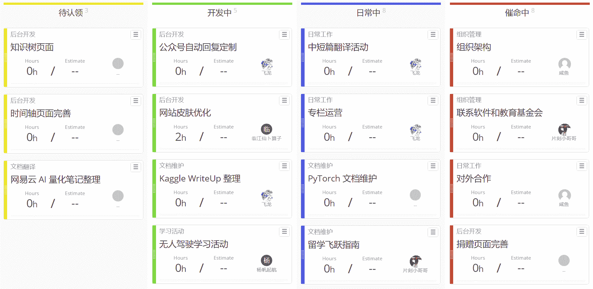

## 公告

1.  欢迎大家在我们平台上投放广告。如果你希望在我们的专栏、文档或邮件中投放广告，请准备好各种尺寸的图片和专属链接，联系咸鱼（QQ 1034616238）。
2.  我们组织了一个开源互助平台，方便开源组织和大 V 互相认识，互相帮助，整合资源。请回复[这个帖子](https://www.ibooker.org.cn/topic/2019-04-%e4%ba%92%e5%8a%a9%e8%81%94%e7%9b%9f/)并注明组织/个人信息来申请加入。
3.  请回复[这个帖子](https://www.ibooker.org.cn/topic/%e7%bf%bb%e8%af%91%e5%be%81%e9%9b%86/)来推荐希望翻译的内容。如果大家遇到了做得不错的教程或翻译项目，也可以推荐给我们。我们会联系项目的维护者，一起把它变得更好。
4.  我们的各个公众平台接受个人学习博文，论文解读，比赛心得等 AI 相关文章投稿，[请将文章链接发到这里](https://github.com/apachecn/awesome-AI-blog-post)，我们会每日从所有投稿博文中精选两篇，在 ApacheCN 全平台推送。
5.  为了能够将开源事业做大做强，[ApacheCN 需要与公益基金会（IT、教育类）合作](https://www.zhihu.com/question/318287335)，欢迎大家提供帮助。[同时我们也接受社会各界的捐助](https://t.modian.com/project/67957.html)。
6.  如果你不希望再收到我们的邮件，请直接拉黑我们，不要浪费彼此的时间，谢谢合作。

## 组织任务

认领须知：

1.  请私聊片刻（529815144）、咸鱼（1034616238）、或飞龙（562826179）来认领任务，我们会把你拉进合伙人群。
2.  除了列出的翻译项目之外，**现有**翻译项目不接受新的负责人。如果你打算贡献，请直接提交Pull Request。
3.  如果你的想法没有列出（包括但不仅限于翻译项目），同样欢迎私聊我们。

## 翻译校对活动

### 短篇集（校对）

参与方式：[https://github.com/apachecn/misc-docs-zh/blob/master/CONTRIBUTING.md](https://github.com/apachecn/misc-docs-zh/blob/master/CONTRIBUTING.md)

整体进度：[https://github.com/apachecn/misc-docs-zh/issues/1](https://github.com/apachecn/misc-docs-zh/issues/1)

项目仓库：[https://github.com/apachecn/misc-docs-zh](https://github.com/apachecn/misc-docs-zh)

关于卷积神经网络：认领：2/12，校对：2/12

| 章节 | 贡献者 | 进度 |
| --- | --- | --- |
| 关于卷积神经网络 | - | - |
| [1](https://github.com/apachecn/misc-docs-zh/blob/master/docs/what-do-we-understand-about-convnet/1.md) | @daewis | 100% |
| [2.1.1-2.1.3](https://github.com/apachecn/misc-docs-zh/blob/master/docs/what-do-we-understand-about-convnet/2.1.1-2.1.3.md) | @daewis | 100% |
| [2.1.4-2.1.6](https://github.com/apachecn/misc-docs-zh/blob/master/docs/what-do-we-understand-about-convnet/2.1.4-2.1.6.md) |  |  |
| [2.2.1](https://github.com/apachecn/misc-docs-zh/blob/master/docs/what-do-we-understand-about-convnet/2.2.1.md) |  |  |
| [2.2.2-2.2.3](https://github.com/apachecn/misc-docs-zh/blob/master/docs/what-do-we-understand-about-convnet/2.2.2-2.2.3.md) |  |  |
| [2.3-2.4](https://github.com/apachecn/misc-docs-zh/blob/master/docs/what-do-we-understand-about-convnet/2.3-2.4.md) |  |  |
| [3.1](https://github.com/apachecn/misc-docs-zh/blob/master/docs/what-do-we-understand-about-convnet/3.1.md) |  |  |
| [3.2](https://github.com/apachecn/misc-docs-zh/blob/master/docs/what-do-we-understand-about-convnet/3.2.md) |  |  |
| [3.3](https://github.com/apachecn/misc-docs-zh/blob/master/docs/what-do-we-understand-about-convnet/3.3.md) |  |  |
| [3.4-3.5](https://github.com/apachecn/misc-docs-zh/blob/master/docs/what-do-we-understand-about-convnet/3.4-3.5.md) |  |  |
| [4.1](https://github.com/apachecn/misc-docs-zh/blob/master/docs/what-do-we-understand-about-convnet/4.1.md) |  |  |
| [4.2](https://github.com/apachecn/misc-docs-zh/blob/master/docs/what-do-we-understand-about-convnet/4.2.md) |  |  |

### 写给不耐烦程序员的 JavaScript（校对）

参与方式：[https://github.com/apachecn/impatient-js-zh/blob/master/CONTRIBUTING.md](https://github.com/apachecn/impatient-js-zh/blob/master/CONTRIBUTING.md)

整体进度：[https://github.com/apachecn/impatient-js-zh/issues/1](https://github.com/apachecn/impatient-js-zh/issues/1)

项目仓库：[https://github.com/apachecn/impatient-js-zh](https://github.com/apachecn/impatient-js-zh)

认领：29/42，校对：27/42

| 章节 | 贡献者 | 进度 |
| --- | --- | --- |
| [1.关于本书（ES2019 版）](https://github.com/apachecn/impatient-js-zh/tree/master/docs/2.md) | @YouWillBe | 100% |
| [2.常见问题：本书](https://github.com/apachecn/impatient-js-zh/tree/master/docs/3.md) | @huangzijian888 | 100% |
| [3\. JavaScript 的历史和演变](https://github.com/apachecn/impatient-js-zh/tree/master/docs/4.md) |  |  |
| [4.常见问题：JavaScript](https://github.com/apachecn/impatient-js-zh/tree/master/docs/5.md) |  |  |
| [5.概览](https://github.com/apachecn/impatient-js-zh/tree/master/docs/7.md) | @kj415j45 | 100% |
| [6.语法](https://github.com/apachecn/impatient-js-zh/tree/master/docs/8.md) | @lq920320 | 100% |
| [7.在控制台上打印信息（`console.*`）](https://github.com/apachecn/impatient-js-zh/tree/master/docs/9.md) | @lq920320 | 100% |
| [8.断言 API](https://github.com/apachecn/impatient-js-zh/tree/master/docs/10.md) | @lq920320 | 100% |
| [9.测验和练习入门](https://github.com/apachecn/impatient-js-zh/tree/master/docs/11.md) | @so-hard | 100% |
| [10.变量和赋值](https://github.com/apachecn/impatient-js-zh/tree/master/docs/13.md) | @so-hard | 100% |
| [11.值](https://github.com/apachecn/impatient-js-zh/tree/master/docs/14.md) | @lq920320 | 100% |
| [12.运算符](https://github.com/apachecn/impatient-js-zh/tree/master/docs/15.md) | @wizardforcel | 100% |
| [13.非值`undefined`和`null`](https://github.com/apachecn/impatient-js-zh/tree/master/docs/17.md) | @wizardforcel | 100% |
| [14.布尔值](https://github.com/apachecn/impatient-js-zh/tree/master/docs/18.md) | @wizardforcel | 100% |
| [15.数字](https://github.com/apachecn/impatient-js-zh/tree/master/docs/19.md) | @wizardforcel | 100% |
| [16\. `Math`](https://github.com/apachecn/impatient-js-zh/tree/master/docs/20.md) | @wizardforcel | 100% |
| [17\. Unicode - 简要介绍（高级）](https://github.com/apachecn/impatient-js-zh/tree/master/docs/21.md) | @wizardforcel | 100% |
| [18.字符串](https://github.com/apachecn/impatient-js-zh/tree/master/docs/22.md) | @wizardforcel | 100% |
| [19.使用模板字面值和标记模板](https://github.com/apachecn/impatient-js-zh/tree/master/docs/23.md) | @wizardforcel | 100% |
| [20.符号](https://github.com/apachecn/impatient-js-zh/tree/master/docs/24.md) | @wizardforcel | 100% |
| [21.控制流语句](https://github.com/apachecn/impatient-js-zh/tree/master/docs/26.md) | @wizardforcel | 100% |
| [22.异常处理](https://github.com/apachecn/impatient-js-zh/tree/master/docs/27.md) |  |  |
| [23.可调用值](https://github.com/apachecn/impatient-js-zh/tree/master/docs/28.md) |  |  |
| [24.模块](https://github.com/apachecn/impatient-js-zh/tree/master/docs/30.md) |  |  |
| [25.单个对象](https://github.com/apachecn/impatient-js-zh/tree/master/docs/31.md) |  |  |
| [26.原型链和类](https://github.com/apachecn/impatient-js-zh/tree/master/docs/32.md) | @lq920320 | 100% |
| [27.同步迭代](https://github.com/apachecn/impatient-js-zh/tree/master/docs/34.md) | @lq920320 |  |
| [28.数组（`Array`）](https://github.com/apachecn/impatient-js-zh/tree/master/docs/35.md) | @52admln | 100% |
| [29.类型化数组：处理二进制数据（高级）](https://github.com/apachecn/impatient-js-zh/tree/master/docs/36.md) |  |  |
| [30.映射（`Map`）](https://github.com/apachecn/impatient-js-zh/tree/master/docs/37.md) |  |  |
| [31\. WeakMaps（`WeakMap`）](https://github.com/apachecn/impatient-js-zh/tree/master/docs/38.md) |  |  |
| [32.集（`Set`）](https://github.com/apachecn/impatient-js-zh/tree/master/docs/39.md) |  |  |
| [33\. WeakSets（`WeakSet`）](https://github.com/apachecn/impatient-js-zh/tree/master/docs/40.md) |  |  |
| [34.解构](https://github.com/apachecn/impatient-js-zh/tree/master/docs/41.md) | @Kavelaa | 100% |
| [35.同步生成器（高级）](https://github.com/apachecn/impatient-js-zh/tree/master/docs/42.md) |  |  |
| [36\. JavaScript 中的异步编程](https://github.com/apachecn/impatient-js-zh/tree/master/docs/44.md) | @Kavelaa | 100% |
| [37.异步编程的 Promise](https://github.com/apachecn/impatient-js-zh/tree/master/docs/45.md) | @iChrisJ | 100% |
| [38.异步函数](https://github.com/apachecn/impatient-js-zh/tree/master/docs/46.md) | @iChrisJ | 100% |
| [39.正则表达式（`RegExp`）](https://github.com/apachecn/impatient-js-zh/tree/master/docs/48.md) | @iChrisJ | 100% |
| [40.日期（`Date`）](https://github.com/apachecn/impatient-js-zh/tree/master/docs/49.md) | @facebesidewyj | 100% |
| [41.创建和解析 JSON（`JSON`）](https://github.com/apachecn/impatient-js-zh/tree/master/docs/50.md) | @xdyushenli |  |
| [42.其余章节在哪里？](https://github.com/apachecn/impatient-js-zh/tree/master/docs/51.md) |  |  |

### seaborn 0.9 中文文档

参与方式：[https://github.com/apachecn/seaborn-doc-zh/blob/master/CONTRIBUTING.md](https://github.com/apachecn/seaborn-doc-zh/blob/master/CONTRIBUTING.md)

整体进度：[https://github.com/apachecn/seaborn-doc-zh/issues/1](https://github.com/apachecn/seaborn-doc-zh/issues/1)

项目仓库：[https://github.com/apachecn/seaborn-doc-zh](https://github.com/apachecn/seaborn-doc-zh)

认领：58/74，翻译：47/74

| 序号 | 章节 | 译者 | 进度 |
| --- | --- | --- | --- |
| 1 | [An introduction to seaborn](https://github.com/apachecn/seaborn-doc-zh/blob/master/docs/1.md) | @yiran7324 | 100% |
| 2 | [Installing and getting started](https://github.com/apachecn/seaborn-doc-zh/blob/master/docs/2.md) | @neolei | 100% |
| 3 | [Visualizing statistical relationships](https://github.com/apachecn/seaborn-doc-zh/blob/master/docs/3.md) | @JNJYan | 100% |
| 4 | [Plotting with categorical data](https://github.com/apachecn/seaborn-doc-zh/blob/master/docs/4.md) | @hold2010 | 100% |
| 5 | [Visualizing the distribution of a dataset](https://github.com/apachecn/seaborn-doc-zh/blob/master/docs/5.md) | @alohahahaha | 100% |
| 6 | [Visualizing linear relationships](https://github.com/apachecn/seaborn-doc-zh/blob/master/docs/6.md) | @friedhelm739 |  |
| 7 | [Building structured multi-plot grids](https://github.com/apachecn/seaborn-doc-zh/blob/master/docs/7.md) | @keyianpai | 100% |
| 8 | [Controlling figure aesthetics](https://github.com/apachecn/seaborn-doc-zh/blob/master/docs/8.md) | @P3n9W31 | 100% |
| 9 | [Choosing color palettes](https://github.com/apachecn/seaborn-doc-zh/blob/master/docs/9.md) | @Modrisco | 100% |
| 10 | [seaborn.relplot](https://github.com/apachecn/seaborn-doc-zh/blob/master/docs/10.md) | @Stuming |  |
| 11 | [seaborn.scatterplot](https://github.com/apachecn/seaborn-doc-zh/blob/master/docs/11.md) | @tututwo |  |
| 12 | [seaborn.lineplot](https://github.com/apachecn/seaborn-doc-zh/blob/master/docs/12.md) | @tututwo |  |
| 13 | [seaborn.catplot](https://github.com/apachecn/seaborn-doc-zh/blob/master/docs/13.md) | @LIJIANcoder97 | 100% |
| 14 | [seaborn.stripplot](https://github.com/apachecn/seaborn-doc-zh/blob/master/docs/14.md) | @LIJIANcoder97 | 100% |
| 15 | [seaborn.swarmplot](https://github.com/apachecn/seaborn-doc-zh/blob/master/docs/15.md) | @LIJIANcoder97 |  |
| 16 | [seaborn.boxplot](https://github.com/apachecn/seaborn-doc-zh/blob/master/docs/16.md) | @FindNorthStar | 100% |
| 17 | [seaborn.violinplot](https://github.com/apachecn/seaborn-doc-zh/blob/master/docs/17.md) | @FindNorthStar | 100% |
| 18 | [seaborn.boxenplot](https://github.com/apachecn/seaborn-doc-zh/blob/master/docs/18.md) | @FindNorthStar | 100% |
| 19 | [seaborn.pointplot](https://github.com/apachecn/seaborn-doc-zh/blob/master/docs/19.md) | @FindNorthStar | 100% |
| 20 | [seaborn.barplot](https://github.com/apachecn/seaborn-doc-zh/blob/master/docs/20.md) | @melon-bun |  |
| 21 | [seaborn.countplot](https://github.com/apachecn/seaborn-doc-zh/blob/master/docs/21.md) | @Stuming | 100% |
| 22 | [seaborn.jointplot](https://github.com/apachecn/seaborn-doc-zh/blob/master/docs/22.md) | @Stuming |  |
| 23 | [seaborn.pairplot](https://github.com/apachecn/seaborn-doc-zh/blob/master/docs/23.md) | @Stuming |  |
| 24 | [seaborn.distplot](https://github.com/apachecn/seaborn-doc-zh/blob/master/docs/24.md) | @hyuuo | 100% |
| 25 | [seaborn.kdeplot](https://github.com/apachecn/seaborn-doc-zh/blob/master/docs/25.md) | @hyuuo | 100% |
| 26 | [seaborn.rugplot](https://github.com/apachecn/seaborn-doc-zh/blob/master/docs/26.md) | @P3n9W31 | 100% |
| 27 | [seaborn.lmplot](https://github.com/apachecn/seaborn-doc-zh/blob/master/docs/27.md) | @P3n9W31 | 100% |
| 28 | [seaborn.regplot](https://github.com/apachecn/seaborn-doc-zh/blob/master/docs/28.md) | @P3n9W31 | 100% |
| 29 | [seaborn.residplot](https://github.com/apachecn/seaborn-doc-zh/blob/master/docs/29.md) | @P3n9W31 | 100% |
| 30 | [seaborn.heatmap](https://github.com/apachecn/seaborn-doc-zh/blob/master/docs/30.md) | @hyuuo | 100% |
| 31 | [seaborn.clustermap](https://github.com/apachecn/seaborn-doc-zh/blob/master/docs/31.md) |  |  |
| 32 | [seaborn.FacetGrid](https://github.com/apachecn/seaborn-doc-zh/blob/master/docs/32.md) | @hyuuo | 100% |
| 33 | [seaborn.FacetGrid.map](https://github.com/apachecn/seaborn-doc-zh/blob/master/docs/33.md) | @sfw134 | 100% |
| 34 | [seaborn.FacetGrid.map_dataframe](https://github.com/apachecn/seaborn-doc-zh/blob/master/docs/34.md) | @sfw134 | 100% |
| 35 | [seaborn.PairGrid](https://github.com/apachecn/seaborn-doc-zh/blob/master/docs/35.md) |  |  |
| 36 | [seaborn.PairGrid.map](https://github.com/apachecn/seaborn-doc-zh/blob/master/docs/36.md) |  |  |
| 37 | [seaborn.PairGrid.map_diag](https://github.com/apachecn/seaborn-doc-zh/blob/master/docs/37.md) |  |  |
| 38 | [seaborn.PairGrid.map_offdiag](https://github.com/apachecn/seaborn-doc-zh/blob/master/docs/38.md) |  |  |
| 39 | [seaborn.PairGrid.map_lower](https://github.com/apachecn/seaborn-doc-zh/blob/master/docs/39.md) |  |  |
| 40 | [seaborn.PairGrid.map_upper](https://github.com/apachecn/seaborn-doc-zh/blob/master/docs/40.md) |  |  |
| 41 | [seaborn.JointGrid](https://github.com/apachecn/seaborn-doc-zh/blob/master/docs/41.md) |  |  |
| 42 | [seaborn.JointGrid.plot](https://github.com/apachecn/seaborn-doc-zh/blob/master/docs/42.md) |  |  |
| 43 | [seaborn.JointGrid.plot_joint](https://github.com/apachecn/seaborn-doc-zh/blob/master/docs/43.md) |  |  |
| 44 | [seaborn.JointGrid.plot_marginals](https://github.com/apachecn/seaborn-doc-zh/blob/master/docs/44.md) |  |  |
| 45 | [seaborn.set](https://github.com/apachecn/seaborn-doc-zh/blob/master/docs/45.md) | @lbllol365 |  |
| 46 | [seaborn.axes_style](https://github.com/apachecn/seaborn-doc-zh/blob/master/docs/46.md) | @lbllol365 |  |
| 47 | [seaborn.set_style](https://github.com/apachecn/seaborn-doc-zh/blob/master/docs/47.md) | @lbllol365 |  |
| 48 | [seaborn.plotting_context](https://github.com/apachecn/seaborn-doc-zh/blob/master/docs/48.md) |  |  |
| 49 | [seaborn.set_context](https://github.com/apachecn/seaborn-doc-zh/blob/master/docs/49.md) |  |  |
| 50 | [seaborn.set_color_codes](https://github.com/apachecn/seaborn-doc-zh/blob/master/docs/50.md) |  |  |
| 51 | [seaborn.reset_defaults](https://github.com/apachecn/seaborn-doc-zh/blob/master/docs/51.md) |  |  |
| 52 | [seaborn.reset_orig](https://github.com/apachecn/seaborn-doc-zh/blob/master/docs/52.md) |  |  |
| 53 | [seaborn.set_palette](https://github.com/apachecn/seaborn-doc-zh/blob/master/docs/53.md) | @Modrisco | 100% |
| 54 | [seaborn.color_palette](https://github.com/apachecn/seaborn-doc-zh/blob/master/docs/54.md) | @Modrisco | 100% |
| 55 | [seaborn.husl_palette](https://github.com/apachecn/seaborn-doc-zh/blob/master/docs/55.md) | @Modrisco | 100% |
| 56 | [seaborn.hls_palette](https://github.com/apachecn/seaborn-doc-zh/blob/master/docs/56.md) | @Modrisco | 100% |
| 57 | [seaborn.cubehelix_palette](https://github.com/apachecn/seaborn-doc-zh/blob/master/docs/57.md) | @Modrisco | 100% |
| 58 | [seaborn.dark_palette](https://github.com/apachecn/seaborn-doc-zh/blob/master/docs/58.md) | @Modrisco | 100% |
| 59 | [seaborn.light_palette](https://github.com/apachecn/seaborn-doc-zh/blob/master/docs/59.md) | @Modrisco | 100% |
| 60 | [seaborn.diverging_palette](https://github.com/apachecn/seaborn-doc-zh/blob/master/docs/60.md) | @Modrisco | 100% |
| 61 | [seaborn.blend_palette](https://github.com/apachecn/seaborn-doc-zh/blob/master/docs/61.md) | @Modrisco | 100% |
| 62 | [seaborn.xkcd_palette](https://github.com/apachecn/seaborn-doc-zh/blob/master/docs/62.md) | @Modrisco | 100% |
| 63 | [seaborn.crayon_palette](https://github.com/apachecn/seaborn-doc-zh/blob/master/docs/63.md) | @Modrisco | 100% |
| 64 | [seaborn.mpl_palette](https://github.com/apachecn/seaborn-doc-zh/blob/master/docs/64.md) | @Modrisco | 100% |
| 65 | [seaborn.choose_colorbrewer_palette](https://github.com/apachecn/seaborn-doc-zh/blob/master/docs/65.md) | @Modrisco | 100% |
| 66 | [seaborn.choose_cubehelix_palette](https://github.com/apachecn/seaborn-doc-zh/blob/master/docs/66.md) | @Modrisco | 100% |
| 67 | [seaborn.choose_light_palette](https://github.com/apachecn/seaborn-doc-zh/blob/master/docs/67.md) | @Modrisco | 100% |
| 68 | [seaborn.choose_dark_palette](https://github.com/apachecn/seaborn-doc-zh/blob/master/docs/68.md) | @Modrisco | 100% |
| 69 | [seaborn.choose_diverging_palette](https://github.com/apachecn/seaborn-doc-zh/blob/master/docs/69.md) | @Modrisco | 100% |
| 70 | [seaborn.load_dataset](https://github.com/apachecn/seaborn-doc-zh/blob/master/docs/70.md) | @Modrisco | 100% |
| 71 | [seaborn.despine](https://github.com/apachecn/seaborn-doc-zh/blob/master/docs/71.md) | @Modrisco | 100% |
| 72 | [seaborn.desaturate](https://github.com/apachecn/seaborn-doc-zh/blob/master/docs/72.md) | @Modrisco | 100% |
| 73 | [seaborn.saturate](https://github.com/apachecn/seaborn-doc-zh/blob/master/docs/73.md) | @Modrisco | 100% |
| 74 | [seaborn.set_hls_values](https://github.com/apachecn/seaborn-doc-zh/blob/master/docs/74.md) | @Modrisco | 100% |

### UCB CS61b：Java 中的数据结构

参与方式：[https://github.com/apachecn/cs61b-textbook-zh/blob/master/CONTRIBUTING.md](https://github.com/apachecn/cs61b-textbook-zh/blob/master/CONTRIBUTING.md)

整体进度：[https://github.com/apachecn/cs61b-textbook-zh/issues/1](https://github.com/apachecn/cs61b-textbook-zh/issues/1)

项目仓库：[https://github.com/apachecn/cs61b-textbook-zh](https://github.com/apachecn/cs61b-textbook-zh)

认领：11/12，翻译：9/12

| 标题 | 译者 | 进度 |
| --- | --- | --- |
| 一、算法复杂度 | @leader402 | 100% |
| 二、抽象数据类型 | @Allenyep | 100% |
| 三、满足规范 | @renyuhuiharrison | 100% |
| 四、序列和它们的实现 | @biubiubiuboomboomboom | 100% |
| 五、树 | @biubiubiuboomboomboom | 100% |
| 六、搜索树 | @yongfengyan | 100% |
| 七、哈希 | @Abel-Huang | 100% |
| 八、排序和选择 | @Rachel-Hu | 100% |
| 九、平衡搜索 | @Abel-Huang |  |
| 十、并发和同步 | @Ruffianjiang | 100% |
| 十一、伪随机序列 |  |  |
| 十二、图 | @yuanrw |  |

### Git 中文参考（校对）

参与方式：[https://github.com/apachecn/git-doc-zh/blob/master/CONTRIBUTING.md](https://github.com/apachecn/git-doc-zh/blob/master/CONTRIBUTING.md)

整体进度：[https://github.com/apachecn/git-doc-zh/issues/1](https://github.com/apachecn/git-doc-zh/issues/1)

项目仓库：[https://github.com/apachecn/git-doc-zh](https://github.com/apachecn/git-doc-zh)

认领：10/83，校对：8/83

| 序号 | 章节 | 贡献者 | 进度 |
| --- | --- | --- | --- |
| 1 | [git](https://github.com/apachecn/git-doc-zh/blob/master/docs/1.md) |  |  |
| 2 | [git-config](https://github.com/apachecn/git-doc-zh/blob/master/docs/2.md) | @honglyua | 100% |
| 3 | [git-help](https://github.com/apachecn/git-doc-zh/blob/master/docs/3.md) | @honglyua | 100% |
| 4 | [git-init](https://github.com/apachecn/git-doc-zh/blob/master/docs/4.md) | @honglyua | 100% |
| 5 | [git-clone](https://github.com/apachecn/git-doc-zh/blob/master/docs/5.md) | @honglyua | 100% |
| 6 | [git-add](https://github.com/apachecn/git-doc-zh/blob/master/docs/6.md) | @yulezheng | 100% |
| 7 | [git-status](https://github.com/apachecn/git-doc-zh/blob/master/docs/7.md) | @honglyua | 100% |
| 8 | [git-diff](https://github.com/apachecn/git-doc-zh/blob/master/docs/8.md) | @honglyua | 100% |
| 9 | [git-commit](https://github.com/apachecn/git-doc-zh/blob/master/docs/9.md) | @yulezheng |  |
| 10 | [git-reset](https://github.com/apachecn/git-doc-zh/blob/master/docs/10.md) |  |  |
| 11 | [git-rm](https://github.com/apachecn/git-doc-zh/blob/master/docs/11.md) |  |  |
| 12 | [git-mv](https://github.com/apachecn/git-doc-zh/blob/master/docs/12.md) |  |  |
| 13 | [git-branch](https://github.com/apachecn/git-doc-zh/blob/master/docs/13.md) |  |  |
| 14 | [git-checkout](https://github.com/apachecn/git-doc-zh/blob/master/docs/14.md) |  |  |
| 15 | [git-merge](https://github.com/apachecn/git-doc-zh/blob/master/docs/15.md) |  |  |
| 16 | [git-mergetool](https://github.com/apachecn/git-doc-zh/blob/master/docs/16.md) |  |  |
| 17 | [git-log](https://github.com/apachecn/git-doc-zh/blob/master/docs/17.md) |  |  |
| 18 | [git-stash](https://github.com/apachecn/git-doc-zh/blob/master/docs/18.md) |  |  |
| 19 | [git-tag](https://github.com/apachecn/git-doc-zh/blob/master/docs/19.md) |  |  |
| 20 | [git-worktree](https://github.com/apachecn/git-doc-zh/blob/master/docs/20.md) |  |  |
| 21 | [git-fetch](https://github.com/apachecn/git-doc-zh/blob/master/docs/21.md) |  |  |
| 22 | [git-pull](https://github.com/apachecn/git-doc-zh/blob/master/docs/22.md) | @Mrhuangyi | 100% |
| 23 | [git-push](https://github.com/apachecn/git-doc-zh/blob/master/docs/23.md) | @Mrhuangyi |  |
| 24 | [git-remote](https://github.com/apachecn/git-doc-zh/blob/master/docs/24.md) |  |  |
| 25 | [git-submodule](https://github.com/apachecn/git-doc-zh/blob/master/docs/25.md) |  |  |
| 26 | [git-show](https://github.com/apachecn/git-doc-zh/blob/master/docs/26.md) |  |  |
| 27 | [git-log](https://github.com/apachecn/git-doc-zh/blob/master/docs/27.md) |  |  |
| 29 | [git-shortlog](https://github.com/apachecn/git-doc-zh/blob/master/docs/29.md) |  |  |
| 30 | [git-describe](https://github.com/apachecn/git-doc-zh/blob/master/docs/30.md) |  |  |
| 31 | [git-apply](https://github.com/apachecn/git-doc-zh/blob/master/docs/31.md) |  |  |
| 32 | [git-cherry-pick](https://github.com/apachecn/git-doc-zh/blob/master/docs/32.md) |  |  |
| 34 | [git-rebase](https://github.com/apachecn/git-doc-zh/blob/master/docs/34.md) |  |  |
| 35 | [git-revert](https://github.com/apachecn/git-doc-zh/blob/master/docs/35.md) |  |  |
| 36 | [git-bisect](https://github.com/apachecn/git-doc-zh/blob/master/docs/36.md) |  |  |
| 37 | [git-blame](https://github.com/apachecn/git-doc-zh/blob/master/docs/37.md) |  |  |
| 38 | [git-grep](https://github.com/apachecn/git-doc-zh/blob/master/docs/38.md) |  |  |
| 39 | [gitattributes](https://github.com/apachecn/git-doc-zh/blob/master/docs/39.md) |  |  |
| 40 | [giteveryday](https://github.com/apachecn/git-doc-zh/blob/master/docs/40.md) |  |  |
| 41 | [gitglossary](https://github.com/apachecn/git-doc-zh/blob/master/docs/41.md) |  |  |
| 42 | [githooks](https://github.com/apachecn/git-doc-zh/blob/master/docs/42.md) |  |  |
| 43 | [gitignore](https://github.com/apachecn/git-doc-zh/blob/master/docs/43.md) |  |  |
| 44 | [gitmodules](https://github.com/apachecn/git-doc-zh/blob/master/docs/44.md) |  |  |
| 45 | [gitrevisions](https://github.com/apachecn/git-doc-zh/blob/master/docs/45.md) |  |  |
| 46 | [gittutorial](https://github.com/apachecn/git-doc-zh/blob/master/docs/46.md) |  |  |
| 47 | [gitworkflows](https://github.com/apachecn/git-doc-zh/blob/master/docs/47.md) |  |  |
| 48 | [git-am](https://github.com/apachecn/git-doc-zh/blob/master/docs/48.md) |  |  |
| 50 | [git-format-patch](https://github.com/apachecn/git-doc-zh/blob/master/docs/50.md) |  |  |
| 51 | [git-send-email](https://github.com/apachecn/git-doc-zh/blob/master/docs/51.md) |  |  |
| 52 | [git-request-pull](https://github.com/apachecn/git-doc-zh/blob/master/docs/52.md) |  |  |
| 53 | [git-svn](https://github.com/apachecn/git-doc-zh/blob/master/docs/53.md) |  |  |
| 54 | [git-fast-import](https://github.com/apachecn/git-doc-zh/blob/master/docs/54.md) |  |  |
| 55 | [git-clean](https://github.com/apachecn/git-doc-zh/blob/master/docs/55.md) |  |  |
| 56 | [git-gc](https://github.com/apachecn/git-doc-zh/blob/master/docs/56.md) |  |  |
| 57 | [git-fsck](https://github.com/apachecn/git-doc-zh/blob/master/docs/57.md) |  |  |
| 58 | [git-reflog](https://github.com/apachecn/git-doc-zh/blob/master/docs/58.md) |  |  |
| 59 | [git-filter-branch](https://github.com/apachecn/git-doc-zh/blob/master/docs/59.md) |  |  |
| 60 | [git-instaweb](https://github.com/apachecn/git-doc-zh/blob/master/docs/60.md) |  |  |
| 61 | [git-archive](https://github.com/apachecn/git-doc-zh/blob/master/docs/61.md) |  |  |
| 62 | [git-bundle](https://github.com/apachecn/git-doc-zh/blob/master/docs/62.md) |  |  |
| 63 | [git-daemon](https://github.com/apachecn/git-doc-zh/blob/master/docs/63.md) |  |  |
| 64 | [git-update-server-info](https://github.com/apachecn/git-doc-zh/blob/master/docs/64.md) |  |  |
| 65 | [git-cat-file](https://github.com/apachecn/git-doc-zh/blob/master/docs/65.md) |  |  |
| 66 | [git-check-ignore](https://github.com/apachecn/git-doc-zh/blob/master/docs/66.md) |  |  |
| 67 | [git-checkout-index](https://github.com/apachecn/git-doc-zh/blob/master/docs/67.md) |  |  |
| 68 | [git-commit-tree](https://github.com/apachecn/git-doc-zh/blob/master/docs/68.md) |  |  |
| 69 | [git-count-objects](https://github.com/apachecn/git-doc-zh/blob/master/docs/69.md) |  |  |
| 70 | [git-diff-index](https://github.com/apachecn/git-doc-zh/blob/master/docs/70.md) |  |  |
| 71 | [git-for-each-ref](https://github.com/apachecn/git-doc-zh/blob/master/docs/71.md) |  |  |
| 72 | [git-hash-object](https://github.com/apachecn/git-doc-zh/blob/master/docs/72.md) |  |  |
| 73 | [git-ls-files](https://github.com/apachecn/git-doc-zh/blob/master/docs/73.md) |  |  |
| 74 | [git-merge-base](https://github.com/apachecn/git-doc-zh/blob/master/docs/74.md) |  |  |
| 75 | [git-read-tree](https://github.com/apachecn/git-doc-zh/blob/master/docs/75.md) |  |  |
| 76 | [git-rev-list](https://github.com/apachecn/git-doc-zh/blob/master/docs/76.md) |  |  |
| 77 | [git-rev-parse](https://github.com/apachecn/git-doc-zh/blob/master/docs/77.md) |  |  |
| 78 | [git-show-ref](https://github.com/apachecn/git-doc-zh/blob/master/docs/78.md) |  |  |
| 79 | [git-symbolic-ref](https://github.com/apachecn/git-doc-zh/blob/master/docs/79.md) |  |  |
| 80 | [git-update-index](https://github.com/apachecn/git-doc-zh/blob/master/docs/80.md) |  |  |
| 81 | [git-update-ref](https://github.com/apachecn/git-doc-zh/blob/master/docs/81.md) |  |  |
| 82 | [git-verify-pack](https://github.com/apachecn/git-doc-zh/blob/master/docs/82.md) |  |  |
| 83 | [git-write-tree](https://github.com/apachecn/git-doc-zh/blob/master/docs/83.md) |  |  |

### HBase 3.0 中文参考指南（校对）

参与方式：[https://github.com/apachecn/hbase-doc-zh/blob/master/CONTRIBUTING.md](https://github.com/apachecn/hbase-doc-zh/blob/master/CONTRIBUTING.md)

整体进度：[https://github.com/apachecn/hbase-doc-zh/issues/1](https://github.com/apachecn/hbase-doc-zh/issues/1)

项目仓库：[https://github.com/apachecn/hbase-doc-zh](https://github.com/apachecn/hbase-doc-zh)

认领：18/31，校对：14/31

| 章节 | 贡献者 | 进度 |
| --- | --- | --- |
| [Preface](https://github.com/apachecn/hbase-doc-zh/blob/master/docs/0.md) | @xixici | 100% |
| [Getting Started](https://github.com/apachecn/hbase-doc-zh/blob/master/docs/1.md) | @xixici | 100% |
| [Apache HBase Configuration](https://github.com/apachecn/hbase-doc-zh/blob/master/docs/2.md) | @xixici | 100% |
| [Upgrading](https://github.com/apachecn/hbase-doc-zh/blob/master/docs/3.md) | @xixici | 100% |
| [The Apache HBase Shell](https://github.com/apachecn/hbase-doc-zh/blob/master/docs/4.md) | @xixici | 100% |
| [Data Model](https://github.com/apachecn/hbase-doc-zh/blob/master/docs/5.md) | @Winchester-Yi |  |
| [HBase and Schema Design](https://github.com/apachecn/hbase-doc-zh/blob/master/docs/6.md) | @RaymondCode | 100% |
| [RegionServer Sizing Rules of Thumb](https://github.com/apachecn/hbase-doc-zh/blob/master/docs/7.md) |  |  |
| [HBase and MapReduce](https://github.com/apachecn/hbase-doc-zh/blob/master/docs/8.md) | @BridgetLai | 100% |
| [Securing Apache HBase](https://github.com/apachecn/hbase-doc-zh/blob/master/docs/9.md) |  |  |
| [Architecture](https://github.com/apachecn/hbase-doc-zh/blob/master/docs/10.md) | @RaymondCode |  |
| [In-memory Compaction](https://github.com/apachecn/hbase-doc-zh/blob/master/docs/11.md) | @mychaow | 100% |
| [Backup and Restore](https://github.com/apachecn/hbase-doc-zh/blob/master/docs/12.md) | @mychaow | 100% |
| [Synchronous Replication](https://github.com/apachecn/hbase-doc-zh/blob/master/docs/13.md) | @mychaow | 100% |
| [Apache HBase APIs](https://github.com/apachecn/hbase-doc-zh/blob/master/docs/14.md) | @xixici | 100% |
| [Apache HBase External APIs](https://github.com/apachecn/hbase-doc-zh/blob/master/docs/15.md) | @xixici | 100% |
| [Thrift API and Filter Language](https://github.com/apachecn/hbase-doc-zh/blob/master/docs/16.md) | @xixici | 100% |
| [HBase and Spark](https://github.com/apachecn/hbase-doc-zh/blob/master/docs/17.md) | @TsingJyujing | 100% |
| [Apache HBase Coprocessors](https://github.com/apachecn/hbase-doc-zh/blob/master/docs/18.md) | @TsingJyujing |  |
| [Apache HBase Performance Tuning](https://github.com/apachecn/hbase-doc-zh/blob/master/docs/19.md) |  |  |
| [Troubleshooting and Debugging Apache HBase](https://github.com/apachecn/hbase-doc-zh/blob/master/docs/20.md) |  |  |
| [Apache HBase Case Studies](https://github.com/apachecn/hbase-doc-zh/blob/master/docs/21.md) |  |  |
| [Apache HBase Operational Management](https://github.com/apachecn/hbase-doc-zh/blob/master/docs/22.md) |  |  |
| [Building and Developing Apache HBase](https://github.com/apachecn/hbase-doc-zh/blob/master/docs/23.md) |  |  |
| [Unit Testing HBase Applications](https://github.com/apachecn/hbase-doc-zh/blob/master/docs/24.md) |  |  |
| [Protobuf in HBase](https://github.com/apachecn/hbase-doc-zh/blob/master/docs/25.md) | @TsingJyujing |  |
| [Procedure Framework (Pv2): HBASE-12439](https://github.com/apachecn/hbase-doc-zh/blob/master/docs/26.md) |  |  |
| [AMv2 Description for Devs](https://github.com/apachecn/hbase-doc-zh/blob/master/docs/27.md) |  |  |
| [ZooKeeper](https://github.com/apachecn/hbase-doc-zh/blob/master/docs/28.md) |  |  |
| [Community](https://github.com/apachecn/hbase-doc-zh/blob/master/docs/29.md) |  |  |
| [Appendix](https://github.com/apachecn/hbase-doc-zh/blob/master/docs/30.md) |  |  |

### UCB Prob140：面向数据科学的概率论

参与方式：[https://github.com/apachecn/prob140-textbook-zh/blob/master/CONTRIBUTING.md](https://github.com/apachecn/prob140-textbook-zh/blob/master/CONTRIBUTING.md)

整体进度：[https://github.com/apachecn/prob140-textbook-zh/issues/2](https://github.com/apachecn/prob140-textbook-zh/issues/2)

项目仓库：[https://github.com/apachecn/prob140-textbook-zh](https://github.com/apachecn/prob140-textbook-zh)

认领：22/25，翻译：19/25

| 标题 | 译者 | 翻译进度 |
| --- | --- | --- |
| 一、基础 | 飞龙 | 100% |
| 二、计算几率 | 飞龙 | 100% |
| 三、随机变量 | 飞龙 | 100% |
| 四、事件之间的关系 | @biubiubiuboomboomboom | 100% |
| 五、事件集合 |  | >0% |
| 六、随机计数 | @viviwong | 100% |
| 七、泊松化 | @YAOYI626 | 100% |
| 八、期望 |  | 50% |
| 九、条件（续） | @YAOYI626 | 100% |
| 十、马尔科夫链 | 喵十八 | 100% |
| 十一、马尔科夫链（续） | 喵十八 | 100% |
| 十二、标准差 | 缺只萨摩 | 100% |
| 十三、方差和协方差 | 缺只萨摩 | 100% |
| 十四、中心极限定理 | 喵十八 | 100% |
| 十五、连续分布 | @ThunderboltSmile |  |
| 十六、变换 | @hellozhaihy |  |
| 十七、联合密度 | @Winchester-Yi | 100% |
| 十八、正态和 Gamma 族 | @Winchester-Yi | 100% |
| 十九、和的分布 | 平淡的天 | 100% |
| 二十、估计方法 | 平淡的天 | 100% |
| 二十一、Beta 和二项 | @lvzhetx | 100% |
| 二十二、预测 |  | 50% |
| 二十三、联合正态随机变量 | @JUNE951234 |  |
| 二十四、简单线性回归 | @ThomasCai | 100% |
| 二十五、多元回归 | @lanhaixuan | 100% |

### Machine Learning Mastery（校对）

参与方式：[https://github.com/apachecn/ml-mastery-zh/blob/master/CONTRIBUTING.md](https://github.com/apachecn/ml-mastery-zh/blob/master/CONTRIBUTING.md)

整体进度：[https://github.com/apachecn/ml-mastery-zh/issues/1](https://github.com/apachecn/ml-mastery-zh/issues/1)

项目仓库：[https://github.com/apachecn/ml-mastery-zh](https://github.com/apachecn/ml-mastery-zh)

Keras：认领：0/46，校对：0/46

XGBoost：认领：0/18，校对：0/18

| 章节 | 贡献者 | 进度 |
| --- | --- | --- |
| 深度学习与 Keras | - | - |
| [Keras 中神经网络模型的 5 步生命周期](https://github.com/apachecn/ml-mastery-zh/blob/master/docs/dl-keras/5-step-life-cycle-neural-network-models-keras.md) |  |  |
| [在 Python 迷你课程中应用深度学习](https://github.com/apachecn/ml-mastery-zh/blob/master/docs/dl-keras/applied-deep-learning-in-python-mini-course.md) |  |  |
| [Keras 深度学习库的二元分类教程](https://github.com/apachecn/ml-mastery-zh/blob/master/docs/dl-keras/binary-classification-tutorial-with-the-keras-deep-learning-library.md) |  |  |
| [如何用 Keras 构建多层感知器神经网络模型](https://github.com/apachecn/ml-mastery-zh/blob/master/docs/dl-keras/build-multi-layer-perceptron-neural-network-models-keras.md) |  |  |
| [如何在 Keras 中检查深度学习模型](https://github.com/apachecn/ml-mastery-zh/blob/master/docs/dl-keras/check-point-deep-learning-models-keras.md) |  |  |
| [10 个用于 Amazon Web Services 深度学习的命令行秘籍](https://github.com/apachecn/ml-mastery-zh/blob/master/docs/dl-keras/command-line-recipes-deep-learning-amazon-web-services.md) |  |  |
| [机器学习卷积神经网络的速成课程](https://github.com/apachecn/ml-mastery-zh/blob/master/docs/dl-keras/crash-course-convolutional-neural-networks.md) |  |  |
| [如何在 Python 中使用 Keras 进行深度学习的度量](https://github.com/apachecn/ml-mastery-zh/blob/master/docs/dl-keras/custom-metrics-deep-learning-keras-python.md) |  |  |
| [深度学习书籍](https://github.com/apachecn/ml-mastery-zh/blob/master/docs/dl-keras/deep-learning-books.md) |  |  |
| [深度学习课程](https://github.com/apachecn/ml-mastery-zh/blob/master/docs/dl-keras/deep-learning-courses.md) |  |  |
| [你所知道的深度学习是一种谎言](https://github.com/apachecn/ml-mastery-zh/blob/master/docs/dl-keras/deep-learning-for-developers.md) |  |  |
| [如何设置 Amazon AWS EC2 GPU 以训练 Keras 深度学习模型（分步）](https://github.com/apachecn/ml-mastery-zh/blob/master/docs/dl-keras/develop-evaluate-large-deep-learning-models-keras-amazon-web-services.md) |  |  |
| [神经网络中批量和迭代之间的区别是什么？](https://github.com/apachecn/ml-mastery-zh/blob/master/docs/dl-keras/difference-between-a-batch-and-an-epoch.md) |  |  |
| [在 Keras 展示深度学习模型训练历史](https://github.com/apachecn/ml-mastery-zh/blob/master/docs/dl-keras/display-deep-learning-model-training-history-in-keras.md) |  |  |
| [基于 Keras 的深度学习模型中的dropout正则化](https://github.com/apachecn/ml-mastery-zh/blob/master/docs/dl-keras/dropout-regularization-deep-learning-models-keras.md) |  |  |
| [评估 Keras 中深度学习模型的表现](https://github.com/apachecn/ml-mastery-zh/blob/master/docs/dl-keras/evaluate-performance-deep-learning-models-keras.md) |  |  |
| [如何评价深度学习模型的技巧](https://github.com/apachecn/ml-mastery-zh/blob/master/docs/dl-keras/evaluate-skill-deep-learning-models.md) |  |  |
| [小批量梯度下降的简要介绍以及如何配置批量大小](https://github.com/apachecn/ml-mastery-zh/blob/master/docs/dl-keras/gentle-introduction-mini-batch-gradient-descent-configure-batch-size.md) |  |  |
| [在 Keras 中获得深度学习帮助的 9 种方法](https://github.com/apachecn/ml-mastery-zh/blob/master/docs/dl-keras/get-help-with-keras.md) |  |  |
| [如何使用 Keras 在 Python 中网格搜索深度学习模型的超参数](https://github.com/apachecn/ml-mastery-zh/blob/master/docs/dl-keras/grid-search-hyperparameters-deep-learning-models-python-keras.md) |  |  |
| [用 Keras 在 Python 中使用卷积神经网络进行手写数字识别](https://github.com/apachecn/ml-mastery-zh/blob/master/docs/dl-keras/handwritten-digit-recognition-using-convolutional-neural-networks-python-keras.md) |  |  |
| [如何用 Keras 进行预测](https://github.com/apachecn/ml-mastery-zh/blob/master/docs/dl-keras/how-to-make-classification-and-regression-predictions-for-deep-learning-models-in-keras.md) |  |  |
| [用 Keras 进行深度学习的图像增强](https://github.com/apachecn/ml-mastery-zh/blob/master/docs/dl-keras/image-augmentation-deep-learning-keras.md) |  |  |
| [8 个深度学习的鼓舞人心的应用](https://github.com/apachecn/ml-mastery-zh/blob/master/docs/dl-keras/inspirational-applications-deep-learning.md) |  |  |
| [Python 深度学习库 Keras 简介](https://github.com/apachecn/ml-mastery-zh/blob/master/docs/dl-keras/introduction-python-deep-learning-library-keras.md) |  |  |
| [Python 深度学习库 TensorFlow 简介](https://github.com/apachecn/ml-mastery-zh/blob/master/docs/dl-keras/introduction-python-deep-learning-library-tensorflow.md) |  |  |
| [Python 深度学习库 Theano 简介](https://github.com/apachecn/ml-mastery-zh/blob/master/docs/dl-keras/introduction-python-deep-learning-library-theano.md) |  |  |
| [如何使用 Keras 函数式 API 进行深度学习](https://github.com/apachecn/ml-mastery-zh/blob/master/docs/dl-keras/keras-functional-api-deep-learning.md) |  |  |
| [Keras 深度学习库的多类分类教程](https://github.com/apachecn/ml-mastery-zh/blob/master/docs/dl-keras/multi-class-classification-tutorial-keras-deep-learning-library.md) |  |  |
| [多层感知器神经网络速成课程](https://github.com/apachecn/ml-mastery-zh/blob/master/docs/dl-keras/neural-networks-crash-course.md) |  |  |
| [基于卷积神经网络的 Keras 深度学习库中的目标识别](https://github.com/apachecn/ml-mastery-zh/blob/master/docs/dl-keras/object-recognition-convolutional-neural-networks-keras-deep-learning-library.md) |  |  |
| [流行的深度学习库](https://github.com/apachecn/ml-mastery-zh/blob/master/docs/dl-keras/popular-deep-learning-libraries.md) |  |  |
| [用深度学习预测电影评论的情感](https://github.com/apachecn/ml-mastery-zh/blob/master/docs/dl-keras/predict-sentiment-movie-reviews-using-deep-learning.md) |  |  |
| [Python 中的 Keras 深度学习库的回归教程](https://github.com/apachecn/ml-mastery-zh/blob/master/docs/dl-keras/regression-tutorial-keras-deep-learning-library-python.md) |  |  |
| [如何使用 Keras 获得可重现的结果](https://github.com/apachecn/ml-mastery-zh/blob/master/docs/dl-keras/reproducible-results-neural-networks-keras.md) |  |  |
| [如何在 Linux 服务器上运行深度学习实验](https://github.com/apachecn/ml-mastery-zh/blob/master/docs/dl-keras/run-deep-learning-experiments-linux-server.md) |  |  |
| [保存并加载您的 Keras 深度学习模型](https://github.com/apachecn/ml-mastery-zh/blob/master/docs/dl-keras/save-load-keras-deep-learning-models.md) |  |  |
| [用 Keras 逐步开发 Python 中的第一个神经网络](https://github.com/apachecn/ml-mastery-zh/blob/master/docs/dl-keras/tutorial-first-neural-network-python-keras.md) |  |  |
| [用 Keras 理解 Python 中的有状态 LSTM 循环神经网络](https://github.com/apachecn/ml-mastery-zh/blob/master/docs/dl-keras/understanding-stateful-lstm-recurrent-neural-networks-python-keras.md) |  |  |
| [在 Python 中使用 Keras 深度学习模型和 Scikit-Learn](https://github.com/apachecn/ml-mastery-zh/blob/master/docs/dl-keras/use-keras-deep-learning-models-scikit-learn-python.md) |  |  |
| [如何使用预训练的 VGG 模型对照片中的物体进行分类](https://github.com/apachecn/ml-mastery-zh/blob/master/docs/dl-keras/use-pre-trained-vgg-model-classify-objects-photographs.md) |  |  |
| [在 Python 和 Keras 中对深度学习模型使用学习率调度](https://github.com/apachecn/ml-mastery-zh/blob/master/docs/dl-keras/using-learning-rate-schedules-deep-learning-models-python-keras.md) |  |  |
| [如何在 Keras 中可视化深度学习神经网络模型](https://github.com/apachecn/ml-mastery-zh/blob/master/docs/dl-keras/visualize-deep-learning-neural-network-model-keras.md) |  |  |
| [什么是深度学习？](https://github.com/apachecn/ml-mastery-zh/blob/master/docs/dl-keras/what-is-deep-learning.md) |  |  |
| [何时使用 MLP，CNN 和 RNN 神经网络](https://github.com/apachecn/ml-mastery-zh/blob/master/docs/dl-keras/when-to-use-mlp-cnn-and-rnn-neural-networks.md) |  |  |
| [为什么用随机权重初始化神经网络？](https://github.com/apachecn/ml-mastery-zh/blob/master/docs/dl-keras/why-initialize-a-neural-network-with-random-weights.md) |  |  |
| XGBoost | - | - |
| [通过在 Python 中使用 XGBoost 提前停止来避免过度拟合](https://github.com/apachecn/ml-mastery-zh/blob/master/docs/xgboost/avoid-overfitting-by-early-stopping-with-xgboost-in-python.md) |  |  |
| [如何在 Python 中调优 XGBoost 的多线程支持](https://github.com/apachecn/ml-mastery-zh/blob/master/docs/xgboost/best-tune-multithreading-support-xgboost-python.md) |  |  |
| [如何配置梯度提升算法](https://github.com/apachecn/ml-mastery-zh/blob/master/docs/xgboost/configure-gradient-boosting-algorithm.md) |  |  |
| [在 Python 中使用 XGBoost 进行梯度提升的数据准备](https://github.com/apachecn/ml-mastery-zh/blob/master/docs/xgboost/data-preparation-gradient-boosting-xgboost-python.md) |  |  |
| [如何使用 scikit-learn 在 Python 中开发您的第一个 XGBoost 模型](https://github.com/apachecn/ml-mastery-zh/blob/master/docs/xgboost/develop-first-xgboost-model-python-scikit-learn.md) |  |  |
| [如何在 Python 中使用 XGBoost 评估梯度提升模型](https://github.com/apachecn/ml-mastery-zh/blob/master/docs/xgboost/evaluate-gradient-boosting-models-xgboost-python.md) |  |  |
| [在 Python 中使用 XGBoost 的特征重要性和特征选择](https://github.com/apachecn/ml-mastery-zh/blob/master/docs/xgboost/feature-importance-and-feature-selection-with-xgboost-in-python.md) |  |  |
| [浅谈机器学习的梯度提升算法](https://github.com/apachecn/ml-mastery-zh/blob/master/docs/xgboost/gentle-introduction-gradient-boosting-algorithm-machine-learning.md) |  |  |
| [应用机器学习的 XGBoost 简介](https://github.com/apachecn/ml-mastery-zh/blob/master/docs/xgboost/gentle-introduction-xgboost-applied-machine-learnin.md) |  |  |
| [如何在 macOS 上为 Python 安装 XGBoost](https://github.com/apachecn/ml-mastery-zh/blob/master/docs/xgboost/install-xgboost-python-macos.md) |  |  |
| [如何在 Python 中使用 XGBoost 保存梯度提升模型](https://github.com/apachecn/ml-mastery-zh/blob/master/docs/xgboost/save-gradient-boosting-models-xgboost-python.md) |  |  |
| [从梯度提升开始，比较 165 个数据集上的 13 种算法](https://github.com/apachecn/ml-mastery-zh/blob/master/docs/xgboost/start-with-gradient-boosting.md) |  |  |
| [在 Python 中使用 XGBoost 和 scikit-learn 进行随机梯度提升](https://github.com/apachecn/ml-mastery-zh/blob/master/docs/xgboost/stochastic-gradient-boosting-xgboost-scikit-learn-python.md) |  |  |
| [如何使用 Amazon Web Services 在云中训练 XGBoost 模型](https://github.com/apachecn/ml-mastery-zh/blob/master/docs/xgboost/train-xgboost-models-cloud-amazon-web-services.md) |  |  |
| [在 Python 中使用 XGBoost 调整梯度提升的学习率](https://github.com/apachecn/ml-mastery-zh/blob/master/docs/xgboost/tune-learning-rate-for-gradient-boosting-with-xgboost-in-python.md) |  |  |
| [如何在 Python 中使用 XGBoost 调整决策树的数量和大小](https://github.com/apachecn/ml-mastery-zh/blob/master/docs/xgboost/tune-number-size-decision-trees-xgboost-python.md) |  |  |
| [如何在 Python 中使用 XGBoost 可视化梯度提升决策树](https://github.com/apachecn/ml-mastery-zh/blob/master/docs/xgboost/visualize-gradient-boosting-decision-trees-xgboost-python.md) |  |  |
| [在 Python 中开始使用 XGBoost 的 7 步迷你课程](https://github.com/apachecn/ml-mastery-zh/blob/master/docs/xgboost/xgboost-python-mini-course.md) |  |  |

### Pytorch 1.0 中文文档

参与方式：[https://github.com/apachecn/pytorch-doc-zh/blob/master/CONTRIBUTING.md](https://github.com/apachecn/pytorch-doc-zh/blob/master/CONTRIBUTING.md)

整体进度：[https://github.com/apachecn/pytorch-doc-zh/issues/274](https://github.com/apachecn/pytorch-doc-zh/issues/274)

项目仓库：[https://github.com/apachecn/pytorch-doc-zh](https://github.com/apachecn/pytorch-doc-zh)

翻译活动：认领：75/76，翻译：70/76

校对活动：认领：16/76，校对：0/76

| 章节 | 贡献者 | 进度 | 校验者 | 进度 |
| --- | --- | --- | --- | --- |
| 教程部分 | - | - | - | - |
| [Deep Learning with PyTorch: A 60 Minute Blitz](https://github.com/apachecn/pytorch-doc-zh/blob/master/docs/1.0/deep_learning_60min_blitz.md) | @bat67 | 100% | @AllenZYJ |  |
| [What is PyTorch?](https://github.com/apachecn/pytorch-doc-zh/blob/master/docs/1.0/blitz_tensor_tutorial.md) | @bat67 | 100% | @AllenZYJ |  |
| [Autograd: Automatic Differentiation](https://github.com/apachecn/pytorch-doc-zh/blob/master/docs/1.0/blitz_autograd_tutorial.md) | @bat67 | 100% | @AllenZYJ |  |
| [Neural Networks](https://github.com/apachecn/pytorch-doc-zh/blob/master/docs/1.0/blitz_neural_networks_tutorial.md) | @bat67 | 100% | @AllenZYJ |  |
| [Training a Classifier](https://github.com/apachecn/pytorch-doc-zh/blob/master/docs/1.0/blitz_cifar10_tutorial.md) | @bat67 | 100% | @AllenZYJ |  |
| [Optional: Data Parallelism](https://github.com/apachecn/pytorch-doc-zh/blob/master/docs/1.0/blitz_data_parallel_tutorial.md) | @bat67 | 100% |  |  |
| [Data Loading and Processing Tutorial](https://github.com/apachecn/pytorch-doc-zh/blob/master/docs/1.0/data_loading_tutorial.md) | @yportne13 | 100% |  |  |
| [Learning PyTorch with Examples](https://github.com/apachecn/pytorch-doc-zh/blob/master/docs/1.0/pytorch_with_examples.md) | @bat67 | 100% | @Smilexuhc |  |
| [Transfer Learning Tutorial](https://github.com/apachecn/pytorch-doc-zh/blob/master/docs/1.0/transfer_learning_tutorial.md) | @jiangzhonglian | 100% | @infdahai |  |
| [Deploying a Seq2Seq Model with the Hybrid Frontend](https://github.com/apachecn/pytorch-doc-zh/blob/master/docs/1.0/deploy_seq2seq_hybrid_frontend_tutorial.md) | @cangyunye | 100% |  |  |
| [Saving and Loading Models](https://github.com/apachecn/pytorch-doc-zh/blob/master/docs/1.0/saving_loading_models.md) | @bruce1408 | 100% | @luxinfeng |  |
| [What is torch.nn really?](https://github.com/apachecn/pytorch-doc-zh/blob/master/docs/1.0/nn_tutorial.md) | @lhc741 | 100% | @luxinfeng |  |
| [Finetuning Torchvision Models](https://github.com/apachecn/pytorch-doc-zh/blob/master/docs/1.0/finetuning_torchvision_models_tutorial.md) | @ZHHAYO | 100% | @luxinfeng |  |
| [Spatial Transformer Networks Tutorial](https://github.com/apachecn/pytorch-doc-zh/blob/master/docs/1.0/spatial_transformer_tutorial.md) | @PEGASUS1993 | 100% | @Smilexuhc |  |
| [Neural Transfer Using PyTorch](https://github.com/apachecn/pytorch-doc-zh/blob/master/docs/1.0/neural_style_tutorial.md) | @bdqfork | 100% |  |  |
| [Adversarial Example Generation](https://github.com/apachecn/pytorch-doc-zh/blob/master/docs/1.0/fgsm_tutorial.md) | @cangyunye | 100% | @infdahai |  |
| [Transfering a Model from PyTorch to Caffe2 and Mobile using ONNX](https://github.com/apachecn/pytorch-doc-zh/blob/master/docs/1.0/super_resolution_with_caffe2.md) | @PEGASUS1993 | 100% |  |  |
| [Chatbot Tutorial](https://github.com/apachecn/pytorch-doc-zh/blob/master/docs/1.0/chatbot_tutorial.md) | @a625687551 | 100% | @enningxie |  |
| [Generating Names with a Character-Level RNN](https://github.com/apachecn/pytorch-doc-zh/blob/master/docs/1.0/char_rnn_generation_tutorial.md) | @hhxx2015 | 100% |  |  |
| [Classifying Names with a Character-Level RNN](https://github.com/apachecn/pytorch-doc-zh/blob/master/docs/1.0/char_rnn_classification_tutorial.md) | @hhxx2015 | 100% |  |  |
| [Deep Learning for NLP with Pytorch](https://github.com/apachecn/pytorch-doc-zh/blob/master/docs/1.0/deep_learning_nlp_tutorial.md) | @bruce1408 | 100% |  |  |
| [Introduction to PyTorch](https://github.com/apachecn/pytorch-doc-zh/blob/master/docs/1.0/nlp_pytorch_tutorial.md) | @guobaoyo | 100% |  |  |
| [Deep Learning with PyTorch](https://github.com/apachecn/pytorch-doc-zh/blob/master/docs/1.0/nlp_deep_learning_tutorial.md) | @bdqfork | 100% |  |  |
| [Word Embeddings: Encoding Lexical Semantics](https://github.com/apachecn/pytorch-doc-zh/blob/master/docs/1.0/nlp_word_embeddings_tutorial.md) | @sight007 | 100% | @Smilexuhc |  |
| [Sequence Models and Long-Short Term Memory Networks](https://github.com/apachecn/pytorch-doc-zh/blob/master/docs/1.0/nlp_sequence_models_tutorial.md) | @ETCartman | 100% |  |  |
| [Advanced: Making Dynamic Decisions and the Bi-LSTM CRF](https://github.com/apachecn/pytorch-doc-zh/blob/master/docs/1.0/nlp_advanced_tutorial.md) | @enningxie |  |  |  |
| [Translation with a Sequence to Sequence Network and Attention](https://github.com/apachecn/pytorch-doc-zh/blob/master/docs/1.0/seq2seq_translation_tutorial.md) | @mengfu188 | 100% |  |  |
| [DCGAN Tutorial](https://github.com/apachecn/pytorch-doc-zh/blob/master/docs/1.0/dcgan_faces_tutorial.md) | @wangshuai9517 | 100% | @infdahai |  |
| [Reinforcement Learning (DQN) Tutorial](https://github.com/apachecn/pytorch-doc-zh/blob/master/docs/1.0/reinforcement_q_learning.md) | @friedhelm739 | 100% | @infdahai |  |
| [Creating Extensions Using numpy and scipy](https://github.com/apachecn/pytorch-doc-zh/blob/master/docs/1.0/numpy_extensions_tutorial.md) | @cangyunye | 100% |  |  |
| [Custom C++ and CUDA Extensions](https://github.com/apachecn/pytorch-doc-zh/blob/master/docs/1.0/cpp_extension.md) | @P3n9W31 |  |  |  |
| [Extending TorchScript with Custom C++ Operators](https://github.com/apachecn/pytorch-doc-zh/blob/master/docs/1.0/torch_script_custom_ops.md) | @sunxia233 |  |  |  |
| [Writing Distributed Applications with PyTorch](https://github.com/apachecn/pytorch-doc-zh/blob/master/docs/1.0/dist_tuto.md) | @firdameng | 100% |  |  |
| [PyTorch 1.0 Distributed Trainer with Amazon AWS](https://github.com/apachecn/pytorch-doc-zh/blob/master/docs/1.0/aws_distributed_training_tutorial.md) | @yportne13 | 100% |  |  |
| [ONNX Live Tutorial](https://github.com/apachecn/pytorch-doc-zh/blob/master/docs/1.0/ONNXLive.md) | @PEGASUS1993 | 100% |  |  |
| [Loading a PyTorch Model in C++](https://github.com/apachecn/pytorch-doc-zh/blob/master/docs/1.0/cpp_export.md) | @talengu | 100% |  |  |
| [Using the PyTorch C++ Frontend](https://github.com/apachecn/pytorch-doc-zh/blob/master/docs/1.0/cpp_frontend.md) | @solerji | 100% |  |  |
| 文档部分 | - | - | - | - |
| [Autograd mechanics](https://github.com/apachecn/pytorch-doc-zh/blob/master/docs/1.0/notes_autograd.md) | @PEGASUS1993 | 100% |  |  |
| [Broadcasting semantics](https://github.com/apachecn/pytorch-doc-zh/blob/master/docs/1.0/notes_broadcasting.md) | @PEGASUS1993 | 100% |  |  |
| [CUDA semantics](https://github.com/apachecn/pytorch-doc-zh/blob/master/docs/1.0/notes_cuda.md) | @jiangzhonglian | 100% |  |  |
| [Extending PyTorch](https://github.com/apachecn/pytorch-doc-zh/blob/master/docs/1.0/notes_extending.md) | @PEGASUS1993 | 100% |  |  |
| [Frequently Asked Questions](https://github.com/apachecn/pytorch-doc-zh/blob/master/docs/1.0/notes_faq.md) | @PEGASUS1993 | 100% |  |  |
| [Multiprocessing best practices](https://github.com/apachecn/pytorch-doc-zh/blob/master/docs/1.0/notes_multiprocessing.md) | @cvley | 100% |  |  |
| [Reproducibility](https://github.com/apachecn/pytorch-doc-zh/blob/master/docs/1.0/notes_randomness.md) | @bruce1408 |  |  |  |
| [Serialization semantics](https://github.com/apachecn/pytorch-doc-zh/blob/master/docs/1.0/notes_serialization.md) | @yuange250 | 100% |  |  |
| [Windows FAQ](https://github.com/apachecn/pytorch-doc-zh/blob/master/docs/1.0/notes_windows.md) | @PEGASUS1993 | 100% |  |  |
| [torch](https://github.com/apachecn/pytorch-doc-zh/blob/master/docs/1.0/torch.md) |  |  |  |  |
| [torch.Tensor](https://github.com/apachecn/pytorch-doc-zh/blob/master/docs/1.0/tensors.md) | @hijkzzz | 100% |  |  |
| [Tensor Attributes](https://github.com/apachecn/pytorch-doc-zh/blob/master/docs/1.0/tensor_attributes.md) | @yuange250 | 100% |  |  |
| [Type Info](https://github.com/apachecn/pytorch-doc-zh/blob/master/docs/1.0/type_info.md) | @PEGASUS1993 | 100% |  |  |
| [torch.sparse](https://github.com/apachecn/pytorch-doc-zh/blob/master/docs/1.0/sparse.md) | @hijkzzz | 100% |  |  |
| [torch.cuda](https://github.com/apachecn/pytorch-doc-zh/blob/master/docs/1.0/cuda.md) | @bdqfork | 100% |  |  |
| [torch.Storage](https://github.com/apachecn/pytorch-doc-zh/blob/master/docs/1.0/storage.md) | @yuange250 | 100% |  |  |
| [torch.nn](https://github.com/apachecn/pytorch-doc-zh/blob/master/docs/1.0/nn.md) | @gongel | 100% |  |  |
| [torch.nn.functional](https://github.com/apachecn/pytorch-doc-zh/blob/master/docs/1.0/nn_functional.md) | @hijkzzz | 100% |  |  |
| [torch.nn.init](https://github.com/apachecn/pytorch-doc-zh/blob/master/docs/1.0/nn_init.md) | @GeneZC | 100% |  |  |
| [torch.optim](https://github.com/apachecn/pytorch-doc-zh/blob/master/docs/1.0/optim.md) | @zonasw |  |  |  |
| [Automatic differentiation package - torch.autograd](https://github.com/apachecn/pytorch-doc-zh/blob/master/docs/1.0/autograd.md) | @gfjiangly | 100% |  |  |
| [Distributed communication package - torch.distributed](https://github.com/apachecn/pytorch-doc-zh/blob/master/docs/1.0/distributed.md) | @univeryinli | 100% |  |  |
| [Probability distributions - torch.distributions](https://github.com/apachecn/pytorch-doc-zh/blob/master/docs/1.0/distributions.md) | @hijkzzz | 100% |  |  |
| [Torch Script](https://github.com/apachecn/pytorch-doc-zh/blob/master/docs/1.0/jit.md) | @keyianpai | 100% |  |  |
| [Multiprocessing package - torch.multiprocessing](https://github.com/apachecn/pytorch-doc-zh/blob/master/docs/1.0/multiprocessing.md) | @hijkzzz | 100% |  |  |
| [torch.utils.bottleneck](https://github.com/apachecn/pytorch-doc-zh/blob/master/docs/1.0/bottleneck.md) | @belonHan | 100% |  |  |
| [torch.utils.checkpoint](https://github.com/apachecn/pytorch-doc-zh/blob/master/docs/1.0/checkpoint.md) | @belonHan | 100% |  |  |
| [torch.utils.cpp_extension](https://github.com/apachecn/pytorch-doc-zh/blob/master/docs/1.0/docs_cpp_extension.md) | @belonHan | 100% |  |  |
| [torch.utils.data](https://github.com/apachecn/pytorch-doc-zh/blob/master/docs/1.0/data.md) | @BXuan694 | 100% |  |  |
| [torch.utils.dlpack](https://github.com/apachecn/pytorch-doc-zh/blob/master/docs/1.0/dlpack.md) | @kunwuz | 100% |  |  |
| [torch.hub](https://github.com/apachecn/pytorch-doc-zh/blob/master/docs/1.0/hub.md) | @kunwuz | 100% |  |  |
| [torch.utils.model_zoo](https://github.com/apachecn/pytorch-doc-zh/blob/master/docs/1.0/model_zoo.md) | @BXuan694 | 100% |  |  |
| [torch.onnx](https://github.com/apachecn/pytorch-doc-zh/blob/master/docs/1.0/onnx.md) | @guobaoyo | 100% |  |  |
| [Distributed communication package (deprecated) - torch.distributed.deprecated](https://github.com/apachecn/pytorch-doc-zh/blob/master/docs/1.0/distributed_deprecated.md) | @luxinfeng | 100% |  |  |
| [torchvision Reference](https://github.com/apachecn/pytorch-doc-zh/blob/master/docs/1.0/docs_torchvision_ref.md) | @BXuan694 | 100% |  |  |
| [torchvision.datasets](https://github.com/apachecn/pytorch-doc-zh/blob/master/docs/1.0/torchvision_datasets.md) | @BXuan694 | 100% |  |  |
| [torchvision.models](https://github.com/apachecn/pytorch-doc-zh/blob/master/docs/1.0/torchvision_models.md) | @BXuan694 | 100% |  |  |
| [torchvision.transforms](https://github.com/apachecn/pytorch-doc-zh/blob/master/docs/1.0/torchvision_transforms.md) | @BXuan694 | 100% |  |  |
| [torchvision.utils](https://github.com/apachecn/pytorch-doc-zh/blob/master/docs/1.0/torchvision_utils.md) | @BXuan694 | 100% |  |  |

### 认领完毕

#### OpenCV 4.0 中文教程

参与方式：[https://github.com/apachecn/opencv-doc-zh/blob/master/CONTRIBUTING.md](https://github.com/apachecn/opencv-doc-zh/blob/master/CONTRIBUTING.md)

整体进度：[https://github.com/apachecn/opencv-doc-zh/issues/1](https://github.com/apachecn/opencv-doc-zh/issues/1)

项目仓库：[https://github.com/apachecn/opencv-doc-zh](https://github.com/apachecn/opencv-doc-zh)

认领：51/51，翻译：26/51。

## 笔记整理活动

### CS224n 自然语言处理

参与方式：[https://github.com/apachecn/stanford-cs224n-notes-zh/blob/master/CONTRIBUTING.md](https://github.com/apachecn/stanford-cs224n-notes-zh/blob/master/CONTRIBUTING.md)

整体进度：[https://github.com/apachecn/stanford-cs224n-notes-zh/issues/1](https://github.com/apachecn/stanford-cs224n-notes-zh/issues/1)

项目仓库：[https://github.com/apachecn/stanford-cs224n-notes-zh](https://github.com/apachecn/stanford-cs224n-notes-zh)

认领：12/20，整理：0/20

| 章节 | 贡献者 | 进度 |
| --- | --- | --- |
| [Lecture 1](https://www.bilibili.com/video/av46216519/?p=1) | @cx123cx456 |  |
| [Lecture 2](https://www.bilibili.com/video/av46216519/?p=2) | @AllenZYJ |  |
| [Lecture 3](https://www.bilibili.com/video/av46216519/?p=3) | @cx123cx456 |  |
| [Lecture 4](https://www.bilibili.com/video/av46216519/?p=4) | @ZSIRS |  |
| [Lecture 5](https://www.bilibili.com/video/av46216519/?p=5) | @ZSIRS |  |
| [Lecture 6](https://www.bilibili.com/video/av46216519/?p=6) | @ZSIRS |  |
| [Lecture 7](https://www.bilibili.com/video/av46216519/?p=7) | @neolei |  |
| [Lecture 8](https://www.bilibili.com/video/av46216519/?p=8) | @Qichao-Ge |  |
| [Lecture 9](https://www.bilibili.com/video/av46216519/?p=9) | @NewDreamstyle192 |  |
| [Lecture 10](https://www.bilibili.com/video/av46216519/?p=10) | @enningxie |  |
| [Lecture 11](https://www.bilibili.com/video/av46216519/?p=11) |  |  |
| [Lecture 12](https://www.bilibili.com/video/av46216519/?p=12) |  |  |
| [Lecture 13](https://www.bilibili.com/video/av46216519/?p=13) |  |  |
| [Lecture 14](https://www.bilibili.com/video/av46216519/?p=14) |  |  |
| [Lecture 15](https://www.bilibili.com/video/av46216519/?p=15) |  |  |
| [Lecture 16](https://www.bilibili.com/video/av46216519/?p=16) |  |  |
| [Lecture 17](https://www.bilibili.com/video/av46216519/?p=17) | @pingjing233 |  |
| [Lecture 18](https://www.bilibili.com/video/av46216519/?p=18) |  |  |
| [Lecture 19](https://www.bilibili.com/video/av46216519/?p=19) |  |  |
| [Lecture 20](https://www.bilibili.com/video/av46216519/?p=20) | @Willianan |  |

## 宣传活动

### PyTorch 1.0

整体进度：[https://github.com/apachecn/pytorch-doc-zh/issues/372](https://github.com/apachecn/pytorch-doc-zh/issues/372)

项目仓库：[https://github.com/apachecn/pytorch-doc-zh](https://github.com/apachecn/pytorch-doc-zh)

| 章节 | OSChina | SegmentFault | 掘金 | 简书 | 搜狐号 | 百家号 | 知乎专栏 |
| --- | --- | --- | --- | --- | --- | --- | --- |
| 教程部分 |  |  |  |  |  |  |  |
| [Deep Learning with PyTorch: A 60 Minute Blitz](https://github.com/apachecn/pytorch-doc-zh/blob/master/docs/1.0/deep_learning_60min_blitz.md) |  |  |  |  |  |  |  |
| [What is PyTorch?](https://github.com/apachecn/pytorch-doc-zh/blob/master/docs/1.0/blitz_tensor_tutorial.md) |  |  |  |  |  |  |  |
| [Autograd: Automatic Differentiation](https://github.com/apachecn/pytorch-doc-zh/blob/master/docs/1.0/blitz_autograd_tutorial.md) |  |  |  |  |  |  |  |
| [Neural Networks](https://github.com/apachecn/pytorch-doc-zh/blob/master/docs/1.0/blitz_neural_networks_tutorial.md) |  |  |  |  |  |  |  |
| [Training a Classifier](https://github.com/apachecn/pytorch-doc-zh/blob/master/docs/1.0/blitz_cifar10_tutorial.md) |  |  |  |  |  |  |  |
| [Optional: Data Parallelism](https://github.com/apachecn/pytorch-doc-zh/blob/master/docs/1.0/blitz_data_parallel_tutorial.md) |  |  |  |  |  |  |  |
| [Data Loading and Processing Tutorial](https://github.com/apachecn/pytorch-doc-zh/blob/master/docs/1.0/data_loading_tutorial.md) |  |  |  |  |  |  |  |
| [Learning PyTorch with Examples](https://github.com/apachecn/pytorch-doc-zh/blob/master/docs/1.0/pytorch_with_examples.md) |  |  |  |  |  |  |  |
| [Transfer Learning Tutorial](https://github.com/apachecn/pytorch-doc-zh/blob/master/docs/1.0/transfer_learning_tutorial.md) |  |  |  |  |  |  |  |
| [Deploying a Seq2Seq Model with the Hybrid Frontend](https://github.com/apachecn/pytorch-doc-zh/blob/master/docs/1.0/deploy_seq2seq_hybrid_frontend_tutorial.md) |  |  |  |  |  |  |  |
| [Saving and Loading Models](https://github.com/apachecn/pytorch-doc-zh/blob/master/docs/1.0/saving_loading_models.md) |  |  |  |  |  |  |  |
| [What is torch.nn really?](https://github.com/apachecn/pytorch-doc-zh/blob/master/docs/1.0/nn_tutorial.md) |  |  |  |  |  |  |  |
| [Finetuning Torchvision Models](https://github.com/apachecn/pytorch-doc-zh/blob/master/docs/1.0/finetuning_torchvision_models_tutorial.md) |  |  |  |  |  |  |  |
| [Spatial Transformer Networks Tutorial](https://github.com/apachecn/pytorch-doc-zh/blob/master/docs/1.0/spatial_transformer_tutorial.md) |  |  |  |  |  |  |  |
| [Neural Transfer Using PyTorch](https://github.com/apachecn/pytorch-doc-zh/blob/master/docs/1.0/neural_style_tutorial.md) |  |  |  |  |  |  |  |
| [Adversarial Example Generation](https://github.com/apachecn/pytorch-doc-zh/blob/master/docs/1.0/fgsm_tutorial.md) |  |  |  |  |  |  |  |
| [Transfering a Model from PyTorch to Caffe2 and Mobile using ONNX](https://github.com/apachecn/pytorch-doc-zh/blob/master/docs/1.0/super_resolution_with_caffe2.md) |  |  |  |  |  |  |  |
| [Chatbot Tutorial](https://github.com/apachecn/pytorch-doc-zh/blob/master/docs/1.0/chatbot_tutorial.md) |  |  |  |  |  |  |  |
| [Generating Names with a Character-Level RNN](https://github.com/apachecn/pytorch-doc-zh/blob/master/docs/1.0/char_rnn_generation_tutorial.md) |  |  |  |  |  |  |  |
| [Classifying Names with a Character-Level RNN](https://github.com/apachecn/pytorch-doc-zh/blob/master/docs/1.0/char_rnn_classification_tutorial.md) |  |  |  |  |  |  |  |
| [Deep Learning for NLP with Pytorch](https://github.com/apachecn/pytorch-doc-zh/blob/master/docs/1.0/deep_learning_nlp_tutorial.md) |  |  |  |  |  |  |  |
| [Introduction to PyTorch](https://github.com/apachecn/pytorch-doc-zh/blob/master/docs/1.0/nlp_pytorch_tutorial.md) |  |  |  |  |  |  |  |
| [Deep Learning with PyTorch](https://github.com/apachecn/pytorch-doc-zh/blob/master/docs/1.0/nlp_deep_learning_tutorial.md) |  |  |  |  |  |  |  |
| [Word Embeddings: Encoding Lexical Semantics](https://github.com/apachecn/pytorch-doc-zh/blob/master/docs/1.0/nlp_word_embeddings_tutorial.md) |  |  |  |  |  |  |  |
| [Sequence Models and Long-Short Term Memory Networks](https://github.com/apachecn/pytorch-doc-zh/blob/master/docs/1.0/nlp_sequence_models_tutorial.md) |  |  |  |  |  |  |  |
| [Advanced: Making Dynamic Decisions and the Bi-LSTM CRF](https://github.com/apachecn/pytorch-doc-zh/blob/master/docs/1.0/nlp_advanced_tutorial.md) |  |  |  |  |  |  |  |
| [Translation with a Sequence to Sequence Network and Attention](https://github.com/apachecn/pytorch-doc-zh/blob/master/docs/1.0/seq2seq_translation_tutorial.md) |  |  |  |  |  |  |  |
| [DCGAN Tutorial](https://github.com/apachecn/pytorch-doc-zh/blob/master/docs/1.0/dcgan_faces_tutorial.md) |  |  |  |  |  |  |  |
| [Reinforcement Learning (DQN) Tutorial](https://github.com/apachecn/pytorch-doc-zh/blob/master/docs/1.0/reinforcement_q_learning.md) |  |  |  |  |  |  |  |
| [Creating Extensions Using numpy and scipy](https://github.com/apachecn/pytorch-doc-zh/blob/master/docs/1.0/numpy_extensions_tutorial.md) |  |  |  |  |  |  |  |
| [Custom C++ and CUDA Extensions](https://github.com/apachecn/pytorch-doc-zh/blob/master/docs/1.0/cpp_extension.md) |  |  |  |  |  |  |  |
| [Extending TorchScript with Custom C++ Operators](https://github.com/apachecn/pytorch-doc-zh/blob/master/docs/1.0/torch_script_custom_ops.md) |  |  |  |  |  |  |  |
| [Writing Distributed Applications with PyTorch](https://github.com/apachecn/pytorch-doc-zh/blob/master/docs/1.0/dist_tuto.md) |  |  |  |  |  |  |  |
| [PyTorch 1.0 Distributed Trainer with Amazon AWS](https://github.com/apachecn/pytorch-doc-zh/blob/master/docs/1.0/aws_distributed_training_tutorial.md) |  |  |  |  |  |  |  |
| [ONNX Live Tutorial](https://github.com/apachecn/pytorch-doc-zh/blob/master/docs/1.0/ONNXLive.md) |  |  |  |  |  |  |  |
| [Loading a PyTorch Model in C++](https://github.com/apachecn/pytorch-doc-zh/blob/master/docs/1.0/cpp_export.md) |  |  |  |  |  |  |  |
| [Using the PyTorch C++ Frontend](https://github.com/apachecn/pytorch-doc-zh/blob/master/docs/1.0/cpp_frontend.md) |  |  |  |  |  |  |  |
| 文档部分 |  |  |  |  |  |  |  |
| [Autograd mechanics](https://github.com/apachecn/pytorch-doc-zh/blob/master/docs/1.0/notes_autograd.md) |  |  |  |  |  |  |  |
| [Broadcasting semantics](https://github.com/apachecn/pytorch-doc-zh/blob/master/docs/1.0/notes_broadcasting.md) |  |  |  |  |  |  |  |
| [CUDA semantics](https://github.com/apachecn/pytorch-doc-zh/blob/master/docs/1.0/notes_cuda.md) |  |  |  |  |  |  |  |
| [Extending PyTorch](https://github.com/apachecn/pytorch-doc-zh/blob/master/docs/1.0/notes_extending.md) |  |  |  |  |  |  |  |
| [Frequently Asked Questions](https://github.com/apachecn/pytorch-doc-zh/blob/master/docs/1.0/notes_faq.md) |  |  |  |  |  |  |  |
| [Multiprocessing best practices](https://github.com/apachecn/pytorch-doc-zh/blob/master/docs/1.0/notes_multiprocessing.md) |  |  |  |  |  |  |  |
| [Reproducibility](https://github.com/apachecn/pytorch-doc-zh/blob/master/docs/1.0/notes_randomness.md) |  |  |  |  |  |  |  |
| [Serialization semantics](https://github.com/apachecn/pytorch-doc-zh/blob/master/docs/1.0/notes_serialization.md) |  |  |  |  |  |  |  |
| [Windows FAQ](https://github.com/apachecn/pytorch-doc-zh/blob/master/docs/1.0/notes_windows.md) |  |  |  |  |  |  |  |
| [torch](https://github.com/apachecn/pytorch-doc-zh/blob/master/docs/1.0/torch.md) |  |  |  |  |  |  |  |
| [torch.Tensor](https://github.com/apachecn/pytorch-doc-zh/blob/master/docs/1.0/tensors.md) |  |  |  |  |  |  |  |
| [Tensor Attributes](https://github.com/apachecn/pytorch-doc-zh/blob/master/docs/1.0/tensor_attributes.md) |  |  |  |  |  |  |  |
| [Type Info](https://github.com/apachecn/pytorch-doc-zh/blob/master/docs/1.0/type_info.md) |  |  |  |  |  |  |  |
| [torch.sparse](https://github.com/apachecn/pytorch-doc-zh/blob/master/docs/1.0/sparse.md) |  |  |  |  |  |  |  |
| [torch.cuda](https://github.com/apachecn/pytorch-doc-zh/blob/master/docs/1.0/cuda.md) |  |  |  |  |  |  |  |
| [torch.Storage](https://github.com/apachecn/pytorch-doc-zh/blob/master/docs/1.0/storage.md) |  |  |  |  |  |  |  |
| [torch.nn](https://github.com/apachecn/pytorch-doc-zh/blob/master/docs/1.0/nn.md) |  |  |  |  |  |  |  |
| [torch.nn.functional](https://github.com/apachecn/pytorch-doc-zh/blob/master/docs/1.0/nn_functional.md) |  |  |  |  |  |  |  |
| [torch.nn.init](https://github.com/apachecn/pytorch-doc-zh/blob/master/docs/1.0/nn_init.md) |  |  |  |  |  |  |  |
| [torch.optim](https://github.com/apachecn/pytorch-doc-zh/blob/master/docs/1.0/optim.md) |  |  |  |  |  |  |  |
| [Automatic differentiation package - torch.autograd](https://github.com/apachecn/pytorch-doc-zh/blob/master/docs/1.0/autograd.md) |  |  |  |  |  |  |  |
| [Distributed communication package - torch.distributed](https://github.com/apachecn/pytorch-doc-zh/blob/master/docs/1.0/distributed.md) |  |  |  |  |  |  |  |
| [Probability distributions - torch.distributions](https://github.com/apachecn/pytorch-doc-zh/blob/master/docs/1.0/distributions.md) |  |  |  |  |  |  |  |
| [Torch Script](https://github.com/apachecn/pytorch-doc-zh/blob/master/docs/1.0/jit.md) |  |  |  |  |  |  |  |
| [Multiprocessing package - torch.multiprocessing](https://github.com/apachecn/pytorch-doc-zh/blob/master/docs/1.0/multiprocessing.md) |  |  |  |  |  |  |  |
| [torch.utils.bottleneck](https://github.com/apachecn/pytorch-doc-zh/blob/master/docs/1.0/bottleneck.md) |  |  |  |  |  |  |  |
| [torch.utils.checkpoint](https://github.com/apachecn/pytorch-doc-zh/blob/master/docs/1.0/checkpoint.md) |  |  |  |  |  |  |  |
| [torch.utils.cpp_extension](https://github.com/apachecn/pytorch-doc-zh/blob/master/docs/1.0/docs_cpp_extension.md) |  |  |  |  |  |  |  |
| [torch.utils.data](https://github.com/apachecn/pytorch-doc-zh/blob/master/docs/1.0/data.md) |  |  |  |  |  |  |  |
| [torch.utils.dlpack](https://github.com/apachecn/pytorch-doc-zh/blob/master/docs/1.0/dlpack.md) |  |  |  |  |  |  |  |
| [torch.hub](https://github.com/apachecn/pytorch-doc-zh/blob/master/docs/1.0/hub.md) |  |  |  |  |  |  |  |
| [torch.utils.model_zoo](https://github.com/apachecn/pytorch-doc-zh/blob/master/docs/1.0/model_zoo.md) |  |  |  |  |  |  |  |
| [torch.onnx](https://github.com/apachecn/pytorch-doc-zh/blob/master/docs/1.0/onnx.md) |  |  |  |  |  |  |  |
| [Distributed communication package (deprecated) - torch.distributed.deprecated](https://github.com/apachecn/pytorch-doc-zh/blob/master/docs/1.0/distributed_deprecated.md) |  |  |  |  |  |  |  |
| [torchvision Reference](https://github.com/apachecn/pytorch-doc-zh/blob/master/docs/1.0/docs_torchvision_ref.md) |  |  |  |  |  |  |  |
| [torchvision.datasets](https://github.com/apachecn/pytorch-doc-zh/blob/master/docs/1.0/torchvision_datasets.md) |  |  |  |  |  |  |  |
| [torchvision.models](https://github.com/apachecn/pytorch-doc-zh/blob/master/docs/1.0/torchvision_models.md) |  |  |  |  |  |  |  |
| [torchvision.transforms](https://github.com/apachecn/pytorch-doc-zh/blob/master/docs/1.0/torchvision_transforms.md) |  |  |  |  |  |  |  |
| [torchvision.utils](https://github.com/apachecn/pytorch-doc-zh/blob/master/docs/1.0/torchvision_utils.md) |  |  |  |  |  |  |  |

## 关于我们

> 我们是一个大型开源社区，旗下 QQ 群共一万余人，订阅用户至少一万人。Github Star 数量超过 40k 个，在所有 Github 组织中[排名前 150](https://gitstar-ranking.com/apachecn)。网站日 uip 超过 4k，[Alexa 排名的峰值为 20k](http://home.apachecn.org/img/about/alexa_201906.png)。我们的核心成员拥有 [CSDN 博客专家](https://blog.csdn.net/wizardforcel)和[简书程序员优秀作者](https://www.jianshu.com/u/b508a6aa98eb)认证。我们与 [Datawhale](http://home.apachecn.org/img/about/datawhale_qr.jpg)、[AI 有道](http://home.apachecn.org/img/about/redstone_qr.jpg)、[黄海广博士](http://home.apachecn.org/img/about/huanghaiguang_qr.jpg)等国内知名开源组织和大 V 合作，组织公益性的翻译活动、学习活动和比赛组队活动。
> ‍
> 与商业组织不同，我们并不会追逐热点，或者唯利是图。作为公益组织，我们将完成项目放在首要位置，并有足够时间把项目打磨到极致。我们希望做出广大 AI 爱好者真正需要的东西，打造真正有价值的长尾作品。

*   【导航】[ibooker.org.cn](http://www.ibooker.org.cn/)
*   【归档】[home.apachecn.org](http://home.apachecn.org)
*   【社区】[ibooker.org.cn/forums](https://www.ibooker.org.cn/forums/)
*   【Github】[@ApacheCN](https://github.com/apachecn)
*   自媒体平台
    *   [微博：@ApacheCN](https://weibo.com/u/6326715527)
    *   [知乎专栏：AILearning](https://zhuanlan.zhihu.com/apachecn-mlia)
    *   [公众号：ApacheCN](http://home.apachecn.org/img/about/apachecn_qr.jpg)
    *   [CSDN](https://blog.csdn.net/wizardforcel/article/category/8437073) | [博客园](https://www.cnblogs.com/wizardforcel/category/1352397.html) | [OSChina](https://my.oschina.net/u/1777350?tab=newest&catalogId=6512710) | [SF](https://segmentfault.com/blog/flygon) | [掘金](https://juejin.im/user/57960af3128fe10056c637e4/posts)
    *   [简书](https://www.jianshu.com/c/4ee721d0c474) | [搜狐号](https://mp.sohu.com/profile?xpt=NDhjYmViMzMtZWE2Yi00NTlmLWE3OTQtY2FjNjIwNDBlZDJl) | [头条号](https://www.toutiao.com/c/user/1560897303348516/) | [百家号](https://baijiahao.baidu.com/u?app_id=1586378717339620) | [bilibili](http://space.bilibili.com/97678687)
*   **We are ApacheCN Open Source Organization, not ASF! We are fans of AI, and have no relationship with ASF!**
*   合作 or 侵权，请联系 apachecn@163.com | 请抄送一份到 wizard.z@foxmail.com

## 赞助我们

