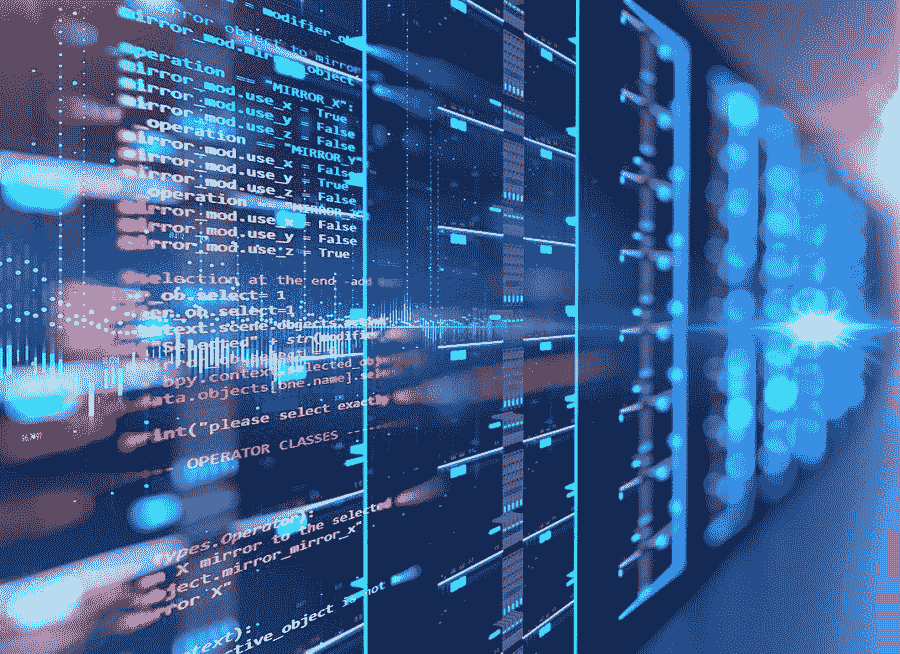

来源丨阿里技术官方公众号（ID：ali_tech）

导读：很多程序员在工作一段时间后会遇到迷茫期，虽有技术傍身，也难免会产生焦虑，反复思考怎样才能快速成长。关于如何提高自己的思考力，运用思考的力量推动能力提升，以此实现技术成长，阿里巴巴盒马产品技术部的岩动总结了一套思考方法，分享给每个正在成长的程序员。（本篇文章较长，阅读时间约30分钟，建议收藏后，找一个合适的时间慢慢品读哦）

**引言**

我们来看一下几类在程序员成长、发展的常见问题，如果你或多或少存在一些，那么恭喜你，这篇文章值得你仔细往下看了：

*   你自认为付出了跟别人同样的努力，但是你的**成长确实更慢一些**，比如学得比别人慢，排查问题比别人慢，出方案老是有漏洞等等；

*   你觉得你只是在疲于应付需求，自己做的事情**完全没有技术含量**（很多人觉得自己做的业务开发就是没有技术含量，但我认为每个领域都有自己的技术含量，只是你有没有get到）；

*   你发现总是在**犯同样的错误**，或者做的事情不断地在同一个水平循环；

*   每次要晋升的时候，你发现根本**讲不出来**（很多人会认为是表达能力问题，但是我认为不是）；

*   当你换到一个新的领域，你发现**自己的经验好像用不上**；

*   你一直很难搞懂老鸟说的“认知升级”到底是什么概念？不同级别的技术思维能力到底有什么差别？为什么晋升的是他，而不是我？

在这篇文章里，我会告诉大家一些**技术成长的误区**，我先点出来：

*   只要把事情搞定了，成长是自然而然的事情——可能过段时间，你发现之前犯过的错误，后来一个都没有避免；

*   我只要努力，996甚至007，我就能够成长得比别人快——可能你发现你干得最多，但是并没有拿到最好的结果；

*   我尽力了，还是比别人慢，应该是我智商确实差一些——恭喜你，其实大家的智商并不会有太大差别；

*   别人表现好，或者晋升了，只不过是比我表达能力更强而已——我可以负责任地告诉你，这并不是仅仅是表达能力的问题。

先抛一个非常重要的结论：**“思考力”是程序员需要具备的一种至关重要的素质。**掌握了思考力，你就掌握了在互联网领域，这种高度“智力密集型”行业成长的钥匙。上面这几个成长的问题和误区，跟没有掌握思考力有着非常重要的关系，而且我发现所有发展比较顺畅的同学，他们的思考和学习能力是非常强悍的。

我个人在工作中，一直有意或者无意地锻炼自己和团队同学的思考力，包括哪些是对我们最重要的思考力，如何去训练思考力，有一些心得，希望能够分享给大家。

**关于思考力**

思考力是一门很深的学问，包括认知科学，心理学、教育学、逻辑学，如果要系统化学习，是需要看很多书的，我推荐以下几本：

1.**《金字塔原理：思考、表达和解决问题的逻辑》**-[美] 芭芭拉·明托，这本书系统阐述了思考、表达和解决问题的逻辑，也是麦肯锡的思维能力基础，算是一本比较标准的思考力教材；

2.**《麦肯锡教我的思考武器》**- [日] 安宅和人，作者根据自己在麦肯锡公司工作时积累的丰富经验以及脑神经学的专业背景，设计出一套极具逻辑性的问题解决思维模式；

3.**《思维的本质》**-[美]约翰·杜威 ，这本书是美国著名教育家约翰·杜威的代表作，阐述了思维训练的基础理论和实践；

本文并不是探讨思考力的深层理论，而是分享我们从日常的技术学习和项目过程中沉淀下来的思考力，以及如何培养这些思考力，这些思考力几乎我们每天都可以用到，只要你有一定体感，你一定会感同身受。

**有哪些对程序员最重要的思考力**

**原理性思维：找出知识背后的原理**

有的人会说，为什么要思考原理，而不是直接掌握知识就可以了？我只需要会用就行了啊。

我们先来举一些**技术方案设计的案例**：

*   为什么订单创单要先create，然后enable？

    这其实是一种采用二阶段提交解决分布式事务的思路，只是从一般的事务框架延展到交易领域；

*   业务系统中为什么要使用消息？

    因为消息使用的是观察者模式，观察者模式的好处是可以实现多个消费事务与触发事务的解耦；

*   为什么业务系统中会使用DTS来做补偿？

    这本质上是一种最终一致性BASE理论解决分布式事务的一种思路；

*   为什么更新数据的时候一定要在sql中加上版本比对或者状态比对？

    这本质上是一种借助DB实现的乐观锁机制。

进一步，你会发现再大到**系统架构和顶层设计的案例**：

*   比如阿里系的技术框架NBF、TMF、早期的webx，各类框架设计理念，逃不脱设计模式，比如开闭原则，模板方法、责任链、工厂模式、开闭原则；

*   不管是底层中间件，错综复杂的业务系统，在设计的时候永远无法离开核心的业务建模，比如实体与实体关系的构建；在分析这类系统的设计思想时，你会发现最好的工具就是UML！

实际上除了软件领域的原理，还有**商业设计的原理**，比如案例：

*   所有的售中退款前必须要先取消履约，所有的履约过程中发生缺货都需要退款，为什么？因为交易的基本原则是：“钱货平衡”，钱和货的变更必须是最终同步的（允许短期的不平衡），你掌握了钱货平衡的基本原理，交易中的很多复杂的流程设计就很好理解了；

*   在设计财务系统、库存系统时候，业务流程、业务逻辑可能非常复杂，导致你晕头转向，这时候“有借必有贷，借贷必相等”的财务平衡性原理就发挥作用了，你只要知道这个原理，很快就能看懂各类财务流程、库存流转流程，以及各类数据对账逻辑；

*   在我的领域“高可用线下收银系统”进行线下系统容灾的时候，有各种容灾方案的设计，会员容灾、商品容灾、交易容灾、支付容灾……不同的容灾手段看起来让你眼花缭乱，但是他们有没有共同遵循的原则呢？有，这就是“让消费者最快速度完成交易，但保持最后追溯的能力”。你只要get到这个基本原理，设计各类容灾策略就会得心应手了。

此外，我们的工作流程、管理手段，同样也蕴含着深层的原理，非常有意思，大家可以抽空仔细推敲一下，比如：

1.  为什么团队机制要透明？沟通要透明？

2.  为什么要有owner意识，都是在工作，owner意识会有什么不同呢？

3.  为什么管理者不能管得太细，也不能放羊？到底哪些该管，哪些不该管？

所以，掌握了知识背后的原理，带来的好处是：

*   软件系统的复杂度越来越高，我们所面对的场景越来越多，掌握原理实际上可以**大幅度降低我们对于知识的记忆量，知识量是爆炸的，但是原理绝对是可控的！**

*   **原理性的东西比直接的知识有更强的复用度！**记住最核心的原理，当你面对新的场景时，你会惊喜地发现，你的理解速度大大加快！这个点大家应该有体会，比如可能之前我们都学习过dubbo等底层的RPC通信框架的基本原理，但是你如果仅了解了他的基本用法，你会发现对你现在做业务系统没有什么帮助！但是，当你了解的是dubbo如何寻址，如何做容灾，如何做扩展，你再去做业务系统，发现设计原理是一样的，并没有本质区别！这样你之前研究中间件的设计思想就可以快速用到业务系统上面。

*   **另外探求原理的过程，本身很有乐趣！**这是一个非常有价值的思维训练过程，不断对系统设计思想、业务设计思想、做事情的工作方式，追寻背后的原理，并找到他们之间的共性，在我看来非常有乐趣，一段时间训练以后，你会发现你看透本质的能力越来越强！

好，那么我们程序员的工作中，**究竟有哪些与原理性知识是需要我们掌握的呢？**按我们团队的实战经验来看：

1.  java，linux，数据结构和算法，数据库，网络通信与分布式计算的原理，这几类是比较重要的基础知识，我们在做方案设计、编码、问题排查中会运用得很多；

2.  设计模式，UML这个是对系统架构设计必要要掌握的知识，当你经历了很多大规模的软件系统设计，回到根本上，你会发现逃不出这一块的理论和工具；

3.  领域性的基本原则，比如我们上面提到的“钱货平衡”，“财务平衡公式”，“线下收银让消费者最快速度走人”，这种逻辑需要大家get到这些领域性的设计原理，甚至自己去总结出这种原理；

4.  关于管理学，人际沟通，心理学的一些基本原理，大家可以按照自己的实际需求去看一下。

如何在工作中学习和运用这些原理，我觉得有一个**最佳实践**：

1.  **首先，对你可能用到的领域知识，建立一个基本的概念。**看书，看文章，找行业资深的人去聊，都可以得到。注意，这里需要有一个基本的概念就可以，这样你在有可能touch到这些原理的时候，你会有意识，也不至于花很多时间；

2.  在实践中，有个意识是**“多问一下为什么”，并一直“刨根问底”**，最终肯定能够追查到背后的最终原理；这里面还要注意思考一下，为什么在这个地方会运用这个原理，也就是**找到“场景”和“原理”的关联关系**，这样你的理解会更加深刻；

3.  了解了原理以后，**在实践中运用一下**，这样你对这个原理的理解就会非常深刻，并且你知道如何去运用这原理；

4.  如果这是一个非常重要的原理，建议大家如有余力去结合经典的书籍**系统化学习。**

**结构化思维：构建自己的知识树**

知识树要解决的问题，我们看一些场景：

1.  为什么我知道很多东西，但是当场景来的时候老是会记不起来使用；

2.  完成一个方案你只能想到一些点状的手段，还有其他方案被漏掉了；

3.  讲一件事情的时候逻辑非常混乱，前后没有逻辑性关联。

但是很有可能你的知识都是知道的，为什么会出现这种悲剧？

这个就跟大脑中的知识结构有关，这是知识学习中**“索引”没有建立，也就是说，你的知识只有点，没有线！**大家想一想，把东西乱七八糟地丢在房间中，到用的时候没有查找的线索和路径，怎么找得到呢？

来看一下我们工作场景的结构化的典型案例，大家体会一下：

项目中测试MM提了一个bug，我总结出来的比较标准的**问题定位步骤**：

1.  确认刚才是否有过代码变更和部署，因为有比较高的概率是刚才变更的代码又搞坏了……

2.  追踪链路日志看链路是否有异常；

3.  通过RPC的控制台调用看接口输入输出是否符合预期；

4.  追踪关键方法的入参和出参，看是否有问题；

5.  定位到方法细节后，推理逻辑是否有问题；

6.  如果无法通过推理，那就最后一招，回放异常流量debug，这样肯定能够找到原因。

某个链路耗时比较长，需要进行**性能优化**，我的分析步骤是：

1\. 通过实际流量制造一个耗时较高的trace；

2\. 进行trace分析，看清楚耗时最多的原因，然后按优先级进行排序；

3\. 针对对原因找解决方案，可能的方案有：

1.  减少数据访问次数或者计算量，常见手段是增加cache：线程内的invokeCache；分布式缓存tair；页面缓存……

2.  增强处理速度，比如多线程加速；

3.  减少循环调用次数，比如请求合并后再分发；

4.  减少数据处理范围，比如减少查询内容，异步加载分页；

5.  逻辑简化，比如逻辑进行优化，或者非核心逻辑异步化等；

6.  ……

4.改掉以后，回放同样的case，看性能消耗是否满足预期，不满足预期继续优化；

**如何熟悉一个新系统，**我的步骤是：

1.  要一个测试账号，把相关功能走一遍，这样能非常快地了解一个系统的功能；

2.  看关键的核心表结构，这样可以快速了解系统的领域模型；

3.  根据功能步骤找到系统对外的接口列表，了解系统的L0业务流程；

4.  下载系统工程，熟悉整个工程结构和模块职责；

5.  以一个最重要的流程为入手点，阅读代码，看清楚核心的执行逻辑，可以变看边画时序图；

6.  制造一个debug场景，以debug方式走一遍流程，这样可以实际加深一下对系统的理解；

7.  做一个小需求，掌握相关的流程和权限；

下单这里**来了一个新的需求**，出一个技术方案的步骤：

1\. 看清楚之前的需求，把这个需求所在的场景和链路大致阅读一遍，搞懂；

2\. 找到需求的变化点；

3\. 分析变更的方案，涉及的内容可能会有：

1.  1.  数据结构会不会变，如何变；

    2.  交互协议会不会变，如何变，交互协议分为：端和组件要不要变；和下游接口要不要变；

    3.  执行逻辑会不会变，如何变，执行逻辑变更的细化考虑点：是否变更域服务；是否变更流程编排；是否变更主干逻辑；是否变更扩展点是否变更扩展点的内部逻辑，变更内部逻辑的时候，又可以进一步拆解：

    a.重构原有的方法，覆盖之前的逻辑，那就需要进行回归；

    b.通过逻辑路由到新的方法，这里需要增加路由逻辑；

4\. 稳定性方案； 

    5\. 发布方案；

可以看到，面对任何一个场景，不管多大多小，我们所需要掌握的知识或者技能都可以构建成**一个树结构，同类之间是顺序关系，上下之间是父子关系（或者粗细颗粒度）。**

当这个树在大脑中构建起来以后，你会发现你**做什么事情都是有一个明确的分析和执行逻辑**，不太可能产生遗漏和混乱！

**那么如何训练出自己的知识树呢？**我给一些比较有效的实践方案：

1.** 一定要总结出自己的知识树，而不要盲从书本上的或者别人的**，为什么呢？一是因为人的思维速度和习惯、技能有一定差异，不一定每个人都是一样的；二是如果没有内化别人的知识成为自己的知识，这棵树不太能够很熟练地运用；

2. **习惯性总结，**做完任何一个事情，都习惯性地回顾一下，往自己的树上面挂新东西，这个是构建知识树的必备手段，这个总结不需要花很多时间，比如做完事情后花个几分钟回顾一下就可以，但是需要坚持；

3. **推荐一个很常见的工具：xmind，**把自己的树记录下来；

4.** 训练自己的思维习惯和做事方式变得结构化，**当你做事情的时候，习惯性用树的方式推进，强迫自己按照这个方式来。

**扩展性思维：举一反三，拓展思维**

**扩展性思维的核心目标是提升我们思维的广度，**也就是让我们的知识树变得更加开阔；

我在工作中总结出来的扩展性思维的两个关键的扩展方向：

**（1）举一反三：解决同类型的N个问题**

举一反三的好处是：“我们能否用同样的知识和手段去解决类似的相关联的几个类似问题”，先举一些案例：

*   当发现某个系统的jvm参数配置存在一个错误配置，不是仅仅修复这个系统的jvm配置，而是把负责的几个系统都检查一下是否需要统一修改；

*   系统中存在某个bug导致产生了脏数据，不是直接订正已发现的脏数据，而是根据特征拉取出所有的脏数据，进行一次性处理；

**这种思维方式的特征是举一反三，触类旁通，相当于产生批处理的效果**，可以大大提升解决问题的效率，避免重复处理。

**（2）寻求更多的可能性：拓展解决问题的不同手段**

拓展思维常见的手段是：是否能够换更多的理解方式，或者更多的解法，举一些案例：

*   产生故障的时候，快速止血除了回滚以外，还有哪些方案？如果故障处理经验丰富的人一定知道，除了回滚，其实还有系统降级，运营活动降级等多种方案；

*   除了写更加健壮的代码，还有哪些手段都可以提升系统的容错性？还有数据监控，单据闭环等多种手段；

当解决问题的手段更多了，思维就开阔了。

**抓重点思维：提升效率，方便记忆和传递**

当我们发现知识树构建起来以后，怎么样使得记忆和使用的效率变高？而且对外传递的时候更加容易让人理解？抓重点思维要解决的场景是：

1.  如果每件事情都按照知识树方式做，效率可能不会特别高，有更快的办法么？

2.  在对外沟通表达的时候，要表达核心思想，否则别人会很难理解你的表达内容；比如大家再晋升答辩、项目汇报的时候一定会有体会。

解决这两类困惑，**核心思路是要抓住重点和脉络。**

但是抓住重点和知识结构化之间并不矛盾，而且我认为是有先后次序的，**一定要先建立知识结构化，然后才能从里面筛选出重点，**否则知识的体系是不完整的。

那么筛选重点的思路有哪些呢？

**（1）归纳法**

采用归纳法，把细节隐藏掉，呈现知识的脉络，这是一种非常好的思路；**尤其是大家在准备晋升ppt时，ppt的每一页都需要归纳一个核心观点，不是全是细节，这个非常重要！**并且训练归纳的能力，本身就是对知识理解深刻程度的一种反映；

**（2）优先级法**

优先级策略往往应用于在多项任务之间**找到最最关键或者收益最大**的那个任务项，比如完成一个事情可能有若干个步骤，其中哪个步骤是最有效的，大致可以做一个排序。在实施的时候，你可以按照优先级去落实。

但是找到效果最好的那个任务项，在不同场景下是不同的，跟我们的熟练程度和经验有关。就像老中医把脉，越有经验判断越准，这块没有什么捷径，只能不断练习自己找到哪些任务项在什么场景下更加重要。

**反思性思维：思考哪里可以做得更好**

反思性思维是提升知识质量和深度的一个关键能力。**因为只有不断反思才能让下一次在上一次基础上升级，**而不是重复循环。

常见的反思案例：

*   有个问题我查了2个小时，师兄只花了10分钟，这是为什么呢？是他的业务比我熟悉？思路比我清晰？还是知道某个我不知道的工具？一定要找到关键的差异点，然后弥补掉这个差距；

*   一个项目项目做完了，从方案设计，研发过程，质量保障上面，哪些地方下次可以做得更好？找到不足，下次避免；

**对于我们技术团队，哪些内容值得反思，我们团队的经验是：**

1.  这个项目商业价值OK吗？是否取得了预期的效果？

2.  项目中我的能力有哪些问题，有哪些做得好的和不好的？

3.  系统设计的优势和不足？

4.  项目质量保障是否可以做得更好一些？

5.  研发过程和项目管理是否有不足？

**反思性思维的实践，注意有两个点比较关键：**

1.  **反思性思维最重要的意识：做事情的过程总有优化的空间，每次都要有进步；**如果没有这种心态，那么很难持续地进行反思；

2.  **反思是一种习惯和潜意识，可以在不经意之间经常进行，**其实不需要很形式化地花很多时间，有时候做完一个事情，习惯性思考一下就可以。

**锻炼思考力的有效实践**

**1.意识觉醒**

**意识觉醒是提升思考力最重要的一个点，我认为。**只要形成了这种意识，就已经成功了一半。

很多同学思维能力没有上去，是没有意识到思考力这个概念，只是机械地做事情，做事情，做事情……每次都在同一个思维层次上面转悠，不可能有本质的提升。

从初级工程师，高级工程师，技术专家，高级专家，资深专家……级别提升靠什么？多接了多少需求？多写了多少代码？这些因素会有，但是关键因素不是这些，而是思考力在不断提升，思维方式在不断进化，进而导致业绩产出必变得更加优秀，产生的是事半功倍的效果。

能够坚持看到这里的同学，一定是能够知道思考力的重要性了。

**2.保持信心**

现在知道思考力的重要性了，很多同学可能认为自己是一个不够聪明的人。为什么我努力了，还是不行？

**给大家一个信心：有位大师说过：在相同的文明程度和种族背景下，每一个正常人的潜意识与意识相加之和，在精神能量意义上基本上是相等的。**

我几乎接触到的很努力但是成长速度不快的同学都是因为没有没有掌握正确的方法；

只要掌握了正确的方法并坚持训练，思考力绝对可以提升。

**3.空杯心态**

思考的过程其实是对人的知识进行不断刷新和重构的过程，这里一定要保证空杯心态，对新的环境，新的理念，新的技术持开放态度，否则就是自己给自己制造阻力。

**4.思考的时间从哪里来？**

常见的借口是“我连需求都做不完，哪来的时间思考”？

训练思考力其实并不需要太完整的时间，我的口诀是：**“1.利用碎片时间；2.抓住工作的过程”。**

*   利用碎片时间，比如上下班路上的时间，吃饭的时候，可以把刚才或者今天的事情想一想，想通了，然后定期汇总一下就可以；

*   抓住工作的过程，注意，每次每次出技术方案，优化代码，排查问题，处理故障，准备晋升……都是一次训练的机会，在做事情的过程中就可以思考并快速实践。

**5.思考力提升有没有什么判断标准？**

有的，一般来说思考力有三个度：**广度、深度、速度**，这你自己就能够感觉出来的：

*   **广度：**就是你自己的知识树能够长多大的范围，越广知识越渊博；比如从“如何写一个多线程程序”，提升到“如何做系统性能优化“，再到“如何做系统稳定性备战”，这就是一种广度的提升；

*   **深度：**就是你自己的知识树的叶子节点有多深，越深对知识了解越透彻；比如从“分布式事务问题解决思路”，到“利用最终一致性解决分布式事务”，再到“利用DTS解决分布式事务”，这就是一种深度的提升；

*   **速度：**就是建立和刷新知识树的速度了。比如原来你想清楚一个建模方案要一天，现在只需要半小时可以想清楚，那就是速度的提升了。

**6.好的工具有推荐么？**

还是推荐一个工具：**Xmind**，这个最土的工具最有效。可以下载手机版和PC版本，随时进行记录。

**7.一定要相互分享**

思考虽然主要是靠自己，但是一定要相互分享。因为思考是智力活动，相互分享完全能够取得1+1>2的效果；

注意分享可以有很多形式，比如我们团队最经常的是：

*   **项目分享：**重大项目是一定要分享的，包括架构设计经验，过程经验，质量提升经验，都需要分享出来；

*   **周会分享：**团队周会重点过进度？那太浪费啦，了解进度和风险看周报就可以了。周会是学习分享的好时机重点就是一些关键的方案，架构设计理念，好的工具，甚至工作无关的内容；

*   **群内分享：**当有个人踩坑以后，在群里面提醒一下大家，这是一个很及时的分享方案；

*   **年度/季度分享：**这时候适合找个风景优美喝茶的地方，大家讲一讲自己的成长和思考，非常有帮助；

*   **小圈子：**大家形成自己的小圈子，随时都可以相互倾诉一下自己的心得体会，其实这种效果也很好；

**8.技术Leader在训练大家思考力中的职责**

在技术团队中，**技术Leader的思考力意识、能力和实际行动，决定了一个团队的整体思考力水平和成长速度！**

一个团队要提高思考和学习的能力，首先得这个团队Leader的思考意识就要提上来，如果团队Leader没有思考意识，也没有把团队同学的成长放在心上，那么整个团队的思考力和成长速度绝对快不起来。

在提升团队整体思考力的实践中，技术Leader的职责：

*   **先要把自己变成一个思考者**，自己做表率，以身作则；

*   **意识心态上先变过来**，要把团队同学的成长速度最为最重要的职责之一，没有这个意识都是空谈；

*   **多创造思考的条件和氛围**，一定要抓住任何机会（代码reivew、方案评审、周会都可以）鼓励大家去思考和分享；

*   **控制团队节奏**，给大家学习和思考留出一定的时间；

*   **及时的引导和示范，**有的同学可能掌握会偏慢一些，这时候需要有耐心去引导同学找到思考的感觉；

*   **不必过多干预细节，**发挥大家的群体智慧，而不必做过多干预，更不能以个人的意志去强迫别人接受。

**重要观点小结**

好了，**到这里可以给重要观点做个小结**，时间紧的同学们可以直接读这一段：

1.  思考力对程序员的成长至关重要，团队和个人都需要有意或者无意识地提升思考能力。

2.  对程序员最重要的思考力有：原理性思维、结构化思维、反思性思维、扩展性思维、抓重点思维。

*   原理性思维是根基，因为没有搞懂的情况下所有的知识建构都是空谈；

*   结构化思维帮助我们建立了我们的知识树；

*   反思性思维不断对知识进行重构，是实现认知升级的必备条件；

*   扩展性思维可以提升知识的广度和深度；

*   抓重点思维可以加快知识的使用效率和传递效率；

    3\. 在提升思考力的实践中：

*   思考力提升最关键的是意识的转变；

*   要对思考力的提升充满信心；

*   多在工作中去锻炼思考力，不需要花太多额外的休息时间；

*   多相互分享；

*   团队Leader要团队同学的成长和把思考力提升作为最重要的内容，并拿出实际行动。

