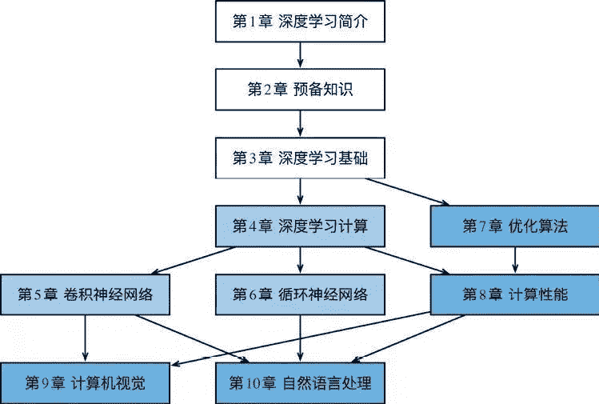
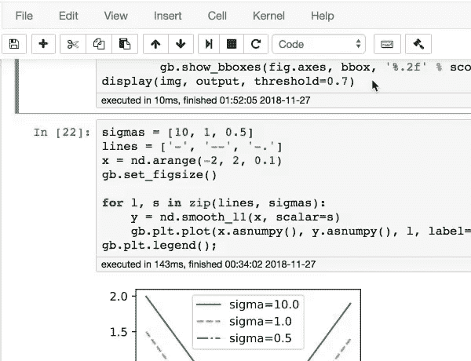

点击上方“**Datawhal****e**”，选择“星标”公众号

第一时间获取价值内容

图文 / 静修   排版 / 家豪

##### **【导读】**《动手学深度学习》这本书由亚马逊首席科学家李沐，亚马逊应用科学家阿斯顿·张等大师合作打造，沉淀三年完成。本书采用交互式的学习方法，不但讲授了深度学习算法原理，还给出了代码运行与实现，让你在手调代码的同时理解消化知识。

经常有学习者在微信后台私信留言小编：想要学习深度学习，但不知道怎么学，有没有推荐的书籍或经验传授一下。

踩过坑的学习者应该都深有以下几点体会：

**深度学习需要一定量的数学基础**，遇到难理解的数学公式简直令人抓狂。

**深度学习现有资料偏向理论**，抽象难以理解，很容易让人雾里看花，琢磨不透。

**深度学习现有视频教学英文资料更多**，虽然有字幕加持，但怎么也没有中文听着舒服。

看到这里，有的人可能长叹一声，你是劝退我的吧，我告诉你：你成功了！

别着急，现在我就来给大家安利一本适合深度学习初学者的书籍，好书傍身，助你轻松掌握机器学习。

6月19日，作为Datawhale的一员，小编参加了AWS教育科技交流会，也是《动手学深度学习》这本书的新书发布会，现场请来了本书首要作者Aston Zhang和大家交流沟通。他们为了更好的迭代内容，几位理工科男进入斗鱼直播间与大家交流学习，本书交流社区的3000名小伙伴汇总了5000多个问题，精致打磨，迭代完成。这本书的主编还偷偷告诉小编，Aston在本书排版时候严格到注释中的一个空格都要纠正过来，严格遵守Pep8规范。

我想正是因为作者严谨的态度和开源的精神，让本书获得韩佳炜、Bernhard Scholkopf、周志华老师等人联袂推荐，也已经被加州伯克利等15所全球知名高校用作教学书籍，更是在京东6·18大促计算机与电子书籍类别里夺得桂冠。听了这些是不是重拾学习深度学习的热情了，那现在让我们具体来了解下这本书吧。

**本书结构**

**第一部分（第1章~第3章）**涵盖预备工作和基础知识。第1章介绍深度学习的背景。第2章提供动手学深度学习所需要的预备知识，例如，如何获取并运行本书中的代码。第3章包括深度学习最基础的概念和技术，如多层感知机和模型正则化。如果读者时间有限，并且只想了解深度学习最基础的概念和技术，那么只需阅读第一部分。

**第二部分（第4章~第6章）**关注现代深度学习技术。第4章描述深度学习计算的各个重要组成部分，并为实现后续更复杂的模型打下基础。第5章解释近年来令深度学习在计算机视觉领域大获成功的卷积神经网络。第6章阐述近年来常用于处理序列数据的循环神经网络。阅读第二部分有助于掌握现代深度学习技术。

**第三部分（第7章~第10章）**讨论计算性能和应用。第7章评价各种用来训练深度学习模型的优化算法。第8章检验影响深度学习计算性能的几个重要因素。第9章和第10章分别列举深度学习在计算机视觉和自然语言处理中的重要应用。这部分内容读者可根据兴趣选择阅读。

详情可见下图，描绘了本书的结构，其中由A章指向B章的箭头表明A章的知识有助于理解B章的内容。

**代码**

本书代码基于Apache MXNet，是一个开源的深度学习框架，但书中只使用了MXNet的ndarray, autograd,gluon等模块或包的基础功能，即便是使用其他深度学习框架的小伙伴也可以很好的借助书中代码更好的理解和应用深度学习。

书中的每一节代码都是可以独立运行的，而且会免费提供给大家，大家可以根据自己的理解修改，从而更好的理解算法的逻辑，真正做到了在文字，图像和公式外创建一个交互式学习环境，更好地理解学习。

**交流社区**

**https://discuss.gluon.ai/c/lecture?order=views**，对于书中不理解或者认为书中存在问题的同学可以在交流社区上提问，会有专门的人回复你哦。另外，没事逛逛社区，学习下其他人的经验也是不错的选择呢。

最后奉上资源：

*   在线书地址：**http://zh.d2l.ai/index.html**

*   GitHub 项目：**https://github.com/diveintodeeplearning/d2l-zh**

*   PDF：**https://zh.d2l.ai/d2l-zh.pdf**

*   视频讲解：**https://space.bilibili.com/209599371/channel/detail?cid=23541**

**今日话题**

你在学习深度学习的过程中，还有什么觉得值得推荐的书籍呢？

对于深度学习这部分，你有什么想要提问的问题吗？

在评论区留言，分享给大家吧~

你的分享，可以帮助大家共同学习进步。

