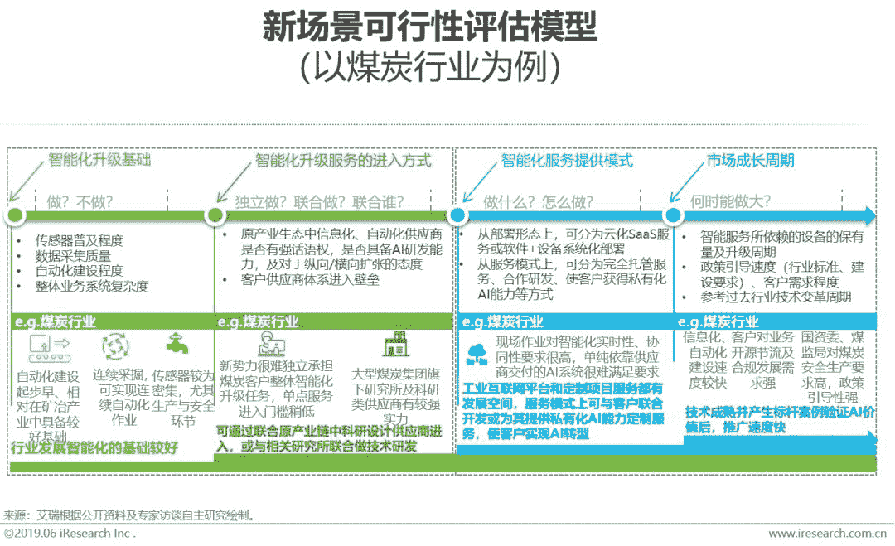

人工智能丨研究报告

来源丨艾瑞咨询

**核心摘要：**

“商业落地”已成为人工智能发展到当前阶段鲜明的主题词，过去人工智能技术驱动阶段重在AI算法模型比拼，如今更要依赖商业场景洞察、专家团队实力，将AI技术与行业实际需求结合，产生应用与经济价值。因此本报告从人工智能在实体经济中的市场化情况出发，探寻人工智能对实体经济的意义。研究表明，当下，AI相关技术与传统行业经营模式和业务流程开始产生实质性融合，智能经济时代的全新产业版图初步显现。预计2019年人工智能赋能实体经济产业规模接近570亿元。

本报告对安防、金融、客服、医疗健康、零售、广告营销、教育、城市交通、制造、农业等十大传统产业应用人工智能的现状进行了梳理。整体来看，过去AI企业单纯向传统企业技术输出的模式已悄然改变，全产业链都已参与进来，随之而来的是AI应用的快速渗透和对相应场景的革新优化。具体应用场景、使用价值及市场规模推算请详见报告第二章论述。

通往智能世界探索的路径存在多种可能，基于部署思路、建设架构、同其他数字化技术联动等方面的差异，业内已有与IoT结合的AIoT、与云平台能力结合的AI PaSS、与产业全面联通相结合的AI+产业互联网等发展路径，将共促人工智能与实体经济的深度融合。

从市场角度看，对人工智能产业的未来发展思考集中于玩家角色变化、落地场景的探索与评估和技术能力的强化提升，因为上述因素会对业务布局、商业模式、可持续发展产生重要影响。艾瑞认为未来认知智能的推进将带来传统意义上客户方的AI化，AI技术将进一步向其他实体产业渗透，同时市场环境的压力敦促国内AI行业形成自主可控的产业链，这些变化都将促使我国人工智能产业的长期健康发展。

**   行业概述篇   **

******************人工智能战略意义******************

****************商业价值：2019年AI赋能实体经济预计贡献收入近570亿元****************

近几年，人工智能技术在实体经济中寻找落地应用场景成为核心要义，人工智能技术与传统行业经营模式及业务流程产生实质性融合，智能经济时代的全新产业版图初步显现，预计2019年人工智能核心产业规模接近570亿元，目前，安防和金融领域市场份额最大，工业、医疗、教育等领域具有爆发潜力。

******************人工智能产业图谱******************

******************人工智能产业成熟度******************

****************安防与金融发展条件较好，业务渗透最快，营销、客服、教育等有望快速发展****************

我们根据基础建设和价值空间两大维度对人工智能赋能的十大实体经济类型进行分析。总体而言，金融、营销、安防、客服等场景在IT基础设施、数据质量、对新技术的接受周期等AI发展基础条件方面表现较优，而在当下市场规模、行业发展增速、解决方案落地效果和政策导向等诸多因素的影响下，安防、金融、教育、客服等场景将产生较高的商业化渗透和对传统产业提升程度。其余产业中，制造场景由于基础建设复杂、数据获取难度较大，且实际智能应用仍较为边缘化，AI应用短期内渗透释放难度较大；医疗、零售、交通等场景随着AI技术与场景核心痛点匹配度上升、产品逐渐完善，未来将激发更大价值；农业因为技术基础、商业模式、购买能力等问题，目前AI的赋能作用尚不明显，有待未来探索。

**   赋能实体经济篇   **

******************泛安防领域****************** 

****************2022年G端与B端市场规模有望突破700亿元****************

2016年是AI+安防商业化元年， 2018年，我国AI+安防软硬件市场规模达到135亿元，部分头部安防厂商AI业务在总营收中占比从大约4%提升至超过8%，部分典型AI公司安防业务则占接近一半的营业收入。2018年城市公共安防中AI渗透率达到2.6%。预计2019年市场仍将保持高增速，到十三五收官之年2020年增速开始稳定，届时市场规模可达到453亿元（城市公共安防AI渗透率达到11%），2022年市场规模有望突破700亿元（城市公共安防AI渗透率达到25%），从2017年到2022年CAGR达到78.3%。

****************视频监控占比近90%，中心侧份额最大****************

2018年AI+安防软硬件市场约135.3亿元的产值中，视频监控占据绝大部分，份额近90%，成为AI+安防的主赛道。其中，端侧市场规模超过38亿元，占28.3%，中心侧市场规模超过74亿元，占54.8%。而在AI+安防的核心战场公共安全领域，总市场规模约93.1亿元，其中端侧市场规模约13.8亿元，占14.8%，中心侧市场规模约66.5亿元，占71.4%，边缘侧渗透有限，占比较小，约3.8%。出入口控制的主要产品如人脸识别闸机、门禁等，门槛相对较低，与监控人脸识别具备相通之处，因此绝大部分安防产品与解决方案提供商均涉足这部分业务，其市场相对较大。

******************传统金融领域******************

****************传统金融机构、互金公司和AI公司是主要参与者，中小型金融机构表现活跃****************

传统金融机构拥有广泛的客户基础和海量高可信度的数据积累，拥有完整的线下布局，对AI应用有核心需求，是市场中主要的需求方；互联网金融公司承载人口红利，拥有大量的C端客户和流量数据，在产品设计和渠道运营方面具有优势，是技术的需求方，也是提供者；AI公司在终端客户和数据积累方面不足，但在特定方向上具有较强的创新性和研发能力，是主要的技术提供者。传统金融机构主要通过成立子公司自研技术、对外投资并购和采购合作三种方式进行AI布局，目前以采购合作为主，需求更倾向于金融零售中的风控反欺诈和精准营销，国有银行等大型机构对于AI产品采购的态度更显谨慎，为保证数据安全可控，往往要求合作公司开放代码，由双方共同开发，在筛选合作对象时更看中AI公司的合作案例和研发能力，而中小型机构相对灵活，是市场中的活跃者；互联网金融公司面临着新一轮转型，在牌照监管压力下，互金公司将加大与银行的合作，由业务输出向技术输出拓展；AI公司在金融方面以智能风控产品为主，主要存在技术集中型和数据集中型两类，前者在算法模型训练方面有优势，后者在黑名单数据积累方面有优势，AI公司与大型机构合作后摸索出的解决办法对中小型机构更有应用价值。

******************传统金融领域******************

****************2022年传统金融AI投入约580亿元，银行业务仍是核心场景****************

据艾瑞统计，2018年中国传统金融机构科技投入约为1604.3亿元，较2017年增长10%，其中包括硬件和软件的AI相关投入约占10.4%，为166.8亿元，较2017年增速为42.9%。保守估计，到2022年中国传统金融机构科技投入将突破3700亿元，AI相关投入占比将达到15.6%，超580亿元。银行业是AI相关应用的主要投入方，占比70%，大部分通过外部采购方式获取AI服务，其中对基础设施层投入占60%，在AI应用层投入占40%，约39亿元，硬件部分（以AI摄像头和人证比对机为主）占三分之一，软件部分（以精准营销和智能风控平台为主）占三分之二。

******************客服领域******************

****************2022年智能客服业务规模将突破160亿元，AI技术成为重要推动力****************

2018年，智能客服业务规模达到27.2亿元，其中以智能客服机器人为代表的AI应用业务规模达到7.9亿元，预计2022年智能客服业务规模将突破160亿元，年复合增长率为56%，AI应用业务规模突破70亿元。在NLP技术的赋能作用下，客服业务将向企业服务、智能家居、智能可穿戴、车载设备、智能服务机器人、智能会议系统等领域拓展，预计2022年，泛智能客服市场想象空间将突破600亿。

******************客服领域******************

****************NLP技术与标准化数据累积将拓展智能客服企业的业务边际****************

由于客服行业中智能化需求上升，除原有的客服机器人厂商外，拥有丰富大客户资源的传统客服软件厂商、基于PaaS云通讯优势的云客服厂商、互联网巨头公司的相关客服平台都开始组建自身的AI团队，布局智能客服。智能客服最大的隐性价值在于NLP技术在实际场景中的训练和标准化数据累积，后者在挖掘客户有价值信息中明显起到降本增效的作用，标准化的数据打通了企业内部营销、产品等环节，使得智能客服业务拥有了向企业服务其他场景拓展的能力；而NLP技术将成为智能客服公司的核心竞争力，可以此向制造、政务、医疗等领域拓展，向集认知、交互、协同、功能性于一身的智能系统发展。

******************医疗健康领域******************

****************AI医学影像产品潜在价值巨大，但商业落地面临瓶颈****************

本报告重点关注AI医学影像赛道。AI医学影像产品有肺结节等胸部AI、心血管疾病AI、大血管疾病AI、DR影像智能报告AI、骨关节疾病AI、乳腺影像AI、神经系统影像AI、骨龄判读AI、小儿疾病AI、盆腔影像AI、脑部影像AI、眼底影像AI、皮肤AI、病理AI、超声AI等十余种，其中肺结节等胸部AI产品最多、认知度最高。AI医学影像商业落地的大背景是我国影像科医师明显不足：每年影像检查量上升30%，而影像科医师只增长4%，一方面给医院和医师造成巨大压力，医师在重复、单调的阅片工作中容易出现疲劳、漏诊等现象，另一方面中长尾医疗机构缺乏具备诊断能力的影像医师，造成可拍片但无人写报告的局面。AI医学影像产品的主要价值包括：（1）诊断赋能。提高疾病表征的检出率，减少漏诊，帮助癌症等重大疾病患者实现早诊早治，提升病人存活率、降低家庭及社会诊疗成本，艾瑞预测，若未来AI医学影像得到大规模使用，在癌症方面可节省诊疗与用药支出2470亿元，其中节省医保和民政救济支出1062亿元；（2）治疗方案赋能。AI对影像进行分割精准确认病灶位置、形态，可辅助评估患者术前术后风险，不过相关技术和产品尚不成熟；（3）阅片赋能，提升阅片效率、节约医师时间。从AI产品的价值定位分析，其在很长时期内都以院内客户通过IT采购或科研合作形式付费为主，而AI产品的落地还面临准入门槛高、周期长，产品功能仍需完善等问题，商业化快速推进有赖于上述问题的解决。

******************医疗健康领域******************

****************医疗健康是个慢行业，预计2022年AI医学影像市场近10亿元****************

AI医学影像的商业落地预计于2019年起步，到2022年市场规模达到9.7亿元，在已定级医院中总付费渗透率达5%，在三级医院和二级医院的总付费渗透率达到8%，期间若产品功能取得突破性进展则有更大发展空间。此前，AI医学影像基本采用三甲医院试用合作的模式，2019年后逐步推进产品收费，随着分级诊疗的推进和市场对AI认知的提升，预计2020年底至2021年部分产品获得CFDA三类医疗器械认证，同年二级医院客户数量首次超过三级医院。目前主要有三种收费模式：（1）将AI医学影像嵌入云HIS或云PACS中，打包售卖，由于现阶段AI产品商业化面临产品功能还未完全直击客户痛点，医院客户较多使用的是免费AI，与云服务结合可将AI作为收费模块；（2）将AI作为服务单独提供，其优势在于相较于云服务，软件开发形式更符合医院采购习惯；（3）与影像设备厂商合作提供具有AI功能的医疗影像设备，收取一定分成，这种形式较难提供完整的拍片-阅片智能解决方案、需要重新申报CFDA审批认证，目前落地较少。目前市场中主要有AI企业、医疗信息化厂商、科技巨头、医疗影像设备厂商等几类玩家。

******************零售领域******************

****************2022年AI+零售建设投入将超175亿****************

包含大卖场、超级市场、便利商店等业态的现代渠道型零售品牌是新零售的主要实践场景，也是相关产品服务的主要买方。据艾瑞研究，2018年中国现代渠道主要零售商数字化建设投入为285.1亿元，其中AI投入为约9亿元，占比3.15%，据预测，到2022年其数字化建设投入将突破700亿元，AI投入将超过178亿元，占比超过25%，得益于阿里巴巴、京东、苏宁等零售巨头的推动，以AI应用为代表的新零售概念处于增长的上升通道，未来两年将保持较高增速。目前AI应用可以分为以人为准的AI解决办法、商品识别、供应链优化、智能服务机器人/客服机器人和无人货柜/无人店五大类，以CV技术为核心的人脸识别和商品识别是主要建设方向，相关投入占整体的55.36%，供应链优化最为复杂，对AI算法的可用性要求最高，但更靠近零售业的核心痛点，未来可释放的增益价值最大。 

******************零售领域******************

****************AI公司、云服务商和零售商是主要玩家，算法与经验的融合是最终方向****************

目前以人工智能技术为代表的新零售解决办法主要有两种提供途径，其一是技术输出型，提供方主要为云服务商和AI公司，其中云服务商通过集成AI公司的算法能力，向用户输出基于云平台的标准化服务，而AI公司交付给用户的解决办法多为定制类项目，解决用户个性化需求，这也是其主要的收入来源；另一种是经验输出型，由成熟的品牌零售商提供解决办法，试图将品牌自身多年的运营经验和新技术融合，向中小微型零售商输出，优化其运营模式。两种途径出发点不同，但终将向算法与行业经验融合，产出可执行方案的方向发展，而在实际场景中的不断试错是达到这一目标的唯一方法。

****************数字营销：AI的引入弥合了传统数字化营销的不足****************

随着营销产业的不断发展，传统的营销模式渐显不足，在用户时间碎片化的前提下，广告ROI效果不理想、目标用户不清晰等问题被不断放大，同时病毒式的投放方式以及单一的内容形式也必然会让用户产生审美疲劳，降低对广告的体验和兴趣，媒资与流量管理的效率亟待提升。人工智能针对上述问题，通过技术与营销环节相结合，在提供更加充实的用户特征以及创意内容的同时，对投放的策略和形式进行优化，提升引流、集客、转化效果。 

****************视频广告：增加广告位资源，提升用户接受度**************** 

本报告重点关注AI在场景识别广告赛道的商业价值。目前，AI场景营销、广告快速植入、功能性互动营销等视频广告类业务已经有较为明确的商业模式，主要由长视频平台及AI公司通过视频广告招商分成的形式运作，2018年实现了初步商业落地，艾瑞初步测算当年市场规模达到8.8亿元，预计2022年可达63.8亿元，若市场接受度充足、渗透率高于预期，则有望达到133亿元。AI场景广告相比传统网络视频广告可新增约40%广告位资源、平均提升点击率2.5倍，综合投放类型、渗透情况等因素，粗略测算未来AI场景广告可为网络视频广告产业带来31%的价值提升。边看边买类服务由短视频平台自建或AI公司提供，有收取电商平台提成、按点击收费、收取项目实施费等几种收费模式，在短视频平台、电商自有直播中落地较快，在长视频平台、OTT等领域的应用和商业模式都有待成熟。

******************教育领域******************

****************受政策及文化限制较小的校外市场和成人市场AI渗透率较高****************

由于教育关系到一个人未来的发展机会，试错成本高，所以当一项新技术或一种新模式出现时，用户一般不愿率先做“小白鼠”，而是倾向于选择口碑好的成熟品牌，并且，人脑吸收知识或技能的过程在目前无法清晰地拆解呈现出来，过程不透明，更加重了用户消费时的谨慎心理。因此教育行业本身具有顽固性，对于新技术或新模式存在天然的排斥，而不像大众消费品行业、娱乐行业那样求新求异。

从人工智能在不同教育领域的渗透程度来看，越是校外市场，受到教育部门的监管就越小，越是高年龄段的市场，用户的容错能力就越高，所以渗透程度相对高。其中口语听力练测、智能题库、组卷阅卷/作业批改等场景是目前渗透最好的几个场景。

******************教育领域******************

****************坚实的发展基础——庞大的在线教育市场规模和用户数量****************

经过20余年的曲折发展，随着用户对在线教育的接受度不断提升、在线付费意识逐渐养成以及线上学习体验和效果的提升等因素影响，中国在线教育的市场规模与用户数量已进入了初步成熟阶段。2018年中国在线教育市场规模达2517.6亿元，付费用户数量超过1.35亿人，人工智能技术进入教育领域后，市场上涌现出大量专注于“AI+教育”的新型教育机构，在线教育企业也在已有业务线基础上引入人工智能技术以提升教学效率、拓展商业模式。艾瑞认为，目前在线教育中与人工智能技术相关的业务规模已超过120亿元，在AI技术不断发展及教育领域AI落地成熟度持续提升的背景下，预计2022年与人工智能技术相关的在线教育业务规模将超过700亿元。

******************城市交通领域******************

****************2022年交通大脑市场将达33亿，软件需求上升促进其发展****************

治理拥堵问题是城市交通场景的核心需求，所以本报告聚焦于城市智慧交通管控平台目前的应用现状和商业化程度。2016年应用人工智能技术的交通大脑出现，使交通管控系统正式步入智能化时代。交通大脑实质是囊括数据采集平台、数据分析平台、数据建模平台和决策平台的PaaS云服务，通过对城市交通场景中众多传感器采集的数据信息关联性处理，建立数据库，由机器学习对信号灯管控、车流诱导等问题进行建模，联动信号灯控制系统和手机地图软件等，输出最佳解决办法。据艾瑞统计，2018年交通管控项目规模约166.2亿元，其中交通大脑项目规模约5.3亿元，预测2022年交通管控项目规模将突破240亿，交通大脑项目突破32亿。目前交通大脑的供应商多采用与合作伙伴绑定的形式争取项目，利润在整体项目的20%左右，在产业链中的话语权不高，但以北、上、广、深为代表的一线城市和部分二线城市，已经从基础建设阶段向应用阶段过渡，对软件的需求逐渐上升，这一利好未来会持续促进交通大脑项目的落地。

******************制造领域******************

****************制造数字化是“AI+制造”的基础****************

我国制造业信息化水平参差不齐，且制造产业链条远比其他行业复杂，更强调赋能者对行业背景的理解，这都造成了制造业的AI赋能相比其他行业门槛更高、难度更大。尽管人工智能技术在制造业的部分环节与流程中已经有了一定程度的应用，但整体渗透率仍然处于较低水平。“AI+制造”的落地基础取决于制造业的数字化程度，根据中国信通院的测算，2018年中国工业数字化经济的比重仅为18.3%，尚不足20%。在制造业整体数字化水平偏低的背景下，艾瑞认为AI技术在制造业数字化经济中的渗透率在0.4%左右，并将在2022年达到1%。

******************农业领域****************** 

****************农业数字化基础薄弱，AI渗透率低，市场尚处于培育期****************

传统产业的AI赋能都以其数字化程度为基础，中国农业在耕地面积有限且不断减少、规模化种植范围较小、机械化程度不高等因素的影响下，数字化程度处于较低水平。2018年，中国农业数字经济占增加值比重仅为7.3%，不仅远远低于服务业的35.9%，与工业相比也有较大差距。由于农业的信息化、数字化基础薄弱，人工智能在农业中的成长壮大还需要一段积累数据和调整算法的培育期，并随着农业数字化程度的逐步提升以及农业企业、农业规模户对“AI+农业”产品服务的认可而迎来新的发展。2018年中国“AI+农业”领域的市场规模为1.9亿元。预计未来数年内，“AI+农业”市场规模将以35.2%的年复合增长率高速发展，并于2024年突破10亿元，2025年达到15.7亿元。

**   新兴发展模式篇  **

******************AIoT核心生态******************

****************主要包括智能设备与解决方案方、系统方、基础设施提供方****************

AIoT的体系架构中主要包括物联网设备及解决方案、操作系统/平台、基础设施（以云服务形态为主）等三大层级。智能化设备是AIoT的“五官” 与“手脚” ，可以完成视图、音频、压力、温度等数据收集，并执行抓取、分拣、搬运等行为，通常是物联网设备与解决方案搭配向客户提供，这一层涉及设备形态多样化，玩家众多。操作系统/平台相当于AIoT的“大脑”，解决流程体系性问题，核心功能包括对设备层进行连接与控制，分配计算资源，通过AI算法协同优化、合理调度等，这一层对业务逻辑、统一建模、全链路技术能力、高并发支撑能力等要求较高。基础设施层是AIoT的“躯干”，提供服务器、存储等IT基础设施。

******************AI PaaS******************

****************AI能力平台化输出降低了入局门槛，推动商业化第二波爆发****************

随着人工智能技术对传统产业的不断渗透，越来越多的企业对AI产生了需求，但自主组建一支AI技术团队，研发相关系统和应用对于大部分公司而言投入产出比并不高，而且难以达到“即插即用”的效果，因此通过云平台PaaS层输出AI能力的AI PaaS服务成为需求方向。结合产业化落地，AI PaaS平台可分为三个阶段， 既模型自动化生产、模型规模化生产和模型智能化生产，逐步实现去监督化生产。AI PaaS又分公有云平台和私有云平台，二者在架构方面主体基本一致，只有在权限管理、资源管理和数据管理部分区分公有化和私有化，总体来看AI PaaS要满足模块化、分布式、资源共享、可拓展和环境分离五大特性，以满足不同量级用户的并发需求。

******************产业互联网******************

****************产业互联网打造数据环境，AI算法体现核心价值****************

互联网巨头公司正致力于推动产业互联网发展，希望通过丰富的云端应用打通产业链上下游企业，使真实的生产数据能够在云平台累积。其中，AI主要通过认知智能体现价值，由NLP、知识图谱技术建立打通产业的关联数据库，通过机器学习训练模型，推导出最佳的优化策略，向企业输出解决办法、咨询服务或SaaS应用等，使整条产业链的生产更柔性，商业逻辑更具可预测性。随着平台用户增加，导入数据激增，AI算法获得更多优质数据训练，准确率上升，产生能够撬动更多用户的核心竞争力，形成良性循环的产业生态，从而达到技术推动传统产业升级的效果。

**   未来思考篇   **

******************新出发******************

****************认知智能到来的过程，也是传统意义上客户方AI化的过程****************

2018年，感知智能取得了较快发展，但由于感知智能很难切入产业关键业务环节，无论是出于提升产业智能化还是拓展人工智能企业商业价值的目的，2019年都将是成长期的感知智能与萌芽期的认知智能共同发展的一年。目前传统企业获取AI应用的普遍方式是依赖第三方实现全部业务需求，往往出现两类问题：第三方对业务逻辑理解不足；客户很难根据自身不断变化的环境与需求实现算法迭代和人机智能实时协同，这都会导致AI产品在客户处“水土不服”时而发生。而且产业数据的保有方往往是客户，出于敏感数据安全性的顾虑，也很难将涉及核心业务的数据交托给第三方训练，这些非技术性问题在很大程度上阻碍了认知智能的发展。在此背景下，AI服务方与客户合作开发完成在客户公司内部的数据训练标注，以及向客户提供基础AI工具保障其拥有一定的维护、优化甚至开发能力很有必要，因此近几年认知智能的推进将带来传统意义上客户方获得一定自有AI能力，实现AI化。

****************从技术可行性和产业生态的角度评估新场景****************

对于更为广泛的传统行业或线下使用场景的潜在客户，艾瑞建议人工智能企业从产业智能化升级基础-市场进入方式-市场成长周期等几个角度评估可行性。以煤炭行业为例，有勘查设计、地测、采掘、洗选、安全保障、运营等主要业务环节，其中勘查、安全保障、运营等环节已有相关AI应用研究。分析煤炭行业特点可以发现，其有对智能化技术需求强、智能化升级基础较好、政策引导性较强等特点，行业具备应用AI的较好基础；产业生态中有话语权较强、具备研发实力的相关研究所与科研单位，因此通过联合技术研发、与客户联合开发部署服务的方式更符合行业需求，预期相关技术发展成熟并得以验证后可较快商业落地。

