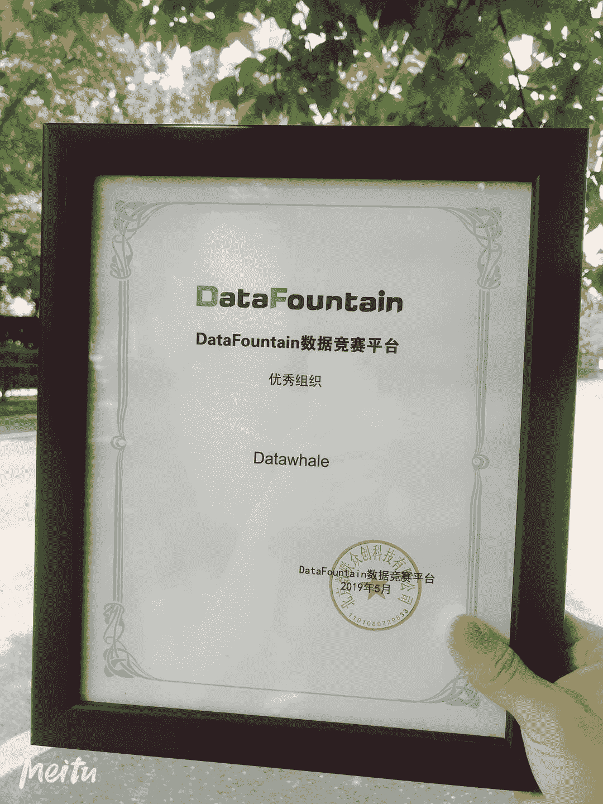

Datawhale数据科学团队

在DataFountain平台所获成绩：

2019 DCIC-中国移动消费者信用预测赛冠军

2019 DCIC-海上风场SCADA数据缺失智能修复赛亚军

2018 BDCI-供应链需求预测赛冠军

2018 BDCI-基金间的相关性预测赛冠军

2018 BDCI-面向电信行业存量用户的智能套餐个性化匹配模型赛亚军

2018 BDCI-面向电信行业存量用户的智能套餐个性化匹配模型赛季军

Datawhale & DataFountain

**Datawhale**是一个专注于AI领域的开源组织，2019年被评为**上海交通大学国家级**项目。致力于构建国内有影响力的开源社区，用开源价值促进产业发展，帮助学习者更好地成长。

目前微信生态学习者**20000+**，组织成员涵盖了清北交浙，伯克利，斯坦福，UMD，港科大，港中文等国内外**50**多所知名院校，以及阿里，百度，头条，微软，IBM等**10**多家知名企业。我们与 **ApacheCN**、**AI有道**、**黄博**、**忆臻 **等国内知名开源组织，AI平台以及领域大V建立了紧密合作关系，与 **和鲸**，**人民邮电出版社 **等企业建立战略合作伙伴关系，以及IT东方会，百度PaddlePaddle，深度之眼等建立良好的合作关系。

作为开源组织，我们坚守愿景和初心，通过良性合作获得资金来源，促使开源组织可持续发展。通过一群人的努力，我们希望能够改善国内的开源环境，打造真正有价值的开源内容和开源产品，促进产业良性发展，帮助到更多渴望改变的学习者。

**DataFountain**平台（简称“DF平台”），是全球最具影响力的数据科学家平台之一，依托中科院计算机所技术团队、中国计算机学会领袖级的专家资源、**5000**余国内外企事业机构资源及教育部上千所高校人才合作渠道，对外提供项目众包服务、数据竞赛服务及线上线下实训服务，链接数据、算法、人才，为产业及数据科学家赋能！

**DF平台**具有丰富的政府、学会、企业、高校竞赛合作经验，是中国计算机学会官方指定竞赛平台。目前已服务**80余名**国内外政企客户，创造了超**50万份**代码提交，吸引近**10万名**来自海内外科技企业、科研机构及高校的数据科学专业人才。以“数据竞赛”模式激活企业技术创新；以“项目众包”模式助力产业升级；以“教赛结合”模式培养数据人才。秉承“链接、分享、协作”的理念，致力于为产业及数据科学家提供服务。

