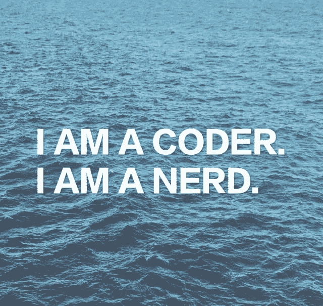
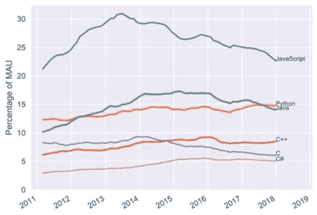
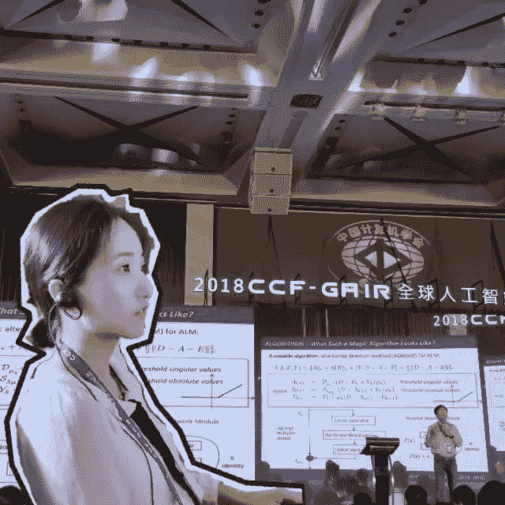
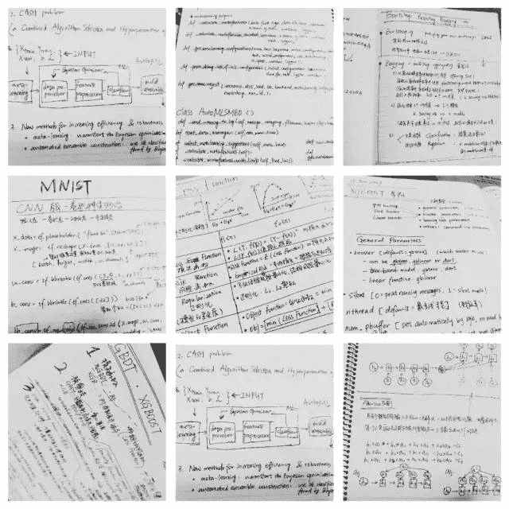
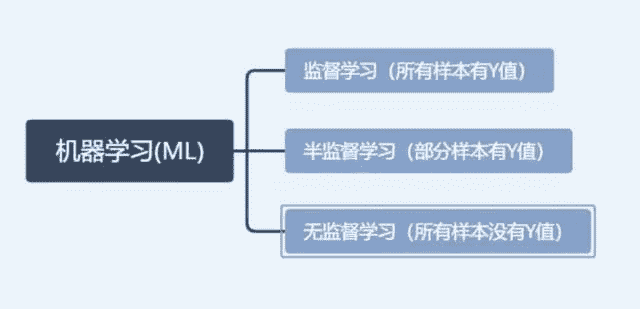
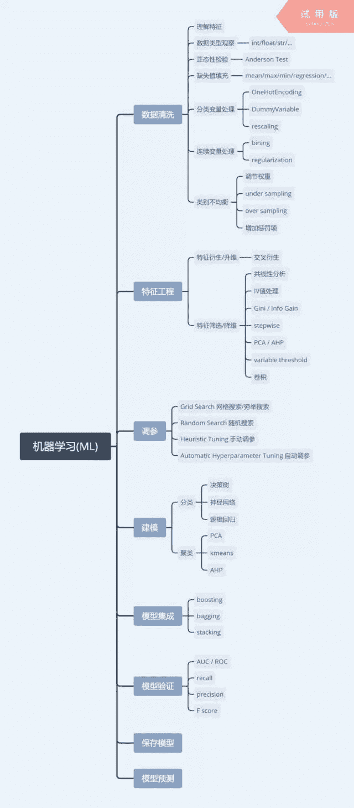
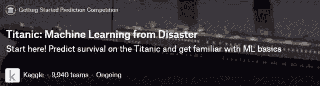

点击上方“**Datawhale**”，选择“星标”公众号

第一时间获取价值内容

**这是一篇关于如何成为一名AI算法工程师的长文~**

经常有朋友私信问，如何学python呀，如何敲代码呀，如何进入AI行业呀？

正好回头看看自己这一年走过的路，进行一次经验总结。

来看看你距离成为一名AI工程师还有多远吧~

⭐具体内容：

? 我是因为什么开始接触敲代码

? 人工智能/机器学习/深度学习

? 自学如何寻找学习资料

? 如何选择编程语言/框架

? 校招/社招/实习/面试经验

? 一碗鸡汤

⭐声明：

? 本篇内容均属于个人观点，建议采纳对自己有用的经验，如有疏漏，欢迎指正，共同进步！

? 2017年5月开始第一份实习 / 2017年7月开始学敲代码 / 2017年11月硕士毕业

? 擅长的编程语言：R / Python

? 不花钱报班，全靠自学，最初是因为穷，后来发现“开源”的世界真是太美好了！

**⚡我是因为什么开始接触敲代码？**

**我的第一个模型是什么**

由于本科是数学，研究生是量化分析，第一份实习是一家金融科技公司，开始接触所谓的“Fintech”?

第一个任务就是做客户的信用评分卡模型，目的给每个用户打一个信用分数，类似支付宝的芝麻信用分。这是银行标配的一个模型，最常见最传统的算法用的就是**逻辑回归**。

在课堂上使用的工具是SAS，SPSS，属于有操作界面的，菜单非常齐全，只需要鼠标点一点就能建模，很好上手。但是SAS这些要付钱的，年费还是相当的贵，所以深圳大部分公司进行数据分析和建模工作都选择开源免费的R语言或者Python。这就体现了掌握一门编程语言的重要性。

虽然说是建模任务，但是前三个月跟建模基本都扯不上边。都在做数据清洗，表格整理（摊手），都在library各种包，用的最多的可能是data.table和dplyr。没办法，很多模型都有包可以直接调用，是最简单的环节了。其实一开始，我一直在犯很低级的错误，各种报错，没有library啦，标点符号没打对啦，各种很low的错误犯了一次又一次，而且连报错的内容都不会看，不知道怎么去改正。如果你也像我一样，**真的请不要灰心**，我就是这样走过来的。对着错误一个个去解决就好了~

当时什么都不知道的时候，觉得真难呀，每个环节都有那么多细节要照顾，要学的那么多，做完一个还有一个，还要理解业务含义。但是当完整的做一遍之后再回头，就会觉得，其实，也没那么难嘛~

**敲代码容易吗**

因为我不是计算机专业的，所以基本上属于没怎么敲过代码的那种。

后来发现程序员也有好多种类的，前端后端等，因此敲的代码种类也很多，才会有几十种的编程语言，下图是一些这几年的主流语言。

实习时我一直被队友嫌弃很蠢，而且一开始敲的东西怎么也运行不通，运行出来的都是鬼结果。有n次想放弃的念头，“我干嘛一定要敲这玩意儿？”，但也有n+1次想坚持的理由，因为我真的喜欢我正在做的事。为什么用“坚持”，因为真的不容易。不难，但真的需要有耐心。

一开始我的状态就是一行行代码的运行，一个个命令的熟悉，反复看，反复运行。

*   **从敲出第一行代码到敲出第一个完整的模型花了3个月**

*   **学习XGBoost，光是理论学了3个月，因为前期铺垫要学的还有adaboost/gbdt和各种机器学习的知识模块**

*   **从R切换到python花了1个月**

*   **从机器学习(Machine Learning)切换到自动机器学习(Auto Machine Learning)花了2个月**

*   **从NLP零基础到搭建一个智能问答机器人花了1个月**

从一年前的“什么是过拟合，什么是交叉检验，损失函数有哪些”到后来参加全球人工智能峰会时都能听懂的七七八八，会觉得，努力没有白费呀！

可以看出，经过前面的积累，后面会学的越来越快。

慢慢的就从一开始的那种“唉，怎么又报错啊，好挫败”的心态变成现在的“啊？没error？感觉不对啊，再查验一遍吧”这种抖M倾向的人。代码虐我千百遍，我已经被磨的没有了脾气。

已经有几个朋友说想转行了，我何曾没想过，只是不知不觉中坚持了下来而已。因为热爱，越虐越停不下来?

**小结**

?**设定一个非常清晰的目标**

为什么第一个写：“我是因为什么开始敲代码的”，因为动机真的非常重要！

所以，很多人在问我“如何学python？”这种问题时，我的第一回答都是“你学python用来干嘛？”

在学校也敲打过python，做个爬虫demo什么的，因为目的性不强没多久就放一边了。清晰的目标就比如说你要做NLP，你要知道NLP的应用有智能问答，机器翻译，搜索引擎等等。然后如果你要做智能问答你要知道现在最发达的技术是深度学习，使用的算法有RNN/LSTM/Seq2Seq/等等一系列。而我的清晰目标是在实习的时候给我的任务。当任务很明确的时候，所需要的语言就明确了，所要学习的算法也就明确了，很多东西就顺理成章了不用一头乱撞了。

?**从金融到科技**

AI的应用范围很广，每一个研究方向都是无穷尽的。由于金融公司很少与图像处理，NLP等技术会有交集，而我强大的好奇心让我决定去纯粹的科技公司一探究竟。目前已投身于智能家居，目标是Javis?

⚡**人工智能/机器学习/深度学习**

我经常在公交的广告牌上看见这些词，好像哪家公司没有这个技术就落后了似的。更多的还有强化学习，迁移学习，增量学习等各种学习。

**这些词儿之间到底什么关系**

机器学习是人工智能的一种，深度学习是机器学习的一种。**学AI先学机器学习**。

**计算机的“算法” 与 数学的“算法” 的区别**

理论知识对于AI算法工程师极其重要。敲代码只是思路的一个实现过程。这里的“算法”和计算机CS的“算法”还不太一样，AI算法是偏数学推导的，所以数学底子还是需要点的，学的越深，要求越高。面试的时候，很少让手写代码，90%都是在问模型抠算法细节。

在学校我是一个不爱记笔记的人，甚至是一个不爱上课的人。但是自从入了机器学习的坑后，笔记写的飞起~

**机器学习的框架**

按照数据集有没有Y值可以将机器学习分为监督学习、半监督学习和无监督学习。监督学习是分类算法，无监督学习是聚类算法。

机器学习的通用流程和相关技术如下图：

ML这棵树还可以有更多的分支。先有个整体感受，再一个一个的解决掉。这里的知识点也是面试最爱问的几个，是重点呀！面试过的同学应该都不陌生了。

**机器学习如何入门**

机器学习之大，初学者都无从下手。说白了，机器学习就是各种模型做预测，那么就需要有数据，要想有好的效果，就要把原始的脏数据洗干净了才能用。数据内隐藏的信息有时候是肉眼不可见的，那么就需要一些相关技巧来把有用信息挖出来。所有绞尽脑汁使用的技巧，都是为了能预测的更准确。但是谁也没办法做到百分百的命中。

这里简单介绍下机器学习的三大块：传统的机器学习ML、图像处理CV、自然语言处理NLP

再推荐一个入门神器：

**Kaggle（www.kaggle.com）**

这是一个世界级的最权威的机器学习比赛，已被谷歌收购。上面的赛题不仅很有代表性，还有很多免费的优秀的数据集供你使用，要知道收集数据是机器学习的第一大难题，它就帮你解决了。入门不用立马参加比赛，把数据下载下来，尽情折腾就好了，要是没有思路，去网上搜别人的解题笔记和代码借鉴一下也很美好~因为这是大家都争相打榜的比赛，所以你并不孤单。

?**ML入门该参加的赛题（Titanic）**

?**图像入门该参加的赛题（数字识别）**

?**NLP入门该参加的赛题（情感分析、quora问句语义匹配）**

等做完第一个titanic的比赛应该就有点感觉了。上面4个比赛我都做过，觉得很经典，很适合入门。

**深度学习的入门算法有哪些**

如今的样本输入可以是文字，可以是图像，可以是数字。

深度学习是跟着图像处理火起来的。甚至现在这个概念都火过了“机器学习”。

深度学习的算法主要都是神经网络系列。入门推荐CNN(卷积神经网络)的一系列：

? LeNet5

? AlexNet

? VGG

? GoogleNet

? ResNet

⚡**自学如何寻找学习资料？**

**开源的世界，美好的世界❤**

“开源”，我的爱！代码届里开源的中心思想就是，share and free?

对于机器学习，网上的社区氛围特别好，分享的很多很全面，而且MLer都非常乐于助人。

介绍几个我经常逛的社区，论坛，和网页：

?**kaggle （www.kaggle.com）**

全球最权威的机器学习比赛，已被谷歌收购。赛题覆盖传统机器学习、nlp、图像处理等，而且都是很实际的问题，来自各行各业。kaggle是数一数二完善的ML社区了，赛题开放的数据集就很有用，非常适合新手练手。对优秀的kaggler也提供工作机会。

?**github（www.github.com）**

全球最大同性交友网站，适合搜项目，开源大社区，大家一起看星星，看issue~

?**StackOverFlow（www.stackoverflow.com）**

代码报错找它，代码不会敲找它！所有与代码相关的坑，基本都有人踩过啦?

?**csdn（www.csdn.net）**

最接地气的博客聚集地，最常看的网页之一，一般用来搜索细节知识点或者代码报错时

?**sklearn（scikit-learn.org/stable）**

专业做机器学习100年！各算法各技巧的例子code应有尽有

?**medium（medium.com）**

创办人是Twitter的创始人，推崇优质内容，国内很多AI公众大号的搬运都来自于这里，medium里每个作者都有自己独特的见解，值得学习和开拓眼界，需要科学上网

?**towards data science（towardsdatascience.com）**

与medium很像，需要科学上网

?**google AI blog（ai.googleblog.com）**

谷歌的AI团队维护的博客，每天至少更新一篇技术博客。刚在上海开的谷歌开发者大会宣布将会免费开放机器学习课程，值得关注一下，毕竟是AI巨头

?**各种大神的技术博客/个人网站**

有很多的网站，会不定期的更新在我的个人博客里

**有口碑的AI公开课平台**

首先说明我没有上课，也没有报班，属于个人学习习惯问题。但考虑到学习差异性，所以还是总结了口碑排名靠前的课程系列。前提，需要有一定数学基础，没有的可以顺便补一补。

?**coursera（www.coursera.org/browse）**

?**吴恩达(Andrew Ng)机器学习**

?**deeplearning.ai（www.deeplearning.ai）**

?**fast.ai（www.fast.ai）**

专注于深度学习。Fast.ai的创始人就蛮有意思的，是横扫kaggle图像处理的高手，不摆架子，也不故弄玄虚。中心思想就是深度学习很简单，不要怕。fast.ai有博客和社区。Jeremy和Rachel鼓励撰写博客，构建项目，在会议中进行讨论等活动，以实力来代替传统证书的证明作用。

?**udacity（in.udacity.com）**

有中文版，课程覆盖编程基础，机器学习，深度学习等。

?**网易云课堂**

**碎片时间**

科技圈也是有潮流要赶的，等你入坑就知道。

追最新的论文，最新的算法，最新的比赛，以及AI圈的网红是哪些~有条件的开个twitter，平时娱乐看看机器学习板块还是蛮有意思的，有很多自嘲的漫画~

推荐几个我超爱看的AI主题美剧

?**硅谷**（强推！简直是我日常生活，太有共鸣了~下饭剧?）

?**西部世界**（看的时候不要学我一直在思考如何实现这个那个技术?）

**实用的小技巧**

?浏览器首推 chrome

?当阅读英文网页呼吸困难时，右击选择“翻成中文（简体）”

考过雅思和GMAT，曾经我也是一个热爱英文的孩子，如今跪倒在海量技术文档和文献里苟活

?搜索问题一定用google，如果没解决是你的问题不是google的锅?

baidu？？？ummm......别为难我......很少用

?学会提问很重要，搜索格式推荐

语言+问题，例如：python how to convert a list to a dataframe

直接复制错误信息，例如：ValueError: No variables to save...

请把所有的问题往上抛，网上查比问人快！总是问别人会引起关系破裂的~

?学会顺藤摸瓜

当你读到一个非常不错的技术文档时，看完别急着关掉。这可能是一个个人网站，去观察菜单栏里有没有【About】选项。或者这也可能是一个优秀的社区，看看有没有【Home】选项，去看看po的其它的文章。

?很多优秀网站都是英文，科学上网必不可少

?学习费用不来自课程，可能来自于硬件要求，学生党要利用好学校资源

**小结**

虽然说了那么多，但还是要说**请放弃海量资料！用多少，找多少就好了！（别把这句话当耳旁风**?）

**资料不在量多而在于内容是有质量保证的**。很多课程或者公众号只管塞知识，你有疑问它也解答不了的时候，这样出来的效果不好，就像一个模型**只管训练，却不验证，就是耍流氓**。

⚡**如何选择编程语言/框架**

**首选英语！！！（咳咳，我认真的?）**

说到底，语言只是工具，不去盲目的追求任何一种技术。根据任务来选择语言，不一样的程序员选择不一样的编程语言。很多人最后不是把重点放在能力而是炫工具，那就有点走偏了。

据观察，在机器学习组里R和Python是使用率最高的两门语言，一般你哪个用的顺就用哪个，只要能达到效果就行，除非强制规定。

我使用之后的感受是，**人生苦短，我用python?**

**用python建个模型到底多难？**

算法任务大致分为两种，一种是普通算法工程师做的“调包、调参”，另一种是高级算法工程师做的，可以自己创建一个算法或者能灵活修改别人的算法。

先说说建个模到底有多简单吧。

?有优秀的算法封装框架

tensorflow / caffe / keras /... 

?Auto ML 是不可阻挡的一个方向

Auto ML(auto machine learning)，自动机器学习。就是你只管丢进去数据，坐等跑出结果来就行了。前一阵子谷歌的CloudML炒的很火，愿景是让每个人都能建模，但毕竟这种服务是要钱的。所以我研究了下开源的auto sklearn框架的代码，发现了什么呢？建模到底有多简单呢？就，简单到4行代码就可能打败10年工作经验的建模师。

再说回来，如果你自己根本不知道自己在做什么，**只能跑出来一个你不能负责的结果，就是很糟糕**的，那还不是一个合格的算法工程师。**你的模型必须像你亲生的那样。但是，只要你想，绝对能做到的！**

**学习python电脑上要装哪些东西**

?Anaconda

对，就是这么简单粗暴，装这个就ok了

学python的应该都会面临到底是python2还是python3的抉择吧。语言版本和环境真的很让人头疼，但是Anaconda惊艳到我了，就是可以自定义python环境，你可以左手py2右手py3?

**推荐几个python的IDE**

?Spyder

Anaconda自带的ide。界面排版与Rstudio和Matlab很相似。输入什么就输出什么结果，适合分析工作，我写小功能的时候很喜欢用。

?Jupyter Notebook

Anaconda自带的ide，属于web界面的。当你程序跑在虚拟机，想调代码的时候适合用。

?PyCharm

对于写项目的，或者代码走读的比较友好。当你需要写好多python文件互相import时，特别好用。

**我的笔记本配置**

（不考虑经济约束的请忽略这条）

牌子+型号：ThinkPad X1 Carbon

推荐配置：i7+16G内存+256G(或更多)硬盘

系统推荐：Linux，因为开源，有空可以玩玩

⚡**校招/社招/实习/面试经验**

?如何安排校招

大厂的开放时间会比较早，密切关注网申时间节点：

2019届的秋招：2019年7月 - 2019年11月

2020届的春招：2020年2月 - 2020年4月

2020届的暑期实习：2020年3月 - 2020年5月

2020届的秋招：2020年7月 - 2020年11月

（以此类推）

?手撕代码能力

建议提早半年开始准备。我的代码也是从实习开始敲起，敲了半年才觉得下手如有神哈哈。不要做没实际意义的课后题，也不要照着书本例题敲，敲完你就忘了，书本这些都是已经排除万难的东西，得不到什么成长。

入门修炼：全国大学生数学建模竞赛、全美大学生数学建模竞赛、kaggle、天池…

?项目经历/实习经历

如果明确自己的职业方向为人工智能/数据挖掘类的，请不要浪费时间去申请其他与技术无关的实习。端茶送水，外卖跑腿，打印纸并不能帮你。当时由于身边同学都断断续续出去实习，面前有一份大厂行政的实习，我…竟然犹豫了一下，好在也还是拒绝了。

尽量选择大厂的技术实习，毕竟以后想进去会更难。但是不要因为一个月拿3000块就只干3000块的活。把整个项目跟下来，了解框架的架构，优化的方向，多去尝试，就算加班（加班在深圳很正常）也是你赚到，思考如何简化重复性工作，去尝试了解自己部门和其他部门的工作内容与方向，了解的越多你对自己想做的事情了解的也越多。我实习做的评分卡模型，除了传统逻辑回归，也尝试新的XGB等等，而且虽然别人也在做，但是私下自己会把整个模型写一遍，包含数据清洗和模型调优等，这样对业务的了解也更透彻，面试起来所有的细节都是亲手做过的，也就比较顺了。

如果没有实习在手，世界给我们数据挖掘选手的大门还是敞开着的。kaggle上有专门给数据挖掘入门者的练习场。相关的比赛还有很多，包括腾讯、阿里等大厂也时不时会发布算法大赛，目测这样的算法大赛只会越来越多，你坚持做完一个项目，你在平台上还可以得到相关名次，名次越靠前越有利哈哈哈这是废话。

?BAT常见的面试题（不分先后）

自我介绍/项目介绍

类别不均衡如何处理

数据标准化有哪些方法/正则化如何实现/onehot原理

为什么XGB比GBDT好

数据清洗的方法有哪些/数据清洗步骤

缺失值填充方式有哪些

变量筛选有哪些方法

信息增益的计算公式

样本量很少情况下如何建模

交叉检验的实现

决策树如何剪枝

WOE/IV值计算公式

分箱有哪些方法/分箱原理是什么

手推SVM：目标函数，计算逻辑，公式都写出来，平面与非平面

核函数有哪些

XGB原理介绍/参数介绍/决策树原理介绍/决策树的优点

Linux/C/Java熟悉程度

过拟合如何解决

平时通过什么渠道学习机器学习（好问题值得好好准备）

决策树先剪枝还是后剪枝好

损失函数有哪些

偏向做数据挖掘还是算法研究（好问题）

bagging与boosting的区别

模型评估指标有哪些

解释模型复杂度/模型复杂度与什么有关

说出一个聚类算法

ROC计算逻辑

如何判断一个模型中的变量太多

决策树与其他模型的损失函数、复杂度的比较

决策树能否有非数值型变量

决策树与神经网络的区别与优缺点对比

数据结构有哪些

model ensembling的方法有哪些

?小结

问题是散的，知识是有关联的，学习的时候要从大框架学到小细节。

没事多逛逛招聘网站看看招聘需求，了解市场的需求到底是什么样的。时代变化很快，捕捉信息的能力要锻炼出来。你可以关注的点有：职业名/职业方向/需要会什么编程语言/需要会什么算法/薪资/...

**每个面试的结尾，面试官会问你有没有什么想问的，请注意这个问题也很关键。**

比如：这个小组目前在做什么项目/实现项目主要用什么语言和算法/…

尽量不要问加不加班，有没有加班费之类的，别问我为什么这么说（摊手）

在面试中遇到不理解的，比如C++语法不懂，可以问这个C++具体在项目中实现什么功能。**如果你提出好问题，能再次引起面试官对你的兴趣**，那就能增加面试成功率。

**应届生就好好准备校招，别懒，别怕输，别怕被拒，从哪里跌倒从哪里起来。社招不是你能招呼的，会更挫败，因为你什么也没做过。**

虽然是做技术的，但是日常social一下还是收益很大的。实习的时候，也要与周围同事和平相处，尤其是老大哥们，也许哪天他就帮你内推大厂去了。内推你能知道意想不到的信息，面试官，岗位需求，最近在做什么项目之类的。

**挑选给你机会的公司****，不要浪费自己的时间**。不要每家都去，去之前了解这家公司与你的**匹配度**。

尤其社招，你一改动简历就很多人给你打电话，你要有策略的去进行面试，把握总结每个机会。像我就是东一榔头西一榔头的，好多都是止步于第一面，就没回信儿了，因为每次面完没有好好反思总结，等下次再遇到这问题还是抓瞎，十分消耗自己的时间和信心。

⚡**一碗鸡汤**

?**一切才刚刚开始，别着急**

AI才刚刚起步，为什么呢？因为上数学课的时候，课本上都是柯西，牛顿，高斯等等，感觉他们活在遥远的时代，很有陌生感。但是现在，我每天用的模型是比我没大几岁的陈天奇创造出来的，我甚至follow他的社交账号，他就鲜活在我的世界里，这种感觉，很奇妙。每次查论文查文献的时候，看2017年出来的都觉得晚了，懊悔自己怎么学的这么慢，看2018年2月出来的才心里有点安慰。这个证明，你在时代发展的浪潮上，也是一切刚刚起步的证明。机遇与挑战并肩出现的时候，是你离创造历史最近的时候。而所谓的风口所谓的浪尖都不重要，**重要的是，因为你喜欢**。

?**找一件可以坚持的事，不要停止去寻找的脚步**

当人做喜欢的事情时，会发光呀！

当你因为真的热爱某件事，而不断接近它的时候，你的灵魂像是被上帝指点了迷津，受到了指示，受到了召唤。你会很自然的知道该做什么，你想做什么，好像生而为了这件事而来。你有时候自己都想不明白为什么做这件事。看过月亮与六便士的应该懂这种使命感~

我不是属于聪明的那类人，我是属于比较倔的那种。就是只要我认定的，我认定到底。天知道我有多少次怀疑过自己，有多少次想放弃，但我还是选择咬牙向前，选择相信自己。坚持的意义就在这里。

