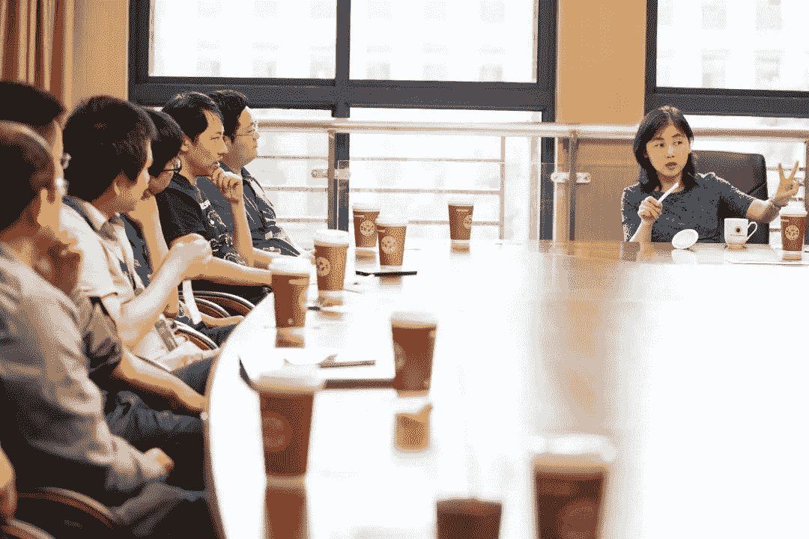
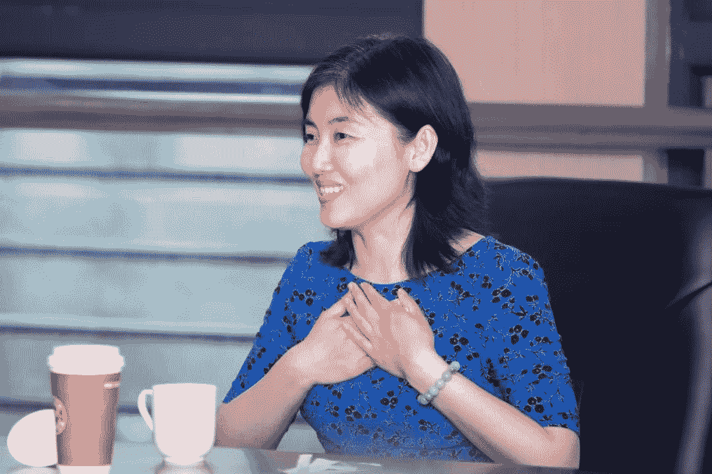

传说中的爱丽丝来了，姓“颜”名“宁”。

她的履历无需赘述，可我们还是忍不住再唠叨一次：

未满30岁从普林斯顿博士毕业回到清华任教，成为“清华最年轻教授”；

2017年成为普林斯顿大学分子生物学系首位雪莉·蒂尔曼终身讲席教授；

2019年在睡梦中当选美国国家科学院外籍院士……

6月20日，一身宝蓝色长裙的颜宁走进西湖大学云栖校区5号楼301。这是她早就计划好的行程，**专程来和生命科学学院的青年PI们“聊聊天”**。

聊什么？聊学生、聊经费、聊科研方向、聊实验室恋情，啥都行！

这个率真的女子有问必答，妙语连珠，毫无保留地献出自己在科研上“打怪升级”的全部经验，也让我们再次强烈感受到她的人生信条：**遵从内心，做独一无二的自己！**

编辑丨李凯娜  

来源丨西湖大学（ID：WIAS2016）

**关于“青椒”的成长之路**

**Q：****刚组建实验室时，应该避免走哪些弯路？**

****━ ━ ━ ━ ━ **━******

**A：**记得当时我回清华建实验室经历了“豪气万丈”、“怒气冲天”、“心平气和”几个阶段。从博士后变成PI，又是回母校，是事业的真正开始，无数的idea在脑中，豪气万丈，磨拳霍霍，恨不得一天一个样地出成绩。

理想是美好的，现实却总要给你捣捣乱。一间空荡荡的屋子，连bench都没有，再加几个连PCR都不明白的小朋友，回国前流畅的实验节奏被完全打乱，有力气没处使的感觉让我每天都在抓狂中。印象中，回清华的第一年是我人生中最暴躁的一年。

后来，差不多半年过去了，实验室该买的仪器有了，该建的冷室能制冷了，学生该犯的错误也都犯得七七八八了，E.coli 每天该染的phage也都染过了。不知从哪一天开始，实验进展变得每天都看得见了！于是，终于进入了心平气和的阶段。

所以，想预警一下新建实验室的同事们：**如****果你觉得很烦闷，压力很大，千万不要因此有了次生压力。这个经历想必很多初建实验室的人都会有，但少则几个月，多则半年一年总会过去。**

**Q：****对于备课、上课，你是什么样的心态？**

****━ ━ ━ ━ ━ **━******

**A：****狠狠地抱怨，然后认真地备课，上完课后再感叹一句“真好玩啊”。**记得我之前在清华讲生化课，我生化其实是很厉害的，印象里似乎是拿到过94分、96分的成绩，但在讲课的时候，我竟然发现自己在很多地方并没有真正明白。因为作为教师讲课和学生听课是完全不一样的，讲课要有逻辑，要讲清楚前因后果，1个小时的课，我经常要花费1天去备课。

但我很喜欢讲课，这是一个很愉悦的过程，我自己也受益很多。在清华的时候，我曾经一周讲过7个小时的课，这其实对口才和体力都是很好的锻炼。我现在讲起来科学史，能够做到引经据典、旁征博引，但又有意识控制时间，这都得益于之前上课的积累。

**Q：****开会很耗时间，对年轻PI来说，去还是不去？**

****━ ━ ━ ━ ━ **━******

**A：**作为年轻PI，你一定要去参加学术会议。我从回国第一天，我的目标就是国际的标准，**科学家要在国际舞台上比拼。**在学术界，你不能让别人觉得你是一个很没有存在感的人，不能是“小透明”。通过学术会议，你可以让别人看到你的脸，让别人知道你的存在、了解你的研究，你也可以借此把自己的学术圈扩大，还能去了解学术前沿进展。科学家切忌偏居一隅。

**Q：****西湖大学是一所崭新的学校，PI是否需要经常参与到学校和学院的发展，该如何分配时间？**

****━ ━ ━ ━ ━ **━******

**A：**我分享一下当年我是怎么做的，我是一个非常闲云野鹤的人，我很不愿意做行政，但我觉得每个人都应该承担一点public service。**我的建议是对于新PI，最初三年一般是有豁免权的**，一定要充分利用这几年，打好稳固的实验室基础。

我是在2010年才开始承担研究生培养这一公共服务的，做下来还是很有意思的，毕竟你可以完全按照你的想法去搭建构架和建立规则，这对你也是一种训练。当然，研究生培养也是我的兴趣所在。尽管如此，5年以后，我觉得公共服务挺对得起学校和大家了，就辞去相关职务了。

**Q：****面对太多的邮件和信息应该如何处理？****如何拒绝别人的一些邀请？**

****━ ━ ━ ━ ━ **━******

**A：**现在邮件、微信太多了，如果你不有意识地控制，杂事无穷无尽。**一定要勇敢地说NO，**对我而言，平时饭局什么的，基本能逃就逃。我的手机很多时候根本不在身边，E-mail不回也是常态。当然，这好像有点没礼貌，我自己都觉得太不够nice。然而，一个人的时间是有限的，鱼与熊掌不可得兼，总要有所取舍，就这么简单。只要让别人知道这是你的一贯风格，你不是因人而异，最终大家也就都谅解了。

不过呢，与学术相关的，比如别人对你论文的问题、找你要论文中提到的质粒等实验材料，一定要尽快回复，这是学术规范。

说到时间的管理，**有个得力的lab manager非常重要**。很多好的scholar，未必是好的manager。术业有专攻，一个得力、值得信赖的lab manager能给你省出大把的时间。其实就是一句话，**把时间、精力、资源尽可能地投入到research中去。**

**关于和学生的相处之道**

**Q：****应该如何调动学生科研的积极性？**

**━ ━ ━ ━ ━ **━ ****

**A：****与其批评人，不如表扬人，**你要激发起同学们的积极性和主动性。这是我向施一公老师学来的。当我在施老师实验室做博士时，他整天在我面前夸另一个学生，她来自复旦，和我同时进实验室。当毕业的时候，她对我说：“颜宁你带给我压力太大了，一公经常在我面前夸你！”我就释然了，原来这是他的“激将法”。

在我们实验室内，大家基本上是团队分组合作，但同一年级的人不要在一个课题上，一般都是老带新，也可以保证课题的延续性，老生毕业了，新生也成长了，课题后继有人。但这个过程中，你要注意，有时候个别老生可能会“欺负”新生，比如让新生只做粗重的工作，这时候你要站出来干预。

**Q：****当我给学生比较多自由的时候，我会很生气；但我管太多的时候，学生又很生气。应该如何在这其中找到平衡？**

**━ ━ ━ ━ ━ **━****

**A：**这个其实是**如何处理 Hands on 和 Hands off 的关系**。在初期的时候你一定要“Hands on”，施老师说过的前三年我们要做super postdoc就让我很受益。不论学生有多聪明、多用功，经验教训总是比不上你的。学生自己磕磕绊绊地折腾半天，也许你和他一起工作几分钟就帮他绕开了陷阱。

我总是喜欢给学生讲我知道的容易犯的错误，告诉他们我平时积累的一些小窍门。实验室内的第一批学生我都是手把手地带和教，在写第一篇论文之前，我的几乎所有时间都是泡在实验室里面，和他们一起干活，关注细节，把好的科研习惯教给他们，避免他们走弯路。第一批成长起来后，第二批会由第一批带。当实验室各方面都比较成熟的时候，你再“Hands off”。

**Q：****我的一个科研项目给这位学生后，我发现他不是很合适，我想转交给其他学生，应该如何照顾学生的情绪？**

**━ ━ ━ ━ ━ **━****

**A：****这其实是一项沟通的艺术。**不要说学生能力不行，伤人的话不要说，而是看是否“Match”。我在清华做班主任的时候，有一位学生，书本上的公式全部都会，但做实验却不擅长，我会告诉这位学生，你更擅长计算方面，可以多做计算方面的工作。

所以，要善于发现每个人的长处，千万不要摧毁学生的信心，但为了顺利推进工作、实现目标，也不能一味迁就某个团队成员的玻璃心。我也会赶人的。我赶人的原则是痴迷电子游戏或者撒谎，如果出现了这两点，我会给三次机会，但是如果在充分沟通的情况下还屡教不改，本着对实验室文化和对学生负责的态度，我只能坦诚告知：我们chemistry不合，还是不要再留在本实验室了。

**Q：****如何管理好学生在实验室的时间？**

**━ ━ ━ ━ ━ **━****

**A：**听说现在有的实验室会实行打卡考勤，我觉得这样做挺奇怪的。我们实验室是不管大家几点来、几点走的，实验注重的是效率；而且每个人的生物钟都不一样，要给学生支配时间的自由。我实验室同学们一年有三周的假期，大家可以自由调整时间，错开节假日高峰，也不一定要在周六周日休息，比如实验周五做上了，一定要在周末休息，那周一就得再重新开始。当同学们做完了一个项目，也可以在工作日内休息两天。**我们要“push project”, 而不是“push”人。**这一点很重要。

其实，我讲了这么多，从来不是想“管”学生，而是要“帮助”他们。实验室是学生强大的后盾，不要冷冰冰的，当同学们有一些特殊情况时，我们一定要考虑到、照顾到，比如我实验室内学生家人生病时，我会给一些慰问津贴。为人师长真的是要为他们好，而且我们也要问一问，你的这种好是不是学生想要的好，不能把自以为是的好强加在学生身上。

**Q：****您有特别encourage实验室内的女学生吗？**

**━ ━ ━ ━ ━ **━ ****

**A：**我为什么要特别鼓励女学生？我从头到尾都是鼓励**大家遵从自己内心的选择，做自己想做的事。**每个人都有自己的目标，也不是每个学生都能做PI，要看同学们的素质和兴趣。如果她想明白了就是想做全职妈妈， why not?比如我自己，我最开始时候也从来没想做过PI，我是想做记者的。但是为人师长，我们有义务要提醒学生，不论做什么决定，都有拷问内心，这是非常清醒负责任的决定。

**Q：****在带学生时还有哪些要注意的？**

**━ ━ ━ ━ ━ **━****

**A：**我自己常常感慨，和学生打交道是一门艺术，**不要和学生走得太“近”，也不要太“远”。**这也是我自己在带学生时的一个经验。比如你刚来的时候，你把学生们当成一家人，打成一片，学生真的会把你当做哥哥或者姐姐，教师和学生之间的界限感就没有了。切记我们不是学生的玩伴，而是可以值得信任的老师，这个度一定要把握好。

孩子们把最好的青春放在了实验室，和导师相处的时间多过陪伴父母的时间。耳濡目染之际，师生彼此影响。四五年下来，至少于我，那就是亲人了。亲人之间不仅关切，也苛责；不需要虚伪与掩饰，但是一颗盼好的心是最自然的。我们要用心指导学生，他们做得好，自己的路越走越宽，前途越来越光明，我成全了他们；他们做得好，我的实验室整体看着越来越像样，我自己也收获颇多，他们成全了我。

**关于实验室里的那些事儿**

**Q：****实验室应该营造什么样的文化？**

**━ ━ ━ ━ ━ **━ ****

**A：**这要看你喜欢什么样的实验室文化，实验室的文化是靠自己带动的。比如在我们实验室，每三个月就会强调诚信问题，这是一条不可跨越的红线。再如，当实验室内有同学做出了很好的成果时，其实是可以带动其他人的，有人说自己天生“佛系”，但在我看来其实是一种逃避，我不大相信年纪轻轻就真正能够做到“佛系”的。作为PI，你要正面利用好实验室成员之间的这种心态，带动起实验室内的氛围。

另外，我自己个人比较喜欢质疑我的学生，对于这样的学生，你要刻意地保护他们的好奇心和提出问题的能力，不要担心自己的权威受到影响，这些学生往往将来会成器的。

**Q：****如何处理实验室内小组的分工和平衡？**

**━ ━ ━ ━ ━ **━ ****

**A：**首先我们自己要做到公平，要客观评价学生的贡献，要扪心自问我们是否做到了公平，如果我们自己都做不到，要知道学生并不傻，一定会有抱怨的；其次要给团队成员多传递**我们是一个Team**，大家是一荣俱荣、一损俱损的关系，当这个项目做出来了，大家也都是受益者。

**Q：****如何看待实验室内部谈恋爱？**

**━ ━ ━ ━ ━ **━ ****

**A：****其实这是公和私关系的一个处理，**谈恋爱是学生的私人生活，我们能管的是实验室内相关的事，而且这也不见得是一件坏事，只要不影响科研就好了，除非向你求助了，否则不该干涉学生的私域。

**Q：****在使用经费方面，有没有好的经验？**

**━ ━ ━ ━ ━ **━ ****

**A：**不要小气。经费是为科研服务的，对于经费我们的使用原则是**“好钢要用在刀刃上”**。你想，购买了这个设备，能够大大提高实验的效率，那就是值得的。如果5年时间一个膜蛋白都做不出来，这不是更大的浪费吗？当然，在使用的时候也要看性价比。

还有一个提醒，使用科研经费时，**一定要注意做好财务监管**，包括PI本人在经费使用上也要有监督机制。

颜宁的每一个回答都非常的真诚和真实，无论是学生还是老师，无论是科研还是处事，相信从颜宁身上都能学习一二。 

