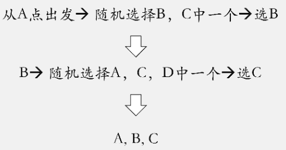

关注上方“**Datawhale**”，选择“星标”公众号

第一时间获取价值内容


作者丨梅子行

来源丨风控算法工程师（ID：RC_algorithms）

现在我们正处在一个深度学习时代，CV领域基本上已经被NN所统治，NLP、推荐也有不同程度的大规模应用。似乎很多从业者对风控领域的认知是我们一定不会使用深度学习方法，归根结底是因为它本身是一个黑箱模型，解释性较差。但是个人理解当我们从LR转向XGBoost的时候，解释性其实就已经不复存在了。纵观整个机器学习界，无外乎都是从传统机器学习逐渐过渡到NN的一个过程，个人觉得深度学习在各个领域的普及是迟早的事情。

**那么当前深度学习在风控场景都有哪些应用呢？**

我觉得基本可以总结为以下这三个子场景：

1）序列数据建模：代表算法 LSTM

2）图谱建模：代表算法 GCN

3）传统特征衍生：代表算法 CNN、XDeepFM

#### 循环神经网络

目前就使用场景来看，与传统风控建模手段区别最大的，莫过于基于RNN的一系列序列模型，不在使用onehot编码或者时间窗口的描述统计特征进行建模，而是使用循环神经网络对时间序列进行拟合，从而学习到一个用户的发展变化。


代表场景主要是拥有时间顺序的序列数据：

*   B卡

*   盗号检测

*   失联模型

*   文本分类

理论上来说用户在app上的点击数据都可以拿来使用。

双向LSTM的pytorch实现

```
from torch import nn	
class BLSTM(nn.Module):	
"""	
        Implementation of BLSTM Concatenation for sentiment classification task	
"""	
def __init__(self, embeddings, input_dim, hidden_dim, num_layers, output_dim, max_len=40, dropout=0.5):	
        super(BLSTM, self).__init__()	
        self.emb = nn.Embedding(num_embeddings=embeddings.size(0),	
                                embedding_dim=embeddings.size(1),	
                                padding_idx=0)	
        self.emb.weight = nn.Parameter(embeddings)	
        self.input_dim = input_dim	
        self.hidden_dim = hidden_dim	
        self.output_dim = output_dim	
# sen encoder	
        self.sen_len = max_len	
        self.sen_rnn = nn.LSTM(input_size=input_dim,	
                               hidden_size=hidden_dim,	
                               num_layers=num_layers,	
                               dropout=dropout,	
                               batch_first=True,	
                               bidirectional=True)	
        self.output = nn.Linear(2 * self.hidden_dim, output_dim)	
def bi_fetch(self, rnn_outs, seq_lengths, batch_size, max_len):	
        rnn_outs = rnn_outs.view(batch_size, max_len, 2, -1)	
# (batch_size, max_len, 1, -1)	
        fw_out = torch.index_select(rnn_outs, 2, Variable(torch.LongTensor([0])).cuda())	
        fw_out = fw_out.view(batch_size * max_len, -1)	
        bw_out = torch.index_select(rnn_outs, 2, Variable(torch.LongTensor([1])).cuda())	
        bw_out = bw_out.view(batch_size * max_len, -1)	
        batch_range = Variable(torch.LongTensor(range(batch_size))).cuda() * max_len	
        batch_zeros = Variable(torch.zeros(batch_size).long()).cuda()	
        fw_index = batch_range + seq_lengths.view(batch_size) - 1	
        fw_out = torch.index_select(fw_out, 0, fw_index)  # (batch_size, hid)	
        bw_index = batch_range + batch_zeros	
        bw_out = torch.index_select(bw_out, 0, bw_index)	
        outs = torch.cat([fw_out, bw_out], dim=1)	
return outs	

def forward(self, sen_batch, sen_lengths, sen_mask_matrix):	
"""	
        :param sen_batch: (batch, sen_length), tensor for sentence sequence	
        :param sen_lengths:	
        :param sen_mask_matrix:	
        :return:	
 """	

''' Embedding Layer | Padding | Sequence_length 40'''	
        sen_batch = self.emb(sen_batch)	
        batch_size = len(sen_batch)	

''' Bi-LSTM Computation '''	
        sen_outs, _ = self.sen_rnn(sen_batch.view(batch_size, -1, self.input_dim))	
        sen_rnn = sen_outs.contiguous().view(batch_size, -1, 2 * self.hidden_dim)  # (batch, sen_len, 2*hid)	

''' Fetch the truly last hidden layer of both sides'''	
        sentence_batch = self.bi_fetch(sen_rnn, sen_lengths, batch_size, self.sen_len)  # (batch_size, 2*hid)	
        representation = sentence_batch	
        out = self.output(representation)	
        out_prob = F.softmax(out.view(batch_size, -1))	
return out_prob
```

#### 卷积神经网络

CNN中的卷积本质上就是利用一个共享参数的过滤器（kernel），通过计算中心像素点以及相邻像素点的加权和来构成feature map实现空间特征的提取，加权系数就是卷积核的权重系数。


代表场景主要是用于拥有拓扑关系的数据上：

*   将可以求和的数据展开成feature-map的样子即可做卷积，从而实现特征交叉，挖掘更深层次的特征

深度学习的另一个非常重要的领域就是在我们的知识图谱中。

**图卷积神经网络的前奏-Node2Vec** 

说GCN之前首先要先知道一个概念叫做Node2Vec，讲Node2Vec之前可能需要先引入一个概念叫做Word2Vec


Word2Vec的基本流程如下


那我们怎么在图中找到“临近”的节点？如何生成节点序列？

#### 1）广度优先遍历（BFS）

从根节点出发，即下图中的0节点出发

首先访问它的子节点1，之后再访问它的子节点2。

当根节点0的所有子节点访问完了，再访问节点1的子节点，即节点3和节点4

当节点1的所有子节点访问完了，再访问节点2的所有子节点，即节点5和节点6

访问顺序为0-1-2-3-4-5-6

广度优先遍历得到的是结构相似性 （structural equivalence）：结构相似性是衡量两个节点在网络中所在的位置和结构的相似性。


#### 2）深度优先遍历（DFS）

从根节点0出发

首先访问它的子节点1， 然后再访问节点1的子节点，节点3和节点4

再返回访问子节点2，然后再访问节点2的子节点，节点5和节点6

访问顺序为 0-1-3-4-2-5-6

深度优先遍历得到的是同质性（homophily）：通过两个节点的距离来衡量它们之间的相似性。如果两个节点的距离越近，则它们的同质性越高，也就是相似度越大。


那么，有没有可能在某种生成节点序列的过程中同时考虑到homophily和structural equivalence？

#### Random Walk 随机游走

随机漫步（Random Walk）思想最早由Karl Pearson在1905年提出，它是一种不规则的变动形式，在变动过程当中的每一步都是随机的。假如我们有下面这样一个小的关系网络。



在加权网络结构图，我们还可以根据权重来设置某节点游走到另外一个节点的概率。

随机游走在生成节点序列中，在一定程度上既可以照顾到homophily，又可以照顾到structural equivalence。但是很难控制两种相似性所占的比重。

#### node2vec

node2vec 可以改善random walk，更好地反映同质性与结构相似性
以下图为例，选择 t 为初始节点，并引入两个参数 p和q

返回概率参数（Return parameter）p，对应BFS，p控制回到原来节点的概率，如图中从t跳到v以后，有1/p的概率在节点v处再跳回到t
离开概率参数（In outparameter）q，对应DFS，q控制跳到其他节点的概率


假设现在已经从节点 t 走到节点 v，那么边的权重如所示:：


其中dtx表示节点t到节点x之间的最短路径

通过上面我们可以发现:

*   q 越大，p越小，结构相似性所占比重越高

*   p 越大，q越小，同质性所占比重越高

#### Node2Vec的pytorch实现

```
#preprocess_transition_probs（初始生成节点到节点的概率）	
def preprocess_transition_probs(self):	
'''	
    Preprocessing of transition probabilities for guiding the random walks.	
    '''	
####get_alias_edge这个函数是对每条边设定为二阶randomwalk的概率形式	
###这个函数的作用是生成每个边界的概率，同时会有alias_setup这个函数将概率进行转换，方便后面抽样	
    G = self.G	
    is_directed = self.is_directed	

    alias_nodes = {}	
for node in G.nodes():	
      unnormalized_probs = [G[node][nbr]['weight'] for nbr in sorted(G.neighbors(node))]#读取每个邻点权重	
      norm_const = sum(unnormalized_probs)###权重求和，作为公式中正则项常数的那个分母	
      normalized_probs =  [float(u_prob)/norm_const for u_prob in unnormalized_probs]###除以分母	
      alias_nodes[node] = alias_setup(normalized_probs)	
    alias_edges = {}	
    triads = {}	
if is_directed:	
for edge in G.edges():	
        alias_edges[edge] = self.get_alias_edge(edge[0], edge[1])	
else:	
for edge in G.edges():	
        alias_edges[edge] = self.get_alias_edge(edge[0], edge[1])	
        alias_edges[(edge[1], edge[0])] = self.get_alias_edge(edge[1], edge[0])	

    self.alias_nodes = alias_nodes	
    self.alias_edges = alias_edges	

return	
#get_alias_edge是得到节点到节点的概率	
def get_alias_edge(self, src, dst):####二阶ramdom walk	
#src是随机游走序列中的上一个节点，dst是当前节点	
'''	
    Get the alias edge setup lists for a given edge.	
'''	
    G = self.G	
    p = self.p	
    q = self.q	

    unnormalized_probs = []	
for dst_nbr in sorted(G.neighbors(dst)):	
if dst_nbr == src:	
        unnormalized_probs.append(G[dst][dst_nbr]['weight']/p)	
elif G.has_edge(dst_nbr, src):	
        unnormalized_probs.append(G[dst][dst_nbr]['weight'])	
else:	
        unnormalized_probs.append(G[dst][dst_nbr]['weight']/q)	
    norm_const = sum(unnormalized_probs)	
    normalized_probs =  [float(u_prob)/norm_const for u_prob in unnormalized_probs]	

return alias_setup(normalized_probs)	
#alias_setup ：输入概率，得到对应的两组数，方便后面的抽样调用	
def alias_setup(probs):	
'''	
    alias_setup的作用是根据二阶random walk输出的概率变成每个节点对应两个数，被后面的alias_draw函数所进行抽样	
  '''	
  K = len(probs)	
  q = np.zeros(K)	
  J = np.zeros(K, dtype=np.int)	

  smaller = []	
  larger = []	
for kk, prob in enumerate(probs):	
      q[kk] = K*prob	
if q[kk] < 1.0:	
          smaller.append(kk)	
else:	
          larger.append(kk)##kk是下标，表示哪些下标小	

while len(smaller) > 0 and len(larger) > 0:	
      small = smaller.pop()##smaller自己也会减少最右边的值	
      large = larger.pop()	

      J[small] = large	
      q[large] = q[large] + q[small] - 1.0	
if q[large] < 1.0:	
          smaller.append(large)	
else:	
          larger.append(large)	

return J, q	
#alias_draw 抽样函数	
def alias_draw(J, q):	
'''	
  Draw sample from a non-uniform discrete distribution using alias sampling.	
  '''	
  K = len(J)	

  kk = int(np.floor(np.random.rand()*K))	
if np.random.rand() < q[kk]:	
return kk	
else:	
return J[kk]	
#node2vec_walk就是对于给定的长度，对于开始节点开始模拟这个节点的路径，涉及的函数都在上面提及	
def node2vec_walk(self, walk_length, start_node):	
'''	
    Simulate a random walk starting from start node.	
    '''	
    G = self.G	
    alias_nodes = self.alias_nodes	
    alias_edges = self.alias_edges	

    walk = [start_node]	
######alias_draw这个函数是等于是根据二阶random walk概率选择下一个点	
while len(walk) < walk_length:	
      cur = walk[-1]	
      cur_nbrs = sorted(G.neighbors(cur))###G.neighbors(cur)得到cur一级关联的节点	
if len(cur_nbrs) > 0:	
if len(walk) == 1:	
####cur[0]	
          walk.append(cur_nbrs[alias_draw(alias_nodes[cur][0], alias_nodes[cur][1])])	
else:	
          prev = walk[-2]	
          next = cur_nbrs[alias_draw(alias_edges[(prev, cur)][0], 	
            alias_edges[(prev, cur)][1])]	
          walk.append(next)	
else:	
break	

return walk
```

#### 图卷积神经网络（Graphs Convolutional Neural Networks ）

CNN处理的图像或者视频数据中像素点（pixel）是排列成成很整齐的矩阵。与之相对应,科学研究中还有很多Non Euclidean Structure的数据,社交网络、信息网络中有很多类似的结构。

实际上,这样的网络结构(Non Euclidean Structure)就是图论中抽象意义上的拓扑图。因此我们提出GCN.


为什么要研究GCN？

*   CNN无法处理Non Euclidean Structure的数据，学术上的表达是传统的离散卷积（如问题1中所述）在Non Euclidean Structure的数据上无法保持平移不变性。通俗理解就是在拓扑图中每个顶点的相邻顶点数目都可能不同，那么当然无法用一个同样尺寸的卷积核来进行卷积运算。

*   由于CNN无法处理Non Euclidean Structure的数据，又希望在这样的数据结构（拓扑图）上有效地提取空间特征来进行机器学习，所以GCN成为了研究的重点。

*   广义上来讲任何数据在赋范空间内都可以建立拓扑关联，谱聚类就是应用了这样的思想（谱聚类（spectral clustering）原理总结）。所以说拓扑连接是一种广义的数据结构，GCN有很大的应用空间。

代表场景是金融知识图谱：

*   提取客户的关系特征

*   构建反欺诈模型

#### 因子分解机

对于预测性的系统来说，特征工程起到了至关重要的作用。特征工程中，挖掘交叉特征是至关重要的。交叉特征指的是两个或多个原始特征之间的交叉组合。

传统的风控模型中，挖掘交叉特征主要依靠人工提取，这种做法主要有以下三种缺点：

*   重要的特征都是与应用场景息息相关的，针对每一种应用场景，工程师们都需要首先花费大量时间和精力深入了解数据的规律之后才能设计、提取出高效的高阶交叉特征，因此人力成本高昂

*   原始数据中往往包含大量稀疏的特征，交叉特征的维度空间是原始特征维度的乘积，因此很容易带来维度灾难的问题

*   人工提取的交叉特征无法泛化到未曾在训练样本中出现过的模式中

因此自动学习特征间的交互关系是十分有意义的。

FM算法的pytorch实现：

```
class FM_model(nn.Module):	
def __init__(self, n, k):	
super(FM_model, self).__init__()	
self.n = n # len(items) + len(users)	
self.k = k	
self.linear = nn.Linear(self.n, 1, bias=True)	
self.v = nn.Parameter(torch.randn(self.k, self.n))	

def fm_layer(self, x):	
# x 属于 R^{batch*n}	
        linear_part = self.linear(x)	
# 矩阵相乘 (batch*p) * (p*k)	
        inter_part1 = torch.mm(x, self.v.t())  # out_size = (batch, k)	
# 矩阵相乘 (batch*p)^2 * (p*k)^2	
        inter_part2 = torch.mm(torch.pow(x, 2), torch.pow(self.v, 2).t()) # out_size = (batch, k) 	
        output = linear_part + 0.5 * torch.sum(torch.pow(inter_part1, 2) - inter_part2) 	
# 这里torch求和一定要用sum	
return output  # out_size = (batch, 1)	

def forward(self, x):	
        output = self.fm_layer(x)	
return output
```

#### DeepFM

左边deep network，右边FM，所以叫deepFM。图示就是这样：


其中deep部分并不怎么deep，才2个全连接层（FC）。

目前大部分相关的研究工作是基于因子分解机的框架，利用多层全连接神经网络去自动学习特征间的高阶交互关系，例如FNN、PNN和DeepFM等。

其缺点是模型学习出的是隐式的交互特征，其形式是未知的、不可控的；同时它们的特征交互是发生在元素级（bit-wise）而不是特征向量之间（vector-wise），这一点违背了因子分解机的初衷。

#### xDeepFM算法

**压缩交互网络（Compressed Interaction Network）**

CIN中一个神经元相关的接受域是垂直于特征维度D的整个平面，而CNN中的接受域是当前神经元周围的局部小范围区域，因此CIN中经过卷积操作得到的特征图（Feature Map）是一个向量，而不是一个矩阵。

将CIN与线性回归单元、全连接神经网络单元组合在一起，得到最终的模型并命名为极深因子分解机**xDeepFM.**

代表场景和CNN差不多：

*   对变量矩阵做特征交叉，挖掘更深层次的特征


前面提到的几大模块是我这从这几年经手的所有深度学习相关的风控项目中归纳得到的，希望能对其他对深度学习感兴趣的风控从业者有所帮助。

