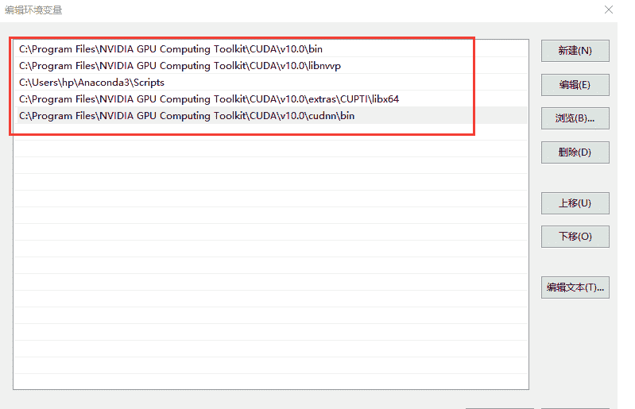

点击上方“**Datawhale**”，选择“星标”公众号

第一时间获取价值内容

##### **【导读】**今年三月谷歌在TensorFlow开发者峰会上宣布TensorFlow 2.0 Alpha版本（内部测试版）之后，TensorFlow 2.0 Beta版本（公开测试版本）已经发布。TF2.0相比于1.x版本默认使用Keras、Eager Execution、支持跨平台、简化了API等。这次更新使得TF2.0更加的接近PyTorch，一系列烦人的概念将一去不复返。如果2019的下半年开始入坑TF，那么你将选择进入AI的最佳时机了，Tensorflow社区蓬勃发展，未来可期。接下来就给大家带来TF 2.0 Beta –Window系统下GPU版本的详细完整的安装教程。

**目录**

1.Anaconda 

1.  安装Anaconda

2.  修改路径

3.  修改默认浏览器

2.CUDA10.0

1.  CUDA安装

2.  cuDNN安装

3.  PATH配置

3.TensorFlow2.0 Beta-GPU版本安装与测试

1.  确认显卡

2.  测试

**1\. Anaconda**

**a. 下载**

首先进入Anaconda的官网： 

https://www.anaconda.com/distribution

选择Windows下Python3.7（注意：必须选择64位，因为TF不支持Python32位的）

下载完成后打开，然后就是傻瓜式的安装，一路next即可。

**b. 修改路径**

默认地址为C盘(这是默认地址，如果你通常安装在c盘的话，可以忽略此步骤)，

如果安装后没有其他的操作的话，打开.juyter文件是没有[jupyter_notebook_config.py]

打开cmd，输入

jupyter notebook --generate-config

回车，会产生[jupyter_notebook_config.py]

用Notepad++打开[jupyter_notebook_config.py],找到c.Notebook

建立你的新工作路径

取消注释，c前面的#要去掉

点击保存，这下就修该好了路径

cmd，输入[jupyter notebook]，你就发现你的路径已更改

**c. 修改默认浏览器**

打开[jupyter_notebook_config.py] 

找到你想用的浏览器路径(下面是我的浏览器路径)

打开[jupyter_notebook_config.py] 找到App.browser = ''，在这行下面添加以下三行代码

import webbrowser

webbrowser.register("chrome",None,webbrowser.GenericBrowser(u"C:\ProgramFiles (x86)\Google\Chrome\Application\chrome.exe"))

c.NotebookApp.browser = 'chrome'

这样就修改好了Anaconda使用的浏览器和使用路径，还是非常简单的。现在打开我们的Jupyter Notebook(后面将会在这个文件夹写下Tensorflow2.0的笔记内容)

**2\. CUDA 10.0**

**a. CUDA 安装**

下载CUDA

官网链接：

https://developer.nvidia.com/cuda-10.0-download-archive?target_os=Windows&target_arch=x86_64&target_version=10&target_type=exelocal

下载完成后，打开下载的驱动

取勾GeForce Experience

如果电脑上本身就有Visual Studio Integration，要将这个取消勾选，避免冲突了

点开Driver comonents，Display Driver这一行，前面显示的是Cuda本身包含的驱动版本是411.31

如果你电脑目前安装的驱动版本号新于Cuda本身自带的驱动版本号，那一定要把这个勾去掉。否则会安装失败(相同的话，就不用去取勾了)

接下来需要几分钟的时间安装，这是NVIDIA程序已完成的界面

打开此路径，查看nvcc.exe

有这个nvcc.exe就说明CUDA安装已成功

打开此文件夹，查看有没有cuti64_100.dll

有这个cuti64_100.dll就说明CUPT1已成功

**b. cuDNN 安装**

CDNN官网链接：

https://developer.nvidia.com/rdp/cudnn-download

选择cuDNN for CUDA10.0

解压cuDNN

将解压后文件复制到CUDA文件夹下 

**c. PATH配置**

查看CUDA环境路径

我的电脑——>属性——>高级系统设置——>环境变量

在系统变量中找到PATH

查看CUDA路径，当你安装完CUDA后，它会将这两个目录加进来 

CUPTA和cuDNN还没有加进来，所以必须将它们添加到路径，这样使用Tensorflow的时候才不会报错

添加CUPTA和cudnn路径

新建——>浏览，找到路径

cuDNN路径，CUPTA路径(缺一不可)

测试CUDA：

cmd

nvcc -V

下面的显示说明我们CUDA的版本是10.0

**3. TensorFlow 2.0 安装与测试**

**a. 确认显卡**

安装前要确认显卡是不是NVDIA的

命令行

pip install tensorflow-gpu==2.0.0-beta0

**b. 测试**

测试Tensorflow是否安装成功：

步骤：

打开cmd——>ipython——>import tensorflow as t f

import tensorflow as tf

tfabab.test.is_gpu_available()

显示True，说明gpu版本已经安装成功

**今日话题**

你在学习使用TensorFlow 的过程中，遇到过什么问题呢？

后续还会推出TF2.0 系列学习教程，你有什么想要提问的问题吗？

在评论区留言，分享给大家吧~

你的分享，可以帮助大家共同学习进步。

