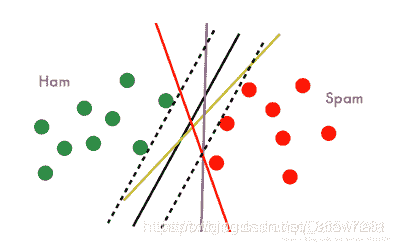
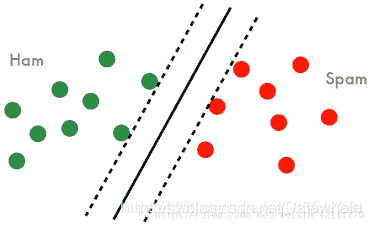
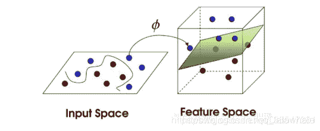

## SVM简介

> SVM，Support Vector Machine，它是一种二分类模型，其基本模型定义为特征空间上的间隔最大的线性分类器，其学习策略便是间隔最大化，最终可转化为一个凸二次规划问题的求解。

这里涉及了几个概念，二分类模型，线性分类器，间隔最大化，凸二次规划问题。

> *   **二分类模型**：给定的各个样本数据分别属于两个类之一，而目标是确定新数据点将归属到哪个类中。
> *   **线性分类器**：分割样本点的分类器是一个超平面，这也就要求样本线性可分，这是hard-margin SVM的要求，对于后来的soft-margin SVM，放低为近似线性可分，再到后来的核技巧，要求映射到高维空间后要近似线性可分。
> *   **线性可分**： D 0 D0 D0和 D 1 D1 D1是 n n n维欧氏空间中的两个点集（点的集合）。如果存在 n n n维向量 w w w和实数 b b b，使得所有属于 D 0 D0 D0的点 xi 都有 w x i + b &gt; 0 wx_i+b&gt;0 wxi​+b>0，而对于所有属于 D 1 D1 D1的点 x j x_j xj​则有 w x j + b &lt; 0 wx_j+b&lt;0 wxj​+b<0。则我们称 D 0 D0 D0和 D 1 D1 D1线性可分。
> *   **间隔最大化**：首先要知道SVM中有函数间隔和几何间隔，函数间隔刻画样本点到超平面的相对距离，几何间隔刻画的是样本点到超平面的绝对距离，SVM的直观目的就是找到最小函数距离的样本点，然后最大化它的几何间隔。
> *   **凸二次规划**：目标函数是二次的，约束条件是线性的。

## 核心公式

> *   线性可分训练集： T = { ( x 1 , y 1 ) , ( x 2 , y 2 ) , … , ( x n , y n ) } T=\left\{\left(x_{1}, y_{1}\right),\left(x_{2}, y_{2}\right), \ldots,\left(x_{n}, y_{n}\right)\right\} T={(x1​,y1​),(x2​,y2​),…,(xn​,yn​)}
> *   学习得到的超平面： w ∗ T x + b ∗ = 0 w^{* T} x+b^{*}=0 w∗Tx+b∗=0
> *   相应的分类决策函数： f ( x ) = sign ⁡ ( w ∗ T x + b ∗ ) f(x)=\operatorname{sign}\left(w^{* T} x+b^{*}\right) f(x)=sign(w∗Tx+b∗)
> *   SVM基本思想：间隔最大化，不仅要讲正负类样本分开，而且对最难分的点（离超平面最近的点）也要有足够大的确信度将他们分开。
>     
>     

##### 函数间隔

> 给定一个超平面 ( w , b ) (w, b) (w,b)，定义该超平面关于样本点 ( x i , y i ) (x_i,y_i ) (xi​,yi​) 的函数间隔为： γ ^ i = y i ( w T x i + b ) \widehat{\gamma}{i}=y{i}\left(w^{T} x_{i}+b\right) γ ​i=yi(wTxi​+b) 定义该超平面关于训练集 T T T的函数间隔为： γ ^ = min ⁡ i = 1 , 2 , … , N γ ^ i \widehat{\gamma}=\min {i=1,2, \ldots, N} \widehat{\gamma}{i} γ ​=mini=1,2,…,Nγ ​i

##### 几何间隔

> 给定一个超平面 ( w , b ) (w, b) (w,b)，定义该超平面关于样本点 ( x i , y i ) (x_i,y_i ) (xi​,yi​) 的几何间隔为： γ i = y i ( w T ∣ w ∣ x i + b ∣ w ∣ ) \gamma_{i}=y_{i}\left(\frac{w^{T}}{|w|} x_{i}+\frac{b}{|w|}\right) γi​=yi​(∣w∣wT​xi​+∣w∣b​) 定义该超平面关于训练集 T T T的几何间隔为： γ = min ⁡ i = 1 , 2 , … , N γ i \gamma=\min {i=1,2, \ldots, N} \gamma{i} γ=mini=1,2,…,Nγi

##### 函数间隔与几何间隔的关系

> γ i = γ ^ i ∣ w ∣ , i = 1 , 2 , … , N   γ = γ ^ ∣ w ∣ \begin{array}{c}{\gamma_{i}=\frac{\hat{\gamma}_{i}}{|w|}, i=1,2, \ldots, N} \ {\gamma=\frac{\hat{\gamma}}{|w|}}\end{array} γi​=∣w∣γ^​i​​,i=1,2,…,N γ=∣w∣γ^​​​

##### 间隔最大化

> 1.  求得一个几何间隔最大的分离超平面，可以表示为如下的最优化问题：
>     max ⁡ w , b γ   s.t. y i ( w T ∣ w ∣ x i + b ∣ w ∣ ) ≥ γ , i = 1 , 2 , … , N \begin{array}{c}{\max {w, b} \gamma} \ {\text {s.t.} y{i}\left(\frac{w^{T}}{|w|} x_{i}+\frac{b}{|w|}\right) \geq \gamma, i=1,2, \ldots, N}\end{array} maxw,bγ s.t.yi(∣w∣wT​xi​+∣w∣b​)≥γ,i=1,2,…,N​
> 2.  考虑函数间隔与几何间隔的关系式，改写为：
>     max ⁡ w , b γ ^ ∣ w ∣   s.t.  y i ( w T x i + b ) ≥ γ ^ , i = 1 , 2 , … , N \begin{array}{c}{\max {w, b} \frac{\hat{\gamma}}{|w|}} \ {\text {s.t. } y{i}\left(w^{T} x_{i}+b\right) \geq \hat{\gamma}, i=1,2, \ldots, N}\end{array} maxw,b∣w∣γ^​​ s.t. yi(wTxi​+b)≥γ^​,i=1,2,…,N​
> 3.  等价与下式
>     max ⁡ w , b 1 ∣ w ∣   s.t.  1 − y i ( w T x i + b ) ≤ 0 , i = 1 , 2 , … , N \begin{array}{c}{\max {w, b} \frac{1}{|w|}} \ {\text {s.t. } 1-y{i}\left(w^{T} x_{i}+b\right) \leq 0, i=1,2, \ldots, N}\end{array} maxw,b∣w∣1​ s.t. 1−yi(wTxi​+b)≤0,i=1,2,…,N​
> 4.  注意到最大化 1 ∣ w ∣ \frac{1}{|w|} ∣w∣1​ 和最小化 1 2 ∣ w ∣ 2 \frac{1}{2}|w|^{2} 21​∣w∣2是等价的，故最优化问题可转化为：
>     min ⁡ w , b 1 2 ∣ w ∣ 2   s.t.  1 − y i ( w T x i + b ) ≤ 0 , i = 1 , 2 , … , N \begin{array}{c}{\min {w, b} \frac{1}{2}|w|^{2}} \ {\text {s.t. } 1-y{i}\left(w^{T} x_{i}+b\right) \leq 0, i=1,2, \ldots, N}\end{array} minw,b21​∣w∣2 s.t. 1−yi(wTxi​+b)≤0,i=1,2,…,N​
> 5.  构造Lagrange函数：
>     L ( w , b , α ) = 1 2 ∣ w ∣ 2 + ∑ i = 1 N α i [ 1 − y i ( w T x i + b ) ]   α i ≥ 0 , i = 1 , 2 , … , N \begin{aligned} L(w, b, \alpha)=&amp; \frac{1}{2}|w|^{2}+\sum_{i=1}^{N} \alpha_{i}\left[1-y_{i}\left(w^{T} x_{i}+b\right)\right] \ \alpha_{i} &amp; \geq 0, i=1,2, \ldots, N \end{aligned} L(w,b,α)=​21​∣w∣2+i=1∑N​αi​[1−yi​(wTxi​+b)] αi​​≥0,i=1,2,…,N​
>     令 θ α ( w , b ) = max ⁡ α i ≥ 0 L ( w , b , α ) \theta_{\alpha}(w, b)=\max {\alpha{i} \geq 0} L(w, b, \alpha) θα​(w,b)=maxαi≥0L(w,b,α)
>     则有 θ α ( w , b ) = { 1 2 ∥ w ∥ 2 , 当 全 部 约 束 满 足 + ∞ ， 当 存 在 约 束 不 满 足 \theta_{\alpha}(w, b)=\left\{\begin{array}{c}{\frac{1}{2}\|w\|^{2},当全部约束满足} \\ {+\infty，当存在约束不满足}\end{array}\right. θα​(w,b)={21​∥w∥2,当全部约束满足+∞，当存在约束不满足​
>     故原问题等价于 min ⁡ w , b θ α ( w , b ) = min ⁡ w , b max ⁡ α i ≥ 0 L ( w , b , α ) \min {w, b} \theta{\alpha}(w, b)=\min _{w, b} \max {\alpha{i} \geq 0} L(w, b, \alpha) minw,bθα(w,b)=w,bmin​maxαi≥0L(w,b,α)

##### 对偶算法

###### 1.对偶问题

> 根据拉格朗日对偶性，上式的对偶问题为： min ⁡ w , b θ α ( w , b ) = max ⁡ α i ≥ 0 min ⁡ w , b L ( w , b , α ) \min _{w, b} \theta_{\alpha}(w, b)= \max _{\alpha_{i} \geq 0}\min _{w, b} L(w, b, \alpha) w,bmin​θα​(w,b)=αi​≥0max​w,bmin​L(w,b,α)
> 
> 1.  求 min ⁡ w , b L ( w , b , α ) \min _{w, b} L(w, b, \alpha) minw,b​L(w,b,α)
>     ∇ w L ( w , b , α ) = w − ∑ i = 1 N α i y i x i = 0 \nabla_{w} L(w, b, \alpha)=w-\sum_{i=1}^{N} \alpha_{i} y_{i} x_{i}=0 ∇w​L(w,b,α)=w−i=1∑N​αi​yi​xi​=0
>     ∇ b L ( w , b , α ) = − ∑ i = 1 N α i y i = 0 \nabla_{b} L(w, b, \alpha)=-\sum_{i=1}^{N} \alpha_{i} y_{i}=0 ∇b​L(w,b,α)=−i=1∑N​αi​yi​=0
>     得
>     w = ∑ i = 1 N α i y i x i w=\sum_{i=1}^{N} \alpha_{i} y_{i} x_{i} w=i=1∑N​αi​yi​xi​
>     ∑ i = 1 N α i y i = 0 \sum_{i=1}^{N} \alpha_{i} y_{i}=0 i=1∑N​αi​yi​=0
>     将以上两式代入拉格朗日函数中消去，得 L ( w , b , α ) = − 1 2 ∑ i = 1 N ∑ j = 1 N α i α j y i y j ⟨ x i , x j ⟩ + ∑ i = 1 N α i \begin{aligned} L(w, b, \alpha) &amp;=-\frac{1}{2} \sum_{i=1}^{N} \sum_{j=1}^{N} \alpha_{i} \alpha_{j} y_{i} y_{j}\left\langle x_{i}, x_{j}\right\rangle+\sum_{i=1}^{\mathrm{N}} \alpha_{i} \end{aligned} L(w,b,α)​=−21​i=1∑N​j=1∑N​αi​αj​yi​yj​⟨xi​,xj​⟩+i=1∑N​αi​​
> 2.  求 min ⁡ w , b L ( w , b , α ) \min _{w, b} L(w, b, \alpha) minw,b​L(w,b,α)求对 α \alpha α的极大，即是对偶问题
>     max ⁡ α − 1 2 ∑ i = 1 N ∑ j = 1 N α i α j y i y j ⟨ x i , x j ⟩ + ∑ i = 1 N α i  s.t. ∑ i = 1 N α i y i = 0   α i ≥ 0 , i = 1 , 2 , … , N \begin{aligned} \max {\alpha} &amp;-\frac{1}{2} \sum{i=1}^{N} \sum_{j=1}^{N} \alpha_{i} \alpha_{j} y_{i} y_{j}\left\langle x_{i}, x_{j}\right\rangle+\sum_{i=1}^{\mathrm{N}} \alpha_{i} \ \text {s.t.} &amp; \sum_{i=1}^{N} \alpha_{i} y_{i}=0 \ \alpha_{i} &amp; \geq 0, i=1,2, \ldots, N \end{aligned} maxα​−21​∑i=1Nj=1∑N​αi​αj​yi​yj​⟨xi​,xj​⟩+i=1∑N​αi​ s.t.​i=1∑N​αi​yi​=0 αi​​≥0,i=1,2,…,N​
>     将极大改为极小，得
>     min ⁡ α 1 2 ∑ i = 1 N ∑ j = 1 N α i α j y i y j ⟨ x i , x j ⟩ − ∑ i = 1 N α i {\min {\alpha} \frac{1}{2} \sum{i=1}^{N} \sum_{j=1}^{N} \alpha_{i} \alpha_{j} y_{i} y_{j}\left\langle x_{i}, x_{j}\right\rangle-\sum_{i=1}^{\mathrm{N}} \alpha_{i}} minα21​∑i=1Nj=1∑N​αi​αj​yi​yj​⟨xi​,xj​⟩−i=1∑N​αi​
>     ∑ i = 1 N α i y i = 0 \sum_{i=1}^{N} \alpha_{i} y_{i}=0 i=1∑N​αi​yi​=0
>     α i ≥ 0 , i = 1 , 2 , … , N \alpha_{i} \geq 0, i=1,2, \ldots, N αi​≥0,i=1,2,…,N
>     原问题的对偶问题： min ⁡ α 1 2 ∑ i = 1 N ∑ j = 1 N α i α j y i y j ⟨ x i , x j ⟩ − ∑ i = 1 N α i  s.t. ∑ i = 1 N α i y i = 0   α i ≥ 0 , i = 1 , 2 , … , N \begin{aligned} \min {\alpha} &amp; \frac{1}{2} \sum{i=1}^{N} \sum_{j=1}^{N} \alpha_{i} \alpha_{j} y_{i} y_{j}\left\langle x_{i}, x_{j}\right\rangle-\sum_{i=1}^{\mathrm{N}} \alpha_{i} \ \text {s.t.} &amp; \sum_{i=1}^{N} \alpha_{i} y_{i}=0 \ &amp; \alpha_{i} \geq 0, i=1,2, \ldots, N \end{aligned} minα​21​∑i=1Nj=1∑N​αi​αj​yi​yj​⟨xi​,xj​⟩−i=1∑N​αi​ s.t.​i=1∑N​αi​yi​=0 ​αi​≥0,i=1,2,…,N​

###### 2.求解方法：

> 1.  由于该问题为凸优化问题，故可直接求解。
> 2.  由于该问题与其原问题等价，其原问题满足Slater定理，故该问题的解与KKT条件为充分必要的关系，故只需找到一组解满足KKT条件，即找到了问题的解（充分性）。
> 3.  关于对偶问题的解 α = ( α 1 , α 2 , … , α N ) \alpha^{}=\left(\alpha_{1}^{}, \alpha_{2}^{}, \ldots, \alpha_{N}^{}\right) α=(α1​,α2​,…,αN​)，是由SMO算法解出来的，这个结合加入松弛变量的情况再讲。

###### 3.解出对偶问题的解 α = ( α 1 , α 2 , … , α N ) \alpha^{}=\left(\alpha_{1}^{}, \alpha_{2}^{}, \ldots, \alpha_{N}^{}\right) α=(α1​,α2​,…,αN​)后，怎么求原问题的解 w , b w^{}, b^{} w,b？

> **求解 w w^{} w**:
> 由KKT条件可知，原问题和对偶问题均取到最优值的解 ( w , b , α ∗ ) \left(w^{}, b^{}, \alpha^{*}\right) (w,b,α∗)需满足以下四个要求：
> 
> 1.  对原始变量梯度为0： ∇ w L ( w , b , α ) = w − ∑ i = 1 N α i y i x i = 0 \nabla_{w} L\left(w^{}, b^{}, \alpha^{}\right)=w^{}-\sum_{i=1}^{N} \alpha_{i}^{} y_{i} x_{i}=0 ∇w​L(w,b,α)=w−i=1∑N​αi​yi​xi​=0 ∇ b L ( w , b , α ) = − ∑ i = 1 N α i ∗ y i = 0 \nabla_{b} L\left(w^{}, b^{}, \alpha^{}\right)=-\sum_{i=1}^{N} \alpha_{i}^{*} y_{i}=0 ∇b​L(w,b,α)=−i=1∑N​αi∗​yi​=0
> 2.  原问题可行： 1 − y i ( w ∗ T x i + b ∗ ) ≤ 0 , i = 1 , 2 , … , N 1-y_{i}\left(w^{* T} x_{i}+b^{*}\right) \leq 0, i=1,2, \ldots, N 1−yi​(w∗Txi​+b∗)≤0,i=1,2,…,N
> 3.  不等式约束乘子非负: α i ∗ ≥ 0 , i = 1 , 2 , … , N \alpha_{i}^{*} \geq 0, i=1,2, \ldots, N αi∗​≥0,i=1,2,…,N
> 4.  对偶互补松弛： α i [ 1 − y i ( w T x i + b ∗ ) ] = 0 , i = 1 , 2 , … , N \alpha_{i}^{}\left[1-y_{i}\left(w^{ T} x_{i}+b^{*}\right)\right]=0, i=1,2, \dots, N αi​[1−yi​(wTxi​+b∗)]=0,i=1,2,…,N
>     由于1中 ∇ w L ( w , b , α ) = w − ∑ i = 1 N α i ∗ y i x i = 0 \nabla_{w} L\left(w^{}, b^{}, \alpha^{}\right)=w^{}-\sum_{i=1}^{N} \alpha_{i}^{*} y_{i} x_{i}=0 ∇w​L(w,b,α)=w−i=1∑N​αi∗​yi​xi​=0
>     得到 w = ∑ i = 1 N α i y i x i w^{}=\sum_{i=1}^{N} \alpha_{i}^{} y_{i} x_{i} w=i=1∑N​αi​yi​xi​
> 
> **求解 b b^{} b**:
> 
> 1.  用反证法我们可以得到至少有一个 α i &gt; 0 \alpha_{i}^{}&gt;0 αi​>0，假设所有的 α i = 0 \alpha_{i}^{}=0 αi​=0，由 w − ∑ i = 1 N α i y i x i = 0 w^{}-\sum_{i=1}^{N} \alpha_{i}^{} y_{i} x_{i}=0 w−∑i=1N​αi​yi​xi​=0知道， w = 0 w^{}=0 w=0，而 w = 0 w^{}=0 w=0显然不是原问题的解，我们要零解一点意义都没有。
> 2.  接下来，求 b b^{} b 取 α i \alpha_{i}^{} αi​ 的一个分量满足 α i &gt; 0 \alpha_{i}^{}&gt;0 αi​>0 ，则有对应的由4中的 α i [ 1 − y i ( w ∗ T x i + b ) ] = 0 , i = 1 , 2 , … , N \alpha_{i}^{}\left[1-y_{i}\left(w^{* T} x_{i}+b^{}\right)\right]=0, i=1,2, \dots, N αi​[1−yi​(w∗Txi​+b)]=0,i=1,2,…,N有 1 − y j ( w T x j + b ∗ ) = 0 1-y_{j}\left(w^{ T} x_{j}+b^{*}\right)=0 1−yj​(wTxj​+b∗)=0
> 3.  代入 w w^{} w和样本点 ( x j , y j ) (x_j,y_j) (xj​,yj​)，求出 b = y j − ∑ i = 1 N α i ∗ y i ⟨ x i , x j ⟩ b^{}=y_{j}-\sum_{i=1}^{N} \alpha_{i}^{*} y_{i}\left\langle x_{i}, x_{j}\right\rangle b=yj​−i=1∑N​αi∗​yi​⟨xi​,xj​⟩
> 
> 这样超平面的两个参数 ( w , b ) (w^{},b^{}) (w,b)就都求出来了
> w = ∑ i = 1 N α i y i x i b = y j − ∑ i = 1 N α i y i ⟨ x i , x j ⟩ w^{}=\sum_{i=1}^{N} \alpha_{i}^{} y_{i} x_{i}b^{}=y_{j}-\sum_{i=1}^{N} \alpha_{i}^{} y_{i}\left\langle x_{i}, x_{j}\right\rangle w=i=1∑N​αi​yi​xi​b=yj​−i=1∑N​αi​yi​⟨xi​,xj​⟩

###### 4.为什么SVM叫支持向量机?

> 因为我们发现只有 α i &gt; 0 \alpha_{i}^{}&gt;0 αi​>0时，对应的样本 ( x i , y i ) (x_i,y_i) (xi​,yi​)才会对最终超平面的结果产生影响，此时 1 − y i ( w T x i + b ∗ ) = 0 1-y_{i}\left(w^{ T} x_{i}+b^{*}\right)=0 1−yi​(wTxi​+b∗)=0， 也就是函数间隔为1，我们称这类样本为支持向量，所以这个模型被叫做支持向量机。支持向量的个数一般很少，所以支持向量机只有很少的“重要的”训练样本决定。

##### 核技巧

###### 1.基本思想

> 找一个映射 Φ Φ Φ（一般为高维映射），将样本点特征 x x x映射到新的特征空间 Φ ( x ) Φ(x) Φ(x)，使其在新的特征空间中线性可分（或近似线性可分），然后利用之前的SVM算法在新的特征空间中对样本进行分类。
> 

###### 2\. 流程：

> 输入训练集:
> T = { ( x 1 , y 1 ) , ( x 2 , y 2 ) , … , ( x n , y n ) } T=\left\{\left(x_{1}, y_{1}\right),\left(x_{2}, y_{2}\right), \ldots,\left(x_{n}, y_{n}\right)\right\} T={(x1​,y1​),(x2​,y2​),…,(xn​,yn​)}
> 
> 1.  选择合适的映射函数Φ，将训练集??映射为
>     T = { ( Φ ( x 1 ) , y 1 ) , ( Φ ( x 2 ) , y 2 ) , … , ( Φ ( x n ) , y n ) } T=\left\{\left(\Phi\left(x_{1}\right), y_{1}\right),\left(\Phi\left(x_{2}\right), y_{2}\right), \ldots,\left(\Phi\left(x_{n}\right), y_{n}\right)\right\} T={(Φ(x1​),y1​),(Φ(x2​),y2​),…,(Φ(xn​),yn​)}
> 2.  选择惩罚参数C，构造并求解约束最优化问题（原问题的对偶问题）
>     min ⁡ α 1 2 ∑ i = 1 N ∑ j = 1 N α i α j y i y j ⟨ Φ ( x i ) , Φ ( x j ) ⟩ − ∑ i = 1 N α i \min_{\alpha} \frac{1}{2} \sum_{i=1}^{N} \sum_{j=1}^{N} \alpha_{i} \alpha_{j} y_{i} y_{j}\left\langle\Phi\left(x_{i}\right), \Phi\left(x_{j}\right)\right\rangle-\sum_{i=1}^{\mathrm{N}} \alpha_{i} αmin​21​i=1∑N​j=1∑N​αi​αj​yi​yj​⟨Φ(xi​),Φ(xj​)⟩−i=1∑N​αi​ s.t.  ∑ i = 1 N α i y i = 0   0 ≤ α i ≤ C , i = 1 , 2 , … , N \begin{aligned} \text { s.t. } &amp; \sum_{i=1}^{N} \alpha_{i} y_{i}=0 \ &amp; 0 \leq \alpha_{i} \leq C, i=1,2, \ldots, N \end{aligned}  s.t. ​i=1∑N​αi​yi​=0 ​0≤αi​≤C,i=1,2,…,N​ 求得最优解 α = ( α 1 , α 2 , … , α N ) T \alpha^{}=\left(\alpha_{1}^{}, \alpha_{2}^{}, \ldots, \alpha_{N}^{}\right)^{T} α=(α1​,α2​,…,αN​)T
> 3.  计算 W , b W^{}, b^{} W,b: w = ∑ i = 1 N α i y i Φ ( x i ) w^{}=\sum_{i=1}^{N} \alpha_{i}^{} y_{i} \Phi\left(x_{i}\right) w=i=1∑N​αi​yi​Φ(xi​) 选择 a a^{} a的一个分量满足 0 &lt; α i &lt; C 0&lt;\alpha_{i}^{}&lt;C 0<αi​<C，计算 b = y j − ∑ i = 1 N α i y i ⟨ Φ ( x i ) , Φ ( x j ) ⟩ b^{}=y_{j}-\sum_{i=1}^{N} \alpha_{i}^{} y_{i}\left\langle\Phi\left(x_{i}\right), \Phi\left(x_{j}\right)\right\rangle b=yj​−i=1∑N​αi​yi​⟨Φ(xi​),Φ(xj​)⟩
> 4.  求得分离超平面和分类决策函数：
>     w ∗ T Φ ( x ) + b = 0 w^{* T} \Phi(x)+b^{}=0 w∗TΦ(x)+b=0 f ( x ) = sign ⁡ ( w T Φ ( x ) + b ) = sign ⁡ ( ∑ i = 1 N α i y i ⟨ Φ ( x ) , Φ ( x i ) ⟩ + b ∗ ) f(x)=\operatorname{sign}\left(w^{ T} \Phi(x)+b^{}\right)=\operatorname{sign}\left(\sum_{i=1}^{N} \alpha_{i}^{} y_{i}\left\langle\Phi(x), \Phi\left(x_{i}\right)\right\rangle+ b^{*}\right) f(x)=sign(wTΦ(x)+b)=sign(∑i=1N​αi​yi​⟨Φ(x),Φ(xi​)⟩+b∗)

###### 3\. 该算法的问题：

> 1.  合适的映射函数 Φ ( x ) Φ(x) Φ(x)太难找，几乎找不到
> 2.  假设找到了映射函数 Φ ( x ) Φ(x) Φ(x)，由于将数据映射到高维，在高维空间中做运算，计算量太大（维数灾难）

###### 4\. 改进：

> 考虑到算法中如果不需写出分离超平面，即不需写出 w ? w^{?} w?，而是直接用 f ( x ) = sign ⁡ ( w ∗ T Φ ( x ) + b ) = sign ⁡ ( α i y i ⟨ Φ ( x ) , Φ ( x j ) ⟩ + b ∗ ) f(x)=\operatorname{sign}\left(w^{* T} \Phi(x)+b^{}\right)=\operatorname{sign}\left(\alpha_{i}^{} y_{i}\left\langle\Phi(x), \Phi\left(x_{j}\right)\right\rangle+ b^{*}\right) f(x)=sign(w∗TΦ(x)+b)=sign(αi​yi​⟨Φ(x),Φ(xj​)⟩+b∗)来做预测，同样可以给出分类边界以及达到预测目的。这样的话，算法中需要用到样本的地方全部以内积形式出现，如果我们能够找到一种函数，能够在低维空间中直接算出高维内积，并且该函数对应着某个映射，即解决了以上两个问题。

###### 5\. 核函数的本质

> 用相似度函数重新定义内积运算。

##### 常用的核函数:(核函数对应的Gram矩阵为半正定矩阵。)

> 线性核函数（linear kernel） K ( x , z ) = x T z K(x, z)=x^{T} z K(x,z)=xTz
> 多项式核函数（polynomial kernel function） K ( x , z ) = ( γ x T z + r ) p K(x, z)=\left(\gamma x^{T} z+r\right)^{p} K(x,z)=(γxTz+r)p
> 高斯核函数（ Gaussian kernel function ） K ( x , z ) = exp ⁡ ( − γ ∣ x − z ∣ 2 ) K(x, z)=\exp \left(-\gamma|x-z|^{2}\right) K(x,z)=exp(−γ∣x−z∣2)
> Sigmoid核函数
> 拉普拉斯核函数
> 字符串核函数

## 算法十问

1.  SVM 为什么采用间隔最大化

> 当训练数据线性可分时，存在无穷个分离超平面可以将两类数据正确分开。感知机利用误分类最小策略，求得分离超平面，不过此时的解有无穷多个。线性可分支持向量机利用间隔最大化求得最优分离超平面，这时，解是唯一的。另一方面，此时的分隔超平面所产生的分类结果是最鲁棒的，对未知实例的泛化能力最强。可以借此机会阐述一下几何间隔以及函数间隔的关系。

2.  为什么要将求解 SVM 的原始问题转换为其对偶问题

> 一是对偶问题往往更易求解，当我们寻找约束存在时的最优点的时候，约束的存在虽然减小了需要搜寻的范围，但是却使问题变得更加复杂。为了使问题变得易于处理，我们的方法是把目标函数和约束全部融入一个新的函数，即拉格朗日函数，再通过这个函数来寻找最优点。二是可以自然引入核函数，进而推广到非线性分类问题。

3.  为什么 SVM 要引入核函数

> 当样本在原始空间线性不可分时，可将样本从原始空间映射到一个更高维的特征空间，使得样本在这个特征空间内线性可分。而引入这样的映射后，所要求解的对偶问题的求解中，无需求解真正的映射函数，而只需要知道其核函数。核函数的定义：K(x,y)=< Φ ( x ) Φ(x) Φ(x), Φ ( x ) Φ(x) Φ(x)>，即在特征空间的内积等于它们在原始样本空间中通过核函数 K 计算的结果。一方面数据变成了高维空间中线性可分的数据，另一方面不需要求解具体的映射函数，只需要给定具体的核函数即可，这样使得求解的难度大大降低。

4.  为什么SVM对缺失数据敏感

> 这里说的缺失数据是指缺失某些特征数据，向量数据不完整。SVM 没有处理缺失值的策略。而 SVM 希望样本在特征空间中线性可分，所以特征空间的好坏对SVM的性能很重要。缺失特征数据将影响训练结果的好坏。

5.  SVM 核函数之间的区别

> 一般选择线性核和高斯核，也就是线性核与 RBF 核。
> 线性核：主要用于线性可分的情形，参数少，速度快，对于一般数据，分类效果已经很理想了。
> RBF 核：主要用于线性不可分的情形，参数多，分类结果非常依赖于参数。有很多人是通过训练数据的交叉验证来寻找合适的参数，不过这个过程比较耗时。 如果 Feature 的数量很大，跟样本数量差不多，这时候选用线性核的 SVM。 如果 Feature 的数量比较小，样本数量一般，不算大也不算小，选用高斯核的 SVM。

6.  LR和SVM的联系与区别

> 联系：
> 
> 1.  LR和SVM都可以处理分类问题，且一般都用于处理线性二分类问题（在改进的情况下可以处理多分类问题）
> 2.  两个方法都可以增加不同的正则化项，如l1、l2等等。所以在很多实验中，两种算法的结果是很接近的。
> 
> 区别：
> 
> 1.  LR是参数模型，SVM是非参数模型。
> 2.  从目标函数来看，区别在于逻辑回归采用的是logistical loss，SVM采用的是hinge loss，这两个损失函数的目的都是增加对分类影响较大的数据点的权重，减少与分类关系较小的数据点的权重。
> 3.  SVM的处理方法是只考虑support vectors，也就是和分类最相关的少数点，去学习分类器。而逻辑回归通过非线性映射，大大减小了离分类平面较远的点的权重，相对提升了与分类最相关的数据点的权重。
> 4.  逻辑回归相对来说模型更简单，好理解，特别是大规模线性分类时比较方便。而SVM的理解和优化相对来说复杂一些，SVM转化为对偶问题后,分类只需要计算与少数几个支持向量的距离,这个在进行复杂核函数计算时优势很明显,能够大大简化模型和计算。
> 5.  logic 能做的 svm能做，但可能在准确率上有问题，svm能做的logic有的做不了。

7.  SVM的原理是什么？

> SVM是一种二类分类模型。它的基本模型是在特征空间中寻找间隔最大化的分离超平面的线性分类器。（间隔最大是它有别于感知机）
> 
> 1.  当训练样本线性可分时，通过硬间隔最大化，学习一个线性分类器，即线性可分支持向量机。
> 2.  当训练数据近似线性可分时，引入松弛变量，通过软间隔最大化，学习一个线性分类器，即线性支持向量机；
> 3.  当训练数据线性不可分时，通过使用核技巧及软间隔最大化，学习非线性支持向量机。
> 
> 注：以上各SVM的数学推导应该熟悉：硬间隔最大化（几何间隔）—学习的对偶问题—软间隔最大化（引入松弛变量）—非线性支持向量机（核技巧）。

8.  SVM如何处理多分类问题？

> 一般有两种做法：
> 
> 1.  直接法，直接在目标函数上修改，将多个分类面的参数求解合并到一个最优化问题里面。看似简单但是计算量却非常的大。
> 2.  间接法：对训练器进行组合。其中比较典型的有一对一，和一对多。 一对多，就是对每个类都训练出一个分类器，由svm是二分类，所以将此而分类器的两类设定为目标类为一类，其余类为另外一类。这样针对k个类可以训练出k个分类器，当有一个新的样本来的时候，用这k个分类器来测试，那个分类器的概率高，那么这个样本就属于哪一类。这种方法效果不太好，bias比较高。 svm一对一法（one-vs-one），针对任意两个类训练出一个分类器，如果有k类，一共训练出C(2,k) 个分类器，这样当有一个新的样本要来的时候，用这C(2,k) 个分类器来测试，每当被判定属于某一类的时候，该类就加一，最后票数最多的类别被认定为该样本的类。

## 面试真题

1.  核函数的选择就是svm中的难点，也是核心问题（举出不同的例子？）

2.  函数间隔/几何间隔是什么，有什么意义？

3.  精通svm，那你说一下svm中的难点是什么？以及你是怎么解决这个难点的？（熟悉的问法）

4.  相关关键词：硬间隔最大化（几何间隔）、函数间隔、学习的对偶问题、软间隔最大化（引入松弛变量）、非线性支持向量机（核技巧）、Hinge Loss

5.  怎么理解SVM的损失函数?

6.  使用高斯核函数，请描述SVM的参数C和σ对分类器的影响

7.  核函数是什么?高斯核映射到无穷维是怎么回事?

8.  SVM和Logistic回归的异同？

9.  SVM用于回归问题:SVR

10.  SVM框架下引入Logistic函数:输出条件后验概率？

11.  SVM可以用来划分多类别吗? 如果可以，要怎么实现？

12.  此时的分隔超平面所产生的分类结果是最鲁棒的，对未知实例的泛化能力最强（WHY）？

13.  高维一定线性可分？

14.  一个核函数都隐式定义了一个成为“再生核希尔伯特空间”的特征空间(iff条件)？

15.  感知机的对偶形式和SVM对偶形式的对比

16.  为什么要用对偶形式？如何理解对偶函数的引入对计算带来的优势？

## 参考文献

1.  关于SMO算法 [https://blog.csdn.net/luoshixian099/article/details/51227754#commentBox](https://blog.csdn.net/luoshixian099/article/details/51227754#commentBox)
2.  李航《统计学习方法》
3.  面试真题 [https://zhuanlan.zhihu.com/p/43827793](https://zhuanlan.zhihu.com/p/43827793) [https://zhuanlan.zhihu.com/p/57947723](https://zhuanlan.zhihu.com/p/57947723)