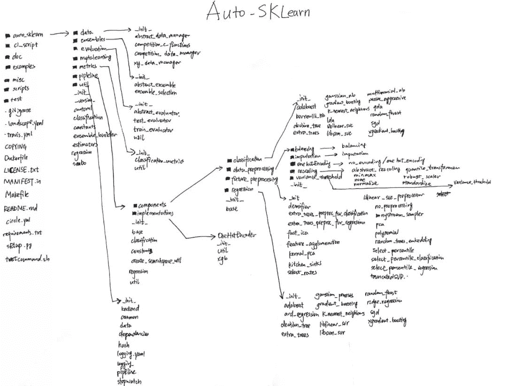

⭐适读人群：有机器学习算法基础

## **1\. auto-sklearn 能 auto 到****什么地步？**

> 在机器学习中的分类模型中：
> 
> *   常规 ML framework 如下图灰色部分：导入数据-数据清洗-特征工程-分类器-输出预测值
>     
>     
> *   auto部分如下图绿色方框：在ML framework 左边新增 **meta-learning**，在右边新增 **build-ensemble**，对于调超参数，用的是贝叶斯优化。
>     
>     
>     *   自动学习样本数据: **meta-learning**，去学习样本数据的模样，自动推荐合适的模型。比如文本数据用什么模型比较好，比如很多的离散数据用什么模型好。
>         
>         
>     *   自动调超参：**Bayesian optimizer**，贝叶斯优化。
>         
>         
>     *   自动模型集成: **build-ensemble**，模型集成，在一般的比赛中都会用到的技巧。多个模型组合成一个更强更大的模型。往往能提高预测准确性。
>         
>         
> *   **CASH problem:** AutoML as a Combined Algorithm Selection and Hyperparameter optimization (CASH) problem

也就是说，一般的分类或者回归的机器学习模型即将或者已经实现了低门槛或者零门槛甚至免费建模的程度。

其实机器学习的每个步骤都可以向着自动化方向发展，而且自动化的方式又有很多种。

机器学习自动化的难点还是在**数据清洗和特征工程**这些技巧，至于模型筛选、模型集成和超参数调参已经有比较成熟可用的代码了。

我们的愿景是 人人都可以用得起机器学习系统? 有没有很google！

## **2\. 目前有哪些公司在做AutoML，github上又有哪些开源项目？**

**业界在 automl 上的进展：**

*   **Google**: Cloud AutoML, Google’s Prediction API  

    https://cloud.google.com/automl/

*   **Microsoft**: Custom Vision, Azure Machine Learning

*   **Amazon**: Amazon Machine Learning

*   **others:** BigML.com, Wise.io, SkyTree.com, RapidMiner.com, Dato.com, Prediction.io, DataRobot.com

**github上的开源项目：**

*   **auto-sklearn (2.4k stars!) **

    https://github.com/automl/auto-sklearn

    论文链接：

    http://papers.nips.cc/paper/5872-efficient-and-robust-automated-machine-learning.pdf

*   **ClimbsRocks/auto_ml**，可以读一下代码学习如何写

    pipeline  https://github.com/ClimbsRocks/auto_ml

*   **autokeras**，基于keras的 automl 向开源项目http://codewithzhangyi.com/2018/07/26/AutoML/

## **3\. auto-sklearn的整体框架了解一下？**

呃…先凑活看吧，具体的可以到github上翻看文件结构。
框架的主轴在第二列，第二列的精华在pipeline，pipeline的重点在components：

*   **16 classifiers**（可以被指定或者筛选，include_estimators=[“random_forest”, ]）

    *   adaboost, bernoulli_nb, decision_tree, extra_trees, gaussian_nb, gradient_boosting, k_nearest_neighbors, lda, liblinear_svc, libsvm_svc, multinomial_nb, passive_aggressive, qda, random_forest, sgd, xgradient_boosting

*   **13 regressors**（可以被指定或者筛选，exclude_estimators=None）

    *   adaboost, ard_regression, decision_tree, extra_trees, gaussian_process, gradient_boosting, k_nearest_neighbors, liblinear_svr, libsvm_svr, random_forest, ridge_regression, sgd, xgradient_boosting

*   **18 feature preprocessing methods**（这些过程可以被手动关闭全部或者部分，include_preprocessors=[“no_preprocessing”, ]）

    *   densifier, extra_trees_preproc_for_classification, extra_trees_preproc_for_regression, fast_ica,feature_agglomeration, kernel_pca, kitchen_sinks, liblinear_svc_preprocessor, no_preprocessing, nystroem_sampler, pca, polynomial, random_trees_embedding, select_percentile, select_percentile_classification, select_percentile_regression, select_rates, truncatedSVD

*   **5 data preprocessing methods**（这些过程不能被手动关闭）

    *   balancing, imputation, one_hot_encoding, rescaling, variance_threshold（看到这里已经有点惊喜了！点进去有不少内容）

*   **more than 110 hyperparameters**
    其中参数include_estimators,要搜索的方法,exclude_estimators:为不搜索的方法.与参数include_estimators不兼容
    而include_preprocessors,可以参考手册中的内容

auto-sklearn是基于sklearn库，因此会有惊艳强大的模型库和数据/特征预处理库，专业出身的设定。

## **4\. meta-learning 是什么操作？**

https://ml.informatik.uni-freiburg.de/papers/15-AAAI-MI-SMBO-poster.pdf

*   What is **MI-SMBO**?
    Meta-learning Initialized Sequential Model-Based Bayesian Optimization

*   What is meta-learning?
    Mimics human domain experts: use configurations which are known to work well on similar datasets

    *   仿照人能积累经验的做法，使机器有[配置空间]去记录它们的经验值，有点像迁移学习

    *   适用的程度，根据数据的相似度

    *   **meta-learning: warmstart the Bayesian optimization procedure**

也就是学习算法工程师的建模习惯，比如看到什么类型的数据就会明白套用什么模型比较适合，去生产对于数据的 **metafeatures**：

*   左边：黑色的部分是标准贝叶斯优化流程，红色的是添加meta-learning的贝叶斯优化

*   右边：有 **Metafeatures for the Iris dataset**，描述数据长什么样的features，下面的公式是计算数据集与数据集的相似度的，只要发现相似的数据集，就可以根据经验来推荐好用的分类器。再来张大图感受下metafeatures到底长啥样：
    ?论文链接

    http://aad.informatik.uni-freiburg.de/papers/15-AAAI-MI-SMBO.pdf
    ?supplementary.pdf

    http://codewithzhangyi.com/2018/07/26/AutoML/www.automl.org/aaai2015-mi-smbo-supplementary.pdf

## **5\. auto-sklearn 如何实现 自动超参数调参？**

概念解释

*   SMBO: Sequential Model-based Bayesian/Global Optimization，调超参的大多数方法基于SMBO

*   SMAC: Sequential Model-based Algorithm Configuration，机器学习记录经验值的配置空间

*   TPE: Tree-structured Parzen Estimator

超参数调参方法：

1.  **Grid Search** 网格搜索/穷举搜索
    在高维空间不实用。

2.  **Random Search** 随机搜索
    很多超参是通过并行选择的，它们之间是相互独立的。一些超参会产生良好的性能，另一些不会。

3.  **Heuristic Tuning** 手动调参
    经验法，耗时长。（不知道经验法的英文是否可以这样表示）

4.  **Automatic Hyperparameter Tuning**

*   能利用先验知识高效地调节超参数

*   通过减少计算任务而加速寻找最优参数的进程

*   不依赖人为猜测所需的样本量为多少，优化技术基于随机性，概率分布

*   在目标函数未知且计算复杂度高的情况下极其强大

*   通常适用于连续值的超参，例如 learning rate, regularization coefficient

*   Bayesian Optimization

*   SMAC

*   TPE

在 auto-sklearn 里，一直出现的 bayesian optimizer 就是答案。是利用贝叶斯优化进行自动调参的。

?具体的贝叶斯优化原理链接

http://codewithzhangyi.com/2018/07/31/Auto%20Hyperparameter%20Tuning%20-%20Bayesian%20Optimization/

?论文链接

https://pdfs.semanticscholar.org/681e/518fd8e3e986ba25bc1fb33aac8873b521e7.pdf

## **6\. auto-sklearn 如何实现 自动模型集成？**

官方回答：**automated ensemble construction: use all classifiers that were found by Bayesian optimization**
目前在库中有16个分类器，根据贝叶斯优化找出最佳分类器组合，比如是（0.4 random forest + 0.2 sgd + 0.4 xgboost)
可以根据fit完的分类器打印结果看最终的模型是由什么分类器组成，以及它们的参数数值：

<figure class="highlight plain" style="font-size:13px;color:rgb(77,77,76);background:rgb(247,247,247);line-height:1.6;font-family:Lato, 'PingFang SC', 'Microsoft YaHei', sans-serif;">

|  |  |

</figure>

打印automl.show_models()就能打印出所谓的自动集成模型有哪些，权重分布，以及超参数数值。

## **7\. 如何使用 auto-sklearn？**

适用系统：Linux

?installation

http://automl.github.io/auto-sklearn/stable/installation.html

官方文档?

http://automl.github.io/auto-sklearn/stable/index.html

接口文档?

http://automl.github.io/auto-sklearn/stable/api.html

举个栗子?

 http://automl.github.io/auto-sklearn/stable/manual.html        

使用套路如下：

<figure class="highlight plain" style="font-size:13px;color:rgb(77,77,76);background:rgb(247,247,247);line-height:1.6;">

|  |  |

</figure>

亲测 X_train, y_train 内不能含有非数值型数据，比如Male/Female字母就报错。

训练集有哪些特征，测试集就必须有哪些特征，可以理解为不做特征筛选，所以最初导入训练集的特征越粗糙越好。

<figure class="highlight plain" style="font-size:13px;color:rgb(77,77,76);background:rgb(247,247,247);line-height:1.6;font-family:Lato, 'PingFang SC', 'Microsoft YaHei', sans-serif;">

|  |  |

</figure>

会打印出非常非常多的东西，耐心看，会找到类似下面的规律。

<figure class="highlight plain" style="font-size:13px;color:rgb(77,77,76);background:rgb(247,247,247);line-height:1.6;font-family:Lato, 'PingFang SC', 'Microsoft YaHei', sans-serif;">

|  |  |

</figure>

其他可以尝试的操作：

<figure class="highlight plain" style="font-size:13px;color:rgb(77,77,76);background:rgb(247,247,247);line-height:1.6;font-family:Lato, 'PingFang SC', 'Microsoft YaHei', sans-serif;">

|  |  |

</figure>

## **8\. auto-sklearn 目前有什么缺点**

*   不支持深度学习，但是貌似会有AutoNet出来，像谷歌的cloud AutoML那样

*   计算时长往往一个小时以上

*   在数据清洗这块还需要人为参与，目前对非数值型数据不友好

## **9\. AutoML 的发展情况**

随着谷歌发布它们的 Cloud AutoML 各种惊艳的功能，对于这块的关注度会越来越高的吧~
machine learning的比赛已经不足为奇啦，现在已经有很多有关AutoML的比赛了：
http://automl.chalearn.org/

