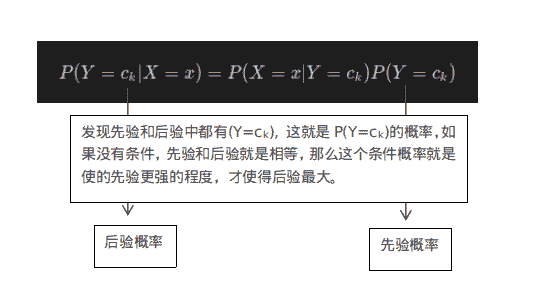

*   Author: Silly_0903;
*   [Datawhale](https://blog.csdn.net/Datawhale/article/details/85100466)

## NaïveBayes简介

> 基于贝叶斯方法，通过先验概率，计算并选择最大的后验概率。

## 核心公式

> P ( Y ∣ X ) = P ( X ∣ Y ) P ( Y ) P ( X ) P(Y|X)=\frac{P(X|Y)P(Y)}{P(X)} P(Y∣X)=P(X)P(X∣Y)P(Y)​
> 其中:
> P(Y)为先验概率(prior);
> P(X|Y)为在样本为Y的前提下，X的条件概率是(likelihood);
> P(X)是证据因子(evidence);
> P(Y|X)是后验概率(posterior)。

1.  **离散的概率模型**：
    P ( Y ∣ X 1 , … , X i ) P(Y|X_1,…,X_i) P(Y∣X1​,…,Xi​),其中类别变量Y，依赖于特征变量 X 1 , X 2 , … , X i X_1, X_2,…,X_i X1​,X2​,…,Xi​, 修改模型为:
    P ( Y ∣ X 1 , . . , X i ) = P ( X 1 , . . , X i ) P ( Y ) P ( X 1 , . . . , X i ) P(Y|X_1,..,X_i)=\frac{P(X_1,..,X_i)P(Y)}{P(X_1,...,X_i)} P(Y∣X1​,..,Xi​)=P(X1​,...,Xi​)P(X1​,..,Xi​)P(Y)​
    由于在预测时，同种方案下，分母 P ( X 1 , … , X i ) P(X_1,…,X_i) P(X1​,…,Xi​)相同，因此我们可以不用考虑这部分。因此，此模型，我们重点需要计算的部分即为: P ( X 1 , . . , X i ) P ( Y ) P(X_1,..,X_i)P(Y) P(X1​,..,Xi​)P(Y)。
    根据链式法则，假设**各个特征相互独立**，模型即可变为以下公式: P ( X 1 ∣ P ) ∗ P ( X 2 ∣ Y ) . . . P ( X i ∣ Y ) P(X_1|P)*P(X_2|Y)...P(X_i|Y) P(X1​∣P)∗P(X2​∣Y)...P(Xi​∣Y)其中， P ( X i ∣ Y ) = D X , Y D Y P(X_i|Y)=\frac{D_{X,Y}}{D_Y} P(Xi​∣Y)=DY​DX,Y​​ 。

2.  **连续概率模型**
    （采用最大似然估计）假设概率的密度函数为:
    P ( X i ∣ Y ) = 1 2 Π σ Y e ( X i − μ γ ) 2 2 σ γ P(X_i|Y)=\frac{1}{\sqrt{2\Pi}\sigma_Y}e^{\frac{{(X_i-\mu_\gamma)}^2}{2\sigma_\gamma}} P(Xi​∣Y)=2Π ​σY​1​e2σγ​(Xi​−μγ​)2​
    其中:
    μ ^ γ = 1 ∣ D γ ∣ ∑ X ∈ D c X \hat{\mu}_\gamma=\frac{1}{|D_\gamma|}\sum_{X \in D_c}X μ^​γ​=∣Dγ​∣1​X∈Dc​∑​X

σ ^ γ 2 = 1 ∣ D γ ∣ ∑ X ∈ D γ ( X − μ γ ^ ) ( X − μ γ ^ ) T \hat{\sigma}_\gamma^2=\frac{1}{|D_\gamma|} \sum_{X \in D_\gamma}(X-\hat{\mu_\gamma})(X-\hat{\mu_\gamma})^T σ^γ2​=∣Dγ​∣1​X∈Dγ​∑​(X−μγ​^​)(X−μγ​^​)T

3.  **拉普拉斯修正**
    （避免因样本不充分而导致估计概率为0）
    令N表示训练集D中可能的类别数，Ni表示第i个属性可能的取值数
    P ^ ( Y ) = ∣ D γ ∣ + 1 D + N \hat{P}(Y)=\frac{|D_\gamma|+1}{D+N} P^(Y)=D+N∣Dγ​∣+1​
    P ^ ( X i ∣ Y ) = ∣ D Y , X i ∣ + 1 D γ + N i \hat{P}(X_i|Y)=\frac{|D_{Y,X_i}|+1}{D_\gamma+N_i} P^(Xi​∣Y)=Dγ​+Ni​∣DY,Xi​​∣+1​

## 算法十问

1.  贝叶斯公式的物理意义？

> 

2.  后验概率最大化的含义？

> 后验概率最大化等价于0-1损失函数期望风险最小化。
> 详见:《统计学习方法》48页

3.  朴素贝叶斯法、贝叶斯公式、贝叶斯估计分别是什么?

> *   朴素贝叶斯法就是我们这个朴素贝叶斯分类器。
> *   贝叶斯公式仅仅是指使用到的公式
>     P ( Y ∣ X ) = P ( X ∣ Y ) P ( Y ) P ( X ) P(Y|X)=\frac{P(X|Y)P(Y)}{P(X)} P(Y∣X)=P(X)P(X∣Y)P(Y)​
> *   贝叶斯估计是和极大似然估计相对的一种参数估计方法，就是对每一个参数变量加入一个 λ \lambda λ。当 λ = 0 \lambda = 0 λ=0时，就是极大似然估计. 通常取值$ \lambda = 1$,这就是拉普拉斯平滑(Laplace smoothing).

4.  贝叶斯网络是什么?

> 朴素贝叶斯假设输入变量都是条件独立的，如果输入变量之间存在概率依存关系，这是就是贝叶斯网络。

5.  朴素贝叶斯分类器适合处理什么数据类型，能否处理连续特征？

> 朴素贝叶斯适合处理标称型数据类型，当处理连续型数据特征时，如果特征值很多可以使用特征分桶策略;但是一般可以假设样本特征服从某个分布(例如正太分布),计算均值和方差给出对应的分类，再进行贝叶斯计算。

## 面试总结

1.  朴素贝叶斯与LR的区别？（经典问题）

> *   朴素贝叶斯是生成模型，而LR为判别模型.朴素贝叶斯：已知样本求出先验概率与条件概率，进而计算后验概率。
>     **优点：样本容量增加时，收敛更快；隐变量存在时也可适用。
>     缺点：时间长；需要样本多；浪费计算资源**.
> *   **Logistic回归**：不关心样本中类别的比例及类别下出现特征的概率，它直接给出预测模型的式子。设每个特征都有一个权重，训练样本数据更新权重w，得出最终表达式。
>     **优点：直接预测往往准确率更高；简化问题；可以反应数据的分布情况，类别的差异特征；适用于较多类别的识别。
>     缺点：收敛慢；不适用于有隐变量的情况。**
> *   朴素贝叶斯是基于很强的条件独立假设（在已知分类Y的条件下，各个特征变量取值是相互独立的），而LR则对此没有要求。 > + 朴素贝叶斯适用于数据集少的情景，而LR适用于大规模数据集。

2.  朴素贝叶斯分类适用于什么样子的数据集？

> 朴素贝叶斯适用于小规模的数据。

3.  朴素贝叶斯中，朴素的含义？

> 对于朴素贝叶斯分类器，朴素（naive）的含义是各个特征属性之间是相互独立的。

4.  因样本不充分而导致估计概率为0应如何修正？

> 使用拉普拉斯修正，详细信息见1.3