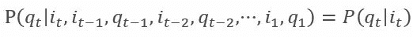
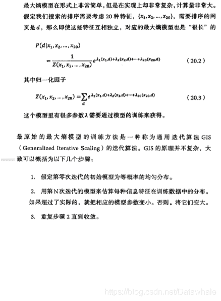

*   Author: 李文乐;
*   Email: cocoleYY@outlook.com
*   [Datawhale](https://blog.csdn.net/Datawhale/article/details/85100466)

## 直观理解

> 马尔可夫链（英语：Markov chain），又称离散时间马尔可夫链（discrete-time Markov chain，缩写为DTMC），因俄国数学家安德烈·马尔可夫（俄语：Андрей Андреевич Марков）得名，为状态空间中经过从一个状态到另一个状态的转换的随机过程。
> 隐马尔可夫模型包含5个要素：**初始概率分布，状态转移概率分布，观测概率分布，所有可能状态的集合，所有可能观测的集合**。
> 隐马尔可夫模型HMM是结构最简单的动态贝叶斯网络，是**有向图模型**。

## 核心公式

1.  依据马尔可夫性，所有变量的联合概率分布为：
    

#### 注意要点

*   统计语言模型[Statistical Language Model]

> 是自然语言处理的重要技术，对于要处理的一段文本，我们可以看做是离散的时间序列，并且具有上下文依存关系；该模型可以应用在语音识别和机器翻译等领域，其模型表达式如下：
> 
> 如果只考虑前n-1个单词的影响，称为n元语法(n-grams),那么语言模型变为：
> 
> 注意：很多时候我们无法考量太久以前的词，一是因为距离太远的词与当前词关系不大，二是因为距离越长模型参数越多，并且成指数级增长，因此4元以上几乎没人使用。当n=2的时候，就是只考虑前一个单词的一阶马尔科夫链模型，大家都知道在NLP任务中，上下文信息相关性的跨度可能非常大，马尔科夫模型无法处理这样的问题，需要新的模型可以解决这种长程依赖性(Long Distance Dependency)。
> 这里可以回忆一下RNN/LSTM网络，通过隐状态传递信息，可以有效解决长程依赖问题，但当处理很长的序列的时候，它们仍然面临着挑战，即梯度消失。

*   两点马尔可夫性质：[可以理解为无记忆性；留意：NLP问题会涉及哦]

> （1）. 下一个状态的概率分布只与当前状态有关 （2）. 下一个时刻的观测只与其相对应的状态有关
> 

*   最大熵马尔可夫模型为什么会产生标注偏置问题？如何解决？

*   HMM为什么是生成模型

> 因为HMM直接对联合概率分布建模；相对而言，条件随机场CRF直接对条件概率建模，所以是判别模型。

*   HMM在处理NLP词性标注和实体识别任务中的局限性

> 在序列标注问题中，隐状态（标注）不仅和单个观测状态相关，还 和观察序列的长度、上下文等信息相关。例如词性标注问题中，一个词被标注为 动词还是名词，不仅与它本身以及它前一个词的标注有关，还依赖于上下文中的 其他词

*   隐马尔可夫模型包括概率计算问题、预测问题、学习问题三个基本问题

> （1）概率计算问题：已知模型的所有参数，计算观测序列Y出现的概率，可 使用前向和后向算法求解。
> （2）预测问题：已知模型所有参数和观测序列Y，计算最可能的隐状态序 列X，可使用经典的动态规划算法——维特比算法来求解最可能的状态序列。
> （3）学习问题：已知观测序列Y，求解使得该观测序列概率最大的模型参 数，包括隐状态序列、隐状态之间的转移概率分布以及从隐状态到观测状态的概 率分布，可使用Baum-Welch算法进行参数的学习，Baum-Welch算法是最大期望算 法的一个特例。

*   浅谈最大熵模型

> 最大熵这个词听起来很玄妙，其实就是保留全部的不确定性，将风险降到最小。
> 应用在词性标注，句法分析，机器翻译等NLP任务中。
> 

## 面试真题

1.  如何对中文分词问题用HMM模型进行建模的训练？
    
2.  最大熵HMM模型为什么会产生标注偏置问题，如何解决？
    

## 参考

1.隐马尔可夫链定义参考维基百科
2.统计学 李航
3.数学之美
4.百面机器学习