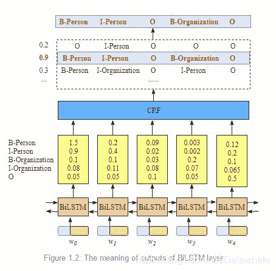

*   Author: 李文乐;
*   Email: cocoleYY@outlook.com
*   [Datawhale](https://blog.csdn.net/Datawhale/article/details/85100466)

## CRF简介

> *   条件随机场（conditional random field，简称 CRF）是给定一组输入随机变量条 件下另一组输出随机变量的条件概率分布模型，其特点是**假设输出随机变量构成马尔可夫随机场**，是一种鉴别式机率模型，是随机场的一种，常用于标注或分析序列资料，如自然语言文字或是生物序列。
> *   如同马尔可夫随机场，条件随机场为无向图模型，图中的顶点代表随机变量，顶点间的连线代表随机变量间的相依关系，在条件随机场当中，随机变量 Y 的分布为条件机率，给定的观察值则为随机变量 X。
> *   原则上，条件随机场的图模型布局是可以任意给定的，一般**常用的布局是链接式**的架构，链接式架构不论在训练（training）、推论（inference）、或是解码（decoding）上，都存在有效率的算法可供演算。
> *   条件随机场跟隐马尔可夫模型常被一起提及，条件随机场对于输入和输出的机率分布，没有如隐马尔可夫模型那般强烈的假设存在 [补充：因为HMM模型假设后面状态和前面无关]。

## 核心公式

1.  条件随机场预测的维特比算法求解过程：

> 输入：模型特征向量F(y,x)和权值向量w，观测序列x=(x1,x2,…,xn);
> 输出：最优路径y<sup>*=(y_1</sup>*,y_2<sup>*,…,y_n</sup>*)
> 初始化：
> 
> 递推：
> ![[外链图片转存失败(img-kJCNQlwn-1562508011373)(http://m.qpic.cn/psb?/V11thrEZ18EV2M/aVoN66f4shajQcPrzYsO8fGTiPG*dXNfvppIyuV870Q!/b/dL8AAAAAAAAA&bo=XQJdAAAAAAADFzA!&rf=viewer_4)]](../img/1554111e79c89de498aca5238b7845c3.png)
> 终止：
> ![[外链图片转存失败(img-0OTRjK9j-1562508011381)(http://m.qpic.cn/psb?/V11thrEZ18EV2M/E2aVlLcp*QF8f4vaiX2DqwT3Wq2hwFsPsvR*ZSK6iPg!/b/dLYAAAAAAAAA&bo=HwFcAAAAAAADF3A!&rf=viewer_4)]](../img/e2a0c0ab6c2307d08a8fd32366fb5593.png)
> 返回路径：
> ![[外链图片转存失败(img-YkMFmEjl-1562508011382)(http://m.qpic.cn/psb?/V11thrEZ18EV2M/3udfuP7mwmvBHGj9x5H8V2i5W*p2qH.Um5y.Rlw8Ero!/b/dL8AAAAAAAAA&bo=VAEuAAAAAAADF0k!&rf=viewer_4)]](../img/29afa73dd30d9eb7eabf13cb19b8552e.png)

2.  链式条件随机场[chain-structured CRF]条件概率公式：

![> [外链图片转存失败(img-kxyAJzOw-1562508011384)(https://m.qpic.cn/psb?/V11thrEZ18EV2M/eTdKbPFTkwuSvO5b3v1BQpaBcwx.WNKbs1DDZ42Z3l8!/b/dL4AAAAAAAAA&bo=ywFAAAAAAAARB7o!&rf=viewer_4)]](../img/121851c254f9eb541358dae17f4d90fe.png)

## 注意要点

1.  概率图模型的表示

> 概率图模型结合了概率论和图论的知识，用图模式(节点和边)表达基于概率相关关系的模型的总称。
> 图模型的引入使得人们在处理复杂概率问题时，可以将复杂问题进行适当的分解；
> 表示理论将图模型分为如下两个类别：
> 
> *   贝叶斯网络[Bayesian Netword],采用有向无环图来表达事件的因果关系
> *   马尔科夫随机场[Markov Random Field]，采用无向图来表达变量间的相互作用；

2.  贝叶斯网络和马尔科夫随机场的分解计算问题

> *   贝叶斯网络中每个节点都对应一个先验概率分布或者条件概率分布，因此整体联合概率分布可以直接分解为所有单个节点分布的乘积；
> *   对于马尔科夫随机场，由于变量间没有明确的因果关系，它的联合概率分布通常会表达为一系列势函数[Potential Function]的乘积，因为乘积之和通常不为1，所以要进行归一化才能成为一个有效的概率分布。

3.  对于概率图模型，模型学习的精度通常受三方面影响

> （1）语料库样本集对总体的代表性；
> （2）模型算法理论基础及所针对的问题。不同模型的理论不同，所擅长处理的NLP任务也不同，比如：朴素贝叶斯模型处理短文本分类效果很好，最大熵模型在处理中文词性标注表现很好，条件随机场处理中文分词，语义组块等方便精度很好，Semi-CRF在处理命名实体识别精度很好。
> （3）模型算法的复杂度。属于工程问题，一般讲，要求模型参数估计的越精确，模型复杂度越高，学习时间越长，推断和预测的精度也越高。

4.  Bi-LSTM-CRF算法解析

> 
> 学习过命名实体识别的同学对上图肯定不陌生，没有学习过也没关系，下面简单讲解一下
> 我们的任务是给句子中的每个单词标注为相对应的实体标签，例句如下：
> **Anne Hathaway is Hollywood star**
> Bi-LSTM-CRF模型的输入是每个单词的词向量，经过双向LSTM层提取特征并输出为5个label的得分，再将该得分输入进CRF层，得到这句话最终最大可能的识别标签。
> 这里面存在一个问题，既然BiLSTM已经计算出了得分，那直接用最大得分对应的label不就好了么，为什么还要引入CRF层？这是因为BiLSTM层得到的label并不总是满足实际情况，CRF层能够添加一些约束使得预测标签是有效的。这些约束便是从训练数据的过程中学习得到的。

5.  常见的概率图模型中，哪些是生成模型和哪些是判别模型？

> 生成式 模型是对联合概率分布P(X,Y,Z)进行建模，在给定观测集合X的条件下，通过计算 边缘分布来得到对变量集合Y的推断，即
> ![[外链图片转存失败(img-YXeTbND5-1562508011386)(http://m.qpic.cn/psb?/V11thrEZ18EV2M/HnOuUN6yfJE7zNF3HaLQbKYf7q5NWfAsOarpA.xW1XE!/b/dL4AAAAAAAAA&bo=2AFkAAAAAAARF50!&rf=viewer_4)]](../img/0295b60cfff7247d1215f07999717277.png)
> 判别式模型是直接对条件概率分布P(Y,Z|X)进行建模，然后消掉无关变量Z就可以 得到对变量集合Y的预测，即
> ![>[外链图片转存失败(img-nlGeWM14-1562508011387)(http://m.qpic.cn/psb?/V11thrEZ18EV2M/H7KjjCbjrm6P4lYQhapLTfyGPtWWYa3Q0L6Xr*yl2Kk!/b/dL4AAAAAAAAA&bo=QAFSAAAAAAARFzM!&rf=viewer_4)]](../img/8815dc970ad8daf58490c8d000880d8d.png)
> 常见的概率图模型有朴素贝叶斯、最大熵模型、贝叶斯网络、隐马尔可夫模 型、条件随机场、pLSA、LDA等。
> 基于前面的问题解答，我们知道朴素贝叶斯、贝叶斯网络、pLSA、LDA等模型都是先对联合概率分布进行建模，然后再通过计算边缘分布得到对变量的预测，所以它们都属于生成式模型；而最大熵模型是直 接对条件概率分布进行建模，因此属于判别式模型。
> 隐马尔可夫模型和条件随机场模型是对序列数据进行建模的方法，其中隐马尔可夫模型属于生成式模型，条件随机场属于判别式模型。

## 面试真题

1.  HMM、MEMM和CRF模型的比较

> 这三个模型都可以用来作为序列化标注模型，但是各自具有自身的特性。

```
 1）HMM模型是对转移概率（隐藏状态转移到隐藏状态的概率）和表现概率（隐藏状态到观察状态的概率）直接建模，统计共现概率；
    2）MEMM模型是对转移概率和表现概率建立联合概率，统计时统计的是条件概率，而非共现概率。MEMM容易陷入局部最优，主要因为是MEMM只在局部做归一化；
    3）CRF模型则统计的是全局概率，在归一化时考虑了数据在全局的分布，而不仅仅是局部归一化，这样也就解决了MEMM中的标记偏置问题；
    例子：对“我爱北京天安门”进行标注，标注结果为：
              我爱北京天安门
              s s b e b c e

    对于HMM，其判断这个标注是否成立的概率为：
              P = P(s->s)*('我'标记为s) * P(s->b)*P('爱'标记为s) * ......
    训练时，要统计状态转移矩阵和混淆矩阵

    对于MEMM，其判断这个标注成立的概率为：
              P = P(s->s|'我'标记为s)*('我'标记为s) * P(s->b|'爱'标记为s)*P('爱'标记为s) * ......
    训练时，要统计条件状态转移矩阵和混淆矩阵

    对于CRF，判断这个标注成立的概率为：
              P = F(s转移到s，'我'标记为s).... F为一个函数，是在全局范围统计归一化的概率，而不是像MEMM在局部统一归一化的概率。 
```

2.简单描述一下NER任务中的BiLSTM-CRF

3.常见的概率图模型中，哪些是生成式模型，哪些是判别式模型？

## 参考

1.条件随机场定义参考维基百科
2.Bi-LSTM-CRF算法解析参考: [https://createmomo.github.io/](https://createmomo.github.io/)
3.数学之美 - 吴军
4.百面机器学习 - 诸葛越&葫芦娃
5.NLP汉语自然语言处理原理与实践 - 郑捷
6.[http://blog.sina.com.cn/s/blog_6d1875160101gy4e.html](http://blog.sina.com.cn/s/blog_6d1875160101gy4e.html)