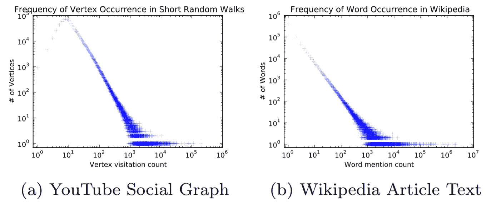
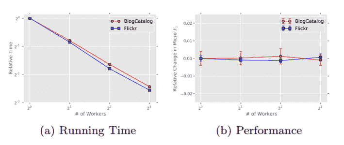

## DeepWalk: Online Learning of Social Representations

[Arxiv 1403.6652](https://arxiv.org/pdf/1403.6652.pdf)

## 二、问题定义

我们将社交网络的成员分类问题考虑为一个或多个类别。 更正式地说，设`G = (V, E)`，其中`V`是网络的成员，`E`是其边，`E ⊆ (V×V)`。 给定部分标记的社交网络`G[L] = (V, E, X, Y)`，属性`X ∈ R^{|V|×S}`，其中`S`是每个属性向量的特征空间的大小，并且`Y ∈ R^{|V|×|Y|}`，`Y`是标签集。

在传统的机器学习分类设置中，我们的目标是学习一个假设`H`，它将`X`的元素映射到标签集`Y`。在我们的例子中，我们可以利用`G`的结构中嵌入的例子的依赖性的重要信息，来完成突出的表现。

在文献中，这被称为关系分类（或集体分类问题 [37]）。 传统的关系分类方法将问题作为无向马尔可夫网络中的推理，然后使用迭代近似推理算法（例如迭代分类算法 [31]，Gibbs 采样 [14] 或标签松弛 [18]）来计算 给定网络结构的标签的后验分布。

我们提出了一种捕获网络拓扑信息的不同方法。 我们提出了一种无监督的方法，它不是将标签空间混合为特征空间的一部分，而是可以学习捕获图结构的特征，而不依赖于标签的分布。

结构表示和标记任务之间的这种分离避免了级联错误，这可能发生在迭代方法中 [33]。 而且，相同的表示可以用于涉及该网络的多个分类问题。

我们的目标是学习`X[E] ∈ R^{|V|×d}`，其中`d`是较小的潜在维数。 这些低维表示是分布式的；意味着每个社会现象都由维度的子集表示，每个维度都有助于空间表达的社会概念的子集。

使用这些结构特征，我们将增加属性空间来有助于分类决策。 这些特征是通用的，可以与任何分类算法（包括迭代方法）一起使用。 但是，我们相信这些特征的最大用途，是它们易于与简单的机器学习算法集成。 它们在现实世界的网络中适当扩展，我们将在第 6 节中展示。

## 三、学习社会表示

我们希望学习具有以下特征的社会表示：

*   适应性 - 真正的社交网络在不断发展；新的社会关系不应该要求重复学习过程。
*   社区感知 - 潜在维度之间的距离应代表评估网络相应成员之间的社交相似性的指标。 这允许同构网络中的泛化。
*   低维 - 当标记数据稀缺时，低维模型泛化更好，并加速收敛和推断。
*   连续 - 我们需要潜在的表示来在连续空间中建模部分社区成员性。 除了提供社区成员的细微视图外，连续表示还可以在社区之间实现平滑的决策边界，从而实现更强大的分类。

为了满足这些要求，我们的方法使用最初为语言建模设计的优化技术，从较短随机游走路径来学习顶点表示。 在这里，我们回顾了随机游走和语言建模的基础知识，并描述了它们的组合如何满足我们的要求。

### 3.1 随机游走

我们将以顶点`v[i]`为根的随机游走表示为`W[v[i]]`。 它是随机过程，带有随机变量`W1[v[i]], W2[v[i]], ..., Wk[v[i]]`，使得`W(k+1)[v[i]]`是从顶点`v[k]`的邻居中随机选择的顶点。 随机游走已被用作内容推荐 [11] 和社区检测 [1] 中各种问题的相似性度量。 它们也是一类输出敏感算法的基础，它们使用随机游走来计算局部社区结构信息，耗费与输入图的大小呈次线性的时间 [38]。

### 3.2 连接：幂律

选择在线随机游走作为捕获图形结构的基元，我们现在需要一种合适的方法来捕获这些信息。 如果连通图的度分布遵循幂律（无标度），我们观察到顶点出现在短随机游走中的频率也将遵循幂律分布。

自然语言中的词频遵循类似的分布，并且来自语言建模的技术解释了这种分布行为。 为了强调这种相似性，我们在图 2 中展示了两种不同的幂律分布。第一种来自无标度图上的一系列短随机游走，第二种来自英文维基百科的 100,000 篇文章。



我们工作的核心贡献是，用于模拟自然语言（符号频率遵循幂律分布（或 Zipf 定律））的技术可以重新用于模拟网络中的社区结构。 我们将在本节的其余部分中回顾语言建模中不断增长的工作，并将其转换来学习满足我们标准的顶点表示。

### 3.3 语言建模

语言建模的目标是估计出现在语料库中的特定单词序列的可能性。 更正式地说，给出一系列的单词：


其中`w[i] ∈ V`（`V`是词汇表），我们希望在所有训练语料库中最大化`Pr(w[n] | w[0], w[1], ..., w[n-1])`。

最近表示学习方面的工作主要集中在使用概率神经网络来构建单词的一般表示，这些表达将语言建模的范围扩展到其原始目标之外。

在这项工作中，我们提出了语言建模的泛化，通过短随机游走流来探索图。 这些游走可以被认为是一种特殊语言的短句和短语。 直接的类比是，给定在随机游走中到目前为止所访问的所有先前顶点，估计观察到顶点`v[i]`的可能性。


我们的目标是学习潜在表示，而不仅仅是节点共现的概率分布，因此我们引入映射函数`Φ: v ∈ V -> R^{|V|×d}`。 该映射`Φ`表示与图中的每个顶点`v`相关联的潜在社会表示。 （在实践中，我们用自由参数的`|V|×d`矩阵表示Φ，稍后将作为我们的`X[E]`。）问题是估计可能性：

 (1)

然而，随着游走长度的增加，计算这个目标函数变得不可行。

语言建模的近期松弛 [26,27] 改变了预测问题。 首先，它不使用上下文来预测缺失的单词，而是使用一个单词来预测上下文。 其次，上下文由出现在给定单词右侧和左侧的单词组成。 最后，它删除了对问题的排序约束。 相反，该模型需要最大化任何单词出现在上下文中的概率，而不需要知道它与给定单词的偏移。

在顶点表示建模方面，这产生了优化问题。

 (2)

我们发现这些松弛对社会表示学习特别理想。 首先，顺序独立性假设更好地捕获随机游走提供的“邻近”感。 此外，对于通过构建小模型来加速训练时间，这种松弛非常有用，因为它一次给出一个顶点。

从公式（2）求解优化问题构建了表示，它捕获顶点之间的局部图结构中的共享相似性。具有相似邻域的顶点将获得类似的表示（编码共引相似性），并能够在机器学习任务上泛化。

通过结合截断的随机游走和神经语言模型，我们制定了一种满足我们所需属性的方法。该方法生成低维度的社交网络的表示，并且存在于连续向量空间中。它的表示编码潜在形式的社区成员性，并且因为该方法输出有用的中间表示，它可以适应不断变化的网络拓扑。

## 四、方法

在本节中，我们将讨论算法的主要组成部分。我们还介绍了我们方法的几种变体，并讨论了它们的优点。

### 4.1 概述

与任何语言建模算法一样，唯一需要的输入是语料库和词汇表`V`。DeepWalk 将一组截断的短随机游走看做其自己的语料库，并且将图顶点看做其自己的词汇表（`V = V`）。虽然在训练之前知道随机行走中的`V`和顶点的频率分布是有益的，但是算法没有必要像 4.2.2 中所示那样工作。

### 4.2 算法：DeepWalk

该算法由两个主要部分组成；首先是随机游走生成器，第二是更新过程。

随机游走生成器接受图`G`并均匀地采样随机顶点`v[i]`作为随机游走`W[v[i]]`的根。游走从访问的最后一个顶点的邻居均匀地采样，直到达到最大长度`t`。 虽然我们将实验中随机游走的长度设置为固定，但随机游走的长度没有限制。 这些游走可能会重新启动（即返回其根的传送概率），但我们的初步结果并未显示使用重启的任何优势。 在实践中，我们的实现指定了从每个顶点开始的长度为`t`的随机游走`γ`的数量。

```
Algorithm 1 DeepWalk(G, w, d, γ, t)
-----------------------------------
Input: graph G(V, E)
    window size w
    embedding size d
    walks per vertex γ
    walk length t
Output: matrix of vertex representations Φ ∈ R^{|V|×d}
1: Initialization: Sample Φ from U[|V|×d]
2: Build a binary Tree T from V
3: for i = 0 to γ do
4:     O = Shuffle(V)
5:     for each vi ∈ O do
6:         W[v[i]] = RandomWalk(G, v[i], t)
7:         SkipGram(Φ, W[v[i]], w)
8:     end for
9: end for 
```

算法 1 中的第 3-9 行展示了我们方法的核心。 外循环指定了我们应该在每个顶点开始的随机行走的次数`γ`。 我们将每次迭代视为在数据上执行一次遍历，并在此过程中对每个节点采样一次游走。 在每次遍历开始时，我们生成一个随机排序来遍历顶点。 这不是严格要求的，但众所周知的是它加速随机梯度下降的收敛。

在内部循环中，我们迭代图的所有顶点。 对于每个顶点`v[i]`，我们生成随机游走`|W[v[i]]| = t`，然后用它来更新我们的表示（第 7 行）。我们使用 SkipGram 算法 [26] 根据公式（2）中的目标函数更新这些表示。

#### 4.2.1 SkipGram

SkipGram 是一种语言模型，它可以最大化句子中的窗口`w`中出现的单词之间的共现概率 [26]。

```
Algorithm 2 SkipGram(Φ, W[v[i]], w)
-----------------------------------
1: for each v[j] ∈ W[v[i]] do
2:     for each u[k] ∈ W[v[i]][j − w : j + w] do
3:         J(Φ) = − log Pr(u[k] | Φ(v[j]))
4:         Φ = Φ − α * ∂J / ∂Φ
5:     end for
6: end for 
```

算法 2 迭代出现在窗口`w`（第 1-2 行）内的随机游走中的所有可能的搭配。 对于每个，我们将每个顶点`v[j]`映射到其当前表示向量`Φ(v[j]) ∈ R^d`（参见图 3b）。 给定`v[j]`的表示，我们希望最大化其游走中的邻居的概率（第 3 行）。 我们可以使用多种分类器来学习这种后验分布。 例如，使用逻辑回归对先前问题建模将产生等于`|V|`的大量标签， 这可能是数百万或数十亿。 这些模型需要大量的计算资源，可能跨越整个计算机集群 [3]。为了加快训练时间，可以使用层级 Softmax [29,30] 来近似概率分布。


#### 4.2.2 层级 Softmax

给定`u[k] ∈ V`，计算第 3 行中的`Pr(u[k] | Φ(v[j]))`是不可行的。 计算分区函数（归一化因子）是昂贵的。如果我们将顶点分配给二叉树的叶子，则预测问题变为最大化树中特定路径的概率（参见图 3c）。 如果顶点`u[k]`的路径由一系列树节点（`b[0], b[1], ..., b[log|V|]`）标识，（`b[0] = root, b[log|V|] = uk`）则：


现在，`Pr(b[l] | Φ(v[j]))`可以由分配给节点`b[l]`的父节点的二元分类器建模。 计算`Pr(u[k] | Φ(v[j]))`的计算复杂度从`O(|V|)`降低到`O(log|V|)`。

通过为随机游走中的频繁顶点分配较短的路径，我们可以进一步加快训练过程。 霍夫曼编码用于减少树中频繁元素的访问时间。

#### 4.2.3 优化

模型参数集是`{Φ, T}`，其中每个的大小是`O(d|V|)`。 随机梯度下降（SGD）[4] 用于优化这些参数（第 4 行，算法 2）。使用反向传播算法估计导数。 SGD 的学习率`α`在训练开始时初始设定为 2.5%，然后随着到目前为止看到的顶点数量而线性减小。

### 4.3 并行化

如图 2 所示，社交网络的随机游走中的顶点的频率分布和语言中的单词都遵循幂律。这尝试产生了不常见顶点的长尾，因此，影响`Φ`的更新本质上将是稀疏的。这允许我们在多任务情况下使用异步版本的随机梯度下降（ASGD）。鉴于我们的更新很稀疏，并且我们没有获得访问模型共享参数的锁，ASGD 将实现最佳的收敛速度 [36]。虽然我们使用多个线程在一台机器上运行实验，但据证明该技术具有高度可扩展性，可用于大规模机器学习 [8]。图 4 显示了并行化 DeepWalk 的效果。它显示了处理 BlogCatalog 和 Flickr 网络的速度是一致的，因为我们将工作器数量增加到 8（图 4a）。它还表明，相对于串行运行的 DeepWalk，预测表现不会下降（图 4b）。



### 4.4 算法变体

这里我们讨论我们提出的方法的一些变体，我们认为这些变体可能是有意义的。

#### 4.4.1 流式

该方法的一个有趣的变体是流式方法，其可以在不知道整个图的情况下实现。 在此变体中，来自图的小型游走直接传递到表示学习代码，并且模型直接更新。 对学习过程的一些修改也是必要的。首先，使用衰减学习率将不再可能。 相反，我们可以将学习率`α`初始化为一个小的常数值。 这需要更长的时间来学习，但在某些应用中可能是值得的。 其次，我们不一定能建立一个参数树。如果`V`的基数已知（或可以有界），我们可以为该最大值构建层级 Softmax 树。在第一次看到顶点时，可以将顶点分配给剩余的一个叶子。 如果我们能够事先估计顶点频率，我们仍然可以使用霍夫曼编码来减少频繁的元素访问时间。

#### 4.4.2 非随机游走

一些图被创建为智能体与一系列元素交互的的副产品（例如，用户在网站上的页面导航）。当一个图通过这种非随机游走流创建时，我们可以使用此过程直接提供建模阶段。以这种方式采样的图，不仅将捕获与网络结构相关的信息，还将捕获遍历路径的频率。

在我们看来，这个变体还包括语言建模。句子可以被视为通过适当设计的语言网络的目的性游走，而 SkipGram 等语言模型旨在捕捉这种行为。

这种方法可以与流式变体（第 4.4.1 节）结合使用，在不需要明确构建整个图的情况下，在不断发展的网络上训练特征。 使用此技术维护表示可以实现 Web 级别分类，而没有处理 Web 级图的麻烦。