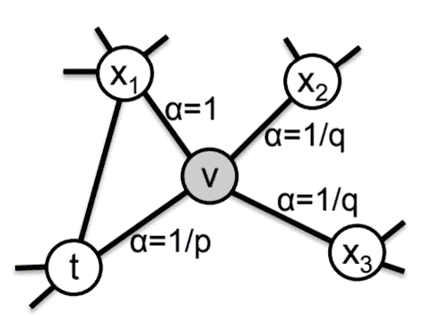
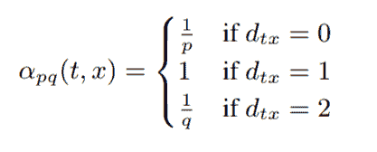
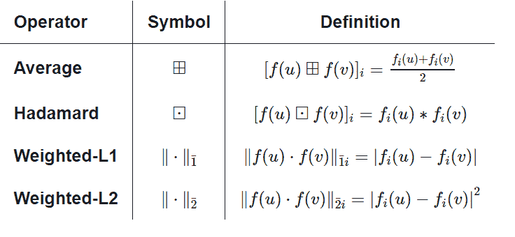

## node2vec: Scalable Feature Learning for Networks

[Arxiv 1607.00653](https://arxiv.org/abs/1607.00653)

## 三、特征学习框架

我们将网络中的特征学习表示为最大似然优化问题。 设`G = (V, E)`为给定网络。 我们的分析是通用的，适用于任何有向（无向）的带权（无权）网络。 设`f: V -> R^d`是从节点到特征表示的映射函数，我们的目标是为下游预测任务学习它。 这里`d`是指定我们的特征表示的维数的参数。 等价地，`f`是大小`|V|×d`的参数矩阵 。 对于每个源节点`u ∈ V`，我们将`N[S](u) ⊂ V`定义为，通过邻域采样策略`S`生成的节点`u`的网络邻域。


为了使优化问题易于处理，我们做出两个标准假设：

*   条件独立性。 我们通过假设给定源的特征表示，观察邻域节点的似然与观察任何其他邻域节点无关，来对分解似然：

    

*   特征空间中的对称性。源节点和邻域节点在特征空间中具有彼此对称的效果。 因此，我们将每个源 - 邻域节点对的条件似然建模为 softmax 单元，该 softmax 单元由其特征的点积参数化：

    

根据上述假设，公式（1）中的目标简化为：


对于大型网络，每节点分区函数`Z[u] = ∑ exp(f(u)·f(v)), v ∈ V`的计算成本很高，我们使用负采样来近似它 [22]。 我们在定义特征`f`的模型参数上，使用随机梯度上升优化公式（2）。

基于 Skip-gram 架构的特征学习方法最初是在自然语言的背景下开发的 [21]。 考虑到文本的线性特性，可以使用连续单词上的滑动窗口自然地定义邻域的概念。 然而，网络不是线性的，因此需要更丰富的邻域概念。 为了解决这个问题，我们提出了一个随机程序，它对给定源节点`u`的许多不同邻域进行采样。 邻域`N[S](u)`不仅限于直接邻居，而是根据采样策略`S`可以具有非常不同的结构。

### 3.1 经典搜索策略

我们将源节点的邻域抽样视为局部搜索的形式。 图 1 显示了一个图表，其中给定源节点`u`，我们的目标是生成（采样）其邻域`N[S](u)`。 重要的是，为了能够公平地比较不同的采样策略`S`，我们将邻域集`N[S]`的大小约束到`k`个节点，然后为单个节点`u`采样多个集合。 通常，有两种极端采样策略用于生成`k`个节点的邻域集`N[S]`：

*   广度优先采样（BFS）：邻域`N[S]`仅限于作为源的直接邻居的节点。 例如，在图 1 中，对于大小为`k = 3`的邻域，BFS 采样节点`s[1]`，`s[2]`，`s[3]`。

*   深度优先采样（DFS）：邻域包括在距离源节点不断增加的距离处顺序采样的节点。 在图 1 中，DFS 采样`s[4]`，`s[5]`，`s[6]`。

广度优先和深度优先抽样代表了他们探索的搜索空间的极端情况，从而对学习的表示产生了有趣的影响。

特别是，网络中节点上的预测任务经常在两种相似行之间穿梭：同质性和结构等价性 [12]。 在同质性假设 [7,36] 下，高度互连且属于类似网络集群或社区的节点应紧密地嵌入在一起（例如，图 1 中的节点`s[1]`和`u`属于同一网络社区）。 相反，在结构等价假设下 [10]，在网络中具有相似结构角色的节点应紧密地嵌入在一起（例如，图 1 中的节点`u`和`s[6]`充当其相应社区的集线器）。 重要的是，与同质性不同，结构等价性并不强调连通性；节点在网络中可能相距很远，但仍然具有相同的结构角色。 在现实世界中，这些等价概念并不是互斥的；网络通常表现出一些行为，其中一些节点表现出同质性而其他节点反映结构等价性。

我们观察到，在产生反映上述任一等价性的表示中，BFS 和 DFS 策略起着关键作用。特别是，BFS 采样的邻域产生与结构等价性紧密对应的嵌入。 直观地，我们注意到，为了确定结构等价性，通常足以准确地表示局部社区。 例如，可以通过观察每个节点的直接邻域来推断基于网络角色（例如网桥和集线器）的结构等价性。 通过将搜索限制到附近的节点，BFS 实现了这种表示并获得了每个节点邻域的微观视图。 此外，在 BFS 中，采样邻域中的节点倾向于重复多次。 这也很重要，因为它减少了表示 1 跳节点相对于源节点的分布的方差。 然而，对于任何给定的`k`，它只探索图的非常小的部分。

对于 DFS 来说则相反，DFS 可以探索网络的更大部分，因为它可以更加远离源节点`u`（样本大小`k`是固定的）。 在 DFS 中，采样节点更准确地反映了邻域的宏观视图，这对于基于同质性推断社区是必不可少的。 但是，DFS 的问题在于，不仅要推断网络中存在哪些节点到节点的依赖关系，而且还要确定这些依赖关系的确切性质。 这是很难的，因为我们对样本大小有限制并且需要探索大的邻域，这产生高方差。 其次，移动到更大的深度导致复杂的依赖性，因为采样节点可能远离源并且可能不太具有代表性。

### 3.2 node2vec

基于上述观察，我们设计了一个灵活的邻域采样策略，允许我们在 BFS 和 DFS 之间平滑插值。 我们通过开发灵活的偏置随机游走过程来实现这一目标，该过程可以以 BFS 以及 DFS 方式探索邻域。

#### 随机游走

形式上，给定源节点`u`，我们模拟固定长度`l`的随机游走。 令`c[i]`表示游走中的第`i`个节点，从`c[0] = u`开始。 节点`c[i]`由以下分布生成：


其中`π[vx]`是节点`v`和`x`之间的非归一化转移概率，`Z`是归一化常数。

#### 搜索偏置`α`

偏置我们的随机游走的最简单方法是基于静态边权重`w[vx]`（即`π[vx] = w[vx]`）对下一节点进行采样。（如果是未加权的图`w[vx] = 1`。）但是，这不允许我们考虑网络结构，并指导我们的搜索过程，来探索不同类型的网络邻域。 此外，与 BFS 和 DFS 不同，它们是分别适用于结构等价和同质性的极端抽样范例，我们的随机游走应该适应这些等价概念不是竞争或排他性的事实，而现实世界的网络通常表现出两者的混合。



node2vec 中随机游走过程的示意图。 游走刚刚从`t`转换到`v`，现在正在评估节点`v`的下一步。 边标签表示搜索偏差`α`。

我们定义了一个二阶随机游走，其中有两个参数`p`和`q`来指导游走：考虑一个随机游走，它刚刚遍历边`(t, v)`，现在位于节点`v`（图 2）。 现在，游走需要决定下一步，所以它评估从`v`引出的边`(v, x)`上的转移概率`π[vx]`。 我们将非标准化转移概率设置为`π[vx] = α[pq](t, x)·w[vx]`，其中：



并且`d[tx]`表示节点`t`和`x`之间的最短路径距离。 请注意，`d[tx]`必须是`{0,1,2}`中的一个，因此，这两个参数对于引导游走是必要且足够的。

直观地，参数`p`和`q`控制游走探索和离开起始节点`u`的邻域的速度。 特别是，这些参数允许我们的搜索过程（大致）在 BFS 和 DFS 之间进行插值，从而对节点等价的不同概念反映出折中。

返回参数，p：参数`p`控制立即重新访问游走中节点的可能性。 将其设置为高值（`> max(q, 1)`）可确保我们不太可能在下面两步中采样已访问过的节点（除非游走中的下一个节点没有其他邻居）。 该策略鼓励适度探索并避免采样中的两跳冗余。 另一方面，如果`p`较低（`<min(q, 1)`），它将使游走回溯一步（图 2），这将使游走“局部”靠近起始节点`u`。

出入参数`q`。 参数`q`允许搜索区分“向内”和“向外”节点。 回到图 2，如果`q> 1`，则随机游走偏向于接近节点`t`的节点。 我们的样本由较小局部性的节点构成，从这个意义上，这样的遍历获得相对于游走中起始节点的底层图的局部视图和近似的 BFS 行为。

随机游走的好处。相对于纯 BFS / DFS 方法，随机游走有几个好处。随机游走在空间和时间要求方面都是计算上有效的。存储图中每个节点的直接邻居的空间复杂度是`O(|E|)`。对于二阶随机游走，存储每个节点的邻居之间的互连是有帮助的，这导致空间复杂度为`O(a^2 |V|)`，其中`a`是图的平均度，并且通常对于实际小世界网络。随机游走优于传统的基于搜索的采样策略的另一个关键优势是时间复杂度。特别是，通过在样本生成过程中强制利用图的连通性，随机游走提供了一种方便的机制，通过在不同的源节点之间重用样本来提高有效采样率。通过模拟长度为`l> k`的随机游走，由于随机游走的马尔可夫性质，我们可以一次为`l-k`个节点生成`k`个样本。因此，我们的有效复杂度是每个样本的`O(l k(l-k))`。例如，在图 1 中，我们采样长度为`l = 6`的随机游走`{u, s[4], s[5], s[6], s[8], s[9]}`，这产生`N[S](u) = {s[4], s[5], s[6]}`，`N[S](s[4]) = {s[5]，s[6]，s[8]}`和`N[S](s[5]) = {s[6], s[8], s[ 9]}`。请注意，样本重用可能会在整个过程中引入一些偏差。但是，我们观察到它大大提高了效率。

```
LearnFeatures(Graph G = (V, E, W), Dimensions d, Walks per node r, Walk length l, Context size k, Return p, In-out q)
π = PreprocessModifiedWeights(G, p, q)
G' = (V, E, π)
Initialize walks to Empty
for iter = 1 to r do
    for all nodes u ∈ V do
        walk = node2vecWalk(G', u, l)
        Append walk to walks
f = StochasticGradientDescent(k, d, walks)
return f

node2vecWalk(Graph G' = (V, E, π), Start node u, Length l)
Inititalize walk to [u]
for walk_iter = 1 to l do
    curr = walk[−1]
    Vcurr = GetNeighbors(curr, G')
    s = AliasSample(Vcurr, π)
    Append s to walk
return walk 
```

算法 1：node2vec 算法

node2vec 的伪代码在算法1中给出。在任何随机游走中，由于选择起始节点`u`而存在隐式偏差。 由于我们学习了所有节点的表示，我们通过模拟从每个节点开始的固定长度`l`的随机游走来抵消这种偏差。 在游走的每个步骤，基于转移概率`π[vx]`进行采样。 可以预先计算二阶马尔可夫链的转移概率`π[vx]`，因此，模拟随机游走时的节点采样，可以使用别名采样在`O(1)`时间内有效地完成。 node2vec 的三个阶段，即用于计算转移概率的预处理，随机游走模拟和使用 SGD 的优化，被顺序执行。 每个阶段都是可并行化的，并且是异步执行的，这有助于 node2vec 的整体可扩展性。

node2vec 位于：[http://snap.stanford.edu/node2vec](http://snap.stanford.edu/node2vec)。

### 3.3 学习边特征

node2vec 算法提供半监督方法来学习网络中节点的丰富特征表示。 但是，我们经常对涉及节点对而不是单个节点的预测任务感兴趣。 例如，在链路预测中，我们预测网络中的两个节点之间是否存在链路。 由于我们的随机游走本质上基于底层网络中节点之间的连接结构，因此我们使用自举方法，将各个节点的特征表示扩展为节点对。

给定两个节点`u`和`v`，我们在相应的特征向量`f(u)`和`f(v)`上定义二元运算符，以便生成表示`g(u, v)`，使得`g: V×V -> R^d'`，其中`d'`是该对`(u, v)`的表示大小。 我们希望通常为任何节点对定义运算符，即使对之间不存在边，因为这样做使表示对链接预测有用，其中我们的测试集包含真边和假边（即，不存在的）。 我们考虑运算符的几种选择，使得`d'= d`，如表 1 所示。



表 1：用于学习边特征的二元运算符的选项。 定义对应于`g(u, v)`的第`i`个分量。