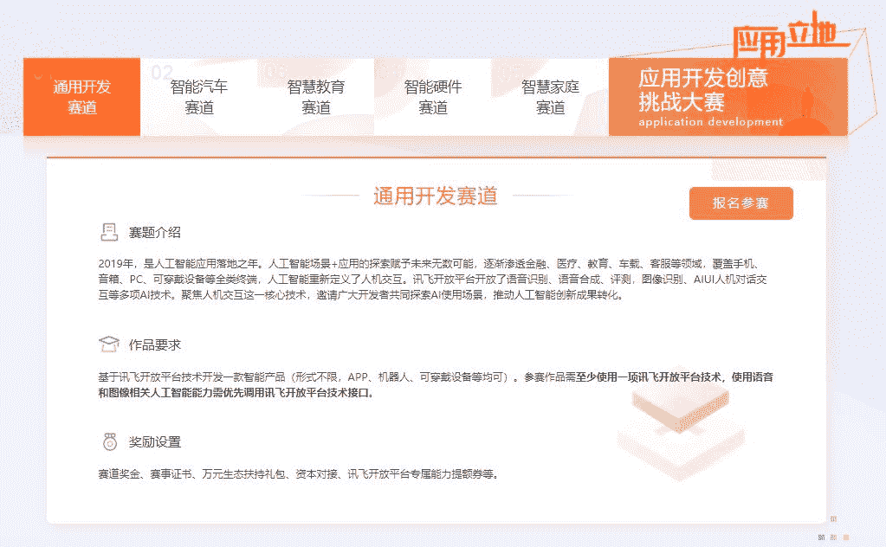

**科大讯飞2019届iFLYTEK A.I.开发者大赛报名通道正式开启！**

自科大讯飞5月21日新品发布会上由执行总裁胡郁宣布大赛正式启动至今，已收到国内20多个省份及美国、加拿大等海外赛区共**1000多支团队**预约报名！席位有限，欲报从速！

大赛优胜者专享：创孵空间，资本对接！还有**百万奖金**等你来瓜分！点击文末**阅读原文**参与报名，就能为自己赢得一份机遇！

**这是一场怎样的大赛？**

“iFLYTEK A.I. 开发者大赛”是由科大讯飞发起的顶尖人工智能竞赛平台。汇聚产学研各界力量，面向全球开发者发起数据算法及创新应用类挑战，推动人工智能前沿科学研究和创新成果转化，培育人工智能产业人才，助力人工智能生态建设。

2018年首届开发者大赛历时七个多月，收到全球3千多支团队提交的参赛作品，吸引1万余名世界各地的优秀开发者参加。2019届iFLYTEK A.I. 开发者大赛将继续开放科大讯飞优质大数据资源及人工智能核心技术，面向全球开发者发起数据算法及创新应用类挑战。

**9大赛题，挑战A.I.最强大脑**

2019届iFLYTEK A.I.开发者大赛延续**“技术顶天、应用立地”**理念，设置**A.I.算法挑战赛、A.I.创新应用赛**两大赛事，立足医疗、营销、车载、教育、硬件、家庭等领域设置**9大赛题**。

**百万奖金领跑五大奖项**

**抢占先机，赛程时间选手须知**

选手从6月21日即可报名并提交初赛作品，复赛阶段我们会前往北京、广州、合肥、长春、重庆、济南、武汉、杭州**8座城市**进行线下路演。强强相遇，角逐决赛入场券。最终在**科大讯飞全球1024开发者节**期间决出冠军！

**关于科大讯飞、Datawhale**
**1**
**科大讯飞**

**科大讯飞**股份有限公司成立于1999年，是亚太地区知名的智能语音和人工智能上市企业。自成立以来，公司长期从事语音及语言、自然语言理解、机器学习推理及自主学习等核心技术研究并保持了国际前沿技术水平；积极推动人工智能产品研发和行业应用落地，致力让机器“能听会说，能理解会思考”。创新坚守，初心不改，科大讯飞愿携手广大合作伙伴一起：在中国，用人工智能改变世界！

**2** **Datawhale**

**Datawhale**是一个专注于AI领域的开源组织，2019年被评为上海交通大学国家级项目，科大讯飞比赛平台AI 开源社区唯一合作伙伴。组织成员涵盖了清北交浙，伯克利，斯坦福，UMD，港科大，港中文等国内外50多所知名院校，以及阿里，百度，头条，微软，IBM等10多家知名企业。致力于构建国内有影响力的开源社区，用开源价值促进产业发展，帮助AI领域学习者更好地成长。

** 更多信息**

**【****科大讯飞比赛组队&交流群****】**

识别下方二维码，添加**Datawhale官方号**

回复关键词：【科大讯飞】进群

 **长按添加**  点击 **阅读原文** **，** 大赛报名一键抵达