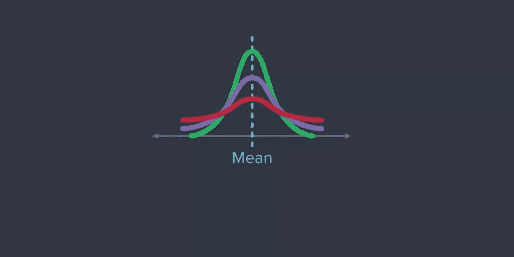
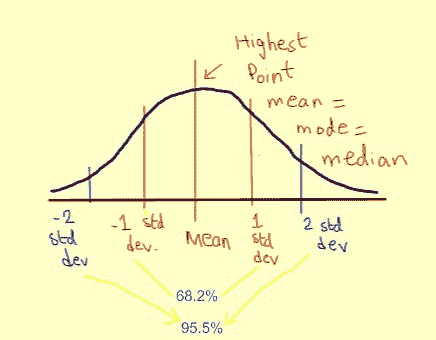
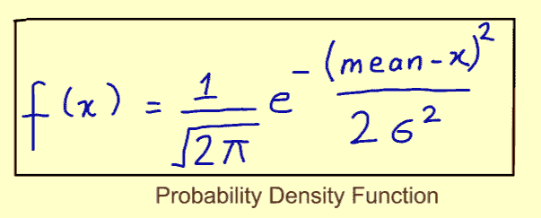
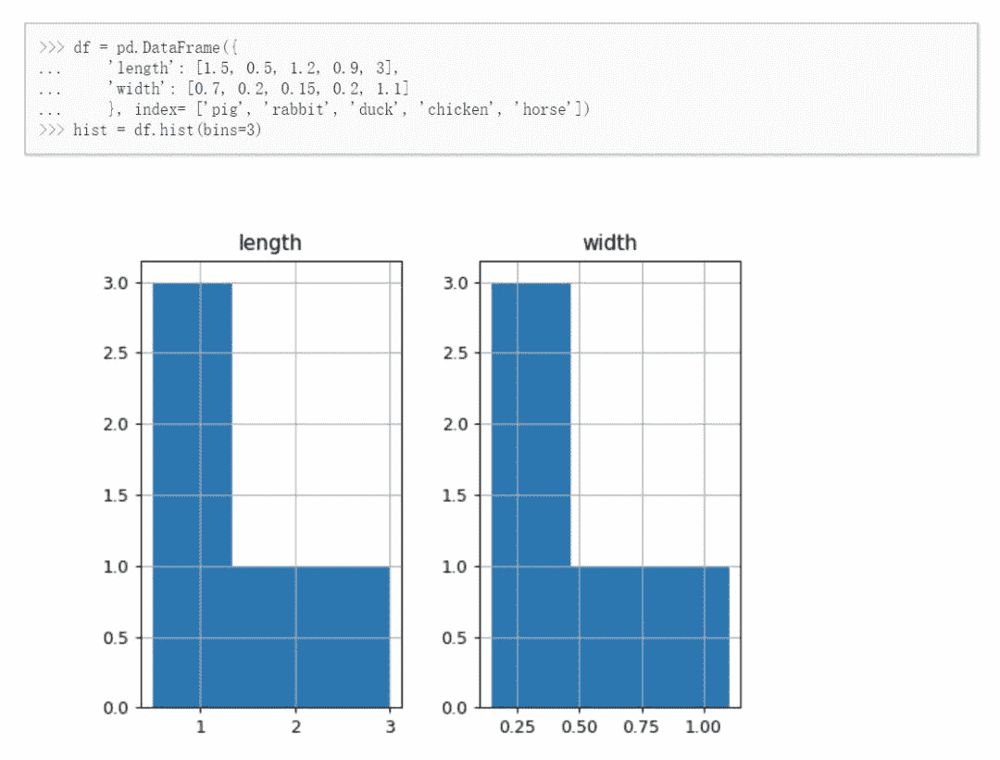
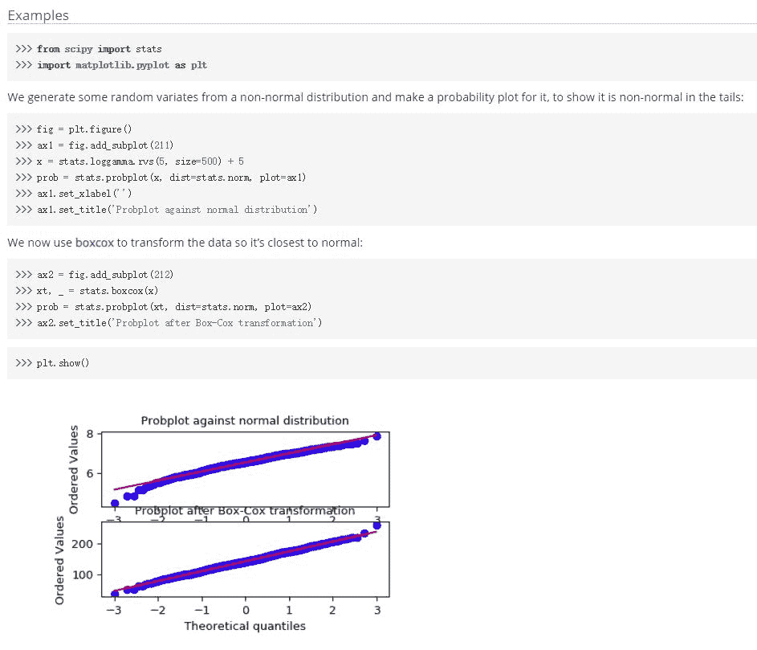

选自Medium

**作者：Farhad Malik，****机器之心编译**

**参与：李诗萌、张倩**

> 我们从高中就开始学正态分布，现在做数据分析、机器学习还是离不开它，那你有没有想过正态分布有什么特别之处？ 为什么那么多关于数据科学和机器学习的文章都围绕正态分布展开？ 本文作者专门写了一篇文章，试着用易于理解的方式阐明正态分布的概念。

机器学习的世界是以概率分布为中心的，而概率分布的核心是。本文说明了什么是正态分布，以及为什么正态分布的使用如此广泛，尤其是对数据科学家和机器学习专家来说。

我会从最基础的内容开始解释，以便读者们理解为什么正态分布如此重要。

文章结构如下：

*   什么是概率分布？

*   什么是正态分布？

*   为什么变量如此青睐正态分布

*   如何用 Python 查看查看特征的分布？

*   其它分布变一变也能近似正态分布 


*Unsplash，由 timJ 发布。*

先让我们来看一点背景知识：

1\. 首先，要注意的最重要的一点是，正态分布也被称为高斯分布。

2\. 它是以天才卡尔·弗里德里希·高斯（Carl Friedrich Gauss）的名字命名的。

3\. 最后需要注意的是，简单的预测模型一般都是最常用的模型，因为它们易于解释，也易于理解。现在补充一点：正态分布因为简单而流行。

因此，正态概率分布很值得我们去花时间了解。

**什么是概率分布？**

想象我们正在自己的数据科学项目中构建感兴趣的预测模型：

*   如果我们想准确地预测变量，那么首先我们要了解目标变量的基本行为。

*   我们先要确定目标变量可能输出的结果，以及这个可能的输出结果是离散值（孤立值）还是连续值（无限值）。简单点解释就是，如果我们要评估骰子的行为，那么第一步是要知道它可以取 1 到 6 之间的任一整数值（离散值）。

*   然后下一步是开始为事件（值）分配概率。因此，如果一个值不会出现，则概率为 0%。

概率越高，事件发生的可能性就越大。


*Unsplash，Brett Jordan 发布*

举个例子，我们可以大量重复一个实验，并记录我们检索到的变量值，这样概率分布就会慢慢展现在我们的面前。

每次实验产生一个值，这些值可以分配到类别/桶中了。对每个桶来说，我们可以记录变量值出现在桶里的次数。例如，我们可以扔 10,000 次骰子，每次骰子会产生 6 个可能的值，我们可以创建 6 个桶。并记录每个值出现的次数。

我们可以根据这些值作图。所作曲线就是概率分布曲线，目标变量得到一个值的概率就是该变量的概率分布。

理解了值的分布方式后，就可以开始估计事件的概率了，甚至可以使用公式（概率分布函数）。因此，我们可以更好地理解它的行为。概率分布依赖于样本的矩，比如平均值、标准差、偏度及峰度。如果对所有概率求和，总和为 100%。

现实世界中存在很多概率分布，最常用的是「正态分布」。

**什么是正态概率分布**

如果对作图，得到一条倒钟形曲线，样本的平均值、众数以及中位数是相等的，那么该变量就是正态分布的。

这是正态分布钟形曲线的示例：



上面是一个变量的高斯分布图形，像神经网络那样上百万的参数量，每个参数都有自己独立的分布形状，还有极其恐怖的联合分布形状。这种高维联合分布就主导了不同任务的表现，因此理解和估计目标变量的概率分布是很重要的。

以下变量非常接近正态分布：

1\. 人群的身高

2\. 成年人的血压

3\. 扩散后的粒子的位置

4\. 测量误差

5\. 人群的鞋码

6\. 员工回家所需时间

此外，我们周围的大部分变量都呈置信度为 x% 的正态分布（x<100）。所以说，生活中经常出现的各种变量，差不多都能用高斯分布描述。

**好理解的正态分布**

正态分布是只依赖数据集中两个参数的分布，这两个参数分别是：样本的平均值和标准差。

*   平均值——样本中所有点的平均值。

*   标准差——表示数据集与样本均值的偏离程度。

分布的这一特性让统计人员省事不少，因此预测任何呈正态分布的变量准确率通常都很高。值得注意的是，一旦你研究过自然界中大多数变量的概率分布，你会发现它们都大致遵循正态分布。

正态分布很好解释。因为：

1\. 分布的均值、众数和中位数是相等的；

2\. 我们只要用平均值和标准差就可以解释整个分布。

**为什么这么多变量近似正态分布？**

为什么样本一多，那么总会有一堆样本都非常普通？这个想法背后有这样一个定理：你在大量随机变量上多次重复一个实验时，它们的分布总和将非常接近正态性（normality）。

人的身高是一个基于其他随机变量（比如一个人所消耗的营养量、他们居住的环境以及他们的基因等）的随机变量，这些随机变量的分布总和最终是非常接近正态的。这就是中心极限定理。

我们从前文了解到，正态分布是许多随机分布的和。如果我们对正态分布密度函数作图，那所作曲线有如下特性：


这个钟形曲线平均值为 100，标准差为 1。

*   平均值是曲线的中心。这是曲线的最高点，因为大多数点都在平均值附近；

*   曲线两侧点的数量是相等的。曲线中心的点数量最多；

*   曲线下的面积是变量能取的所有值的概率和；

*   因此曲线下面的总面积为 100%。



上图介绍了非常出名的 3σ原则，即：

*   约有 68.2% 的点落在 ±1 个标准差的范围内

*   约有 95.5% 的点落在 ±2 个标准差的范围内

*   约有 99.7% 的点落在 ±3 个标准差的范围内。

这样我们就可以轻松地估计出变量的波动性，还可以给出一个置信水平，估计它可能取的值是多少。例如，在上面的灰色钟型曲线中，变量值出现在 101~99 之间的概率约为 68.2%。想象一下，当你根据这样的信息做决定时，你的信心有多充足。

**概率分布函数**

正态分布的概率密度函数是：



概率密度函数本质上是连续随机变量取某些值的概率。例如想知道变量出现在 0 到 1 之间，它的概率就能通过概率密度函数求出。

*   如果你用计算好的概率密度函数绘制概率分布曲线，那么给定范围的曲线下的面积就描述了目标变量在该范围内的概率。

*   概率分布函数是根据多个参数（如变量的平均值或标准差）计算得到的。

*   我们可以用概率分布函数求出随机变量在一个范围内取值的相对概率。举个例子，我们可以记录股票的日收益，把它们分到合适的桶中，然后找出未来收益概率在 20~40% 的股票。

*   标准差越大，样本波动越大。

**如何用 Python 找出特征分布？**

我用过的最简单的方法是在 Pandas 的 DataFrame 中加载所有特征，然后直接调用它的方法找出特征的概率分布：



这里的 bins 表示分布的柱状数量。当然上面并不是一个正态分布，那么当变量满足正态分布时，它意味着什么？

这意味着，如果你把大量分布不同的随机变量加在一起，你的新变量最终也服从正态分布，这就是中心极限定理的魅力。此外，服从正态分布的变量会一直服从正态分布。举个例子，如果 A 和 B 是两个服从正态分布的变量，那么：

*   AxB 服从正态分布；

*   A+B 服从正态分布。

**变量还是乖乖地变成正态分布吧**

如果样本满足某个未知的分布，那么通过一系列操作，它总是能变成正态分布。相反，标准正态分布的叠加与转换，也一定能变化为任意未知分布。从标准正态转换到未知分布，就是很多机器学习模型希望做到的，不论是视觉中的 VAE 或 GAN，还是其它领域的模型。

但对于传统统计学，我们更希望将特征的分布转换成正态分布，因为正态分布简单又好算呀。下面展示了几种转换为标准正态的方法，像相信变换什么的，在高中都有学过。

**1\. 线性变换**

我们收集到作为变量的样本后，就可以用下面的公式对样本做线性变换，从而计算出 

*   Z 分数

*   计算平均值

*   计算标准差

用下式根据每一个值 x 计算出 Z


以前 x 可能服从某个未知分布，但是归一化后的 Z 是服从正态分布的。嗯，这就是做批量归一化或其它归一化的好处吧。

**2.Box-cox 变换**

你可以用 Python 的 SciPy 包将数据转换成正态分布：

```
scipy.stats.boxcox(x, lmbda=None, alpha=None)
```



**3.YEO-JOHBSON 变换**

此外，也可以用强大的 yeo-johnson 变换。Python 的 sci-kit learn 提供了合适的函数：

```
sklearn.preprocessing.PowerTransformer(method=’yeo-johnson’, standardize=True, copy=True)
```

最后，非常重要的一点是，在没有做任何分析的情况下假设变量服从正态分布是很不明智的。

以遵循泊松分布（Poisson distribution）、t 分布（student-t 分布）或二项分布（Binomial distribution）的样本为例，如果错误地假设变量服从正态分布可能会得到错误的结果。

*原文链接：**https://medium.com/fintechexplained/ever-wondered-why-normal-distribution-is-so-important-110a482abee3*

