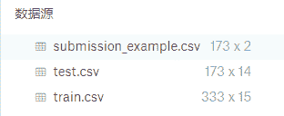
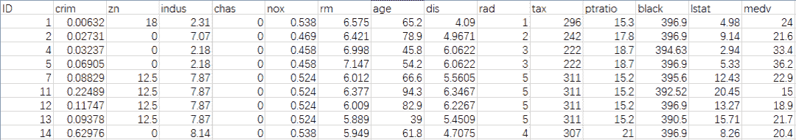
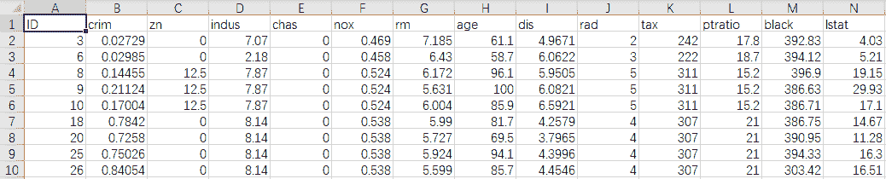

经常出入DC竞赛、kaggle、天池等大数据比赛的同学应该很了解xgboost这座大山。

几乎所有的比赛都绕不过它，可能只需要这一个库，在比赛中就可以得到很高的分数，究竟是为什么呢？那么就来窥探一下它的庐山真面目吧。

 **起源**

xgboost 的全称是 eXtreme Gradient Boosting。

正如其名，它是 Gradient Boosting Machine 的一个 c++ 实现，作者为曾在华盛顿大学研究机器学习的大牛陈天奇。

因为其出众的效率与较高的预测准确度在比赛论坛中引起了参赛选手的广泛关注。

为了方便大家使用，陈天奇将 xgboost 封装成了 python 库，从此作为普通人的我们也可以使用这种开挂般操作的库了。

 **安装**

xgb(xgboost)安装很简单，和一般的库相同：

可在ide导入验证是否安装成功

 **数据形式**

xgb可以接受一下格式文件：（通过xgboost.DMatrix()方法）

·LibSVM文本格式文件

·逗号分隔值（CSV）文件

·NumPy 2D阵列

·SciPy 2D稀疏阵列

·DataFrame数据框

·XGBoost二进制缓冲区文件

需要注意的是：XGBoost不支持分类功能; 如果您的数据包含分类功能，请先将其加载为NumPy阵列，然后执行onehot编码。

XGBoost无法解析带有标头的CSV文件。

 **参数设定**

XGBoost可以使用列表或字典来设置参数，如下所示：

 一般提前定义这些参数，训练时只需将param参数传入即可。

 **训练**

·param：各项参数，是一个字典

·dtrain：训练数据，由xgb.DMatrix传入

·num_round：boosting迭代计算次数

·evallist：一个列表，用于对训练过程中进行评估列表中的元素。例如：evallist = [(dtest, 'eval'), (dtrain, 'train')]，用来为监视性能的验证

 **预测**

模型训练好之后，接下来就是预测：

这样，最简单的xgboost使用就完成啦，接下来，我们通过一个简单的案例实操一下。

 **实战案例**

我们利用kaggle的经典项目波士顿房价预测来进行实战。

kaggle网站波士顿房价项目链接：https://www.kaggle.com/c/boston-housing，将以下三个数据集下载好保存至文档备用。

对数据进行简单的认识一下（打开train.csv）：

训练集包括了15列，第一列是ID，最后一列是medv（要预测的数据），因此在训练的时候将这两个属性去除。

打开测试集（test.csv）：

测试集包含了14列，跟训练集相比缺少了预测项medv.

**代码实现**

**01 导入相关的库**

numpy和pandas是大数据分析计算中常用的两个包，使用它们，可以满足你绝大部分的数据分析需求。

sklearn是python著名的机器学习库，它其中封装了大量的机器学习算法，内置了大量的公开数据集，并且拥有完善的文档，因此成为目前最受欢迎的机器学习学习与实践的工具。

**02 打开数据 并做相关的数据处理**

打开训练集和测试集的数据，去除“ID”和“medv”两个属性，然后把数据集进行拆分，训练集中70%的数据取出用于训练，30%的数据取出用于评价，最后将拆分后的数据集进行模型参数设置。

**03 训练模型**

**04 预测**

预测结果，并将结果输出。

**05 查看结果**

关于波士顿房价预测的竞赛已经出来很长一段时间，有兴趣的同学还可以去kaggle官网上提交答案。

**后台回复“****房价****”可直接获得数据集。**

