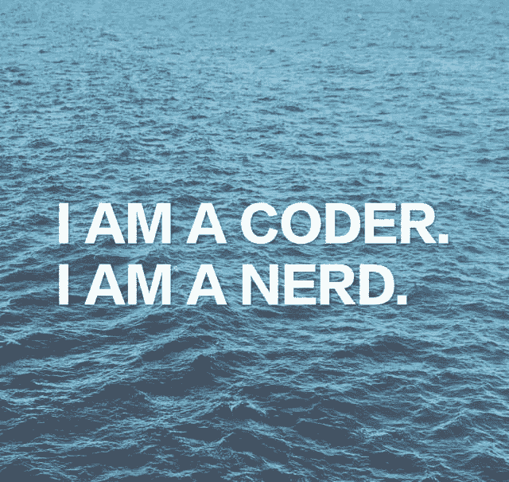

> 作者：[CodeWithZhangYi](https://weibo.com/u/3340707810)

Ummm…上面这张图好像变成了我的[说正事」专用图，下次试试其他的样式或者画风，也欢迎大家投稿呀！

Hi，大家好！这里是 ZhangYi。

除了断斯续续更新课程之外，好久没有跟大家分享和讨论 Girls-In-AI（下面简称 GIA）的未来发展路线了。（其实一开始我也没想到会有一呼百应甚至一呼千应的反响，甚至现在很多私信我都还没有看或者回复，见谅见谅。）

我的出发点很简单，我只想做好一件事，聚焦。我的点很小，鼓励更多的女生去学习 AI 编程甚至成为科技行业的领袖。希望大家都能站在食物链上游看一看，因为风景真的很好。

目前我们 GIA 已经有了小白 python 入门教程，数据分析教程等等，机器学习教程还在更新中。我们已经有了一个官方微博账号。半年的时间里，我们已经有 4400 多个 Giaers，收到了上百条正面积极反惯和感谢信，在 Github 的项目也有 1.1 k stars。说来惭愧，上半年我对 GIA 都是放养的状态，但就像张小龙说的，当一个产品有自然增长的用户，它才有推广的价值。我在等一个时机，这半年证实了 GIA 的价值，当我们官方从来没做任何宣传，却能经常看到大家在其他想学编程的博主下面推荐 GlA，真的很感谢

当你看东西的时候，看它的价值，因为价格终究会回到价值本身。一件事值不值得去做的时候，你自己是知道的。而当你看到价值的时候，就去做！那么，接下来 GIA 该做些什么呢？下面和大家分享些我的想法和正在做的事：

## 【1】

其实很早我就注册了 GIA 的域名，所以这次我想做一个官方网站，使得更多的人能看到 girl coding power；同时从美观的角度也会更好一些。第一期网站的功能不需要太复杂，主要是做統计数据展示和课程展示。如果有前端的妹子感兴趣的可以私我简历：597426363@qq.com，欢迎附带作品，我们一起做有趣的网页！

## 【2】

我有给 Girls-In-A 注册一家公司，嗯！惊不惊喜，意不意外？从零开始，Lets see how far we can go。我们可以众筹公司的中文名字，公司的 ogo，

第一步，我们可以众筹公司的中文名字，公司的 logo， slogan 等等，让大家的灵感碰撞，创建更好的文化。说实话，我就是希望大家一起玩，大不了就没成嘛！大家也拥有了一段勇往直前的青春！就像我经常对自己说的那句话，不要害怕成功，不要害怕成功，不要害怕成功

我们不要期望太多，尽力做自己喜欢的事就好。也欢迎有经验的 female coder 加入进来，GIA 想鼓励更多的女性成为领导者的角色。其实也会有很多机构也鼓励女生敲码的活动，但公司的 leader 都男性，或者绝大部分都是男性，我还是感觉有点怪。

可能有人又要跳出来 judge 什么，但是，

we all iust live once, why so serious?

当我们被赋予更大的责任时，我们也将变得更专业更训练有素的队伍。

我们 GIA 不是【完美】的追求者，我们是【迭代】的执行者。 just learn by doing.

## 【3】

创建 GIA club，前期尝试 base 在微信群

club 群初期将会是和 datawhale 合作的微信群。之前一直没有开微信群，是因为没有管理资源（因为累哦）。目前我已经受邀加入@datawhale，按触了对接人范大大之后，真的是很让人欣赏。datawhale 本身也是一个年轻充满 passion 的组织，很受鼓舞。接下来 datawhale 的 female coders 和 Giaers 都可以陆陆续续加入进来，作为 GIA 的第个官方群哦！终于来惹！加入的方式将在另外一张二维码图里。

这里 GIA 需要 club 的维护者，运营者，可以是对机器学习有些了解的，也可以是对徽信群运营有经验的，有兴趣的同学欢迎疯狂私信我！GIA 真的需要你！！

GIA club 负责人的未来职责：学习打卡、敲码打卡、问答维护、资料共享、分享会组织等等。

## 【4】

坚持接地气的技术输出。不追求高大上，只求简单直接真实。

招人：

这里 GIA 需要对机器学习、深度学习的理论基础比较扎实的同学，如果有实战经验就更好了

tech 负责人：课程写作，技术输出

无论是敲码，做产品，做前端，club 运营，都是一种锻炼。更多的甚至是制作 GIA 的周边设计，未来我们都会有安排的！如果有跟你契合的方向，就像我经常说的， learn by doing，不妨就试。

这里有机会，GIA 给大家提供平台。这里至少有 10w 的人会看到你的作品，而你的作品至少会被 4w 的人使用，还是在没有宣传的 base，未来的用户数一定远超这个数字。我知道这不是最高的起点，但也是不错的起点。

为什么继续做 GIA 又变得强烈，因为范大一句话我听到了，那么多培机构个培训，少你个培训，社会没有多大的改变。唉，收费这事儿我都得说，不知道外面的怎么那么贵。做收费的话，门槛越高，只能影响前 10%有资源的人，甚至是贷款学习的学生，而 GIA 要影响的是 90%那些拿不出几万块学习的人。(其实我在学生时期也学不出那么多钱的)为了不让 Girls-In-AI 变成另一家收费站，我就在开头封自己的路好了，大家听好了，GIA 输出的教程内容，一定是免费的！免费的！邀请大家和我一起维护这个社区。never never let this become another money-take-in project

而且，如果你能改变一个女性，很可能改变的是一个家庭。所以我们 GIA 将影响更多的人，更多的家庭。

We GIAers don’t argue， we iust code it and change it. 只有我们做的比別人更好，我们才能被更多人看见。加油！

说了那么多，如果有你感兴趣的，可以带着简历或作品来找我哦！！ email: 597426363@qq.com

总结一下， we GIA want：

*   前端：官网设计+制作
*   club 负责人：敲码打卡，学习打卡，问答，资料共享，分享会等等
*   技术负贵人：课程写作，技术输出

虽然要做的事情会很多，但还是一件件地来完成慢慢来。因此，如果你感兴越的事还没有在 GIA 的近期计划里，不妨自己先鼓捣起来！交流学习的朋友，咱们可以进交流群。

Please, feel free to make any contributions you feel will make it better.

对贡献者的感谢，都可以将贡献者列在 GIA 官网首页，如果有同学需要实习证明或者证书都是可以的，别怕，咱们有公司的！没关系的，一切的一切我们一起尝试！

> If she is amazing,
> 
> she won’t be easy.

Lets see what we can do.

