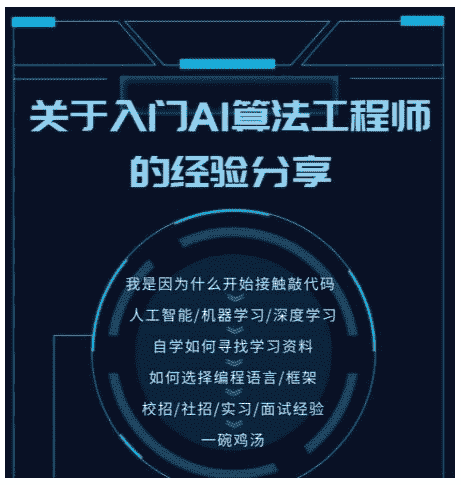

> 转自[Datawhale](https://mp.weixin.qq.com/s?timestamp=1563011128&src=3&ver=1&signature=2pZP-4kqAqHkqQx9FWRGxRYIxhVPj9pbleaByKPWxD4-pi82Wdx63GzVseHQsQa5swa1TOdmhpr7r8qLzsfPI6DBanCzFCfd4fSoWmoZem07hHZM9ruOqcBi7SZ9qlMZ3NS9WnW3h43UrTbAaL5V8VA8CQD-TAgaFjLkWuPOCZo=)，图文 | 蜉蝣

## 一、我是小白，怎么开始修炼之路？

**1.如何开始学习AI知识**

有目标的学习，从项目，从试验场景中找解决问题的方法，以实现某个问题为导向去学习。

**2.如何入门**

Just Do it！

找到自己的目标

*   我想做pm，就从excel入手，学一些python数据统计知识，积累一些数据统计技能。

*   我想做数据分析师、大数据工程师，在学python数据分析的基础上，了解数据库，数理统计的知识，学习一些项目套路及简单的模型，掌握工具。

*   我想做算法工程师，学习模型的原理，学习数据知识，自己敲代码，做工具去预测。

**3.找到目标后如何学习**

*   不停去尝试，找到自己的兴趣点，坚持去做。模型都是有套路的，目标函数、损失函数、超参数…及时总结，多分享。

*   有目标的尝试不同的模型，eg：NLP，先去学embedding，Word2vec，找一个数据集，尝试用CNN、RNN，Bert训练，比较实验结果。

*   遇到难题，要带着问题去网上寻找答案，去找一些大牛的经验分享。不要放弃！

*   学习的时候，以任务为导向。不要为了推公式去推公式。读别人的代码，也要多问几个为什么，遇到问题就去网上找答案。

*   欢迎关注Datawhale公众号及张怡微博CodeWithZhangYi，前人的总结一定不能错过提升自己的最好模板！

**4.如何看论文**

*   网上一定有很好的论文，要抓住潮流，先参考论文解读，在自己细看论文及参考文献。

*   专业术语 -> 推网络结构 、公式 -> github拉相应项目，看代码，改代码 -> 套自己的数据，自己的场景，应用潮流结构。

*   看不懂潮流论文，可能需要补知识点了~还是有目的，有导向的去查应该看的论文。

*   经典论文不代表都要细致看，要抓住论文中的知识点。由知识点扩展到面，做好总结。

**5.应该先看教程还是先走项目**

最好是项目为主，Just Do it！手边要备一本工具书做教材（先看目录哦~）。根据任务去解决问题，在解决问题的过程中学习，并用教材做知识的填充和整理。

**6.怎么找项目**

kaggle，各大厂（BAT等）的比赛。门槛低，找到自己的兴趣点，Just Do it！

另：比赛不要找“猪队友”哦，要找能共同进步的朋友，哦，对了，比赛过程中别忘了增进感情，你们会成为真正志同道合的朋友的！

**7.AI学历要求**

真正的门槛是硕士的能力！是独自分析问题，解决问题的能力，是读论文、推公式、搞理论、敲代码的能力！

**总结**

重中之重，开始尝试吧！别一直停下思考，找一个方向，先去做，**Just do it**！

## 二、校招、实习经验

**1.校招如何准备**

*   一定要提前准备（半年期）

*   去大厂官网搜集招聘信息、招聘要求

*   丰富简历（自己去准备一些实习、比赛经验）

*   提前半年敲代码（简历中可体现的代码能力，包括解决过什么问题，实现过什么模型）

*   多了解校招知识，校招比社招还是容易的！

**2.实习**

*   确定方向，了解常用岗位的工作内容。

*   可以尝试不同方向，找适合自己的岗位；但如果有做AI工程师想法的话，尽量不要投行政、运营等。

*   实习，经济压力略大，尽量坚持一下。痛苦是一时的，成长是一辈子的！

*   实习最重要的是学习！！！技术岗要踏实去敲代码，尝试感兴趣的工作方向！抓住一切学习的机会。

**3.简历**

*   准备哪些内容：大厂招聘需求，多逛招聘网站（需要的技能，对应的能力、待遇）

*   面试遇到难题：从面试官那获取知识，如需要C，寻问项目应用的点及如何用，何时用

*   平时有意识的准备一些简历可写的提亮点

**4.面试**

*   学会挑选面试机会（找适合自己的，不要浪费自己的时间）

*   提前调查

*   面后做总结，不要一个坑跌两次

**总结**

不要想太多，去做！边学边总结边分享！递进式学习。多听自己内心的声音，不要太在意别人的看法。不要太push自己，找到学习的乐趣，乐在其中~

## 三、完整分享

本次直播留存了录播，可以反复收听学习：

[http://weike.fm/n5YYj](http://weike.fm/n5YYj)

