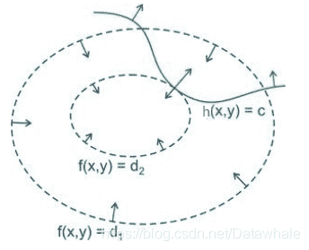

*   Author: 修远;
*   说明：本文为Datawhale下开源项目《李宏毅机器学习》Support vector的补充内容。作者水平有限，还望学习者批评指正。
*   [Datawhale](https://blog.csdn.net/Datawhale/article/details/85100466)

## 学习目标

*   优化实例
*   优化问题求解方式
*   等式优化问题—拉格朗日乘子法
*   不等式优化问题—KKT条件
*   对偶问题

### 1 优化实例

设平面上有两个线段 u 1 , u 2 u_1,u_2 u1​,u2​和 v 1 , v 2 v_1,v_2 v1​,v2​，试求这两个线段是哪个相距最近的两个点 u ∗ , v ∗ u^*,v^* u∗,v∗。

那么线段 u 1 , u 2 u_1,u_2 u1​,u2​和 v 1 , v 2 v_1,v_2 v1​,v2​上的点可分别表示为
u = α u 1 + ( 1 − α ) u 2 ， 0 ⩽ α ⩽ 1 u=\alpha u_1+(1-\alpha)u_2， 0\leqslant \alpha\leqslant 1 u=αu1​+(1−α)u2​，0⩽α⩽1

v = β v 1 + ( 1 − β ) v 2 , 0 ⩽ β ⩽ 1 v=\beta v_1+(1-\beta)v_2, 0\leqslant \beta\leqslant 1 v=βv1​+(1−β)v2​,0⩽β⩽1

点u和v的距离为变量 α \alpha α和 β \beta β的函数

f ( α , β ) = ∣ ∣ u − v ∣ ∣ 2 f(\alpha, \beta)=||u-v||^2 f(α,β)=∣∣u−v∣∣2

上述问题可表示为下述形式：
m i n , f ( α , β ) = ∣ ∣ u − v ∣ ∣ 2 min, f(\alpha, \beta)=||u-v||^2 min,f(α,β)=∣∣u−v∣∣2
s . t . , 0 ⩽ α ⩽ 1 s.t., 0 \leqslant \alpha \leqslant 1 s.t.,0⩽α⩽1
s . t . , 0 ⩽ β ⩽ 1 s.t.,0 \leqslant \beta \leqslant 1 s.t.,0⩽β⩽1

"min"表示“最小化”(minimize)，而s.t.表示受限于(subject to)

这样就得到了一般形式的数学优化问题或者说优化问题，可以写成如下形式：
m i n i m i z e , f 0 ( x ) minimize, f_0(x) minimize,f0​(x)
s . t . , g i ( x ) ⩽ b i , i = 1.. m s.t., g_i(x) \leqslant b_i,i=1..m s.t.,gi​(x)⩽bi​,i=1..m
h i ( x ) = 0 , i = 1... p h_i(x)=0,i=1...p hi​(x)=0,i=1...p

向量 x = ( x 1 , x 2 , . . . x n ) x=(x_1,x_2,...x_n) x=(x1​,x2​,...xn​)称为问题的优化变量，称问题中的 f 0 ( x ) f_0(x) f0​(x)为目标函数。称函数 g i ( x ) ⩽ b i , i = 1.. m g_i(x)\leqslant b_i,i=1..m gi​(x)⩽bi​,i=1..m和 h i ( x ) = 0 , i = 1... p h_i(x)=0,i=1...p hi​(x)=0,i=1...p为约束条件，并分别称他们为不等式约束条件和等式约束条件，常数 b 1 , . . . b m b_1,...b_m b1​,...bm​称为约束边界。

### 2 优化问题求解方式

*   无约束问题:
    一般求解方式梯度下降法、牛顿法、坐标轴下降法

*   等式约束条件:
    拉格朗日乘子法进行求解

*   不等式约束条件:
    KKT条件进行求解

### 3 等式优化问题——拉格朗日乘子法

##### 3.1几何解释

如下图，，f(x,y)为我们的目标函数，x,y为向量.f(x)可以取到不同的值，相当于可以投影在x构成的平面(曲面)上，成为等高线(等高线为虚线)。而约束条件h(x,y)(绿线标出的是约束条件的轨迹)，在x,y构成的平面或者曲面上是一条曲线。

假设f(x,y)的曲线与h(x,y)等高线相交，交点就是同时满足等式约束条件和目标函数的可行域的值，但肯定不是最优值。因为相交意味着肯定还存在其他的等高线在该条等高的内部或者外部，使得等高线与限制条件的交点的值更多或者更小。只有当f(x,y)与h(x,y)相切时，才会出现极值

**证明** ▽ x f ( x ) = − ▽ x h ( x ) \bigtriangledown _xf(x)=-\bigtriangledown _xh(x) ▽x​f(x)=−▽x​h(x)

拉格朗日乘子法是针对等式约束条件进行求解的方法。接下来我们将从等式约束问题观察拉格朗日乘子法是如何进行求解的。

目标函数为 f ( x ) f(x) f(x)，等式约束条件为 h ( x ) = 0 h(x)=0 h(x)=0，优化问题可以写为：
m i n x , f ( x ) min_x,f(x) minx​,f(x)
s . t . , h ( x ) = 0 s.t.,h(x)=0 s.t.,h(x)=0

我们现在要做的是在h(x)的可行域找到x，使得f(x)取得最小值。那么如何表示h(x)的可行域呢？

接下来我们先在h(x)上定义一个点 x f x_f xf​，那么函数h(x)上的任意一点可表示为 x f + △ x x_f+\bigtriangleup x xf​+△x， △ x \bigtriangleup x △x是微小矢量。 △ x \bigtriangleup x △x可表示为 μ δ x \mu \delta x μδx，其中 μ \mu μ表示为标量， δ x \delta x δx表示为单位向量，可得
x f + μ δ x x_f+\mu \delta x xf​+μδx

x f x_f xf​在h(x)和f(x)移动的过程需要满足的条件为
h ( x f + μ δ x ) = 0 h(x_f+\mu \delta x)=0 h(xf​+μδx)=0
f ( x f + μ δ x ) &lt; f ( x f ) f(x_f+\mu \delta x)&lt;f(x_f) f(xf​+μδx)<f(xf​)
x f x_f xf​在f(x)移动的停止条件为
δ x ∗ ( − ▽ x f ( x ) ) = 0 \delta x*(-\bigtriangledown _xf(x))=0 δx∗(−▽x​f(x))=0

x f x_f xf​在h(x)移动的停止条件为(使得f(x)减小的方向)
δ x ∗ ( ▽ x h ( x ) ) = 0 \delta x*(\bigtriangledown _xh(x))=0 δx∗(▽x​h(x))=0

那么我们可以得到两个关键的梯度关系：
δ x ∗ ( − ▽ x f ( x ) ) = 0 \delta x*(-\bigtriangledown _xf(x))=0 δx∗(−▽x​f(x))=0
δ x ∗ ( ▽ x h ( x ) ) = 0 \delta x*(\bigtriangledown _xh(x))=0 δx∗(▽x​h(x))=0
由上述可知， − ▽ x f ( x ) -\bigtriangledown _xf(x) −▽x​f(x)和 ▽ x h ( x ) \bigtriangledown _xh(x) ▽x​h(x)存在一个常数的关系(平行)，可得
− ▽ x f ( x ) = λ ▽ x h ( x ) -\bigtriangledown _xf(x)=\lambda \bigtriangledown _xh(x) −▽x​f(x)=λ▽x​h(x)

##### 3.2拉格朗日乘子

我们将引入常数 λ \lambda λ，使得

L ( x , μ ) = f ( x ) + λ h ( x ) L(x,\mu)=f(x)+\lambda h(x) L(x,μ)=f(x)+λh(x)

##### 3.3构造函数

拉格朗日函数 L L L相当于将限制条件与最优解构造在一起

函数 L L L对 x x x求导
∂ L ( x , λ ) = f ( x ) + λ h ( x ) ∂ x = ▽ x f ( x ) + λ ▽ x h ( x ) = 0 \frac{\partial L(x,\lambda)=f(x)+\lambda h(x)}{\partial x}=\bigtriangledown_x f(x)+\lambda \bigtriangledown _x h(x)=0 ∂x∂L(x,λ)=f(x)+λh(x)​=▽x​f(x)+λ▽x​h(x)=0

− ▽ x f ( x ) = λ ▽ x h ( x ) -\bigtriangledown _xf(x)=\lambda \bigtriangledown _xh(x) −▽x​f(x)=λ▽x​h(x)

函数L对 λ \lambda λ求导
∂ L ( x , λ ) = f ( x ) + λ h ( x ) ∂ λ = h ( x ) = 0 \frac{\partial L(x,\lambda)=f(x)+\lambda h(x)}{\partial \lambda}=h(x)=0 ∂λ∂L(x,λ)=f(x)+λh(x)​=h(x)=0

综上所述，对于等式约束问题，我们可以通过拉格朗日系数将目标函数和限定条件组合为函数L(x, λ \lambda λ)，可以通过对L(x, λ \lambda λ)对各个参数求导取零，求取最优值

##### 3.4等式优化条件

下列条件是函数 L ( x , λ ) L(x,\lambda) L(x,λ)求取最优值时必须满足以下条件

*   ▽ x f ( x ) = − ▽ x h ( x ) \bigtriangledown _xf(x)=-\bigtriangledown _xh(x) ▽x​f(x)=−▽x​h(x)
*   λ &gt; 0 \lambda &gt; 0 λ>0
*   h(x)=0

### 4 不等式优化问题——KKT条件

当我们的目标函数f(x)加上一个不等式的条件时，优化问题可写为：
m i n i m i z e x , f ( x ) minimize_x,f(x) minimizex​,f(x)
s . t . , g ( x ) ⩽ 0 s.t.,g(x)\leqslant 0 s.t.,g(x)⩽0

下图所示为：目标函数的等高线与约束条件可行域之间的关系

由上图可知，当我们在谈论不等式约束条件时，一般都是分为两个case。

case1:minimum属于feasible region

当最优解在限制条件的区域内时，这时候约束条件不起作用，就变为了无条件优化问题，可直接利用梯度下降法、牛顿法、坐标轴下降法进行求解。如图所示为：

case2：minimum不属于feasible region
当最优解不在限制条件的区域内时，最优点在其限制条件的边界上g(x)=0

当我们把两个case写在一起时(不等式约束)，如果满足KKT条件，依然可以使用拉格朗日乘子法对其问题求解。
m i n x f ( x ) min_x f(x) minx​f(x)
s . t . , g ( x ) ⩽ 0 s.t.,g(x) \leqslant 0 s.t.,g(x)⩽0
引入lagrange函数：
L ( x , λ ) = f ( x ) + λ g ( x ) L(x,\lambda)=f(x)+\lambda g(x) L(x,λ)=f(x)+λg(x)

经过上面的两个case可知，在不等式约束的情况下最优解需要满足的KKT条件如下：

*   ▽ x L ( x , λ ) = 0 \bigtriangledown _xL(x,\lambda)=0 ▽x​L(x,λ)=0
*   λ ⩾ 0 \lambda \geqslant 0 λ⩾0
*   λ g ( x ) = 0 \lambda g(x)=0 λg(x)=0
*   g ( x ) ⩽ 0 g(x) \leqslant 0 g(x)⩽0

### 5 对偶特性

*   在优化问题中，目标函数f(x)存在多种形式，如果目标函数和约束条件都为变量x的线性函数，则称问题为线性规划；
*   如果目标函数为二次函数, 约束条件为线性函数, 称该最优化问题为二次规划;
*   如果目标函数或者约束条件均为非线性函数, 称该最优化问题为非线性规划。
*   每个线性规划问题都有一个与之对应的对偶问题，对偶问题具有以下几个特性：
    1.  对偶问题的对偶是原问题
    2.  无论原始问题是否是凸的，对偶问题都是凸优化问题
    3.  对偶问题可以给出原始问题的一个下界
    4.  当满足一定条件时，原始问题与对偶问题的解是完全等价的

接下来的内容我们将对对偶问题的特性做其详细的描述以及证明

### 6 原始问题

原始问题(Primal form)即我们一开始的目标：在限制条件中求取目标函数的最优解(在这里我以不等式约束问题为例，若想考虑等式约束进来，也是非常简单的事情)，形式为：
m i n x f ( x ) min_x f(x) minx​f(x)

s . t . , g i ( x ) ⩽ 0 , i = 1... m s.t., g_i(x)\leqslant 0,i=1...m s.t.,gi​(x)⩽0,i=1...m

引入Lagrange函数：
L ( x , λ ) = f ( x ) + ∑ i = 1 n λ i g i ( x ) ; λ i ⩾ 0 L(x,\lambda)=f(x)+\sum_{i=1}^n \lambda_i g_i(x); \lambda_i \geqslant 0 L(x,λ)=f(x)+i=1∑n​λi​gi​(x);λi​⩾0

其中 g i ( x ) g_i(x) gi​(x)是连续可微的凸函数，记该问题的可行域和最优值为D。对于任意的 x ∈ D x \in D x∈D，Lagrange函数 L ( x , λ ) L(x,\lambda) L(x,λ)是关于 λ \lambda λ的线性函数。

### 7 对偶问题

之前我们一直讨论的是原始问题(Primal Form)，与Primal Form对应的是Dual Form，而在有些场景里面，我们要找到Dual From，比如现在讨论的SVM的问题中。那么为什么要做这件事呢？一个是为了计算的方便，一个是Kernal trick。

考虑原始问题(Primal Form)为：
m i n x f ( x ) min_x f(x) minx​f(x)
s . t . , g i ( x ) ⩽ 0 ; i = 1... m s.t.,g_i(x)\leqslant 0;i=1...m s.t.,gi​(x)⩽0;i=1...m

其中 g i ( x ) g_i(x) gi​(x)是连续可微的凸函数，分别记该问题的可行域和最优值为D和 p ∗ p^* p∗
D = ( x ∣ g i ( x ) ⩽ 0 , i = 1... m ) D=(x|g_i(x)\leqslant 0, i=1...m) D=(x∣gi​(x)⩽0,i=1...m)
p ∗ = i n f ( f ( x ) ∣ x ∈ D ) p^*=inf(f(x)|x \in D) p∗=inf(f(x)∣x∈D)

引入Lagrange函数
L ( x , λ ) = f ( x ) + ∑ i = 1 m λ i g i ( x ) L(x,\lambda)=f(x)+\sum_{i=1}^{m} \lambda_i g_i(x) L(x,λ)=f(x)+i=1∑m​λi​gi​(x)

其中 λ = ( λ 1 , . . . λ m ) T \lambda=(\lambda_1,...\lambda_m)^T λ=(λ1​,...λm​)T是Lagrange乘子向量，当 λ ⩾ 0 ， x ∈ D \lambda \geqslant 0，x \in D λ⩾0，x∈D时

L ( x , λ ) ⩽ f ( x ) L(x,\lambda)\leqslant f(x) L(x,λ)⩽f(x)

因而
i n f x ∈ R n L ( x , λ ) ⩽ i n f x ∈ D L ( x , λ ) ⩽ i n f x ∈ D f ( x ) = p ∗ inf_{x \in R^n}L(x,\lambda) \leqslant inf_{x \in D} L(x,\lambda)\leqslant inf_{x \in D} f(x)=p^* infx∈Rn​L(x,λ)⩽infx∈D​L(x,λ)⩽infx∈D​f(x)=p∗

所以，令
i n f x ∈ R n L ( x , λ ) = g ( λ ) inf_{x \in R^n} L(x,\lambda)=g(\lambda) infx∈Rn​L(x,λ)=g(λ)

则有：
g ( λ ) ⩽ p ∗ g(\lambda) \leqslant p^* g(λ)⩽p∗

表明对任意 λ ⩾ 0 \lambda \geqslant 0 λ⩾0， g ( λ ) g(\lambda) g(λ)为 p ∗ p^* p∗的一个下界。如果要寻找下界中最好的下界，则可致优化问题为：
m a x , g ( λ ) = i n f x ∈ R n L ( x , λ ) max ,g(\lambda)=inf_{x \in R^n} L(x,\lambda) max,g(λ)=infx∈Rn​L(x,λ)
s . t . , λ ⩾ 0 s.t.,\lambda \geqslant 0 s.t.,λ⩾0

我们通常称上式是关于原始问题的对偶问题

记 i n f x ∈ D L ( x , λ ) inf_{x \in D} L(x,\lambda) infx∈D​L(x,λ)的最优值为 d ∗ d^* d∗，所以可得
d ∗ = s u p ( g ( λ ) ∣ λ ⩾ 0 ) ⩽ i n f ( f ( x ) ∣ g i ( x ) ⩽ 0 ) = p ∗ d^* =sup(g(\lambda)|\lambda \geqslant 0) \leqslant inf(f(x)|g_i(x) \leqslant 0)=p^* d∗=sup(g(λ)∣λ⩾0)⩽inf(f(x)∣gi​(x)⩽0)=p∗
d ∗ ⩽ p ∗ d^* \leqslant p^* d∗⩽p∗

通过对偶性，为原始条件引入一个下界， d ∗ ⩽ p ∗ d^* \leqslant p^* d∗⩽p∗。显然，对偶问题的最优解 d ∗ d^* d∗就是我们可以获得的 p ∗ p^* p∗的最优下界

无论原始问题是什么形式，对偶问题总是一个凸优化的问题，对于那些比较难求解的原始问题，都可以转化为对偶问题，通过对偶问题来得到原始问题的下界

### 8 弱对偶定理

##### 对偶间隙

原始问题与对偶问题的最优值之差 p ∗ − d ∗ p^*-d^* p∗−d∗为原始问题的对偶间隙，当原问题的最优值大于对偶问题的最优值( d ∗ ⩽ p ∗ d^* \leqslant p^* d∗⩽p∗)，这就是弱对偶定理

那么有没有可能在某种情况下，对偶间隙消失了呢？也就是说对偶问题的最优解与原问题的最优质相等呢？。接下来我们继续来学习强对偶、Slater条件等内容。

### 9 强对偶定理

强对偶定理意味着对偶间隙等于的情况，强对偶满足：
p ∗ = d ∗ p^*=d^* p∗=d∗

### 10 Slater条件

我们使想通过对偶问题求解原问题的最优解，所以只有两者相等时，才可能将原问题转化成对偶问题进行求解，即对偶间隙为零。要保证对偶间隙为零是有条件的，这样的条件称为约束规格，最简单的约束规格是Slater条件

若原始问题为凸优化问题，且存在严格满足约束条件的点x，这里的“严格”是指 g i ( x ) ⩽ 0 g_i(x)\leqslant 0 gi​(x)⩽0中的$\leqslant $严格取到<。则Slater条件是原问题等价于对偶问题的一个充要条件，该条件保证了鞍点的存在(没有相切)

Slater条件确定了鞍点的成立，但是鞍点意味着不一定使最优解。这时候KKT条件的作用就体现出来了。

如果满足Slater条件，即对偶间隙等于0，则：
L ( x , λ ) = f ( x ) + ∑ i = 1 m λ i g ( x i ) = f ( x ) L(x,\lambda)=f(x)+\sum_{i=1}^m \lambda_ig(x_i)=f(x) L(x,λ)=f(x)+i=1∑m​λi​g(xi​)=f(x)
∑ i = 1 m λ i g ( x i ) = 0 \sum_{i=1}^m \lambda_ig(x_i)=0 i=1∑m​λi​g(xi​)=0

### 11 KKT条件

假设 x ∗ , λ ∗ x^*, \lambda^* x∗,λ∗为原始问题(不一定为凸函数)和对偶问题的最优解，且原始问题满足Slater条件，它们的目标函数值相等
f ( x ∗ ) = g ( λ ∗ ) f(x^*)=g(\lambda^*) f(x∗)=g(λ∗)
= i n f x ( f ( x ) + ∑ i = 1 m λ i ∗ g i ( x ) ) = inf_x(f(x)+\sum_{i=1}^m \lambda_i^* g_i(x)) =infx​(f(x)+∑i=1m​λi∗​gi​(x))
⩽ f ( x ∗ ) + ∑ i = 1 m λ i g i ( x ∗ ) \leqslant f(x^*)+\sum_{i=1}^m \lambda_i g_i(x^*) ⩽f(x∗)+∑i=1m​λi​gi​(x∗)
⩽ f ( x ∗ ) \leqslant f(x^*) ⩽f(x∗)

第一个不等式的根据是下确界inf的定义(极大值点)，第二个不等式的根据是： λ i ∗ ⩾ 0 , f i ( x ∗ ) ⩽ 0 , i = 1... m \lambda_i^* \geqslant 0, f_i(x^*) \leqslant 0, i=1...m λi∗​⩾0,fi​(x∗)⩽0,i=1...m，满足Slater条件，即对偶间隙为0，上述一系列的等式可全部换成等号。

根据上述公式还可以得到以下结论

*   第一个不等式的根据是下界inf的定义(极大值点)，可得：

    \bigtriangledown _{x^*}L(x, \lambda^*)=0

*   第二个不等式的根据是满足Slater条件，可得：

    \lambda_i g_i(x^*) = 0

假设 λ i &gt; 0 \lambda_i &gt;0 λi​>0，那么必有 g i ( x ) = 0 g_i(x)=0 gi​(x)=0，反之假设 g i ( x ) ⩽ 0 g_i(x)\leqslant 0 gi​(x)⩽0，则有 λ i = 0 \lambda_i=0 λi​=0。

若我们将上面的内容统一下的话，就是我们之前一直在说的KKT 条件

*   ▽ x L ( x , λ ) = 0 \bigtriangledown _{x}L(x, \lambda)=0 ▽x​L(x,λ)=0
*   λ i g i ( x ) = 0 \lambda_ig_i(x)=0 λi​gi​(x)=0
*   λ i ⩾ 0 \lambda_i \geqslant 0 λi​⩾0
*   g i ( x ) = 0 g_i(x)=0 gi​(x)=0

综上所述，任何原始问题若满足强对偶性，且目标函数与约束函数连续可微。则原始问题与对偶问题都是满足KKT条件的。

KKT条件确保鞍点就是原始问题最优解的充分条件。当原始问题是凸优化问题时，则KKT条件保证了鞍点便是最优解的充要条件。

##### SVM KKT理解

m a x λ m i n x = m a x λ ( m i n x f ( x ) + m i n x λ g ( x ) ) max_\lambda min_x= max_\lambda(min_xf(x)+min_x \lambda g(x) ) maxλ​minx​=maxλ​(minx​f(x)+minx​λg(x))
m a x λ m i n x f ( x ) + m a x λ m i n x λ g ( x ) max_\lambda min_x f(x)+max_\lambda min_x \lambda g(x) maxλ​minx​f(x)+maxλ​minx​λg(x)
m a x λ m i n x λ g ( x ) = 0 max_\lambda min_x \lambda g(x)=0 maxλ​minx​λg(x)=0
m i n x f ( x ) = m a x λ m i n x L ( x , λ ) min_xf(x)=max_{\lambda} min_x L(x, \lambda) minx​f(x)=maxλ​minx​L(x,λ)
m i n x f ( x ) = m i n x m a x λ L ( x , λ ) min_xf(x)=min_x max_{\lambda}L(x,\lambda) minx​f(x)=minx​maxλ​L(x,λ)
m a x λ m i n x L ( x , λ ) = m i n x m a x λ L ( x , λ ) max_{\lambda} min_x L(x, \lambda)=min_x max_{\lambda}L(x,\lambda) maxλ​minx​L(x,λ)=minx​maxλ​L(x,λ)