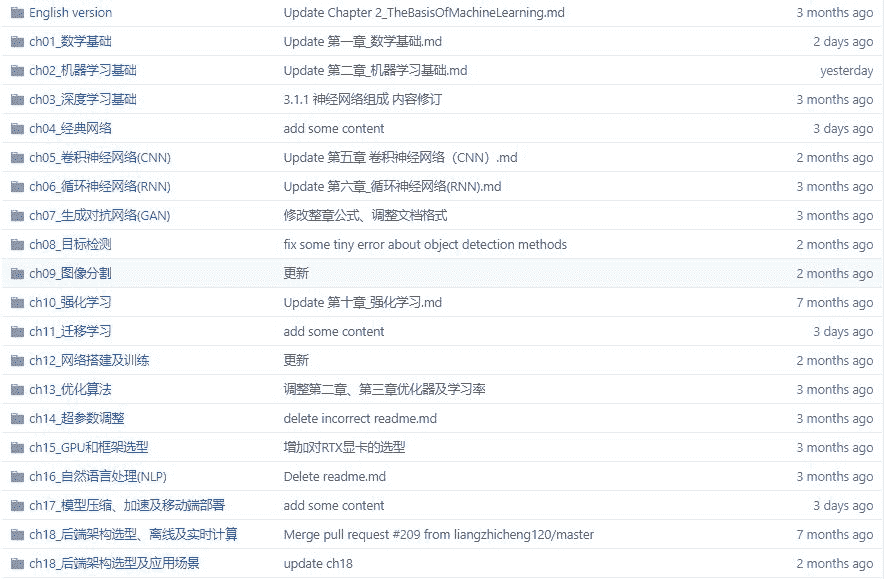
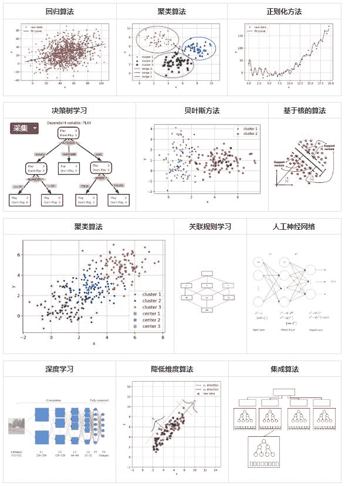
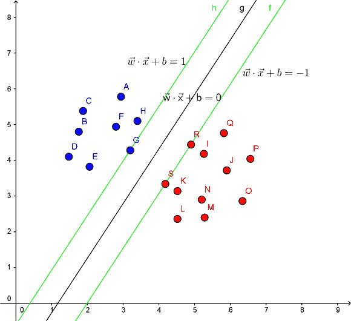
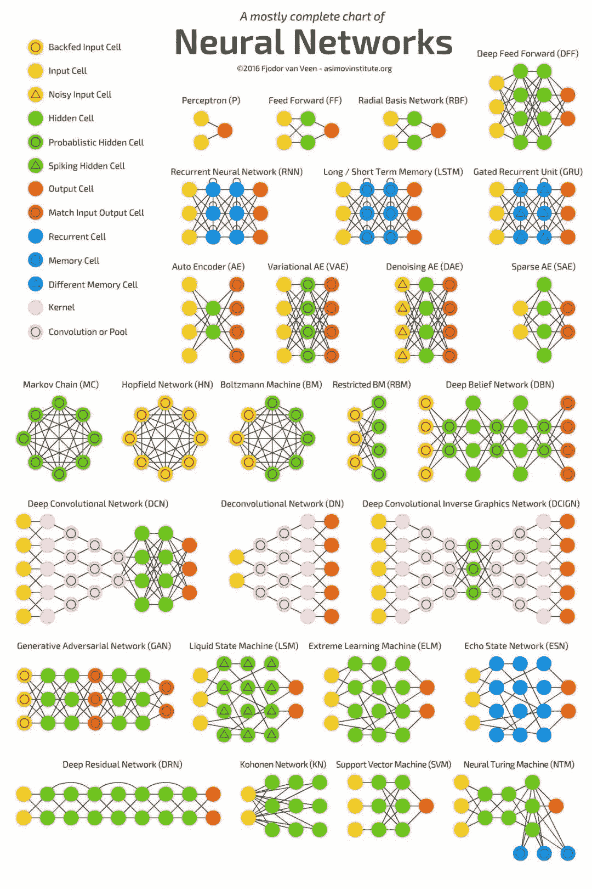
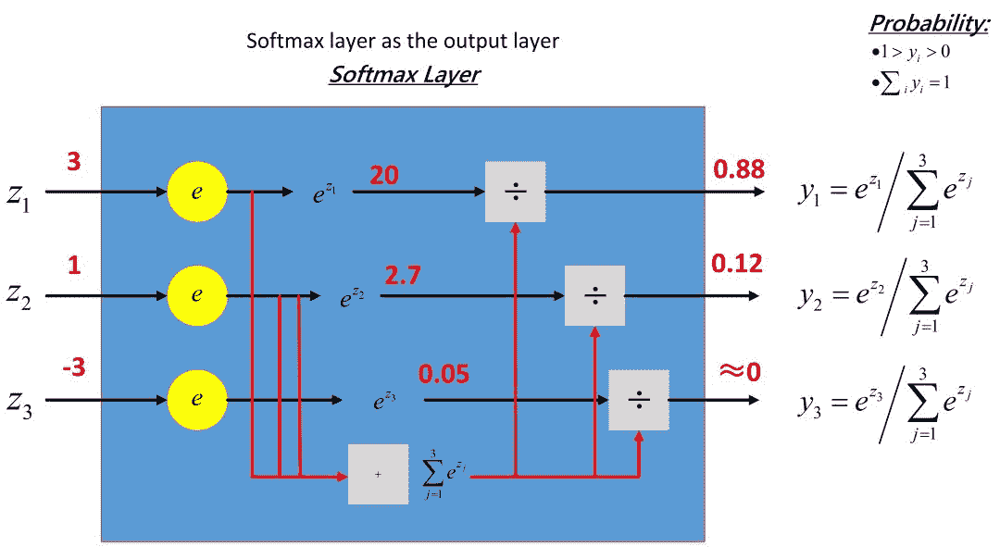
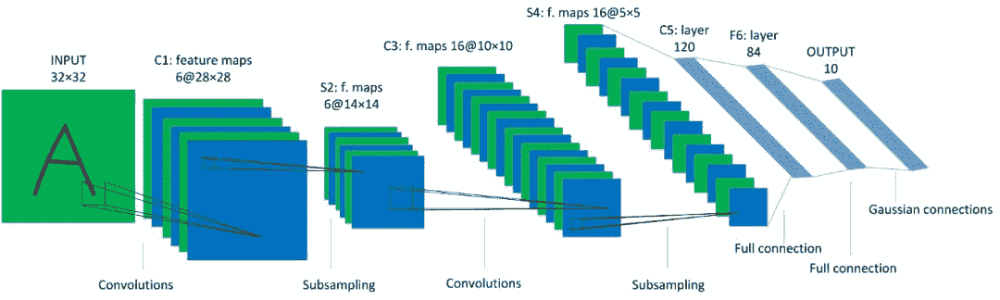
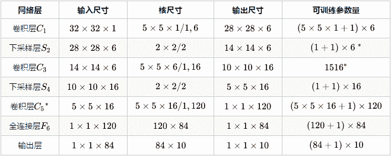
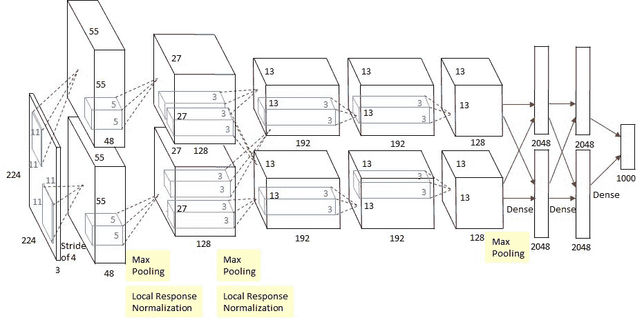
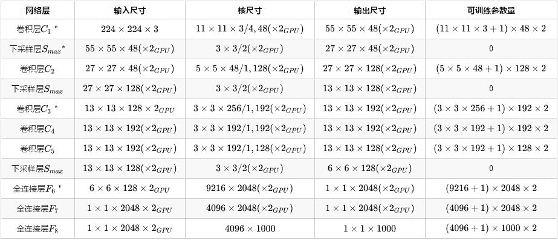
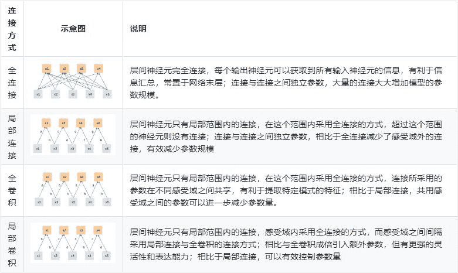

几个月前，红色石头发文介绍过一份在 GitHub 上非常火爆的项目，名为：DeepLearning-500-questions，中文译名：深度学习 500 问。作者是川大的一名优秀毕业生谈继勇。该项目以深度学习面试问答形式，收集了 500 个问题和答案。内容涉及了常用的概率知识、线性代数、机器学习、深度学习、计算机视觉等热点问题。

该热门项目一直在不断更新，作者本着开源精神，不断有新的贡献者在完善项目。如今，全书已达 50 余万字，分为 18 个章节。

首先，直接放上项目地址： 

**https://github.com/scutan90/DeepLearning-500-questions**

目前该项目已有 2.6w stars 了！只要是内容都是干货，超全！

下面，我们来看一看该项目有哪些硬核干货吧！ 

## 全书目录

该项目更确切地说是一本深度学习面试手册，500 问，非常详细。全书共分为 18 章，近 50 万字，目录如下：

*   数学基础

*   机器学习基础

*   深度学习基础

*   经典网络

*   卷积神经网络（CNN）

*   循环神经网络（RNN）

*   生成对抗网络（GAN）

*   目标检测

*   图像分割

*   强化学习

*   迁移学习

*   网络搭建及训练

*   优化算法

*   超参数调试

*   GPU 和框架选型

*   自然语言处理（NLP）

*   模型压缩、加速及移动端部署

*   后端架构选型、离线及实时计算

## 主要内容

全书内容非常丰富，持续更新和完善中。下面我们列举一些知识点给读者一睹为快！ 

**1. 各种常见算法（第 2 章）**

日常使用机器学习的任务中，我们经常会遇见各种算法，如下图所示。

**2. 支持向量机（第 2 章）**

支持向量：在求解的过程中，会发现只根据部分数据就可以确定分类器，这些数据称为支持向量。 

支持向量机（Support Vector Machine，SVM）：其含义是通过支持向量运算的分类器。 

在一个二维环境中，其中点R，S，G点和其它靠近中间黑线的点可以看作为支持向量，它们可以决定分类器，即黑线的具体参数。

支持向量机是一种二分类模型，它的目的是寻找一个超平面来对样本进行分割，分割的原则是边界最大化，最终转化为一个凸二次规划问题来求解。

**3. 常用的神经网络结构（第 3 章）**  

下图包含了大部分常用的模型：

**4. 多分类 Softmax（第 3 章）**  

下图包含了 Softmax 层的详细过程和推导： 

**5. 经典网络结构（第 4 章）**  

本章主要介绍几个具有代表性的神经网络模型。

**LeNet-5**

LeNet-5 模型是 Yann LeCun 于 1998 年提出来的，它是第一个成功应用于数字识别问题的卷积神经网络。在 MNIST 数据中，它的准确率达到大约 99.2%。典型的 LeNet-5 结构包含卷积层、池化层和全连接层，顺序一般是：卷积层->池化层->卷积层->池化层->全连接层->全连接层->输出层。

同时给出了 LeNet-5 的网络参数配置：

**AlexNet**

AlexNet 是 2012 年 ImageNet 竞赛冠军获得者 Hinton 和他的学生 Alex Krizhevsky 设计的。AlexNet 可以直接对彩色的大图片进行处理，对于传统的机器学习分类算法而言，它的性能相当的出色。AlexNet 是由 5 个卷积层和 3 个全连接层组成，顺序一般是：卷积层->池化层->卷积层->池化层->卷积层->卷积层->卷积层->池化层->全连接层->全连接层->输出层。

AlexNet 的网络参数配置：

**6. 全连接、局部连接、全卷积与局部卷积（第 5 章）**

全连接、局部连接、全卷积与局部卷积的对比和解释如下：

## 评价

整个项目包含的内容非常多，这里就不再赘述。干货很硬，大家不要错过了这份资源。再次附上链接： 

**https://github.com/scutan90/DeepLearning-500-questions**

总的来说，这份资源不是一本深度学习的系统教材，而是一份完整的、详细的深度学习知识点精炼手册。对于面试、自我测验来说非常有帮助！一句话：硬核干货，值得收藏！

## 资源下载

最后，这份完整的深度学习 500 问资源我已经为大家打包完毕！需要的可以按照以下方式获取：

**1.扫描下方二维码关注"Datawhale" 公众号**

**2.公众号后台回复关键词：DL500**

