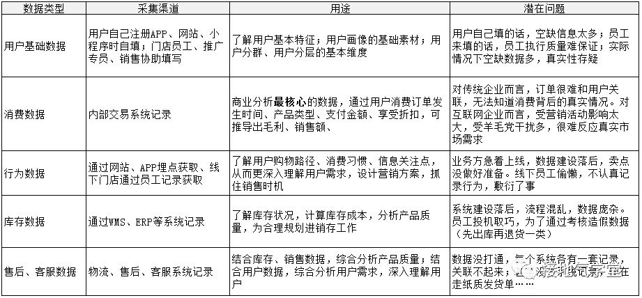
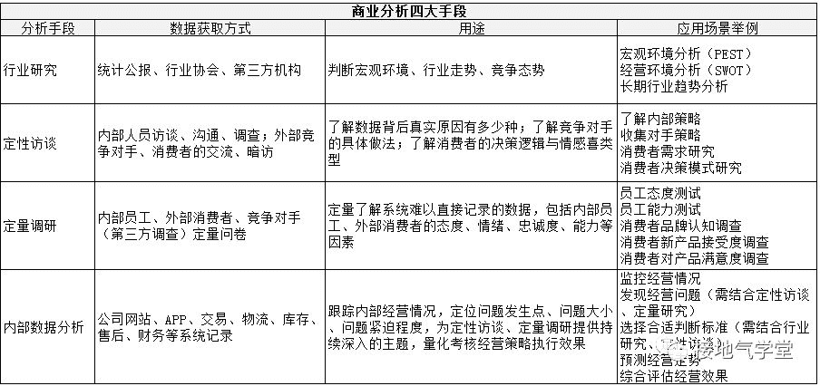
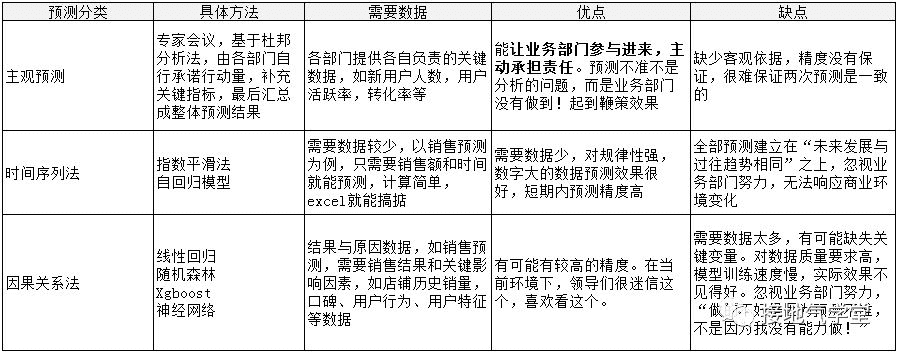

我们常说，办事情要“名正言顺”，而数据领域的名字则是格外的多，商业分析、数据分析、数据挖掘、算法模型……经常把大家绕晕，今天系统科普一下。

**商业分析VS 数据分析**

广义上的数据分析，指的是“利用数据对XX问题进行分析”。包括了数据采集、数据存储、数据清洗、数据计算、结论输出、数据可视化等部分。大家注意到了，这里是有个空白的XX没有填的。实际上，广义上的数据分析是一个基础技能，可以利用到很多很多领域。空白处可以填学术、理论、科学、医疗、教育、情感、心理……等等名词。是滴，这个空白处也可以填“商业问题”。如果是：利用数据分析方法进行商业问题的分析，那就是商业分析了。商业分析是广义的数据分析方法的一个具体应用场景。

狭义上的数据分析， 应该叫“对企业内部系统采集的数据进行分析”。实际上，我们在招聘时看到的要求懂sql，hive，python，R等软件操作的“数据分析岗位”，指的都是狭义的数据分析。这些分析工作基于企业网站、APP、订单、售后、客服、物流、财务系统记录的数据，进行计算、建模、报告等工作。

内部数据质量不行，是个永恒的问题，也常常成为分析的死穴。不懂数据的人往往想当然的认为：数据不是很多吗，分析分析就好了呀。可真正做数据工作的都知道，急躁的业务领导、投机取巧的同事、薅羊毛的用户、落后的IT建设，都会让内部数据看似庞大，实则一塌糊涂。常见的内部数据的分类与问题，简单归纳如下，大家感受一下： 

商业分析不仅仅利用企业内部系统数据，还需要大量利用外部数据。它由四个构成部分：行业研究、定性访谈、定量调研、内部数据分析。因为影响企业经营状况的因素，本身就包括了宏观环境、竞争对手、内部组织、员工能力、消费者态度与意愿等等方面。这些因素非常重要，但不一定都能通过系统采集到。因此就得靠多方面的信息采集来满足需求。具体每个部分的采集方式、用途，如下表所示：

真正进行商业分析，需要有综合性技能和多方面获取数据的能力。很多企业拿着做内部数据分析的要求招商业分析师，结果招来的人只会跑数据，没有解决真实问题的能力。写代码的小哥每天对着销售曲线发呆，冥思苦想不得其解。其核心症结就在这里：本身商业分析就不是敲两行代码就能完事的。至少要有行业研究-市场调查-内部访谈-内部数据分析四部分相互配合，不是200行代码就能让阿尔法狗子开口说人话：贵公司的问题是XXXX。200万行代码都不行。

更何况，很多企业对数据的重视程度远远不够。

*   有新政策出台也不知会；

*   外部信息系统采集、共享机制不存在；

*   内部做事情的背景、现状、目标啥都不交代；

*   不给做分析的同学走访一线，了解实际的机会；

*   **遇到问题就知道甩给分析：“你建个模型分析分析”**

*   私下里搞小动作，做分析的同学甚至是最后一个知道企业发生什么事的人

这就让做分析的同学们无米下锅了。就更难通过分析产出效益了。

**商业分析VS 算法模型**

拜Alpha Go所赐，现在人人都知道人工智能很厉害。阿尔法狗子一声汪汪，咬哭了柯洁，也让人们产生了无数对人工智能、算法模型的幻想。实际上算法模型最大、最成功、最多精力去做的内容，和数据分析没啥关系。算法模型目前比较成熟应用的领域，在于图像识别、语义识别、路线规划等方面，具体应用在安防、风控、物流、驾驶等领域，是基础的工业级应用。

在商业领域算法的用处相当有限。因为本身企业经营靠的就不一定是精细的计算，政策大势、老板的资源、员工创新、创意、创造能力，这些都很难用数据量化。换句话说：如果给定围棋的规则让算法去学习，算法可以打败最一流的高手；但在商业领域不是下围棋，有可能明年下棋的规则都变成在围棋盘上摆车马炮……别说阿尔法狗了，阿尔法喷火大恐龙都搞不掂。

因此，在商业领域算法往往应用在特定场景上。第一类常用的是直接针对用户场景的算法。具体场景往往有以下特点：个人决策、封闭信息、一对一沟通、用户决策容易被营销策略影响、数据指标多需要压缩、创意影响较少。比如常见的：风控。都是个人申请资料，金融机构审核。如果这个人信用不好，我们也没必要帮助他好，拒绝他就是了。设计信用的指标很多，单靠一两个指标很难判断，因此可以建模（最常用的是逻辑回归）来区分用户风险等级。类似的如推荐算法或者大数据杀熟，往往在APP里应用多，欺负的就是一对一的封闭场景沟通。如果真在实体店搞这一套，估计早就被客人告到工商局，或者干脆砸了招牌走人。

第二类常用的是预测算法，包括基于时间序列和因果关系预测两类。商业分析很需要对未来发展趋势做预测，因此需要算法辅助。常见的用法、优缺点如下表所示

第三类是用来降维的算法。包括因子-聚类分析、AHP、主成份分析等。往往是评估一个问题，考虑指标太多的时候，需要做降维处理，压缩指标方便评分。常用于评估类问题，比如项目、新产品、品牌评估等等。

综上，可以看到算法模型在商业分析中是非常有用的，可它本身不能替代商业分析，更不是一个问题思考不清楚了，就甩给做分析的同学：“人工智能好厉害，快人工智能分析一下为什么我们业绩做不起来”。业绩是做出来的，不是算出来的。更多的商业问题是和人的主观能动性有关，因此脱离人的因素去指望算法，最后就沦为数字游戏。

以上就是商业分析、数据分析、算法模型的关系与区别。用一句话概括，可以说是：商业分析是数据分析方法在商业问题的具体应用，算法模型是一个有效解决特定商业分析问题的工具。

