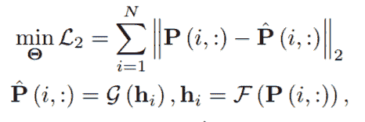
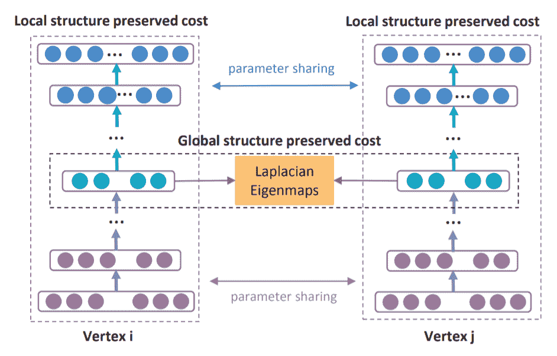

## Deep Learning on Graphs: A Survey

[Arxiv 1812.04202](https://arxiv.org/abs/1812.04202)

自编码器（AE）及其变体被广泛用于无监督学习 [74]，它适用于学习没有监督信息的图节点表示。 在本节中，我们将首先介绍图自编码器，然后转向图变分自编码器和其他改进。表 4 总结了所调查的 GAE 的主要特征。

表 4：不同图自编码器（GAE）的比较

## 5.1 自编码器

图中的 AE 的用法源于稀疏自编码器（SAE）[75] ^3。 基本思想是，通过将邻接矩阵或其辩题视为节点的原始特征，可以利用 AE 作为降维技术来学习低维节点表示。 具体而言，SAE 采用以下 L2 重建损失：

其中`P`是转移矩阵，`P^`是重构矩阵，`h[i] ∈ R^d`是节点`v[i]`的低维表示，`F(·)`是编码器，`G(·)`是解码器，`d << N`是维数，以及`Θ`是参数。 编码器和解码器都是具有许多隐藏层的多层感知器。 换句话说，SAE 试图将`P[i, :]`的信息压缩成低维向量`h[i]`并重建原始向量。 SAE 还增加了另一个稀疏正则化项。 在获得低维表示`h[i]`之后，k-means [85] 被应用于节点聚类任务，据证明它在经验上优于非深度学习基线。 然而，由于理论分析不正确，这种有效性背后的机制仍然无法解释。

结构化深度网络嵌入（SDNE）[76] 通过表明，方程式 35 中的 L2 重建损失实际上对应于二阶邻近度，填补了这个难题。即如果它们具有相似的邻域，则两个节点共享相似的嵌入表示，这在网络科学中进行了很好的研究，例如协同过滤或三角闭包[5]。 由网络嵌入方法启发，表明一阶邻近也很重要 [86]，SDNE 通过添加另一个类似于拉普拉斯特征映射的项来修改目标函数[54]：

即，如果两个节点是直接连接的，则他们也需要共享类似的嵌入表示。 作者还通过使用邻接矩阵并为零和非零元素分配不同的权重来修改 L2 重建损失：

其中如果`A(i, j)= 0`则`b[ij] = 1`，否则`bij = β > 1`，`β`是另一个超参数。 SDNE 的整体架构如图 7 所示。

图 7：SDNE 框架经许可转载自 [76]。使用深度自编码器保留节点的第一和第二级邻近度。

受另一系列工作的启发，当代工作 DNGR [77] 将方程式 35 的转移矩阵`P`，替换为具有随机游走概率的正向逐点互信息（PPMI）[58] 矩阵。 通过这种方式，原始特征可以与图形的一些随机游走概率相关联 [87]。 然而，构造输入矩阵可能需要`O(N^2)`时间复杂度，这不能扩展到大规模图。

GC-MC [78] 通过在 [36] 中使用 GCN 作为编码器，进一步采用了不同的自编码器方法：

解码器是一个简单的双线性函数：

其中`Θ[de]`是编码器的参数。 以这种方式，节点特征可以自然地结合。 对于没有节点特征的图，可以使用节点的单热编码。 作者证明了 GC-MC 对二分图推荐问题的有效性。

DRNE [79] 不是重建邻接矩阵或其变化，而是提出了另一种修改，即通过使用 LSTM 聚合邻域信息来直接重建节点的低维向量。 具体而言，DRNE 最小化了以下目标函数：

由于 LSTM 需要输入序列，因此作者建议根据度对节点的邻域进行排序。 对于具有度较大的节点，也采用邻居的采样以防止内存过大。 作者证明，这种方法可以保留常规等价性和节点的许多中心度量，如 PageRank [88]。

与先前将节点映射到低维向量的工作不同，Graph2Gauss（G2G）[80] 建议将每个节点编码为高斯分布`h[i] = N (M[i, :], diag (Σ[i, :]))`，来捕获节点的不确定性。 具体来说，作者使用从节点属性到高斯分布的均值和方差的深度映射作为编码器：

其中`F[M](·)`和`F[Σ](·)`是需要学习的参数化函数。 然后，他们使用成对约束来学习模型，而不是使用显式解码器函数：

其中`d(i, j)`是从节点`v[i]`到`v[j]`的最短距离，`KL[q(·) || p(·)]`是`q(·)`和`p(·)`之间的 KL 散度 [89]。 换句话说，约束确保节点对之间的 KL 散度，具有与图距离相同的相对顺序。 但是，因为公式 42 难以优化，基于能量的损失 [90] 被用作松弛：

其中`D = {(i, j, j0)|d(i, j) < d(i, j0)}`和`Eij = KL(hj||hi)`。 它进一步提出了一种无偏差的抽样策略，以加速训练过程。

## 5.2 变分自编码器

与以前的自编码器相反，变分自编码器（VAE）是另一种深度学习方法，将降维与生成模型相结合 [91]。 在 [81] 中首次将 VAE 引入到建模图数据中，其中解码器是一个简单的线性乘积：

其中`h[i]`假设遵循高斯后验分布`q (h[i]|M, Σ) = N (h[i]|M[i, :], diag (Σ[i, :]))`。 对于均值和方差矩阵的编码器，作者采用 [36] 中的 GCN：

然后，可以通过最小化变分下界来学习模型参数 [91]：

但是，由于需要重建整图，因此时间复杂度为`O(N^2)`。

受 SDNE 和 G2G 的启发，DVNE [82] 通过将每个节点表示为高斯分布，为图数据提出了另一种 VAE。 与先前采用 KL 散度作为测量的工作不同，DVNE 使用 Wasserstein 距离 [92] 来保持节点相似性的传递。 与 SDNE 和 G2G 类似，DVNE 还再目标函数中保留的一阶和二阶邻近度：

其中`E[ij] = W[2](h[j] || h[i])`是两个高斯分布`h[j]`和`h[i]`之间的第二个 Wasserstein 距离，`D = {(i, j, j')|j ∈ N (i), j' ∈/ N (i)}`是所有三元组的集合，对应于一阶邻近度的排名损失。 重建损失定义为：

其中`P`是过渡矩阵，`Z`是从`H`中抽取的样本。框架如图 8 所示。然后，目标函数可以使用重新参数化技巧，最小化为常规 VAE [91]。

## 5.3 改进和讨论

除了这两个主要类别外，还有一些值得讨论的改进。

### 5.3.1 对抗训练

对抗性训练方案，尤其是生成性对抗性网络（GAN），近来一直是机器学习的热门话题 [93]。 GAN 的基本思想是建立两个链接模型，一个判别器和一个生成器。 生成器的目标是通过生成伪数据来“欺骗”判别器，而判别器旨在区分样本是来自真实数据还是生成器生成。 然后，两个模型可以通过使用 minimax 游戏的联合训练相互受益。

[83] 中，对抗训练方案被纳入 GAE，作为一个额外的正则化项。 总体结构如图 9 所示。具体地说，编码器用作生成器，判别器旨在区分潜在表示是来自生成器还是来自先验分布。 以这种方式，强制自编码器将先验分布与正则化相匹配。 目标函数是：

其中`L2`类似于在 VAE 或 GAE 中定义的重建损失，而`L[GAN]`是

其中`G(F^V, A)`是方程 45 中的卷积编码器，`D(·)`是具有交叉熵损失的鉴别器，`p[h]`是先验分布。本文采用简单的高斯先验，实验结果证明了对抗训练方案的有效性。

### 5.3.2 归纳学习和 GCN 编码器

与 GCN 类似，如果节点属性包含在编码器中，则可以将 GAE 应用于归纳设置。 这可以通过使用 GCN 作为编码器来实现，如 [78]，[81]，[83]，或直接从 [80] 中的特征学习映射函数。 由于边信息仅用于学习参数，因此该模型可以应用于训练期间未见的节点。 这些工作还表明，尽管 GCN 和 GAE 基于不同的架构，但可以结合使用它们，我们相信这是一个充满希望的未来方向。

### 5.3.3 相似性度量

在 GAE 中，采用了许多相似性度量，例如，L2 重建损失，拉普拉斯特征映射和 AE 的排序损失，以及 VAE 的 KL 散度和 Wasserstein 距离。 尽管这些相似性度量基于不同的动机，但如何为给定任务和架构选择适当的相似性度量仍不清楚。 需要进行更多研究来了解这些指标之间的潜在差异。