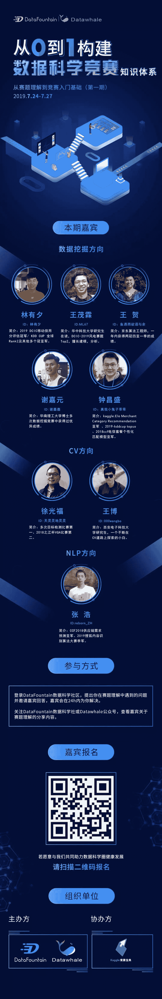

**从0到1构建数据科学竞赛知识体系**

**这是怎样的数据竞赛知识体系**

为了帮助更多竞赛选手入门进阶比赛，通过数据竞赛提升理论实践能力和团队协作能力。DataFountain 和 Datawhale 联合邀请了数据挖掘，CV，NLP领域多位竞赛大咖，将从赛题理解、数据探索、数据预处理、特征工程、模型建立与参数调优、模型融合六个方面完整解析数据竞赛知识体系，帮助竞赛选手从0到1入门和进阶竞赛。

**获取数据竞赛知识的方式**

所有分享的知识体系内容将在 DataFountain社区 和 Datawhale 社群、Datawhale公众号第一时间分享，也可以登陆 DataFountain社区 邀请嘉宾问答，与大咖零距离互动，参与学习讨论。活动地址：

https://discussion.datafountain.cn/

**DataFountain，Datawhale**
**1**
**DataFountain**

**DataFountain**平台（简称“DF平台”），是全球最具影响力的数据科学家平台之一，依托中科院计算机所技术团队、中国计算机学会领袖级的专家资源、5000余国内外企事业机构资源及教育部上千所高校人才合作渠道，对外提供项目众包服务、数据竞赛服务及线上线下实训服务，链接数据、算法、人才，为产业及数据科学家赋能！AI指北为DataFountain旗下面相AI知识的专业问答社区，入驻国内最前顶尖的数据科学人才，助力数据圈良性发展。

**2** **Datawhale**

**Datawhale**是一个专注于AI领域的开源组织，2019年被评为上海交通大学国家级项目，科大讯飞比赛平台AI 开源社区唯一合作伙伴。组织成员涵盖了清北交浙，伯克利，斯坦福，UMD，港科大，港中文等国内外50多所知名院校，以及阿里，百度，头条，微软，IBM等10多家知名企业。致力于构建国内有影响力的开源社区，用开源价值促进产业发展，帮助AI领域学习者更好地成长。

** 更多信息**

**【数据竞赛****交流群****】**

识别下方二维码，添加**Datawhale官方号**

回复关键词：【竞赛】进群

 **长按添加**