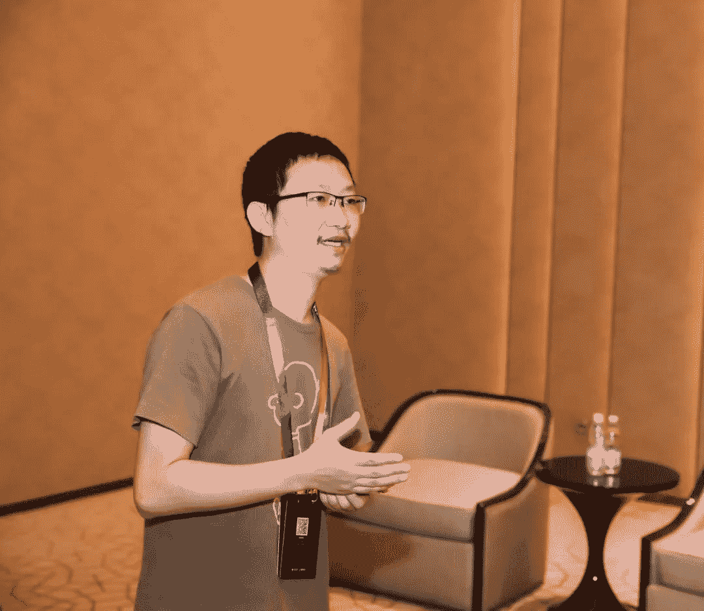
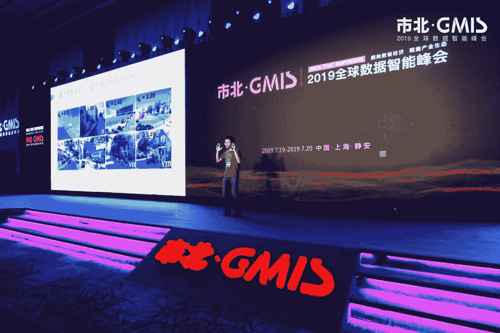

* * *

一种是看快实慢，他以为他走了一条快路，实际上很慢，一种则是看慢实快。有一句话是这么说的，我们从窄门进最终能走出宽路来。很多时候你看起来路好像很宽，实际上最后走的很窄，看起来从窄门进，实际上可以走的很宽。

**作者：周涛**

周涛，电子科技大学教授，数之联CEO。2005年毕业于中科大少年班，2010年获瑞士弗里堡物理系博士学位，同年1月，年仅27岁的周涛，被聘为电子科技大学特聘教授，成为四川省最年轻的教授。2013年入选国家“万人计划”首批青年拔尖人才支持计划，2015年与屠呦呦等七名个人和北斗导航等三个团队共同当选2015年度中国十大科技创新人物。

**编者按：**

周老师本人就是"从窄门进"这一理念的实践者，2007年以前，周涛在国内研究“复杂网络”的学者中已经是赫赫有名了，就在事业发展很顺的时候，他做出了人生的一大重要决定：转换研究方向，研究如何利用统计物理学的理论与方法解决信息科学的问题。2012年，当周老师在高校工作卓有成就的时候，他又创办了数之联，从学者身份转换成了一名企业家，目前估值数十亿。一直对他的经历和人生选择非常好奇，这次有幸参加GMIS全球数据智能峰会，在机器之心的引荐下，和周老师见面详谈，收益良多，于是将内容整理分享给大家。

**转换方向的困难**

**范晶晶**：首先真的是非常荣幸能和周老师面谈。我叫范晶晶，是开源组织Datawhale的核心成员。周老师的经历中有很多让人惊叹的选择，比如说，07年您在研究复杂网络这一块，然后已经有成就了，也是知名的一个学者，却突然选择转换研究方向。在我们看来，它是一件非常艰难的事情，但是您不仅换了方向，而且在新的领域中又取得了卓越成就。我想了解当时您转换方向的初衷，以及面对其中的困难，是如何克服的？

**周涛**：首先没有什么太大的困难，因为我们在university，当你做本科生或者master的时候，**其实我们学到的是发现问题和解决问题的方法**。我们大体把science分成两类，一类叫干科学，这个时候我们不需要动手的，就是只动脑子就可以了。一类叫湿科学，就是我要做实验的，比如说生物你要解剖，或者你要做什么实验，那你既要动脑子又要动手。如果说你从干科学转到湿科学或者相反，那是比较大的转换。因为原来我不做实验，我可能操作不来那仪器，我现在却要做实验。但是我觉得在这种干科学内部的转化，本质上来讲没有你们想象的那么大，我可能用不一样的方法去解决不一样的问题，表面上看起来很不一样，但是你培养你的这种科学素养没有发生变化，所以我觉得在转变的过程中没有遇到困难。

但是从你问的第一个问题，出发点是什么？是因为我原来是做统计力学的，我是在理论物理里面学统计力学。那统计力学他处理的不是几个粒子能精确求解的方程，也不是无穷大，无穷大又是另外一种可以精确的；它是处理这种，比如说那种很大的，有几个摩尔，可能是十到二三十次方，这种量子级别体量的东西。就像我们的物质，比如说液态等这些相变、临界性、雾态这些东西，在这个情况下，它需要用很多大量的统计力学的手段来去获得统计性的一些解。这个实际上和我们现在面对的大数据是一样的，因为我们现在面对的可能是几万亿张网页、可能是七八亿的阿里的users、可能是几千万的商铺，你要在这去做搜索、要去做广告、要去做个性化推荐，它本质上就像我们处理那些粒子一样——你不可能是精确的，但是你又不是真正的无限大。就是它是介于很少的可以精确求解和无穷大之间的问题，所以它本来就是我原来的统计力学比较擅长的一点。我原来做复杂网络，之所以从nerves(复杂网络)偏向更industry(工业)，变成了做推荐系统，做一些更偏工业化的这些应用方向，是因为我觉得，物理的发展就是真正去探索宇宙和量子的这种极大和极小的这些问题的发展，可能更多的还是要靠电动力学和量子力学这两个领域推进，对吧？统计力学可能未来的发展道路很大程度上是要和我们的社会经济有联系的，我们要做宏观物态。统计力学更多的是处理宏观物态，就是我们肉眼看，比如这片水是宏观物态，但是我们不会看到我们整个宇宙全貌，这也看不到，对吧？也不会看到一个粒子。所以在这种情况下我觉得有一条很重要的路，就是我们要用统计力学的方法去获得一些真正的社会经济价值，去解释我们在信息社会遇到的问题。因为我相信物理学、现代物理学的一些方法，是能在信息科学中发挥很大作用的，这是初衷。所以我在转型过程中没有遇到太大困难，**因为一个好的大学不是教一个学生去只会做一件事，而是教一个学生会发现问题，解决问题**。

**基础科学的重要性**

**范晶晶**：我听完后的感觉是，您在用物理学的方法来解决信息科学的问题，这是不是恰恰证明了基础科学的重要性？也就是说您学的物理方法是你的底层基础，上面的很多东西其实都可以变，但是基础科学给你带来的无论是在研究方法，还是在解决问题的思路方面都有非常大的帮助？

**周涛**：对一个人读大学来说，我觉得理工科里最有价值的三个方向就是数学、物理和计算机，其他的价值都要较小。为什么这样说？因为数学物理计算机它学的是一种新的思维方式，这也是为什么我们讲这些学科是基础学科，因为它有使我们去理解和处理世界不一样的理念和方法，它是骨子里不一样。但当你把这些东西学会之后，你再去用它去处理一个具体问题，我觉得是比较容易的。所以我们一般对大家的推荐都是在本科的时候去学这种更基础性的锻炼你思维方式的学科，然后你在硕士、博士阶段，或者走上工作之后再去学一个专门的方向。

那么物理显然是这样的方向了，但其实你要想学好物理，你是离不开computer science和数学的，因为本质上来讲很多比如说你要学好量子力学，对吧？你肯定是有非常强的泛函分析的能力、非常强的实分析的能力，因为你大部分处理的可能是hilbert空间，巴拉赫空间等等，本质上你玩的都是数学工具。所以你数学一定要足够的好，你才有可能学得好理论物理；同样的话你如果你在做很多计算物理的问题的时候，你必须要有很强的这种计算能力。所以说其实很多重要的算法，比如说像大家在计算机里面看到的像模拟退火算法，其实最早是物理学家做的，最早发在science上而不是发在一个conference paper上，那它实际上完全是模拟一个物理过程。所以我觉得这些东西是不可分割的，**如果你学好了基础学科，你将来要转向去解决某些工业性的问题是比较容易的**。

**从窄门进宽路出**

**范晶晶**：刚刚这段话其实引发了我一个思考，就是从您身上我能看到这种，物理学或者数学等基础学科的重要性。你也在大学当老师，感触可能更深，很多学生在选专业的时候倾向于选金融学、经济学等很快有应用价值的学科。我们开始变得很浮躁，很难沉下心去选择基础学科，夯实基础知识。关于这个原因，我自己的理解是，对于企业而言，虽然你可能有好的理论基础，但是他看重的是你有没有实践经历，能不能编写代码，能不能快速上手解决问题，对吧？所以有了一个矛盾点，一方面的确从你的经历我能感受到基础学科的重要性，另外一方面就是企业的急功近利，或者说也不算急功近利，而是需要求职者立刻能为企业产生价值的能力，这可能导致了学生在选择专业的时候更偏向应用学科，做事情也变得更浮躁了一些，对于这个现状，您怎么看待？

**周涛**：OK明白，我先讲一个比较好玩的例子，从这个例子开始理解你的这个问题，比如说我们想象一段非常美好的婚姻，它是怎么来的。一个家庭怎么来的，他应该是先有了爱情，两个人先谈恋爱对吧？先有的很长一段时间爱情，然后觉得这两个人在一起一直生活下去是蛮好的一件事，所以他们才考虑结婚组成家庭，再有子女，对吧？这是一段正常的过程。但是当你年纪大到一定程度的时候，比如说你可能就想，我不要爱情了，我需要有个家庭，我希望结婚要有孩子，对吧？因为有很多父母给予了压力，社会给予了压力，所以我要表现给大家看，让大家看的是我有一个家庭，至于藏在这个背后的爱情反正你也看不到。我们俩只要在一起的时候，两个人卿卿我我，牵着手，让大家以为背后有爱情。但是真有没有爱情你不知道，但是社会大众看来好像感觉你有家庭应该是美满的，但是它的原始驱动力实际上无所谓。

中国有个很独特的特点，就像萨特说“他人即地狱”，对吧？那么其实这句话在中国是特别贴切的，因为我们绝大多数人都生活在某种主流价值观里面，你希望做的是别人家的孩子，对吧？因为我们小学的时候想读重点小学，想读重点中学，然后考上985或者双一流的高校，然后去最好的企业上班，对吧？至于你自己的兴趣是什么是相对不那么重要，因为你这样做的话，你爸爸妈妈就会很有面子，你自己也会觉得很有面子，对吧？所以这就叫主流价值观，它代表许多他人评论的总和；这种价值观在驱动你，你如果去fit这种东西，那你就会丧失到很多。

所以这是我觉得造成这个方面的第一个问题，就是有的时候我们为了去fit主流价值观，我们都会忘掉我们到底想要什么，因为它有太多人的力量在推动，那这样的话你的父母你的老师和这个社会把你推到这个方向去，你可能不知道自己真的喜欢什么。第二个很大的原因就是中国人他很看重一城一池的得失，这是因为我们在40年改革开放快速发展的过程中，我们经历了一个从极其贫困的一个国家迅速转化为一个中等收入，甚至现在是中等偏上收入的国家；在这个过程中，我们并没有形成某种我们可以叫贵族精神或者说，就是那种从容和包容的心态，但是我们学会competing in numbers，就是我们和人比数字，你挣2万一个月我挣3万你挣4万对吧？我们competing in numbers，用这种最简单的机器学习中的降维方法，我本来一个人可能要用一千维来比，我现在把降到收入这一个维度来比，这个时候我就会特别在乎一城一池的得失。

其实很多东西，就像我刚才讲的，可能是爱情的长跑，才会真正撑出一个完美的婚姻和家庭；可能是你在基础学科上做了长年的冷板凳，或者你经历了长期的枯燥学习，那个时候你转成金融经济，其实会变得更加容易。但是你会想，我无法直接看到我学四年本科数学和我学经济直接的关系；但是我可能读一两本经济学的书，到某个咨询公司上上实习，这个效果很明显。

我们刚才不管讲的是我们跟踪主流价值观，还是我们在乎一城一池的这种功利性的得失，都会使我们犯同一个错误，**就是只能看得到眼见即所得快速反馈的东西，看不到沉在下面需要常年积累的东西**，这是我们面对的大问题，你提得非常好，我认为有这样的问题。而事实上在越新的学生中我发现这个问题越严重，包括现在我发现00后的学生就比九五后的更严重，确实是存在这样的一些问题。所以我觉得像你们开源组织，包括媒体、我们老师也是这样的，我们都要尽可能去正面引导学生，让他们去了解到更多的case。首先统计上告诉他们学数学物理不是没有出路，也不是只能在中学去当数学物理老师，统计上来讲他们就很好；然后我希望在更年轻一点的孩子里面，在中学小学生里面，中小学的教育中就要培养他们对于这种基础性思维性学科的兴趣。这是一个很漫长的时间，我觉得不是一蹴而就。我觉得中国会经历几个阶段，一开始对基础学科蛮重视，在我们五六十六七十年代学好数理化走遍天下都不怕，因为没什么可选择对吧？然后随着经济社会的发展慢慢变得功利，但是又会慢慢好起来的。因为我们要从大国变成强国，用政策的话来说就是要实现四个自信，对吧？道路自信、文化自信、理论自信、制度自信，真正意义上我们要实现我们的这种自信，才能够说我们能够很从容地去面对，去学一些不能立竿见影看到效果的东西。

**范晶晶**：刚刚讲的真的太好了，关于结婚这个比喻特别通俗易懂。简单点来讲，我们结婚是为了幸福，不是为了结婚而结婚。现在的社会风气是，需要有房有车才能结婚，所以为了结婚我们很多人只专注于追逐房车，然后换来婚姻，但是其实并没有得到长久幸福。反而像你说的我去追求这种爱情去培养这种能力，最后得到的婚姻才有长久的幸福可能。

**周涛**：对，很多时候路都是这样的，就是有两样东西，一个是有的人看快实慢，他以为他走了一条快路，他实际上很慢，很多人走路是看慢实快。《马太福音》里面说过一句话，叫做“我们要有上帝约束”是吧，我不信那些东西，但是还有一句话就是说“**我们从窄门进最终能走出宽路来**”。很多时候就是这样的，你看起来你好像很宽，你实际上最后走的很窄，你看起来从窄门进，你实际上可以走宽。

学数理方程偏方程也是一样，你可能解你就解一个波动方程你就什么都不管，你就把各种方法的波动方程解完，对吧？波动方程只是方程中很少一部分，但是你如果波动方程解的超牛逼了，比如说什么拉普拉斯方法，各种方法你都很熟悉了，你再回过头来，你说我其他都不会，我就会波动方程，但我再重新来看数理方程的教材和这种学科，你会觉得特别容易。所以这就是从窄门进，你往往能走出宽路来，**你要一根楔子扎得足够深**。

**本质上都是发现问题解决问题**

**范晶晶**：我们当时是因为兴趣去做开源这件事，到后来我们开始成立开源组织，说实话其实也是蛮艰难的。我自己亲身经历了它的发展，我感觉难的是，第一是能下定决心，第二就是在这个过程中我发现难的其实不是事，而是人。我的感触是，你要懂得怎么去跟人相处，怎么去满足人的不同诉求，或者说满足不同的价值观，怎么去塑造组织文化。所以我特别惊讶的是你为什么能在学术界有大的影响力，去到产业界也依旧能卓有成就。能够当好一个CEO，和当好一个老师是相通的吗？

**周涛**：到时候给你留下我的电话和微信，我们可以多聊。其实创业也跟你说一下，我觉得创业它有一件好处，就是你有一个实体，不管你是一个公益的，还是说一个有盈利性的实体，你才会有一种汇聚的平台把人聚在一起，不然的话大家都扯淡，对，那就是酒肉朋友转转会，对吧？这没意思。我觉得他首先是一个汇聚的力量，然后好多的聪明才智和你年轻时候的这个梦想都在一个平台上汇聚，这本身是一件非常美好的事情。

换句话说，有的人会觉得大学生创业他的死亡率非常高。但是在这一段时间里面，你能学到好多有趣的东西，不管是管理还是交到好的朋友，而且你能学到怎么面对失败和挫折，怎么从巨大的失败、重大的挫折中重新站起来，这都是很不得了的一些事情。还有就是你会很快乐，也会很集中的痛苦。**你一个人的人格魅力是取决于你有多么强烈的快乐和多么强烈的痛苦**。你拉伸，如果你只能拉那么直，我这一辈子就只从很快乐到非常快乐这么小，那你很窄，或者你这辈子都很痛苦，对吧？那你也很窄。当你既有很快乐的时候，也有特别痛苦的时候，但是你能够在里面动荡，这才是你人的长度。所以我是蛮欣赏大学生创业的。创业成的人不多，但是这个人一辈子都不成的，我很少见过。创业者，比如说你可能这一次不一定能成，对吧？有可能你要面对这种风险，有可能成有可能不成，但是你这一生都不成，这样的人很少见，基本上没有。我遇到的这种大学生创业愿意带一个team的，那可能他一年两年三年五年没成，但是长久，他都会成，所以这是好事。

说到我，我还是回到刚才那个回答。其实你们在读书，还有在更年轻创业的时候，你们千万不要局限于到某一个特定的技巧和specific的东西，这样的话你就使得你人变得很narrow，我就变成一个窄人，比如说我只能解决下象棋的问题，对吧？其实不是这样的，就是人的智力里面最核心的就是逻辑。智力的核心是逻辑，逻辑看起来简单，像亚里士多德的“三段论”一样，但是它实际上没有那么简单。为什么很多人商业上不成功，是因为他逻辑就没有学好，他没有想明白我商业模式的整个产业链中，我进去之后能不能让产业链依然流畅的运动，能让我的每一个环节都挣到钱，对吧？比如说很多人做医疗创业他失败了，还是因为他不懂逻辑；管理也是一样，它有管理的逻辑，除了逻辑就是你脑子至少清晰而不笨，能够梳理出条理来，能够知道这个前因后果。

第二个就是共情，共情是我学数学物理学不到的，就是你要去充分地了解别人想要什么，别人需要什么，他在意什么，然后你能通过交流去很快地感知到别人，他能接受意见是到什么程度？这叫共情。我们讲情商实际上最早是EQ这个E就是共情的意思。管理里面很重要的就是共情，就是因为你只要能了解别人要什么，你又有逻辑，知道怎么能够让大家都好，那就可以完成这事。

所以说我觉得不要去care自己，在很多人觉得你会在不同的角色中转换，比如说somehow你是一个政府的人员，somehow你是一个创业者，somehow你是一个什么教师对吧？但是其实不然，你在做，你要归根到底你是去设立你某每一件事情的目标，长期的目标、中期的目标、短期目标、达到这个目标的阶段性目标，然后你需要什么样的资源和人，然后你怎么调动它怎么管理它，就OK了。它其实解决的都是类似的问题，只不过有些问题你需要在一线coding，你需要编代码，你需要推公式写文章，有些问题你可能可以到二线去告诉别人应该往哪个方向发展。Almost都是发现问题解决问题。

你如果心里想着你不同的角色，比如说你会想你这是一个难控的角色，一个丈夫的角色、一个爸爸的角色、一个爷爷的角色、一个儿子的角色；如果要想太复杂了你都坏掉了。反正就是让你重要的人觉得很幸福开心就完了，你想那么多就自己把自己想挂掉了，这样的话你的本来就有限的脑容量就会很快要报废，因为我们不是computer我们是human brain。

