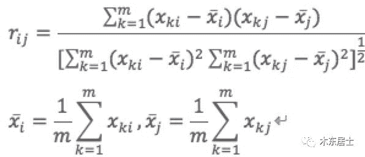
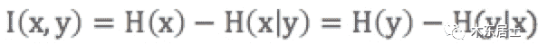
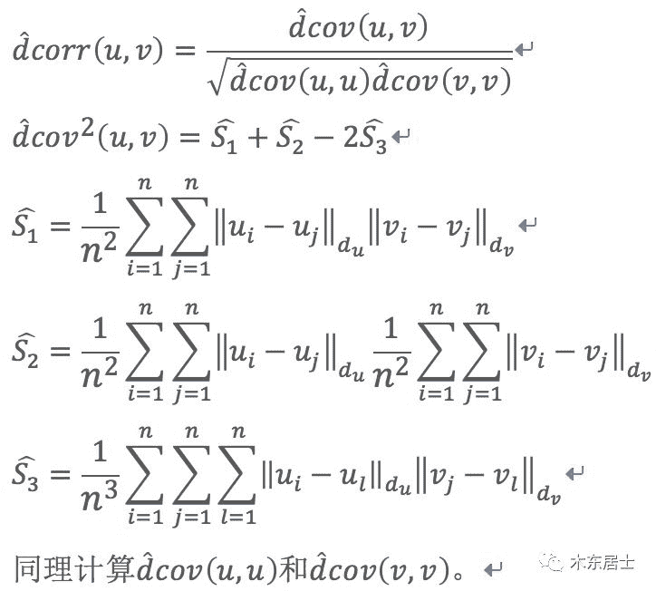
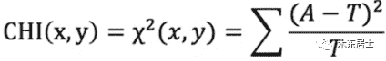

0x00 前言

数据和特征决定了机器学习的上限，而模型和算法只是逼近这个上限而已。由此可见，**特征工程在机器学习中占有相当重要的地位**。在实际应用当中，可以说特征工程是机器学习成功的关键。

那特征工程是什么？

> 特征工程是利用数据领域的相关知识来创建能够使机器学习算法达到最佳性能的特征的过程。

特征工程又包含了Feature Selection（特征选择）、Feature Extraction（特征提取）和Feature construction（特征构造）等子问题，本章内容主要讨论特征选择相关的方法及实现。

在实际项目中，我们可能会有大量的特征可使用，有的特征携带的信息丰富，有的特征携带的信息有重叠，有的特征则属于无关特征，如果所有特征不经筛选地全部作为训练特征，经常会出现维度灾难问题，甚至会降低模型的准确性。因此，我们需要进行特征筛选，排除无效/冗余的特征，把有用的特征挑选出来作为模型的训练数据。

## 0x01 特征选择介绍

### 1.特征按重要性分类

*   相关特征：

    对于学习任务（例如分类问题）有帮助，可以提升学习算法的效果；

*   无关特征：

    对于我们的算法没有任何帮助，不会给算法的效果带来任何提升；

*   冗余特征：

    不会对我们的算法带来新的信息，或者这种特征的信息可以由其他的特征推断出；

### 2.特征选择的目的

对于一个特定的学习算法来说，哪一个特征是有效的是未知的。因此，需要从所有特征中选择出对于学习算法有益的相关特征。而且在实际应用中，经常会出现维度灾难问题。如果只选择所有特征中的部分特征构建模型，那么可以大大减少学习算法的运行时间，也可以增加模型的可解释性。

### 3.特征选择的原则

获取尽可能小的特征子集，不显著降低分类精度、不影响分类分布以及特征子集应具有稳定、适应性强等特点。

## 0x02 特征选择的方法

### 1.Filter方法（过滤式）

**先进行特征选择，然后去训练学习器，所以特征选择的过程与学习器无关。**相当于先对特征进行过滤操作，然后用特征子集来训练分类器。

**主要思想**：对每一维特征“打分”，即给每一维的特征赋予权重，这样的权重就代表着该特征的重要性，然后依据权重排序。

**主要方法**：

*   Chi-squared test（卡方检验）

*   Information gain（信息增益）

*   Correlation coefficient scores（相关系数）

**优点**：运行速度快，是一种非常流行的特征选择方法。

**缺点**：无法提供反馈，特征选择的标准/规范的制定是在特征搜索算法中完成，学习算法无法向特征搜索算法传递对特征的需求。另外，可能处理某个特征时由于任意原因表示该特征不重要，但是该特征与其他特征结合起来则可能变得很重要。

### 2.Wrapper方法（封装式）

**直接把最后要使用的分类器作为特征选择的评价函数，对于特定的分类器选择最优的特征子集。**

**主要思想**：将子集的选择看作是一个搜索寻优问题，生成不同的组合，对组合进行评价，再与其他的组合进行比较。这样就将子集的选择看作是一个优化问题，这里有很多的优化算法可以解决，尤其是一些启发式的优化算法，如GA、PSO（如：优化算法-粒子群算法）、DE、ABC（如：优化算法-人工蜂群算法）等。

**主要方法**：递归特征消除算法。

**优点**：对特征进行搜索时围绕学习算法展开的，对特征选择的标准/规范是在学习算法的需求中展开的，能够考虑学习算法所属的任意学习偏差，从而确定最佳子特征，真正关注的是学习问题本身。由于每次尝试针对特定子集时必须运行学习算法，所以能够关注到学习算法的学习偏差/归纳偏差，因此封装能够发挥巨大的作用。

**缺点**：运行速度远慢于过滤算法，实际应用用封装方法没有过滤方法流行。

### 3.Embedded方法（嵌入式）

将特征选择嵌入到模型训练当中，其训练可能是相同的模型，但是特征选择完成后，还能给予特征选择完成的特征和模型训练出的超参数，再次训练优化。

**主要思想**：在模型既定的情况下学习出对提高模型准确性最好的特征。也就是在确定模型的过程中，挑选出那些对模型的训练有重要意义的特征。

**主要方法**：用带有L1正则化的项完成特征选择（也可以结合L2惩罚项来优化）、随机森林平均不纯度减少法/平均精确度减少法。

**优点**：对特征进行搜索时围绕学习算法展开的，能够考虑学习算法所属的任意学习偏差。训练模型的次数小于Wrapper方法，比较节省时间。

**缺点**：运行速度慢。

## 0x03 特征选择实现方法一：去掉取值变化小的特征 （Removing features with low variance）

**该方法一般用在特征选择前作为一个预处理的工作，即先去掉取值变化小的特征，然后再使用其他特征选择方法选择特征。**  

考察某个特征下，样本的方差值，可以认为给定一个阈值，抛弃哪些小于某个阈值的特征。

### 1.实现原理

*   离散型变量：

    假设某特征的特征值只有0和1，并且在所有输入样本中，95%的实例的该特征取值都是1，那就可以认为这个特征作用不大。

    如果100%都是1，那这个特征就没意义了。

*   连续型变量：

    需要将连续变量离散化之后才能用。

而且实际当中，一般不太会有95%以上都取某个值的特征存在，所以这种方法虽然简单但是不太好用。可以把它作为特征选择的预处理，先去掉那些取值变化小的特征，然后再从接下来提到的的特征选择方法中选择合适的进行进一步的特征选择。

### 2.实现代码

```
from sklearn.feature_selection import VarianceThresholdX = [[0, 0, 1], [0, 1, 0], [1, 0, 0], [0, 1, 1], [0, 1, 0], [0, 1, 1]]sel = VarianceThreshold(threshold=(.8 * (1 - .8)))sel.fit_transform(X)＃array([[0, 1],       [1, 0],       [0, 0],       [1, 1],       [1, 0],       [1, 1]])
```

## 0x04 特征选择实现方法二：单变量特征选择

单变量特征选择方法独立的衡量每个特征与响应变量之间的关系，单变量特征选择能够对每一个特征进行测试，衡量该特征和响应变量之间的关系，根据得分扔掉不好的特征。**该方法简单，易于运行，易于理解，通常对于理解数据有较好的效果（但对特征优化、提高泛化能力来说不一定有效）；**这种方法有许多改进的版本、变种。

### 1.Pearson相关系数（Pearson Correlation）

皮尔森相关系数是一种最简单的，能帮助理解特征和响应变量之间关系的方法，该方法衡量的是变量之间的线性相关性。

#### 1）原理介绍



*   就是用x_i、x_j的协方差除以x_i的标准差和x_j的标准差，**可以看成一种剔除了两个变量量纲影响、标准化后的特殊协方差。**

*   协方差是度量各个维度偏离其均值的程度，协方差的值为正值时说明两者是正相关，否则是负相关的。

    结果的取值区间为[-1，1]，-1表示完全的负相关，+1表示完全的正相关，0表示没有线性相关，绝对值表示相关性的强度。

*   标准差也称均方差，是方差的算术平方根，能反映一个数据集的离散程度。

#### 2）主要用于连续型特征的筛选，不适用于离散型特征的筛选。

#### 3）优缺点

*   优点：

    **相关系数计算速度快、易于计算，经常在拿到数据(经过清洗和特征提取之后的)之后第一时间就执行。**Pearson相关系数能够表征丰富的关系，符合表示关系的正负，绝对值能够表示强度。

*   缺点：

    相关系数作为特征排序机制，**它只对线性关系敏感**，如果关系是非线性的，即便两个变量具有一一对应的关系，相关系数系数也可能会接近0。

#### 4）代码实现

```
import numpy as npfrom scipy.stats import pearsonrnp.random.seed(2019)size=1000x = np.random.normal(0, 1, size)# 计算两变量间的相关系数print("Lower noise {}".format(pearsonr(x, x + np.random.normal(0, 1, size))))print("Higher noise {}".format(pearsonr(x, x + np.random.normal(0, 10, size))))
```

### 2.互信息和最大信息系数（Mutual information and maximal information coefficient）

如果变量不是独立的,那么我们可以通过考察联合概率分布与边缘概率分布乘积之间的 Kullback-Leibler 散度来判断它们是否“接近”于相互独立。

#### 1）互信息方法

熵H(Y)与条件熵H(Y|X)之间的差称为互信息，互信息与条件熵之间的关系：



**其实，这就是ID3决策树的特征选择规则。**  

互信息法也是评价定性自变量对定性因变量的相关性的，但是并不方便直接用于特征选择：

*   它不属于度量方式，也没有办法进行归一化，在不同的数据上的结果无法做比较。

*   只能用于离散型特征的选择，连续型特征需要先进行离散化才能用互信息进行特征选择，而互信息的结果对离散化的方式很敏感。

#### 2）最大信息系数方法

由于互信息法并不方便直接用于特征选择，因此引入了最大信息系数。最大信息数据首先寻找一种最优的离散方式，然后把互信息取值转换成一种度量方式，取值区间为[0,1]。

#### 3）最大信息系数方法代码实现

```
x = np.random.normal(0,10,300)z = x *xpearsonr(x,z)# 输出-0.1from minepy import MINEm = MINE()m.compute_score(x, z)print(m.mic())# 输出1.0
```

### 3.距离相关系数（Distance correlation）

**距离相关系数是为了克服Pearson相关系数的弱点而生的。**

#### 1）原理介绍



Pearson相关系数是0，我们也不能断定这两个变量是独立的（有可能是非线性相关）。
例如x和x^2之间的Pearson相关系数是0，但是两个变量并不是独立的。

#### 2）代码实现

```
from scipy.spatial.distance import pdist, squareformimport numpy as npfrom numbapro import jit, float32def distcorr(X, Y):    """ Compute the distance correlation function    >>> a = [1,2,3,4,5]    >>> b = np.array([1,2,9,4,4])    >>> distcorr(a, b)    0.762676242417    """    X = np.atleast_1d(X)    Y = np.atleast_1d(Y)    if np.prod(X.shape) == len(X):        X = X[:, None]    if np.prod(Y.shape) == len(Y):        Y = Y[:, None]    X = np.atleast_2d(X)    Y = np.atleast_2d(Y)    n = X.shape[0]    if Y.shape[0] != X.shape[0]:        raise ValueError('Number of samples must match')    a = squareform(pdist(X))    b = squareform(pdist(Y))    A = a - a.mean(axis=0)[None, :] - a.mean(axis=1)[:, None] + a.mean()    B = b - b.mean(axis=0)[None, :] - b.mean(axis=1)[:, None] + b.mean()    dcov2_xy = (A * B).sum()/float(n * n)    dcov2_xx = (A * A).sum()/float(n * n)    dcov2_yy = (B * B).sum()/float(n * n)    dcor = np.sqrt(dcov2_xy)/np.sqrt(np.sqrt(dcov2_xx) * np.sqrt(dcov2_yy))    return dcor
```

### 4.基于学习模型的特征排序（Model based ranking）

这种方法的思路是直接使用你要用的机器学习算法，针对每个单独的特征和响应变量建立预测模型。如果特征与响应变量之间的关系是非线性的，则有许多替代方案，例如基于树的方法（决策树，随机森林）、或者扩展的线性模型等。基于树的方法是最简单的方法之一，因为他们可以很好地模拟非线性关系，不需要太多的调整。但是要避免的主要是过度拟合，因此树的深度应该相对较小，并且应该应用交叉验证。

#### 代码实现

```
from sklearn.cross_validation import cross_val_score, ShuffleSplitfrom sklearn.datasets import load_bostonfrom sklearn.ensemble import RandomForestRegressor#Load boston housing dataset as an exampleboston = load_boston()X = boston["data"]Y = boston["target"]names = boston["feature_names"]rf = RandomForestRegressor(n_estimators=20, max_depth=4)scores = []# 使用每个特征单独训练模型，并获取每个模型的评分来作为特征选择的依据。for i in range(X.shape[1]):     score = cross_val_score(rf, X[:, i:i+1], Y, scoring="r2",                              cv=ShuffleSplit(len(X), 3, .3))     scores.append((round(np.mean(score), 3), names[i]))print(sorted(scores, reverse=True))# 输出：[(0.636, 'LSTAT'), (0.59, 'RM'), (0.472, 'NOX'), (0.369, 'INDUS'),(0.311, 'PTRATIO'), (0.24, 'TAX'), (0.24, 'CRIM'), (0.185, 'RAD'),(0.16, 'ZN'), (0.087, 'B'), (0.062, 'DIS'), (0.036, 'CHAS'), (0.027, 'AGE')]
```

### 5.卡方检验

卡方检验是一种用途很广的计数资料的假设检验方法，由卡尔•皮尔逊提出。卡方值描述两个事件的独立性或者描述实际观察值与期望值的偏离程度。卡方值越大，表名实际观察值与期望值偏离越大，也说明两个事件的相互独立性越弱。

#### 1）原理介绍



CHI值(卡方值)用于衡量实际值与理论值的差异程度，除以T是为了避免不同观察值与不同期望之间产生的偏差因T的不同而差别太大，所以除以E以消除这种弊端。

*   实际值与理论值偏差的绝对大小（由于平方的存在，差异被放大）

*   差异值与理论值的相对大小

#### 2）实现流程

**CHI值越大，说明两个变量越不可能是独立无关的，也就是说CHI值越大，两个变量的相关程度也越高。**
a. 对于特征变量x1,x2,…,xn，以及分类变量y。只需要计算CHI(x1,y)、CHI(x2,y)、…、CHI(xn,y)，并按照CHI的值从大到小将特征排序。
b. 选择合适的阈值，大于阈值的特征留下，小于阈值的特征删除。这样筛选出一组特征子集就是输入模型训练的特征。

#### 3）只适用于分类问题中离散型特征筛选，不能用于分类问题中连续型特征的筛选，也不能用于回归问题的特征筛选。

#### 4）代码实现

现实方法：

*   sklearn.feature_selection.SelectKBest：

    返回k个最佳特征

*   sklearn.feature_selection.SelectPercentile：

    返回表现最佳的前r%个特征

```
#导入sklearn库中的SelectKBest和chi2from sklearn.feature_selection import SelectKBest ,chi2#选择相关性最高的前5个特征X_chi2 = SelectKBest(chi2, k=5).fit_transform(X, y)X_chi2.shape输出：(27, 5)
```

## 0xFF 总结

1.  去掉取值变化小的特征方法一般用在特征选择前作为一个预处理的工作，即先去掉取值变化小的特征，然后再使用其他特征选择方法选择特征。如果机器资源充足，并且希望尽量保留所有信息，可以把阈值设置得比较高，或者只过滤离散型特征只有一个取值的特征。

2.  单变量特征选择可以用于理解数据、数据的结构、特点，也可以用于排除不相关特征，但是它不能发现冗余特征。

去掉取值变化小的特征方法和单变量特征选择方法都属于过滤式类特征筛选方法，但是学习算法无法向特征搜索算法传递对特征的需求。为了真正关注的是学习问题本身，我们将在《特征工程系列：特征筛选的原理与实现（下）》中继续介绍Wrapper方法和Embedded方法的原理与实现。

### 参考文献：

*   [1] Feature selection – Part I: univariate selection. http://blog.datadive.net/selecting-good-features-part-i-univariate-selection/  

*   [2] Selecting good features – Part II: linear models and regularization. http://blog.datadive.net/selecting-good-features-part-ii-linear-models-and-regularization/  

*   [3] Feature selection. https://scikit-learn.org/stable/modules/feature_selection.html#univariate-feature-selection  

*   [4] https://gist.github.com/satra/aa3d19a12b74e9ab7941

