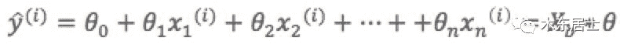
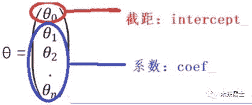

0x00 前言

我们在《特征工程系列：特征筛选的原理与实现（上）》中介绍了特征选择的分类，并详细介绍了过滤式特征筛选的原理与实现。本篇继续介绍**封装式和嵌入式特征筛选的原理与实现**。

## 0x01 特征选择实现方法三：线性模型与正则化

### 1.主要思想

当所有特征在相同尺度上时，最重要的特征应该在模型中具有最高系数，而与输出变量不相关的特征应该具有接近零的系数值。即使使用简单的线性回归模型，当数据不是很嘈杂（或者有大量数据与特征数量相比）并且特征（相对）独立时，这种方法也能很好地工作。

### 2.正则化模型

正则化就是把额外的约束或者惩罚项加到已有模型（损失函数）上，以防止过拟合并提高泛化能力。损失函数由原来的E(X,Y)变为E(X,Y)+alpha||w||，w是模型系数组成的向量（有些地方也叫参数parameter，coefficients），||·||一般是L1或者L2范数，alpha是一个可调的参数，控制着正则化的强度。当用在线性模型上时，L1正则化和L2正则化也称为Lasso和Ridge。

#### 1）L1正则化/Lasso regression

L1正则化将系数w的l1范数作为惩罚项加到损失函数上，由于正则项非零，这就迫使那些弱的特征所对应的系数变成0。因此L1正则化往往会使学到的模型很稀疏（系数w经常为0），这个特性使得L1正则化成为一种很好的特征选择方法。

**Lasso能够挑出一些优质特征，同时让其他特征的系数趋于0。当如需要减少特征数的时候它很有用，但是对于数据理解来说不是很好用。**  

#### 2）L2正则化/Ridge regression

L2正则化将系数向量的L2范数添加到了损失函数中。

*   由于L2惩罚项中系数是二次方的，这使得L2和L1有着诸多差异，最明显的一点就是，L2正则化会让系数的取值变得平均。

*   对于关联特征，这意味着他们能够获得更相近的对应系数。

*   Ridge将回归系数均匀的分摊到各个关联变量上。

**L2正则化对于特征选择来说一种稳定的模型，不像L1正则化那样，系数会因为细微的数据变化而波动。所以L2正则化和L1正则化提供的价值是不同的，L2正则化对于特征理解来说更加有用：表示能力强的特征对应的系数是非零。**

### 3.原理介绍

多元线性回归，具有n个特征值，预测公式如下。



多元线性回归方程演变成求θ。

每个特征都有对应的权重系数coef，特征的权重系数的正负值代表特征与目标值是正相关还是负相关，特征的权重系数的绝对值代表重要性。

sklearn中 中LinearRegression的fit()方法就是通过训练集求出θ，LinearRegression的两个属性intercept*和coef*分别对应θ0和θ1-θn。



### 4.代码实现

#### 1）普通线性模型

```
#获取boston数据boston=datasets.load_boston()x=boston.datay=boston.target#过滤掉异常值x=x[y<50]y=y[y<50]reg=LinearRegression()reg.fit(x,y)#求排序后的coefcoefSort=reg.coef_.argsort()#featureNameSort: 按对标记值的影响，从小到大的各特征值名称#featureCoefSore：按对标记值的影响，从小到大的coef_featureNameSort=boston.feature_names[coefSort]featureCoefSore=reg.coef_[coefSort]print("featureNameSort:", featureNameSort)print("featureCoefSore:", featureCoefSore)# 输出：featureNameSort: ['NOX' 'DIS' 'PTRATIO' 'LSTAT' 'CRIM' 'INDUS' 'AGE' 'TAX' 'B' 'ZN' 'RAD' 'CHAS' 'RM']featureCoefSore: [-1.24268073e+01 -1.21088069e+00 -8.38888137e-01 -3.50952134e-01 -1.05574295e-01 -4.35179251e-02 -2.36116881e-02 -1.37702943e-02 7.93577159e-033.52748549e-02  2.50740082e-01  4.55405227e-01 3.75411229e+00]
```

结果分析：

*   正相关影响系数最大的特征值是”RM”：房间的平均数量，系数值为3.75。

*   负相关影响系数最大的特征值是”NOX”:一氧化氮浓度,系数值为-1.24。

#### 2）L1正则化线性模型

```
#A helper method for pretty-printing linear modelsdef pretty_print_linear(coefs, names = None, sort = False):    if names == None:        names = ["X%s" % x for x in range(len(coefs))]    lst = zip(coefs, names)    if sort:        lst = sorted(lst,  key = lambda x:-np.abs(x[0]))    return " + ".join("%s * %s" % (round(coef, 3), name)                                   for coef, name in lst)from sklearn.linear_model import Lassofrom sklearn.preprocessing import StandardScalerfrom sklearn.datasets import load_bostonboston = load_boston()scaler = StandardScaler()X = scaler.fit_transform(boston["data"])Y = boston["target"]names = boston["feature_names"]lasso = Lasso(alpha=.3)lasso.fit(X, Y)print("Lasso model: {}".format(      pretty_print_linear(lasso.coef_, names, sort = True)))# 输出：Lasso model: -3.707 * LSTAT + 2.992 * RM + -1.757 * PTRATIO+ -1.081 * DIS + -0.7 * NOX + 0.631 * B + 0.54 * CHAS + -0.236 * CRIM+ 0.081 * ZN + -0.0 * INDUS + -0.0 * AGE + 0.0 * RAD + -0.0 * TAX
```

许多特征具有系数0。L1正则化回归的稳定性与非正则化线性模型类似，这意味着当数据中存在相关特征时，系数（以及特征等级）即使在小数据变化时也会发生显着变化。

#### 3）L2正则化线性模型

```
from sklearn.linear_model import Ridgefrom sklearn.metrics import r2_scoresize = 100#We run the method 10 times with different random seedsfor i in range(10):    print("Random seed {}".format(i))    np.random.seed(seed=i)    X_seed = np.random.normal(0, 1, size)    X1 = X_seed + np.random.normal(0, .1, size)    X2 = X_seed + np.random.normal(0, .1, size)    X3 = X_seed + np.random.normal(0, .1, size)    Y = X1 + X2 + X3 + np.random.normal(0, 1, size)    X = np.array([X1, X2, X3]).T    lr = LinearRegression()    lr.fit(X,Y)    print("Linear model: {}".format(pretty_print_linear(lr.coef_)))    ridge = Ridge(alpha=10)    ridge.fit(X,Y)    print("Ridge model: {}".format(pretty_print_linear(ridge.coef_)))# 输出Random seed 0Linear model: 0.728 * X0 + 2.309 * X1 + -0.082 * X2Ridge model: 0.938 * X0 + 1.059 * X1 + 0.877 * X2Random seed 1Linear model: 1.152 * X0 + 2.366 * X1 + -0.599 * X2Ridge model: 0.984 * X0 + 1.068 * X1 + 0.759 * X2Random seed 2Linear model: 0.697 * X0 + 0.322 * X1 + 2.086 * X2Ridge model: 0.972 * X0 + 0.943 * X1 + 1.085 * X2Random seed 3Linear model: 0.287 * X0 + 1.254 * X1 + 1.491 * X2Ridge model: 0.919 * X0 + 1.005 * X1 + 1.033 * X2Random seed 4Linear model: 0.187 * X0 + 0.772 * X1 + 2.189 * X2Ridge model: 0.964 * X0 + 0.982 * X1 + 1.098 * X2Random seed 5Linear model: -1.291 * X0 + 1.591 * X1 + 2.747 * X2Ridge model: 0.758 * X0 + 1.011 * X1 + 1.139 * X2Random seed 6Linear model: 1.199 * X0 + -0.031 * X1 + 1.915 * X2Ridge model: 1.016 * X0 + 0.89 * X1 + 1.091 * X2Random seed 7Linear model: 1.474 * X0 + 1.762 * X1 + -0.151 * X2Ridge model: 1.018 * X0 + 1.039 * X1 + 0.901 * X2Random seed 8Linear model: 0.084 * X0 + 1.88 * X1 + 1.107 * X2Ridge model: 0.907 * X0 + 1.071 * X1 + 1.008 * X2Random seed 9Linear model: 0.714 * X0 + 0.776 * X1 + 1.364 * X2Ridge model: 0.896 * X0 + 0.903 * X1 + 0.98 * X2
```

从示例中可以看出，线性回归的系数变化很大，具体取决于生成的数据。然而，对于L2正则化模型，系数非常稳定并且密切反映数据的生成方式（所有系数接近1）。

## 0x02 特征选择实现方法四：随机森林选择

随机森林具有准确率高、鲁棒性好、易于使用等优点，这使得它成为了目前最流行的机器学习算法之一。随机森林提供了两种特征选择的方法：mean decrease impurity和mean decrease accuracy。

### 1.平均不纯度减少（mean decrease impurity）

#### 1）原理介绍

*   随机森林由多颗CART决策树构成，决策树中的每一个节点都是关于某个特征的条件，为的是将数据集按照不同的响应变量一分为二。

*   CART利用不纯度可以确定节点（最优条件），对于分类问题，通常采用基尼不纯度，对于回归问题，通常采用的是方差或者最小二乘拟合。

*   当训练决策树的时候，可以计算出每个特征减少了多少树的不纯度。对于一个决策树森林来说，可以算出每个特征平均减少了多少不纯度，并把它平均减少的不纯度作为特征选择的标准。

*   随机森林基于不纯度的排序结果非常鲜明，在得分最高的几个特征之后的特征，得分急剧的下降。

#### 2）代码实现

```
from sklearn.datasets import load_bostonfrom sklearn.ensemble import RandomForestRegressorimport numpy as np#Load boston housing dataset as an exampleboston = load_boston()X = boston["data"]Y = boston["target"]names = boston["feature_names"]# 训练随机森林模型，并通过feature_importances_属性获取每个特征的重要性分数。rf = RandomForestRegressor()rf.fit(X, Y)print("Features sorted by their score:")print(sorted(zip(map(lambda x: round(x, 4), rf.feature_importances_), names),             reverse=True))
```

### 2.平均精确度减少（mean decrease accuracy）

#### 1）原理介绍

*   **通过直接度量每个特征对模型精确率的影响来进行特征选择。**

*   主要思路是打乱每个特征的特征值顺序，并且度量顺序变动对模型的精确率的影响。

    *   对于不重要的变量来说，打乱顺序对模型的精确率影响不会太大。

    *   对于重要的变量来说，打乱顺序就会降低模型的精确率。

#### 2）代码实现

```
from sklearn.cross_validation import ShuffleSplitfrom sklearn.metrics import r2_scorefrom collections import defaultdictX = boston["data"]Y = boston["target"]rf = RandomForestRegressor()scores = defaultdict(list)#crossvalidate the scores on a number of different random splits of the datafor train_idx, test_idx in ShuffleSplit(len(X), 100, .3):    X_train, X_test = X[train_idx], X[test_idx]    Y_train, Y_test = Y[train_idx], Y[test_idx]    # 使用修改前的原始特征训练模型，其acc作为后续混洗特征值后的对比标准。r = rf.fit(X_train, Y_train)     acc = r2_score(Y_test, rf.predict(X_test))     # 遍历每一列特征    for i in range(X.shape[1]):        X_t = X_test.copy()        # 对这一列特征进行混洗，交互了一列特征内部的值的顺序        np.random.shuffle(X_t[:, i])        shuff_acc = r2_score(Y_test, rf.predict(X_t))        # 混洗某个特征值后，计算平均精确度减少程度。scores[names[i]].append((acc-shuff_acc)/acc)print("Features sorted by their score:")print(sorted([(round(np.mean(score), 4), feat) for feat, score in scores.items()], reverse=True))
```

## 0x03 特征选择实现方法五：顶层特征选择

顶层特征选择发建立在基于模型的特征选择方法基础之上的，例如线性回归和SVM等，在不同的子集上建立模型，然后汇总最终确定特征得分。

### 1.稳定性选择（Stability selection）

稳定性选择常常是一种既能够有助于理解数据又能够挑出优质特征的这种选择。

#### 1）原理介绍

*   稳定性选择是一种基于二次抽样和选择算法相结合较新的方法，选择算法可以是回归、SVM或其他类似的方法。

*   **它的主要思想是在不同的数据子集和特征子集上运行特征选择算法，不断的重复，最终汇总特征选择结果。比如可以统计某个特征被认为是重要特征的频率（被选为重要特征的次数除以它所在的子集被测试的次数）。**

*   理想情况下，重要特征的得分会接近100%。稍微弱一点的特征得分会是非0的数，而最无用的特征得分将会接近于0。

#### 2）代码实现

```
from sklearn.linear_model import RandomizedLassofrom sklearn.datasets import load_bostonboston = load_boston()#using the Boston housing data.#Data gets scaled automatically by sklearn's implementationX = boston["data"]Y = boston["target"]names = boston["feature_names"]rlasso = RandomizedLasso(alpha=0.025)rlasso.fit(X, Y)print("Features sorted by their score:")print(sorted(zip(map(lambda x: round(x, 4), rlasso.scores_), names),             reverse=True))
```

### 2.递归特征消除（Recursive feature elimination，RFE）

#### 1）原理介绍

*   **递归特征消除的主要思想是反复的构建模型（如SVM或者回归模型）然后选出最好的（或者最差的）的特征（可以根据系数来选），把选出来的特征放到一遍，然后在剩余的特征上重复这个过程，直到所有特征都遍历了。**

*   这个过程中特征被消除的次序就是特征的排序。因此，这是一种寻找最优特征子集的贪心算法。

*   RFE的稳定性很大程度上取决于在迭代的时候底层用哪种模型。

    *   假如RFE采用的普通的回归，没有经过正则化的回归是不稳定的，那么RFE就是不稳定的。

    *   假如RFE采用的是Ridge，而用Ridge正则化的回归是稳定的，那么RFE就是稳定的。

#### 2）代码实现

```
from sklearn.feature_selection import RFEfrom sklearn.linear_model import LinearRegressionboston = load_boston()X = boston["data"]Y = boston["target"]names = boston["feature_names"]#use linear regression as the modellr = LinearRegression()#rank all features, i.e continue the elimination until the last onerfe = RFE(lr, n_features_to_select=1)rfe.fit(X,Y)print("Features sorted by their rank:")print(sorted(zip(map(lambda x: round(x, 4), rfe.ranking_), names)))结果输出Features sorted by their rank:[(1, 'NOX'), (2, 'RM'), (3, 'CHAS'), (4, 'PTRATIO'), (5, 'DIS'),(6, 'LSTAT'), (7, 'RAD'), (8, 'CRIM'), (9, 'INDUS'), (10, 'ZN'),(11, 'TAX'), (12, 'B'), (13, 'AGE')]
```

## 0xFF 总结

1.  单变量特征选择可以用于理解数据、数据的结构、特点，也可以用于排除不相关特征，但是它不能发现冗余特征。

2.  正则化的线性模型可用于特征理解和特征选择。相比起L1正则化，L2正则化的表现更加稳定，L2正则化对于数据的理解来说很合适。由于响应变量和特征之间往往是非线性关系，可以采用basis expansion的方式将特征转换到一个更加合适的空间当中，在此基础上再考虑运用简单的线性模型。

3.  随机森林是一种非常流行的特征选择方法，它易于使用。但它有两个主要问题：

*   重要的特征有可能得分很低（关联特征问题）

*   这种方法对特征变量类别多的特征越有利（偏向问题）

特征选择在很多机器学习和数据挖掘场景中都是非常有用的。在使用的时候要弄清楚自己的目标是什么，然后找到哪种方法适用于自己的任务。

*   当选择最优特征以提升模型性能的时候，可以采用交叉验证的方法来验证某种方法是否比其他方法要好。

*   当用特征选择的方法来理解数据的时候要留心，特征选择模型的稳定性非常重要，稳定性差的模型很容易就会导致错误的结论。

*   对数据进行二次采样然后在子集上运行特征选择算法能够有所帮助，如果在各个子集上的结果是一致的，那就可以说在这个数据集上得出来的结论是可信的，可以用这种特征选择模型的结果来理解数据。

关于训练模型的特征筛选，个人建议的实施流程 :

1.  数据预处理后，先排除取值变化很小的特征。如果机器资源充足，并且希望尽量保留所有信息，可以把阈值设置得比较高，或者只过滤离散型特征只有一个取值的特征。

2.  如果数据量过大，计算资源不足（内存不足以使用所有数据进行训练、计算速度过慢），可以使用单特征选择法排除部分特征。这些被排除的特征并不一定完全被排除不再使用，在后续的特征构造时也可以作为原始特征使用。

3.  如果此时特征量依然非常大，或者是如果特征比较稀疏时，可以使用PCA（主成分分析）和LDA（线性判别）等方法进行特征降维。

4.  经过样本采样和特征预筛选后，训练样本可以用于训练模型。但是可能由于特征数量比较大而导致训练速度慢，或者想进一步筛选有效特征或排除无效特征（或噪音），我们可以使用正则化线性模型选择法、随机森林选择法或者顶层特征选择法进一步进行特征筛选。

**最后，特征筛选是为了理解数据或更好地训练模型，我们应该根据自己的目标来选择适合的方法。为了更好/更容易地训练模型而进行的特征筛选，如果计算资源充足，应尽量避免过度筛选特征，因为特征筛选很容易丢失有用的信息。如果只是为了减少无效特征的影响，为了避免过拟合，可以选择随机森林和XGBoost等集成模型来避免对特征过拟合。**  

#### 参考文献：

*   [1] Feature selection – Part I: univariate selection. http://blog.datadive.net/selecting-good-features-part-i-univariate-selection/  

*   [2] Selecting good features – Part II: linear models and regularization. http://blog.datadive.net/selecting-good-features-part-ii-linear-models-and-regularization/  

*   [3] Feature selection. https://scikit-learn.org/stable/modules/feature_selection.html#univariate-feature-selection  

*   [4] https://gist.github.com/satra/aa3d19a12b74e9ab7941  

*   [5] 结合Scikit-learn介绍几种常用的特征选择方法. https://www.cnblogs.com/hhh5460/p/5186226.html

