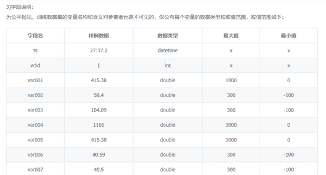

为了帮助更多竞赛选手入门进阶比赛，通过数据竞赛提升理论实践能力和团队协作能力。DataFountain 和 Datawhale 联合邀请了数据挖掘，CV，NLP领域多位竞赛大咖，将从赛题理解、数据探索、数据预处理、特征工程、模型建立与参数调优、模型融合六个方面完整解析数据竞赛知识体系，帮助竞赛选手从0到1入门和进阶竞赛。

下面是大咖分享

???

数据挖掘方向


王贺 ID：鱼遇雨欲语与余

简介：武汉大学硕士，2019年腾讯广告算法大赛冠军选手，京东算法工程师，一年内获得两冠四亚一季的佳绩

不得不说赛题理解是被很多人所忽略的一个问题，作为打比赛的第一个步，我们应该做到熟稔于心。那么怎样才能达到这样的效果呢，这里我们先将赛题理解分为细分为四个部分，分别是**赛题背景**、**赛题数据**、**评价指标**和**业务分析**。下面将对其逐个介绍，帮助走好比赛的第一步。

**赛题背景**

三个问题：

（1）这个赛题是什么业务问题；

（2）具体的业务流程是什么；

（3）最终的目标是什么。

能够回答这三个问题，基本的赛题背景也算是了解了。

举个例子，在2019腾讯广告算法大赛中，三个问题分别是：

（1）本次算法大赛的题目是源于腾讯广告业务中一个面向广告主服务的真实业务产品——广告曝光预估，那么很明显了，广告主服务的真实业务产品中的广告曝光预估；

（2）广告曝光预估的目的是在广告主创建新广告和修改广告设置时，为广告主提供未来的广告曝光效果参考。通过这个预估参考，广告主能避免盲目的优化尝试，有效缩短广告的优化周期，降低试错成本，使广告效果尽快达到广告主的预期范围；

（3）最终目标预测出广告的日曝光量。这些内容都是可以从赛题介绍中所找到的。

**赛题数据**

对于赛题的数据，就需要我们进行基本的探查，作为理解部分不需要太过深入。

（1）每种数据集之间的关系；

（2）数据中缺失值情况；

（3）类别特征和数值特征；这些可以作为我们关注基本点。


**评价指标**

这里主要分为分类指标和回归指标，当然还有很多主办方会自定义评价指标。不同于实际工作中，评价指标需要自己来选取，竞赛中会直接给出评价指标。我们需要做的是熟悉指标的数学性质，以及指标的区别，你是否真的理解logloss和auc的区别，同样是二分类指标，为什么有的比赛选择logloss，而有的选择auc。为什么mse对异常敏感，mae会损失掉部分异常。面对F1指标，有什么好的策略来选择阈值。这些都应该是竞赛第一步中所考虑的问题。

**业务分析**

所有背离业务的分析都是“纸老虎”，业务分析帮助我们理解赛题，同时有助于我们进行特征工程。在我看来业务分析是连接着赛题理解与特征工程的桥梁，起到承上启下的作用。就比如我们在电商平台对一件商品进行下单，需要完成哪些页面跳转，每次跳转对最后下单都会有影响，当然对下单影响最大的就是加入购物车的那次跳转。再举个例子，最近的一场比赛中，我们团队对业务进行了充足的分析，赛题目标是预测用户未来一期的还款情况，那么可以从用户的还款意愿和还款能力来考虑，有哪些因素会影响最终结果。去模拟这样一个过程，可以看作是“角色扮演”，尝试把自己当作一个用户去进行一次交易，站在他人的视角上来寻找关键点，从而帮助理解赛题和提取特征。


作者知乎专栏：

zhuanlan.zhihu.com/DataAI


王茂霖 ID：ML67

简介：华中科技大学研究生，DCIC-2019风电赛Top2选手。

**数据竞赛行军打仗第一步：****赛题理解（摸清敌情）**

作为切入一道赛题的基础，赛题理解是极其重要的，对于赛题的理解甚至会影响后续的特征工程构建以及模型的选择，对了赛题背后的思想以及赛题业务逻辑的清晰，也很有利于花费更少时间构建更为有效的特征模型。所以赛题的理解相当于一种行军打仗中的了解敌情，在不了解敌情的情况下，贸然进攻是不可取的。赛题理解要达到的地步是什么呢，**把一道赛题转化为一种宏观理解的解决思路**。以下将从多方面对于此进行说明。

**1）赛题理解究竟是理解什么：**

理解赛题是不是把一道赛题的背景介绍读一遍就OK了呢？并不是的，理解赛题其实也是从直观上梳理问题，分析问题是否可行的方法，有多少可行度，赛题做的价值大不大，理清一道赛题要从背后的赛题背景引发的赛题任务理解其中的任务逻辑，可能对于赛题有意义的外在数据有哪些，并对于赛题数据有一个初步了解，知道现在和任务的相关数据有哪些，其中数据之间的关联逻辑是什么样的。对于不同的问题，在处理方式上的差异是很大的。

**Example:**

分别对两个问题举例：

1.DCIC-2019风电数据修复题：


在赛题背景以及赛题任务的阅读上我们知道，这是一道数据缺失修复的问题（但是不清楚是离散值修复，还是连续值修复，方法是回归还是分类还是其它什么方法，而这些都是需要从数据里面理解数据去得到的），涉及包括但不限于删去某个时间段的全部数据、某台机组在某段时间的数据、某台机组在某段时间的部分字段信息这三种类型的缺失。但其实到这里来说，问题其实依然是模糊的，比如有多少机组，机组的相对位置信息知道么，机组数据是什么样子的，采样周期是多少，有多少种字段类型特征（是匿名特征还是非匿名特征），其实都还是不清楚的，所以为进一步理解赛题，还需要对于数据有一个初步认识。



在对于数据有一个基础了解上，我们才能对于赛题有着更为深入的理解。知道采样时间段，总样本有多少，缺失有多少，才能对于任务有更为清晰的了解（应该怎样选取模型），也才能更为清晰的了解赛题的大概难度。

2.智能制造预测


这是一道工业数据分析题，从背景描述和问题描述可以发现这是一道工业流程分析题，有反应机台的温度，气体，液体流量，功率，制成时间等因子 这样一些特征因子，并中结合数据观察下，我们知道这是一道可以用回归去解决的问题，可能会存在数据异常要做处理，会有不同的加工流水线，后续这个可能是需要考虑的问题等等。

**2）有了赛题理解后能做什么：**

在对于赛题有了一定的了解后，分析清楚了问题的类型性质和对于数据理解的这一基础上，是不是赛题理解就做完了呢? 并不是的，就像摸清了敌情后，我们**至少就要有一些相应的理解分析，比如这题的难点可能在哪里，关键点可能在哪里，估摸可以用什么方法去解决一些什么问题，哪部分数据应该是关键数据**（背景的业务逻辑下，比如CTR的题，一个寻常顾客大体会有怎么样的购买行为逻辑规律，或者风电那种题，如果机组比较邻近，相关一些风速，转速特征是否会很近似）。这时是在一个宏观的大体下分析的，有助于摸清整个题的思路脉络，以及后续的分析方向。

**3）赛题理解的-评价指标：**

为什么要把这部分单独拿出来呢，因为这部分会涉及后续模型预测中两个很重要的问题：

1. **本地模型的验证方式**，很多情况下，线上验证是有一定的时间和次数限制的，所以在比赛中构建一个合理的本地的验证集和验证的评价指标是很关键的步骤，能有效的节省很多时间。

2\. **不同的指标对于同样的预测结果是具有误差敏感的差异性的**，比如AUC，logloss, MAE，RSME，或者一些特定的评价函数。是会有很大可能会影响后续一些预测的侧重点。

**4）赛题背景中可能潜在隐藏的条件：**

其实赛题中有些说明是很有利益-都可以在后续答辩中以及问题思考中所体现出来的，比如高效性要求，比如对于数据异常的识别处理，比如工序流程的差异性，有些的意识是可以贯穿问题思考，特征，模型以及后续处理的，也有些会对于特征构建或者选择模型上有很大益处，反过来如果在模型预测效果不好，其实有时也要反过来思考，是不是赛题背景有没有哪方面理解不清晰或者什么其中的问题没考虑到。


谢嘉元 ID：谢嘉嘉

简介：华南理工大学博士，多次数据挖掘竞赛中获得优异成绩。

大家好，我叫谢嘉嘉，目前是一名准博士研究生，在我的研究生拿过一些数据挖掘的竞赛top。同时，我也是“kaggle竞赛宝典”的作者之一。PS：由于我最近打比赛少了，可能方法会有过时或不对的地方，欢迎大家来讨论。

**时间序列问题**

时间序列（或称动态数列）是指将同一统计指标的数值按其发生的时间先后顺序排列而成的数列。时间序列分析的主要目的是根据已有的历史数据对未来进行预测。根据观察时间窗口的不同，时间序列中的时间可以是年份、月份、天或其他任何时间形式。过去比赛中有很多该类型的问题，根据统计指标的数值类型的不同，包括了车流量预测，地铁人流量预测，商铺商品销售量预测等等。

在理想情况下，同一周期（年份、月份、天）内统计指标的数值应该都是平稳、相近的。但在现实生活中我们统计指标的数值的观测值往往都是呈现出不平稳的状态。这是因为实际业务场景中，统计指标的数值会受到很多的外部影响因素的作用，最终导致了数据的不平稳，如下图所示。


以将影响因素（曜日，节假日等）构建成数值特征，进而将其变成传统的机器学习方法，利用机器学习的算法对问题进行预测。或者，我们也可以利用“规则”的方法进行解决，我们可以将原始数据剔除影响因素，剔除后的数据是趋于平稳的，我们可以对平稳数据的预测做的很好。简单的流程如下所示：


如果大家对这个方法有兴趣的话，大家可以移步到阿里天池直播间，我之前录制过一期，如何用规则解决时间序列问题：

https://tianchi.aliyun.com/course/video?spm=5176.12282076.0..727a2042c2WwTo&liveId=5596的课程。最后，时间序列问题有一个小tip，预测的时间段往往会包括很奇怪的数值（如之前做肉鸡销售预测问题包括了禽流感的时期），因此，我们做问题的时间可以去看看那段时间的新闻，多读书多看报。

**分类问题**

之前我做过的分类问题包括了购买预测，公司是否会逾期等等。每个问题都在我看来都可以抽取成三个部分“人”，“物”，“人和物的交互”。那么，我们就可以多从这三个方面来进行特征提取。

最后，按照惯例宣传一波我们的公众号“kaggle竞赛宝典”啦啦啦～里面有你想要的关于竞赛的很多内容哦～


钟昌盛 ID：真我小兔子乖乖

简介：Kaggle: Elo Merchant Category Recommendation亚军、2019-kddcup top10、2018ccf电信套餐个性化匹配模型亚军。

从赛题理解到竞赛入门基础。对于我来说，如果我是接触了一个新的赛题，那么我可能从我接触开始都还是那个赛题的入门阶段。《倚天屠龙记》里面各大武林高手修习的武功各有千秋，每个人都有自己的心法，但谁能举起那把屠龙刀和倚天剑就要看是否能达到那把刀的内功了。同样，算法一样，我们每天都在键盘上修习自己的代码能力和算法能力，到了真正竞赛的时候，就看自己是否有拿上那把屠龙刀的时候。正所谓各有千秋，每个人所擅长的方向都各有不同，而我们能做的，**一是发挥自己的所长，二，学习别人的长处**，争取不断学习在这次竞赛或者下次竞赛中，打败他。

每个人都有每个人的想法，所以每个人参赛的理由也不一样，可能有的人是论文看烦了，想做做比赛看看效果；有的人希望通过竞赛中找到好成绩，找到自己心仪的工作。不管如何，在我们对算法解决企业难题的重视的情况下，各大平台各大企业纷纷推出了自己的企业亟待解决的难题，甚至在参赛者们给予优秀的方案以后抛出了橄榄枝。

可是，在数据挖掘竞赛中，lgb横行的当代，我们是否怀念和亲密接触过原来的一些基础的集成包呢？

基于原有的基础，kaggle出了一题与众不同，甚至可以说回归原始的赛题https://www.kaggle.com/c/instant-gratification，这一题刚好可以分析数据竞赛的流程和步骤。

这题并没有像其他 featured comppetition 一样给出大量多种类别特征和其他业务特征等等。而是每一列都是高斯分布生成。这让我们不得不重新审视我们手上现有的屠龙刀 Lgb 等和倚天剑深度学习等，这些宝刀是有大炮打小鸟的功效呢？还是你的高级武器不能遇到枪的缺点。于是，人们开始提刀开始看向遇到的难题https://www.kaggle.com/abhishek/neural-network-with-embedding-layer，可是效果并没有预期的效果，是倚天剑不好用吗？那么试试屠龙刀吧，https://www.kaggle.com/gouzmi/512-lgb。好像也不尽人意。

那，到底是什么问题呢？这让大家不得不重新回去审视这题的出发点：

1. 从 sklearn.make_classification 发现了蛛丝马迹，所以大家开始研习原有的东西；

2\. 并知道了这个函数会生成n_features，这其中不仅包括多信息特征的个数，甚至还随机加了 n_redundant 以及一些 n_repeated；

3\. 我们还知道 n_clusters_per_class 这个参数还会对生成的数据有几个 cluster；

4\. 正因为生成的数据在此，我们会重新审视决策树模型对于这一类数据的欠拟合性以及真正适用的二分类算法；

5\. 基于此，参数者们在 sklearn 上寻找适合这类问题的方法。从中就发现 

Linear Discriminant Analysis 和 QuadraticDiscriminant Analysis 这类方法对于解决这类问题的优越性。

在不断的学习过程中，我们知道了每一种分类算法的区别。


在我们不断探索的过程中，我们知道数据中有512中不同分布的类别。并需要将不同模型生成不同模型。 

```
for k in range(512):	
# ONLY TRAIN WITH DATA WHERE WHEEZY EQUALS I	
    train2 = train[train['wheezy-copper-turtle-magic']==k] 	
    train2p = train2.copy(); idx1 = train2.index 	
    test2 = test[test['wheezy-copper-turtle-magic']==k
```

不仅需要剔除原有的脏数据，还需要将方差大于某些阈值的列剔除。

```
sel = VarianceThreshold(threshold=1.5).fit(train2p[cols])	
train3p= sel.transform(train2p[cols])	
train3= sel.transform(train2[cols])	
test3= sel.transform(test2[cols])
```

不同的数据模型预测出数据以后，我们还要通过观察预测出的test的数据，观察预测数据可以知道预测结果的分布，可以通过这样分布判断最终评测函数是否有效。

```
sub= pd.read_csv('../input/sample_submission.csv')	
sub['target']= preds	
sub.to_csv('submission.csv',index=False)	
importmatplotlib.pyplot as plt	
plt.hist(preds,bins=100)	
plt.title('FinalTest.csv predictions')	
plt.show()
```


所以说，传统机器学习数据竞赛流程基本情况是：

**接触赛题-类别特征，数值特征-查看分布-筛选异常值-特征工程-有用的模型oof-特征选择-模型再次训练oof-预测test**

最后，引用IG这题Kaggle出的一首诗，希望大家共勉，希望从诗中找到你的赛题理解：

Silly column names abound,

but the test set is a mystery.

Careful how you pick and slice,

or be left behind by history.

短暂的分享完了，希望这样经验对大家需要有所帮助。

CV方向


徐光福 ID：天灵灵地灵灵

简介：多次目标检测比赛第一、2018之江杯VQA比赛第二。

一个没有参加过任何大数据竞赛的新人，不知道什么原因，或许是偶然看到就参加了，或许是为了证明自己，或许只是因为看到了奖金（￥—￥），以一往无前、不知道什么是炮灰的精神第一次参加了一个比赛，他（她）除了满腔的热情，或许对自己将要面临的问题一无所知，那么先说说他将要面临的第一个问题——**赛题理解**。

首先，一般来说赛题主要分为几个大类：挖掘类、计算机视觉类、自然语言处理类、前面几类互相结合的类别。

每个大类需要的知识基础和努力的方向是不同的，我目前参加的比赛多是计算机视觉类的，因此主要以计算机视觉方面的竞赛来举例。

计算机视觉方面的比赛再向下分的话主要有几类：

*   分类、目标检测、分割、其它（包括但不限于图像生成、降噪等等）

*   其中分类又分为普通图像分类、多标签分类、零样本或少样本、细粒度分类等等

*   目标检测又分为2D目标检测、3D目标检测、视频目标检测等等

*   分割又分为语义分割、实例分割、全景分割，之间又有2D和3D的区别等等

*   说了这么多废话，好像说的也未必准确和全面，目的是什么呢？

**目的只有一个，首先你要确定你参加的这个比赛属于哪一个大类、哪一个细类**，这样你才能进行下一步的动作。

以基于虚拟仿真环境下的自动驾驶交通标志识别

https://www.datafountain.cn/competitions/339，这个比赛为例，这是一个比较典型的2D目标检测任务，分类确定了，你大致的努力方向也就确定了。

第二，比赛的分类确定了，接下来要做的是什么，当然是上网查资料，**根据比赛的分类确定大概的算法和模型了**，还是以交通标志是被为例，既然是一个典型的目标检测比赛，首先对目标检测的发展历史和目前大致的情况应该有一些了解。

完成了这一步之后，你应该知道了一堆的名词和方法：单阶段检测方法、双阶段检测方法、SSD、retinanet、yolo、CenterNet、fast rcnn、fasterrcnn、cascade rcnn、dcn……单阶段的检测方法速度快、双阶段的检测方法精度高……

有了这些基础的知识，你知道了以faster rcnn为基础的双阶段检测方法和它的各种改进版本似乎很适合这个比赛，但具体哪种算法和模型更好呢？你需要查找和了解当前属于这个分类的**SOTA（state-of-the-art）**，然后你知道了SNIPER、HTC、Trident net等等。

但还是对这个比赛怎么下手有些迷茫，难道要手撸这些算法吗？似乎是个不可能完成的任务，这个时候是**github**（https://github.com全球最大的同性交友网站）出场挽救你的时候了。通过github，你发现了detectron、mmdetection、simpledet等目标检测框架。竟然还有这种逆天的存在，你顿时有一种葵花在手，天下我有的感觉，似乎奖金在向你招手，匆匆忙忙把程序调通、训练、测试提交，成绩出来了——进入了前100名，但离前排的目标似乎还很遥远，你顿时懵了，一定是哪里出了问题。

再次回到本文的主题——**赛题理解**，你再次详细读了一遍赛题说明及评分标准，发现一行小字“根据用户检测结果和目标框之间重叠比率大于0.90，视为合格候选”，嗯，还好不是欲练神功，必先xx，只是IOU需要大约0.9才算检测正确，omg，这个指标使这个比赛和其它目标检测比赛的努力方向完全不同了，目标的分类基本不用担心，因为标志类别相对来说比较明显，基本不会分错，所以检测框的回归精度成了提分的关键，以0.9的IOU，检测框的坐标和大小相差零点几就已经是对与错的差别了。

目标是提高检测框的回归精度，你不停的查找相关的资料和论文，发现大家常用的cascade rcnn似乎是专门为这个目标设计的，于是你尝试了cascade rcnn，果然分数有了明显的提升，然后你再次读了一遍cascade rcnn的论文，发现4层cascade比标准的三层对于检测框的回归帮助更大，于是你实验了4层的cascade rcnn，分数又有了一定的提升。

**找到本赛题和其它赛题的不同点，也就是比赛自身的特点，非常关键。**

总结一下，计算机视觉方面的竞赛，在赛题理解方面主要有以下三个方面：

*   **确定你参加的这个比赛属于哪一个类别包括大类、细类；**

*   **根据比赛的分类确定大概的算法和模型，了解当前分类的SOTA；**

*   **找到本赛题和其它赛题的不同点，也就是比赛自身的特点，非常关键。**


王博 ID：000wangbo

简介：西安电子科技大学研究生，一个不断在CV道路上探索的小白

大家好，很开心能够受邀作为嘉宾参加这次的活动。

首先，对于一个赛题，想要搞到前排，那么你的算法和思路需要是正确的，而这个前提必须是你对赛题的理解是透彻的。通过对赛题的理解，你可以很快确定这个题目是机器学习、深度学习、自然语言处理中的哪一类。对我个人来讲，我就会过滤掉自然语言处理类的比赛，选择自己擅长的领域。

让时间转回两年前，我的第一个参加的比赛—— [飞粤云端2017]广东政务数据创新大赛—智能算法赛，我们从零单排。作为一个萌新，我当时根本就不懂得什么机器学习、深度学习，只有满腔热血。

回归到这个赛题，这个赛题的任务就是使用2015年和2017年广东省某地的卫星图片，识别出两年之间新增的人工地上建筑物（不包括道路）所占的像元图斑，评估指标是F1 score。


可想而知，作为一个萌新，这样的任务是无从下手的。不过万幸当时天池的比赛已经有了钉钉群，通过钉钉群我了解到这样的任务是计算机视觉的分割任务，于是我开始疯狂阅读各类有关分割任务的paper以及深度学习的书籍。即便如此，当时的我还是撸不出来分割的代码，简直气哭。直到我了解到github这个利器，通过github我找到了U-net、FCN的代码，并且能够通过训练预测得到我的答案，最终也是拿到了50多名的成绩。

那么我要开始diss下自己了，当时的我其实对赛题并没有太过深入了解，直接将在2015和2017年遥感图像相同位置的图片crop出来，然后将差值图片当作输入。这样的做法会丢失掉特别多的信息，正确的做法是将2015年和2017年数据合并为8通道，再经过输入到神经网络进行训练。通过赛题理解以及数据分析，我们还能够发现很多小的trick，比如下图，如果能够设定阈值，去掉阈值较小的连通集和空洞，分数也会得到提升。


总之，赛题理解分析是比赛很重要的一部分，赛题的错误理解很有可能导致你离真相越来越远。希望大家能在每一场比赛中不断成长，最终拿到属于自己的Top！

NLP方向


张浩 ID：reborn_ZH

简介：CCF2018供应链需求预测亚军、2019搜狐内容识别算法大赛季军。

大家好，很高兴成为特邀嘉宾，这次我主要说一下我对nlp赛题的一些理解，如果说的有什么不对的地方，欢迎大家一起来讨论。

现如今，深度学习方法成了解决nlp任务的首选方案，比如textCNN、LSTM、GRU、BiLSTM、Attention、BERT等等。当然，有的nlp任务也可以用机器学习方法去解决，至于哪种任务用哪种方法，需要我们**根据实际情况去选择**。就目前我接触到的nlp赛题任务有，文本分类、情感分析、关系抽取、文本匹配、阅读理解、问答系统等等，比如针对文本二分类任务，我们可以把CNN、LSTM、Attention进行各种排列组合来搭建网络，也可以用BERT直接预测，或者使用机器学习方法，训练出TF-IDF，然后使用lr去预测，甚至还可以使用一些骚操作，在搭建好的深度学习网络上，加入各种文本特征，构成一个多输入的网络结构。因此，**解决一个nlp的任务可能有多种方案，但是哪一个方案更合适需要我们不断地去分析尝试**。

当我们拿到一个nlp赛题任务时，首先我们需要对赛题任务和给出的数据进行细致地分析，**了解赛题任务具体是干什么的，并且要深入地分析理解数据，知道数据的含义**，这样可以有助于我们制定解决方案，同时也有利于我们进行数据预处理，比如我们分析知道数据中包含很多链接、#...#标签和@人名这些信息，那么我们就该去考虑这些信息对于我们解决该任务是否有用，如果没用是否该删除这些信息，又比如我们分析知道一条样本中的主要信息在前100个词中，那么我们进行pad_sequences操作时，是否该考虑使截断补齐后的文本长度为100等等，这些都需要我们对数据进行深入地分析后才能知道。然后我们需要去预处理数据，我个人认为这一步和前面的数据分析关系很强，**很多预处理操作都是基于对数据的分析而来**，一般我们对文本预处理包含分词、去除停用词、训练词向量、文本序列化等等，当然，对于有的任务还包含同义词替换、训练词权重等等。再接着就是搭建模型，具体使用什么模型得根据具体任务来定。最后就是优化模型，常用的操作有调参、更改网络结构、针对评价指标优化等等。

最后推荐几个和nlp有关的学习链接：

https://github.com/crownpku/Awesome-Chinese-NLP?tdsourcetag=s_pcqq_aiomsg

https://github.com/FNo0/Algorithm_Interview_Notes-Chinese/tree/master/B-自然语言处理

