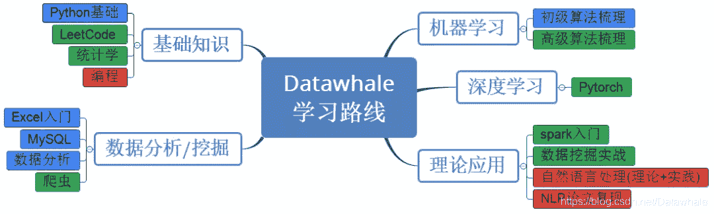

# 第8期Datawhale组队学习计划马上就要开始啦

这次共组织15个组队学习，涵盖了AI领域从理论知识到动手实践的内容

按照下面给出的最完备学习路线分类，难度系数分为低、中、高三档，可以按照需要参加

**Table of Contents**

[学习路线](#%E5%AD%A6%E4%B9%A0%E8%B7%AF%E7%BA%BF)

[基础知识](#%E5%9F%BA%E7%A1%80%E7%9F%A5%E8%AF%86)

[1\. Python基础](#1.%20Python%E5%9F%BA%E7%A1%80)

[2\. LeetCode](#2.%20LeetCode)

[3\. 统计学](#3.%20%E7%BB%9F%E8%AE%A1%E5%AD%A6)

[4\. 编程](#4.%20%E7%BC%96%E7%A8%8B)

[数据分析/挖掘](#%E6%95%B0%E6%8D%AE%E5%88%86%E6%9E%90%2F%E6%8C%96%E6%8E%98)

[1\. Excel入门](#1.%20Excel%E5%85%A5%E9%97%A8)

[2.MySQL](#2.MySQL)

[3.数据分析](#3.%E6%95%B0%E6%8D%AE%E5%88%86%E6%9E%90)

[4.爬虫](#4.%E7%88%AC%E8%99%AB)

[机器学习](#%E6%9C%BA%E5%99%A8%E5%AD%A6%E4%B9%A0)

[1\. 初级算法梳理](#1.%20%E5%88%9D%E7%BA%A7%E7%AE%97%E6%B3%95%E6%A2%B3%E7%90%86)

[2.高级算法梳理](#2.%E9%AB%98%E7%BA%A7%E7%AE%97%E6%B3%95%E6%A2%B3%E7%90%86)

[深度学习](#%E6%B7%B1%E5%BA%A6%E5%AD%A6%E4%B9%A0)

[1\. PyTorch](#1.%20PyTorch)

[理论应用](#%E7%90%86%E8%AE%BA%E5%BA%94%E7%94%A8)

[1\. spark入门](#1.%20spark%E5%85%A5%E9%97%A8)

[2\. 数据挖掘实战](#2.%20%E6%95%B0%E6%8D%AE%E6%8C%96%E6%8E%98%E5%AE%9E%E6%88%98)

[3\. 自然语言处理基础(理论+实践)](#3.%20%E8%87%AA%E7%84%B6%E8%AF%AD%E8%A8%80%E5%A4%84%E7%90%86%E5%9F%BA%E7%A1%80%28%E7%90%86%E8%AE%BA%2B%E5%AE%9E%E8%B7%B5%29)

[4\. 自然语言处理进阶(理论+实践)](#4.%20%E8%87%AA%E7%84%B6%E8%AF%AD%E8%A8%80%E5%A4%84%E7%90%86%E8%BF%9B%E9%98%B6%28%E7%90%86%E8%AE%BA%2B%E5%AE%9E%E8%B7%B5%29)

[5\. NLP论文复现](#5.%20NLP%E8%AE%BA%E6%96%87%E5%A4%8D%E7%8E%B0)

* * *

## 学习路线

## 基础知识

### 1\. Python基础

**1.1 课程简介：**

*   **课程设计：**马晶敏，叶梁
*   **组队学习说明：**学习python基础知识，针对python小白的学习之路
*   **任务路线：**基础知识-函数-第三方模块-类和对象-基础爬虫
*   **组队学习周期：**10天
*   **定位人群：**python小白
*   **难度系数低**
*   **每个任务完成大概所需时间：**2~4h/天，根据个人学习接受能力强弱有所浮动

**1.2 任务安排：**

*   Task1：环境搭建 + python初体验 + python基础讲解 + python数值基本知识 (2天)
*   Task2：列表 + 元组 + string字符串 + 字符串格式化问题 (2天)
*   Task3：数组 + 集合 + 判断语句 + 三目表达式 + 循环语句 (2天)
*   Task4：数组 + 集合 + 判断语句 + 三目表达式 + 循环语句 (2天)
*   Task5：函数 + file + os模块 + datetime模块 (2天)

### 2\. LeetCode

**2.1 课程简介**

*   **课程设计：**老表、于鸿飞、杨皓博
*   **组队学习说明：**Leetcode刷题组队学习，从零开始每天一道算法题，在良好的学习氛围下，培养刷题习惯，学习算法思想。(不限制编程语言)
*   **任务路线：**腾讯精选练习（50 题）顺序每天一道题。
*   **地址链接:** https://leetcode-cn.com/problemset/50/
*   **组队学习周期：**50天(50题全部完成即结束)
*   **定位人群：**适合有一门语言基础的同学
*   **难度系数中**
*   **每个任务完成大概所需时间：**2~3h/天

**2.2 任务安排：**

*   选取腾讯精选练习（50 题）解答

### 3\. 统计学

**3.1 课程简介**

*   **课程设计：**王佳鑫、许辉
*   **组队学习说明：**学习内容涵盖统计学中所有的主要知识，并对其分部分进行梳理总结。
*   **任务路线：**根据所学习内容进行：1.统计学基本知识、二项及泊松分布、大数定律、正态分布等内容的总结进行整体的回顾、梳理与完善；2\. 中心极限定理、置信区间、 假设检验等内容的总结进行整体的回顾、梳理与完善。

*   **组队学习周期：**7天
*   **定位人群：**微积分、基本概率知识储备
*   **难度系数中**
*   **每个任务完成大概所需时间：**2-3h/天

**3.2 学习内容：**

*   本次统计学学习以网易云可汗学院公开课为主：视频链接：http://open.163.com/special/Khan/khstatistics.html
*   并以《深入浅出统计学》为辅：书籍链接：https://pan.baidu.com/s/1dCV6rrOWZU-deKxAoectGA

**3.3 任务安排：**

*   Task1：统计学基本知识 + 二项及泊松分布 + 大数定律 + 正态分布 (2天)
*   Task2：中心极限定理 + 置信区间 (1天)
*   Task3：假设检验 (2天)
*   Task4：线性回归 + 卡方分布 + 方差分析 (2天)

### 4\. 编程

**4.1课程简介**

*   **课程设计：**光城 、LeoLRH
*   **组队学习说明：**利用自己所熟知的编程语言，具有一定基础，讨论在面试中可能出现的数据结构问题，一起学习重温经典数据结构
*   **任务路线：**数组->链表->栈->队列->递归->排序->二分查找->哈希表->字符串->二叉树->堆->图->回溯->分治->动态规划
*   **组队学习周期：**15天甚至往上大概16天左右（周末进行整体整理讨论）（每天任务时间具体看任务情况）
*   **定位人群：**有一门语言基础和算法基础的同学
*   **难度系数高**，小白慎入！！！
*   **每个任务完成大概所需时间：**平均每天学习时间在1个小时左右，晚上统一，半个小时进行集体讨论总结打卡。

**4.2任务安排：**

*   Task1：数组 + 链表 (2天)
*   Task2：栈 + 队列 + 递归 (3天)
*   Task3：排序 + 二分查找 (2天)
*   Task4：散列表(哈希表) + 字符串 (2天)
*   Task5：二叉树 + 堆 (2天)
*   Task6：图 (2天)
*   Task7：递归 + 回溯 + 分治 + 动态规划 (2天)

## 数据分析/挖掘

### 1\. Excel入门

**1.1 课程简介**

*   **课程设计：**杨煜，李严
*   **组队学习说明：**职场人士必备学习内容。通过集中式学习和大量实战练习，快速了解并掌握Excel核心功能，保证今后工作中用得到。
*   **任务路线：**基础界面 → 基础文件操作 & 单元格操作 → 基础函数 → 查找函数vlookup和 match/index → 基础图表 → 数据透视表
*   **组队学习周期：**12天
*   **定位人群：**小白，或有一点基础但不熟练的人群；初入职场人群必学；
*   **难度系数低**
*   **每个任务完成大概所需时间：** 2-3h/每天

**1.2 任务安排：**

*   Task1：基础界面 + 文件操作 + 基础单元格操作 (3天)
*   Task2：单元格引用 + 运算符 + 文本函数 + 逻辑函数 + 计算函数 (2天)
*   Task3：vlookup函数用法 + match&index + 双条件查找 (2天)
*   Task4：图表类型+图表类型选择指南 + 图表的构成要素 (3天)
*   Task5：数据透视表 + 实现数据分段统计 + 变更值汇总依据 + 设置三种值百分比 + 计算字段 & 计算项 (2天)

### 2.MySQL

**2.1 课程简介**

*   **课程设计：**杨皓博 孙涛 杨煜
*   **组队学习说明：**一周内快速了解并掌握MySQL的主要内容。通过大量SQL语句的实战练习，可以在简历上写熟练掌握MySQL。(注意：本课程只关注SQL查询语句本身，对数据库的涉及较少。)
*   **任务路线：**MySQL软件安装及数据库基础 → 查询语句 → 表操作 → 表联结 → MySQL 实战 → MySQL实战 - 复杂项目
*   **组队学习周期：**8天
*   **定位人群**：小白
*   **难度系数低**
*   **每个任务完成大概所需时间**：2-3h

**2.2 任务安排：**

*   Task1：软件安装及数据库基础 + 查询语句 (3天)
*   Task2：表操作 (3天)
*   Task3：MySQL 实战 (1天)
*   Task4：MySQL 实战 - 复杂项目 (1天)

### 3.数据分析

**3.1 课程简介**

*   **课程设计：**金娟娟
*   **组队学习说明：**以《python for data analysis》为辅，学习重要的python库
*   **任务路线：**重要的python库（numpy/pandas/matplotlib/seaborn等) → 数据清洗和分析
*   **组队学习周期：**22天
*   **定位人群：**有一点python基础，但不太会python库的数据分析小白；
*   **难度系数中**
*   **每个任务完成大概所需时间：**2~4h/天，根据个人学习接受能力强弱有所浮动

**3.2 任务安排：**

*   预备任务：github + jupyter (1天)
*   Task1：第4章numpy + 作业1 (2天)
*   Task2：第5章pandas (2天)
*   Task3：第6章数据载入 (2天)
*   Task4：第7章数据清洗 (2天)
*   Task5：第8章数据联合 (2天)
*   Task6：第10章数据聚合 (2天)
*   Task7：第12章高阶pandas + 作业2 (2天)
*   Task8：第9章matplotlib + 作业3 (2天)
*   Task9：第11章时间序列 (2天)
*   Task10：大作业+总结 (3天)

### 4.爬虫

**4.1 课程简介**

*   **课程设计：**光城、李方
*   **组队学习说明：**从零基础到能独立完成一个简易的爬虫项目
*   **任务路线：**请求→re→beautifulsoup→lxml→selenium→IP问题→实战小项目
*   **组队学习周期：**8天
*   **定位人群：**有Python基础。
*   **难度系数中**
*   每个任务完成大概所需时间：2-3h/天

**4.2 任务安排：**

*   Task1：get与post请求 + 正则表达式 (2天)
*   Task2：beautifulsoup + xpath (2天)
*   Task3：selenium + IP (2天)
*   Task4：实战大项目 (2天)

## 机器学习

### 1\. 初级算法梳理

**1.1 课程简介**

*   **课程设计：**苏静、康兵兵
*   **组队学习说明：**通过查阅书籍或参考文献、学习视频等，对传统机器学习算法进行梳理
*   **任务路线：**线性回归--->逻辑回归--->决策树
*   **组队学习周期：**6天
*   **定位人群：**有概率论、矩阵运算、求导、泰勒展开等基础数学知识；
*   **难度系数低**
*   **每个任务完成大概所需时间：**2~3h/天

**1.2 任务安排：**

*   Task1：线性回归算法梳理 (2天)
*   Task2：逻辑回归算法梳理 (2天)
*   Task3：决策树算法梳理 (2天)

### 2.高级算法梳理

**2.1 课程简介**

*   **课程设计：**黑桃，刘广月，于鸿飞
*   **组队学习说明：**通过查阅相关文献，对机器学习算法进行梳理
*   **任务路线：**RF--->GBDT--->XGB
*   **组队学习周期：**7天
*   **定位人群：**有概率论、矩阵运算、求导、泰勒展开等基础数学知识；
*   **难度系数中** 
*   **每个任务完成大概所需时间：**2~3h/天

**2.2 任务安排：**

*   Task1：随机森林算法梳理 (2天)
*   Task2：GBDT算法梳理 (2天)
*   Task3：XGB算法梳理 (3天)
*   Task4：LightGBM算法梳理 (3天)

## 深度学习

### 1\. PyTorch

**1.1 课程简介**

*   **课程设计：**许辉 李奇锋
*   **组队学习说明：**通过学习pytorch的基本操作，最终完成手写数字的识别
*   **任务路线：**安装pytorch->设立图并计算->实现逻辑回归->构建多层神经网络->PyTorch实现L1，L2正则化以及Dropout->书写优化器代码->用PyTorch完成手写数字识别
*   **学习周期**：7天
*   **定位人群：**熟悉python的基础用法
*   **难度系数中**
*   **任务完成所需时间：**2-3h/天

**1.2 任务安排：**

*   Task1：PyTorch的基本概念 (2天)
*   Task2：设立计算图并自动计算 (2天)
*   Task3：PyTorch实现Logistic regression (2天)
*   Task4：PyTorch实现多层网络 (2天)
*   Task5：PyTorch实现L1，L2正则化以及Dropout (2天)
*   Task6：PyTorch理解更多神经网络优化方法 (2天)
*   Task7：手写数字识别 (2天)

## 理论应用

### 1\. spark入门

**1.1 课程简介**

*   **课程设计：**Summer
*   **组队学习说明：**学习spark基础知识，针对spark小白的学习之路
*   **任务路线：**运行原理-环境搭建-RDD编程-SparkSQL-MLlib-常用算法
*   **组队学习周期：**12天
*   **定位人群：**spark小白
*   **难度系数中**
*   **每个任务完成大概所需时间：**2~4h/天，根据个人学习接受能力强弱有所浮动

**1.2 任务安排：**

*   Task1：运行原理，RDD设计，DAG，安装与使用 (3天)
*   Task2：RDD编程，熟悉算子，读写文件 (3天)
*   Task3：DataFrame,SparkSQL (2天)
*   Task4：MLlib流设计，特征工程 (2天)
*   Task5：逻辑回归，决策树 (2天)

### 2\. 数据挖掘实战

**2.1 课程简介**

*   **课程设计：**范晶晶、李碧涵、
*   **组队学习说明：**应用机器学习算法，完整地走完一个数据挖掘项目流程
*   **任务路线：**数据分析→特征工程→模型构建→模型评估→模型调优→模型融合
*   **组队学习周期：**12天
*   **定位人群：**有Python基础，sklearn基础。
*   **难度系数中**
*   **每个任务完成大概所需时间：**2-3h/天

**2.2 任务安排：**

*   Task1：数据分析 (2天)
*   Task2：特征工程 (2天)
*   Task3：模型构建 (2天)
*   Task4：模型评估 (2天)
*   Task5：模型调优 (2天)
*   Task6：模型融合 (2天)

### 3\. 自然语言处理基础(理论+实践)

**3.1 课程简介**

*   **课程设计：**jepson
*   **组队学习说明：**学习自然语言处理理论，并且通过对某些数据集的文本分类任务不断优化来进行实践。
*   **任务路线：**特征提取 → 特征选择 → 文本表示 → 传统机器学习算法跑模型 → LDA生成新特征 → 深度学习算法跑模型
*   **定位人群：**有Python基础，基本框架的基础（例如TensorFlow、Keras和pyTorch等）！
*   **难度系数高**
*   **组队学习周期：**20天
*   **每个任务完成大概所需时间：**3~4h/天

**3.2 任务安排：**

*   预备任务：tensorflow安装+tensrflow基础+NLP
*   Task1：数据集探索 (2天)
*   Task2：特征提取 (2天)
*   Task3：特征选择 (2天)
*   Task4：传统机器学习+讨论(2天)

### 4\. 自然语言处理进阶(理论+实践)

**4.1 课程简介**

*   **课程设计****：**jepson
*   **组队学习说明****：**学习自然语言处理理论，并且通过对某些数据集的文本分类任务不断优化来进行实践。
*   **任务路线****：**word2vec算法跑模型 → 卷积神经网络算法跑模型 → 循环神经网络算法跑模型 → 注意力机制算法跑模型→  Bert
*   定位人群：学完自然语言处理入门组队学习的同学或有自然语言处理基础的巨佬！
*   **难度系数高**
*   **组队学习周期：**14天
*   每个任务完成大概所需时间：3~4h/天

**4.2 任务安排：**

*   Task1：数据集探索 (2天)
*   Task2：神经网络基础 (2天)
*   Task3：简单神经网络+讨论 (2天)
*   Task4：卷积神经网络 (2天)
*   Task5：循环神经网络 (2天)
*   Task6：Attention原理+讨论 (2天)
*   Task7：Bert+讨论 (2天)

### 5\. NLP论文复现

**5.1 课程简介**

*   **课程设计：**杨开漠，王翔
*   **任务路线：**论文学习 → 研读模型 → 跑模型 → 针对学习中存在的问题进行后期讨论
*   **定位人群：**具有nlp基础、代码阅读能力以及论文学习能力；
*   **难度系数高**
*   **组队学习周期：**14天（1篇/周）
*   **每个任务完成大概所需时间：**3~4h/天

**5.2 任务安排：**

*   Task1：论文1发布 + 论文研读笔记作业 (4天)
*   Task2：模型调试心得作业 + 后期讨论 (3天)
*   Task3：论文2发布 + 论文研读笔记作业 (4天)
*   Task4：模型调试心得作业 (3天)

