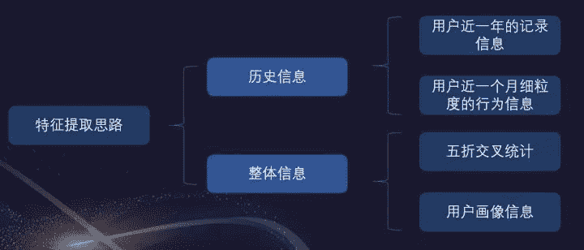

作者：王贺 ID：鱼遇雨欲语与余

简介：武汉大学硕士，2019年腾讯广告算法大赛冠军选手，京东算法工程师，一年内获得两冠四亚一季的佳绩。

## 赛题背景

资金流动性管理迄今仍是金融领域的经典问题。在互联网金融信贷业务中，单个资产标的金额小且复杂多样，对于拥有大量出借资金的金融机构或散户而言，资金管理压力巨大，精准地预测出借资金的流动情况变得尤为重要。本次比赛以互联网金融信贷业务为背景，以《现金流预测》为题，希望选手能够利用我们提供的数据，精准地预测资产组合在未来一段时间内每日的回款金额。

本赛题涵盖了信贷违约预测、现金流预测等金融领域常见问题，同时又是复杂的时序问题和多目标预测问题。希望参赛者利用聪明才智把互联网金融的数据优势转化为行业解决方案。

<figure style="color:rgb(26,26,26);font-family:'-apple-system', BlinkMacSystemFont, 'Helvetica Neue', 'PingFang SC', 'Microsoft YaHei', 'Source Han Sans SC', 'Noto Sans CJK SC', 'WenQuanYi Micro Hei', sans-serif;font-size:medium;"></figure>

## 数据介绍

本赛题对回款预测问题进行了简化，选手需要分别预测每个资产标的第一期从成交日期至第一期应还款日期每日的还款金额，并最终在整体上以资产组合每日还款的误差作为评价指标。

赛题提供了2018年1月1日至2018年12月31日的标的第一期的还款数据作为训练集，需要选手预测2019年2月1日至2019年3月31日成交标的第一期的还款情况。同时还提供了相关的标的属性信息，借款用户基础信息、画像标签和行为日志等数据供选手使用。

## 赛题目标

这里我们可以看作是预测还款金额和预测还款的日期，我们将其转化为预测提前还款天数的概率，也就是33分类问题，即提前还款+31天内还款+逾期。对于不够31天的月，将其用0填补到31天。

## 数据集描述

1\. 样本集（train.csv和test.csv）

本赛题提供的样本集包含训练集（train.csv）和测试集（test.csv），它们的数据表结构基本一致，但测试集中不含实际还款信息。整个样本集共有约113万个标的和90万位借款用户，部分借款用户可能有多个标的记录，但在测试集时间范围内每位用户只有一条记录。

2\. 标的属性表（listing_info.csv）

标的属性表包含了本赛题涉及的所有标的，包括：(1) 样本集中所有标的；(2) 样本集中所有借款用户在过去一段时间内成交和还款的标的。标的属性信息在成交时确定，后续不再变更。

3\. 借款用户基础信息表（user_info.csv）

借款用户基础信息表包含了本赛题涉及的所有用户，用户信息可能发生变更，表中同一用户可能存在多条数据。

4\. 用户画像标签列表（user_taglist.csv）

用户画像标签列表提供了用户的标签信息，用户标签可能发生变更，表中同一用户可能存在多条数据；若在表中无法查到用户标签信息，则表示该用户标签信息未知。

5. 借款用户操作行为日志表（user_behavior_logs.csv）

借款用户操作行为日志表提供了每位用户在过去一段时间内的操作行为日志数据，行为发生时间精确到秒级，相同用户的相同行为在同一秒内可能出现多条数据。

6\. 用户还款日志表（user_repay_logs.csv）

借款用户还款日志表提供了每位用户在过去一段时期内的还款日志数据。

## 评估指标

<figure style="color:rgb(26,26,26);font-family:'-apple-system', BlinkMacSystemFont, 'Helvetica Neue', 'PingFang SC', 'Microsoft YaHei', 'Source Han Sans SC', 'Noto Sans CJK SC', 'WenQuanYi Micro Hei', sans-serif;font-size:medium;"></figure>

## 核心问题

1.  预测一个用户未来一个月内的还款时间及还款金额，那该如何构建合适的label？

2\. 训练集的时间区间如何选取？

3\. Repay_logs有大量的还款记录，如何更好的利用这些记录？

4\. 针对时序问题最常用的方法是滑窗，是否有更加高效的滑窗方式？

5\. 除了常用的统计特征，还可以构造哪些强特？

## 建模框架

<figure style="color:rgb(26,26,26);font-family:'-apple-system', BlinkMacSystemFont, 'Helvetica Neue', 'PingFang SC', 'Microsoft YaHei', 'Source Han Sans SC', 'Noto Sans CJK SC', 'WenQuanYi Micro Hei', sans-serif;font-size:medium;"></figure>

## 数据探察

<figure style="color:rgb(26,26,26);font-family:'-apple-system', BlinkMacSystemFont, 'Helvetica Neue', 'PingFang SC', 'Microsoft YaHei', 'Source Han Sans SC', 'Noto Sans CJK SC', 'WenQuanYi Micro Hei', sans-serif;font-size:medium;">

<figcaption style="font-size:.9em;line-height:1.5;text-align:center;color:rgb(153,153,153);">测试集期限分布情况</figcaption>

</figure>

<figure style="color:rgb(26,26,26);font-family:'-apple-system', BlinkMacSystemFont, 'Helvetica Neue', 'PingFang SC', 'Microsoft YaHei', 'Source Han Sans SC', 'Noto Sans CJK SC', 'WenQuanYi Micro Hei', sans-serif;font-size:medium;">

<figcaption style="font-size:.9em;line-height:1.5;text-align:center;color:rgb(153,153,153);">训练集期限分布情况</figcaption>

</figure>

首先对对训练集和测试集标的期限进行统计，可以发现只有28/30/31天的标。

<figure style="color:rgb(26,26,26);font-family:'-apple-system', BlinkMacSystemFont, 'Helvetica Neue', 'PingFang SC', 'Microsoft YaHei', 'Source Han Sans SC', 'Noto Sans CJK SC', 'WenQuanYi Micro Hei', sans-serif;font-size:medium;">

<figcaption style="font-size:.9em;line-height:1.5;text-align:center;color:rgb(153,153,153);">repay_log期限分布情况</figcaption>

</figure>

接下来，我们统计了repay_log表中标的期限，发现不只有28/30/31天的月标。这里为了与训练集和测试集保持一致，将去除历史记录里面的异常数据，如：七天的周标（短期贷款，也是因为政府出台政策，将其取消）。

<figure style="color:rgb(26,26,26);font-family:'-apple-system', BlinkMacSystemFont, 'Helvetica Neue', 'PingFang SC', 'Microsoft YaHei', 'Source Han Sans SC', 'Noto Sans CJK SC', 'WenQuanYi Micro Hei', sans-serif;font-size:medium;"></figure>

每个月还款情况统计，这里我们选取了最后六个月的数据，可以看出大部分人都是最后一天还款。不过，2019年二月份和三月份的数据分布存在明显异常，为了保证最后结果的稳定性，我们选择将其去除。

## 业务分析

<figure style="color:rgb(26,26,26);font-family:'-apple-system', BlinkMacSystemFont, 'Helvetica Neue', 'PingFang SC', 'Microsoft YaHei', 'Source Han Sans SC', 'Noto Sans CJK SC', 'WenQuanYi Micro Hei', sans-serif;font-size:medium;"></figure>

所有背离业务的分析都是“纸老虎”，所有这次比赛，我们团队将业务分析放在了首位。这也是进行比赛时需要借鉴的，可以帮助挖掘出与业务相关的强特。我们的目标是预测用户的还款情况，所有应该考虑到用户的还款意愿和还款能力。接下来考虑了可能存在的因素，并分析能否从数据集中提取出来。比如“工资日”，我们就可以从repay_logs来推测可能的工资日，如果某个用户总是在同一天还款，那么很有可能是用户的工资日。

## 特征提取思考

<figure style="color:rgb(26,26,26);font-family:'-apple-system', BlinkMacSystemFont, 'Helvetica Neue', 'PingFang SC', 'Microsoft YaHei', 'Source Han Sans SC', 'Noto Sans CJK SC', 'WenQuanYi Micro Hei', sans-serif;font-size:medium;"></figure>

细心的小伙伴可能会发现这张图与“2019年腾讯广告算法大赛”中，我们团队分享的ppt很像。

<figure style="color:rgb(26,26,26);font-family:'-apple-system', BlinkMacSystemFont, 'Helvetica Neue', 'PingFang SC', 'Microsoft YaHei', 'Source Han Sans SC', 'Noto Sans CJK SC', 'WenQuanYi Micro Hei', sans-serif;font-size:medium;">

<figcaption style="font-size:.9em;line-height:1.5;text-align:center;color:rgb(153,153,153);">2019年腾讯广告算法大赛所分享</figcaption>

</figure>

这也是我所提出提取特征前的一种思路，从多个维度进行特征提取，从多角度来刻画用户的行为习惯。同时也能帮助梳理提取特征的方法，避免遗漏有用特征。

## 具体特征

1.  常规统计特征

用户当前标的属性（期数，费率，总金额）历史

借款距当前最小天数/最大天数

借款日/还款截止日dayofweek, dayofmonth

每日平均还款金额

全部历史账单统计

历史1期/2期/3期账单统计

周1/5/6/7还款次数

1/5/6/10/11/15/16/20/21/25/26日还款次数

2\. 历史滑窗特征

近3/6/9月订单数、订单金额、提前还款日期统计

近3/6/9月首逾记录、截止日还款记录统计

用户近3/6/9/12个月标的期数统计值

用户近3/6/9/12个月标的费率统计值

用户近3/6/9/12个月标的总金额统计值

近3/6月标的期数/费率占6/9/12均值的比例

当前金额占近3/6/9月均值比例

用户近7天行为数、白天夜晚行为数

用户近15天行为1数、2数、3数

3\. 用户画像特征

性别、年龄、身份证和id是否同一个省

注册时间据放款时间的月数

提取占比最多的几个城市

使用lgb训练所有用户画像，y为截止日还款和是否逾期，将预测概率作为特征

通过IV筛选最高的若干tag作为模型输入

使用tfidf对tag编码

4\. 其它重要特征

这部分也是需要着重介绍的，也是很大选手没有考虑到的，“用户未来所面对的压力”，这会影响到用户未来还款情况。

*   用户未来一个月需还的标的数、金额（由历史记录推测）

*   用户未来一个月其他标的还款截止日距当前标的截止日的日期差（先借先还原则）

*   借款日到最近农历春节的日期差

其它部分

*   还款截止日到历史最近的1/5/6/10/11/15/20/21/25/26日的日期差（推测可能的工资日）

*   用户历史标的时间间隔

*   ...

## TagList

<figure style="color:rgb(26,26,26);font-family:'-apple-system', BlinkMacSystemFont, 'Helvetica Neue', 'PingFang SC', 'Microsoft YaHei', 'Source Han Sans SC', 'Noto Sans CJK SC', 'WenQuanYi Micro Hei', sans-serif;font-size:medium;"></figure>

用户画像特征提取思路：

1、根据user_id和taglist的关系，将同一个user_id相关的taglist信息汇聚在一起。

2、将每一个标签信息当作一个词语，并构造词频信息。

3、设定100个高频词作为停用词，重新构造taglist特征，去除无效标签。

4、taglist进行tfidf处理，并利用非负矩阵分解，对处理后的标签进行文本的主题分布。

（针对此次赛题，对taglist分成30种主题类别）

具体提取代码：

```
import pickle
import numpy as np
import pandas as pd
from collections import Counter
from sklearn.decomposition import NMF
from sklearn.preprocessing import LabelEncoder
from sklearn.feature_extraction.text import TfidfVectorizer
import tqdm

path = './input/'
user_taglist = pd.read_csv(path+'user_taglist.csv')

data = user_taglist[['user_id','taglist']]
data = data.groupby('user_id')['taglist'].apply(lambda x :'|'.join(x)).reset_index()

def word_fre(x):
word_dict = []
x = x.split('|')
docs = []
for doc in x:
doc = doc.split()
docs.append(doc)
word_dict.extend(doc)
word_dict = Counter(word_dict)
new_word_dict = {}
for key,value in word_dict.items():
new_word_dict[key] = [value,0]
del word_dict  
del x
for doc in docs:
doc = Counter(doc)
for word in doc.keys():
new_word_dict[word][1] += 1
return new_word_dict 

data['word_fre'] = data['taglist'].apply(word_fre)

def top_100(word_dict):
return sorted(word_dict.items(),key = lambda x:(x[1][1],x[1][0]),reverse = True)[:100]
data['top_100'] = data['word_fre'].apply(top_100)

def top_100_word(word_list):
words = []
for i in word_list:
i = list(i)
words.append(i[0])
return words 

data['top_100_word'] = data['top_100'].apply(top_100_word)

word_list = []
for i in data['top_100_word'].values:
word_list.extend(i)

word_list = Counter(word_list)
word_list = sorted(word_list.items(),key = lambda x:x[1],reverse = True)
user_fre = []
for i in word_list:
i = list(i)
user_fre.append(i[1]/data['user_id'].nunique())

stop_words = []
for i,j in zip(word_list,user_fre):
if j>0.5:
i = list(i)
stop_words.append(i[0])

data['title_feature'] = data['taglist'].apply(lambda x: x.split('|'))
data['title_feature'] = data['title_feature'].apply(lambda line: [w for w in line if w not in stop_words])
data['title_feature'] = data['title_feature'].apply(lambda x: ' '.join(x))

tfidf_vectorizer = TfidfVectorizer(ngram_range=(1,1))
tfidf = tfidf_vectorizer.fit_transform(data['title_feature'].values)
#使用nmf算法，提取文本的主题分布
text_nmf = NMF(n_components=30).fit_transform(tfidf)

name = ['taglist_'+str(x) for x in range(1,31)]
tag_list = pd.DataFrame(text_nmf)
tag_list.columns = name
tag_list['user_id'] = data['user_id']
```

## 模型介绍

这里我们使用了两个方案

方案一为XGBoost

<figure style="color:rgb(26,26,26);font-family:'-apple-system', BlinkMacSystemFont, 'Helvetica Neue', 'PingFang SC', 'Microsoft YaHei', 'Source Han Sans SC', 'Noto Sans CJK SC', 'WenQuanYi Micro Hei', sans-serif;font-size:medium;"></figure>

最优基模型，线上成绩5800，覆盖二分类模型后成绩可达5522

方案二为LightGBM+DeepFM

<figure style="color:rgb(26,26,26);font-family:'-apple-system', BlinkMacSystemFont, 'Helvetica Neue', 'PingFang SC', 'Microsoft YaHei', 'Source Han Sans SC', 'Noto Sans CJK SC', 'WenQuanYi Micro Hei', sans-serif;font-size:medium;">

<figcaption style="font-size:.9em;line-height:1.5;text-align:center;color:rgb(153,153,153);">提取叶子节点</figcaption>

</figure>

<figure style="color:rgb(26,26,26);font-family:'-apple-system', BlinkMacSystemFont, 'Helvetica Neue', 'PingFang SC', 'Microsoft YaHei', 'Source Han Sans SC', 'Noto Sans CJK SC', 'WenQuanYi Micro Hei', sans-serif;font-size:medium;">

<figcaption style="font-size:.9em;line-height:1.5;text-align:center;color:rgb(153,153,153);">DeepFm部分</figcaption>

</figure>

当然此方案是稍差于第一个方案的，主要是对不同模型的尝试，效率上是高于方案一的。

## 模型修正

不同于大多数选手使用规则进行修正后处理，因为规则的后处理可能会引起过拟合，同时线上线下并不一致，没有很多机会去尝试不同的规则调试。

<figure style="color:rgb(26,26,26);font-family:'-apple-system', BlinkMacSystemFont, 'Helvetica Neue', 'PingFang SC', 'Microsoft YaHei', 'Source Han Sans SC', 'Noto Sans CJK SC', 'WenQuanYi Micro Hei', sans-serif;font-size:medium;"></figure>

我们团队选择比较稳定的模型修正方式，训练多个二分类模型仅多分类模型进行覆盖修正。多分类模型的结果重要性是不一样的，二分类可以更专注与一个点进行修正处理。

这里我们来举个例子，首先构建二分类模型，以是否最后一天还款作为训练目标，将预测的概率结果进行排序，选取topK个样本进行修正。

对于topK的选取，我们给出了一个计算公式，如下：

<figure style="color:rgb(26,26,26);font-family:'-apple-system', BlinkMacSystemFont, 'Helvetica Neue', 'PingFang SC', 'Microsoft YaHei', 'Source Han Sans SC', 'Noto Sans CJK SC', 'WenQuanYi Micro Hei', sans-serif;font-size:medium;"></figure>

更具体，对于每个二分类目标的训练集的分布是不一样的，这里的训练集分布是最后一天还款次数的比例。一个比较小的值是用来控制风险的值，值越大我们需要调整的就越大，可能的风险也会越大。

以上就完成了一个二分类模型结果对多分类模型结果的修正。

综上，我们的方案可以分为四步，分别是：

1.  33分类模型输出用户还款日期的概率

2.  训练多个二分类模型：是否在账单日还款、是否逾期、是否1-24、是否借款日还款

3.  用二分类模型覆盖33分类的结果

4.  调整阈值与参数，达到最优模型效果

## 数据集下载

https://t.zsxq.com/BaaQFi2

## 思考与总结

1.  从历史记录表提取出了270万优质数据生成新的训练集，训练集的扩充提升了模型效果。

2\. 训练多个二分类模型对基模型进行覆盖，使得所提方案鲁棒性更强，更加稳定。

3\. 进行充足的数据分析，更深层次的了解数据本身的业务含义，挖掘了一系列对label有较强区分性的特征，从而使我们团队一直保持不错的成绩。

## 写在最后

知乎专栏目的传播更多机器学习干货，竞赛方法。

> **本人专栏，点击阅读原文可直接进入**：****
> 
> zhuanlan.zhihu.com/DataAI

ML理论&实践zhuanlan.zhihu.com数与码zhuanlan.zhihu.com

路漫漫其修远兮，吾将上下而求索。

