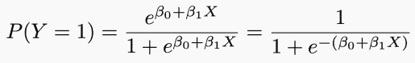
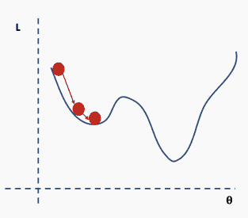

“你的大脑并不产生思想。 你的思想塑造了神经网络。 ”——Deepak Chopra

**引文**

J. Nocedal y S. Wright, “Numerical optimization”, Springer, 1999

TLDR: J. Bullinaria, “Learning with Momentum, Conjugate Gradient Learning”, 2015

作为阐明神经网络背后的理论以及如何设计和实现神经网络系列文章的第一篇，本文力求向更广泛的受众群体详细、深入的介绍神经网络，使对神经网络的工作几乎一无所知，或相对熟悉但可能还没有完全掌握的读者都能从中获益。我将在这篇文章中介绍神经网络的动机和基础知识。在以后的文章中将对神经网络和深度学习的设计和优化进行更深入的讨论。

本系列教程大部分基于哈佛和斯坦福的计算机科学及数据科学系的课程。

本系列教程中所有（全连接）机器学习的代码都在我的神经网络Github存储库中，通过以下链接就可以找到。

https://github.com/mrdragonbear/Neural-Networks

不论你之前对神经网络有多少了解，都希望你能愉快的看完这篇文章并学到一点知识。现在我们开始吧！

**神经网络的动机**

没有训练过的神经网络就像刚出生的婴儿：他们对于世界还一无所知（就白板理论而言），只有通过与世界的接触，如获得后验知识，才能慢慢改变他们的无知。算法则是通过数据感受世界——我们通过基于相关数据集训练神经网络来改变它的无知。在这个过程中我们评价的方法是监测神经网络产生的错误。

在深入神经网络的世界前，了解神经网络背后的动机，并理解它们的工作原理是很重要的。为此我们先简要介绍一下logistic回归。

回归是针对定量响应变量（出租车乘客数量，自行车租赁数量）建模并预测的方法，如岭回归、LASSO等。当响应变量是分类变量，这个问题就不再叫做回归问题，而被称为分类问题。

我们来考虑一个二分类问题。目标是基于一系列预测变量X，将每一个观测分到定义为Y的类别（如某一级别或集群）中。

如我们可能会根据病人的特征预测其是否有心脏病。这里的响应变量是分类变量的，只有有限个结局，更明确的说，只有两个结局，因为响应变量是二分类的（是/否）。

****

这里实际有很多特征，但现在我们只使用MaxHR。

为了做出预测，我们使用logistic回归。Logistic回归通过估计患者在给定X值时患心脏病的可能性P（y=1），来解决这个问题。

Logistic回归通过logistic函数来对P（y=1）建模：

这样，模型就能用S型曲线预测P（y=1），这也是logistic函数的基本形状。β0控制曲线右移或左移c=-β0/β1，而β1控制S型曲线的陡峭度。

注意，如果β1是正数， P（y=1）预测值随着X取值由小到大而从0到1变化，如果β1是负数，二者关系则相反。

作图总结如下：

既然我们明白了怎么控制logistic回归曲线，我们就可以通过调整一些变量来得到我们想要的曲线。

我们可以改变β0来移动曲线的偏移量。

我们可以调整β1来改变曲线的梯度

手工做这些事情太无聊了，而且你也很难调整到理想的取值。为解决这个问题我们用一个损失函数来量化基于目前参数产生残差的水平。然后寻找能够最小化损失函数的参数值。

因此神经网络的参数与网络生成的错误有关，当参数改变时，错误也会改变。我们用于调整参数的优化函数叫做**梯度下降**，这在寻找函数最小值时非常有用。我们希望能最小化错误，这也被叫做**损失函数**或**目标函数**。

那么以上这些内容有什么意义，和神经网络又有什么关联呢？实际上我们所做的与神经网络算法所做的本质是相同的。

我们在刚刚的模型中仅使用了一个特征，在神经网络中，我们可以使用多个特征。对于每一个特征都可以设置权重和误差项，这两部分结合起来就是回归参数。根据预测结果是连续变量或分类变量，公式可能略有差异。

当我们讨论神经网络的权重时，实际讨论的是传入函数的回归参数。传入函数的结果传递给激活函数，由激活函数决定这个结果是否足够“点燃”神经节点。在下一篇文章中，我将更详细地讨论不同种类的激活函数。

现在我们建立了一个由多个logistic回归和四个特征组成的简单神经网络。

为了开始更新和优化参数，我们需要从任意的值公式开始，我们将在每次更新后评估损失函数并执行梯度下降。

我们首先要做的是设置随机选择的权重。在我们的心脏数据中，随机权重很可能表现得很糟糕，模型会因此给出错误的答案。

然后我们通过惩罚表现不佳的网络来“训练”网络

然而，仅仅告诉计算机它的性能是好是坏并没有什么帮助。你需要告诉它如何改变这些权重才能提高模型的性能。

我们已经知道如何告诉计算机网络的预测性能良好，这只需要看看我们的损失函数。但是现在这个过程更复杂了，因为我们有5个权重要处理。首先我只考虑一个权重，因为这个过程对于所有的权重都是类似的。

理想情况下，我们需要知道能够让ℒ(w)达到最小值的w。

为了找到ℒ(w)的最优点，我们可以将ℒ(w)相对于权重w求微分，并使其为0。

然后我们需要找到一个满足这个等式的w，但有时候这个问题没有显式解。

一个更灵活的方法是选择任意一个起点，并确定在哪一个方向上减少损失（当前情况下是选择向左还是向右）。具体来说，我们可以计算出函数在这一点上的斜率。如果斜率为负，则向右移动；如果斜率为正，则向左移动。然后重复此过程，直到收敛。

如果步长与斜率成正比，就可以避免错过最小值。

如何执行这样不断更新的过程呢？这是使用一种称为梯度下降的方法完成的，这在前面已经简单地提到过。

**梯度下降**

梯度下降是求函数最小值的一种迭代方法。有各种的梯度下降方法，我将在后面的文章中详细讨论这些内容。这篇博客介绍了更新权重的不同方法。现在，我们将继续使用普通的梯度下降算法，有时也被称为**delta规则**。

我们知道要朝着导数的相反方向前进（因为我们正试图“远离”误差），并且希望步长与导数成比例。步长由一个称为学习速率的参数λ控制。我们的新权重是旧权重和新步长相加之和，其中步长是从损失函数派生出来的，这就表明相关参数在影响学习率方面有多重要（因此是导数）。

学习率越大，导数的权重就越大，这样算法的每次迭代步长都较大。学习率较小，导数的权重也较小，因此每次迭代步长较小。

如果步长太小，算法收敛时间会很长，如果步长太大，算法会不断错过最优参数。显然，在建立神经网络时，学习率是一个重要的参数。

梯度下降需要考虑以下几个问题：

*   我们仍然需要推导导数。

*   我们需要知道学习率是多少或如何设置。

*   我们需要避免局部极小值。

*   最后，完整的损失函数包括所有单个“误差”的总和。这可以是数十万个像上面例子一样的函数。

现在导数的推导是用自动微分法来完成的，所以这对我们来说不是问题。然而，决定学习率是一个重要而复杂的问题，我将在后面的教程中讨论。

对于神经网络来说，局部最小值是一个非常棘手的问题，因为神经网络的公式并不能保证我们能达到全局最小值。

陷入局部最小值意味着我们仅对参数进行了局部优化，但在损失函数表面的某个点可能存在更优解。神经网络损失曲面可以有许多这样的局部最优，这对于网络优化是有问题的。例如，请参见下面所示的损失面。

我们如何解决这个问题呢？一个建议是使用批量和随机梯度下降。这个想法听起来很复杂，但其实很简单——使用一批（一个子集）数据，而不是使用整个数据集，这样在每次迭代过程中损失函数的曲面都会部分变形。

对于每次迭代k，可以使用以下损失（似然）函数来推导导数：

这是完整损失函数的近似值。我们可以用一个例子来说明这一点。首先，我们从完整损失（似然）函数曲面开始，随机分配的网络权重为我们提供初始值。

然后我们选择一批数据，可能是整个数据集的10%，并构建一个新的损失函数曲面。

然后我们对这个批数据执行梯度下降并更新。

现在我们在一个新的位置。从完整数据集选择一个新的随机子集，然后再次构造损失函数曲面。

然后在这批数据上执行梯度下降和更新。

使用新数据重复以上过程。

执行更新。

这个过程重复多次迭代。

直到网络开始收敛至全局最小值。

现在我们的工具包中有足够的知识来构建我们的第一个神经网络。

**人工神经网络（Artificial Neural Network，ANN）**

我们已经了解了logistic回归是如何工作的、如何评估网络的性能、以及如何更新网络以提高性能，现在我们就可以着手构建一个神经网络了。

首先，我想让大家理解为什么神经网络被称为神经网络。你可能听说过，这是因为它们模仿神经元的结构，即大脑中的细胞。神经元的结构看起来比神经网络复杂得多，但功能相似。

真正的神经元的工作方式涉及到电位的积累，当超过特定值时，会导致突触前神经元放电穿过轴突并刺激突触后神经元。

人类拥有数十亿个相互连接的神经元，它们能产生极其复杂的放电模式。与我们使用最先进的神经网络所能做的相比，人脑的功能是不可思议的。因此，我们很可能不会很快看到神经网络能够模仿人脑的功能。

我们可以画一张神经图，把神经网络中的神经元结构和人工神经元进行类比。

**来源**

考虑到人脑的能力，很明显人工神经网络的能力范围是无限的——特别是当我们开始把它们与传感器、执行器以及互联网的丰富信息联系起来的时候——这就解释了神经网络在世界上的普及，尽管现在还处于相对初级的发展阶段。

毕竟，还原论者可能会争辩，人类只是通过神经系统的各个部分与传感器和执行器相连的神经网络的集合。

现在假设我们有多个特证。每个特征都通过一个称为仿射变换的东西传递，这个变换基本上是一个加法（或减法）和/或乘法。这形成了一个类似回归方程的东西。当多层感知器中的多个节点在一个节点上会聚时，仿射变换就变得很重要。

然后我们通过激活函数传递这个结果，这给了我们某种形式的概率。这个概率决定了神经元是否会激发——结果可以纳入到损失函数中，以评估算法的性能。

从现在开始，我将把仿射和激活模块抽象为一个模块。但是，我们要明白仿射变换是来自上游节点的输出的合并，然后将总和输出传递给一个激活函数，该函数通过评估概率来确定它是否是足以激发神经元。

现在我们可以回到第一个例子来使用心脏病数据。我们可以取两个logistic回归并将它们合并在一起。单个logistic回归如下：

当我们连接这两个网络时，由于自由度的增加，我们获得的网络具有更大的灵活性。

这很好地说明了神经网络的功能，我们能够将多个函数串联在一起（求和），这样就有了大量的函数（来自大量神经元），从而产生高度非线性函数。有了足够多的神经元，就可以产生任意复杂的连续功能。

这是一个非常简单的神经网络的例子，然而，我们还是遇到了一个问题，即使网络如此简单，又该如何更新权重值呢？

我们需要能够计算损失函数对这些权重的导数。为了解未知的权重w1、w2和w3，我们需要使用反向传播。

**反向传播 **

反向传播是神经网络学习的核心机制。它是告诉网络在预测过程中是否出错的信使。反向传播的发现是整个神经网络研究中最重要的里程碑之一。

传播就是在特定的方向或通过特定的媒介传递某种东西（例如光、声音）。当我们讨论神经网络背景下的反向传播时，我们讨论的是信息的传输，这个信息与神经网络在猜测数据时产生的误差有关。

在预测过程中，神经网络通过网络的节点向前传播信号，直到到达作出决定的输出层。然后，网络反向传播有关此预测的误差的信息，以便更改每个参数。

反向传播是计算网络中每个参数导数的方法，这是进行梯度下降所必需的。这是一个反向传播和梯度下降的重要区别，因为二者很容易混淆。我们首先执行反向传播，以获得执行梯度下降所需的信息。

你可能已经注意到我们仍然需要计算导数。计算机不能区分，但是我们可以建立一个函数库来实现这一点，而不需要网络设计者的参与，它为我们抽象化了这个过程，这被称为自动微分。下面是一个例子。

我们可以像这样手工完成，然后根据不同网络体系结构和不同节点更改它。

或者，我们可以编写一个与体系结构有内部链接的函数库，这样当网络体系结构更新时，过程就会被抽象并自动更新。

如果你真的想理解这个抽象的自动微分过程有多实用，尝试用六个节点组成一个多层神经网络，然后编写代码来实现反向传播（如果有人有耐心和勇气这么做，向你致敬）。

**更复杂的网络** 

对于大多数应用来说，有两个节点的网络并不是特别有用。通常，我们使用神经网络来近似传统方法难以描述的复杂函数。

神经网络是特殊的，因为它们遵循所谓的**普遍近似定理**。这个定理表明，在一个神经网络中，给定无限多个神经元，就可以精确地表示任意一个复杂的连续函数。这是一句相当深刻的话，因为它意味着只要有足够的计算能力，我们基本上可以近似任何函数。

显然，在实践中，这个想法有几个问题。首先，我们受到现有数据的限制，这限制了我们预测类别或估计值的潜在准确性。其次，我们受到计算能力的限制。设计一个远远超过世界上最强大的超级计算机能力的网络是相当容易的。

解决这个问题的方法是设计一个网络体系结构，这样我们就能够使用相对较少的计算能力，以最少的数据实现高精度。

更令人印象深刻的是，一个隐藏层足以表示任意精度的函数近似值。

那么，如果一层已经足够，为什么人们要使用多层神经网络呢？

具有多个隐藏层的神经结构

答案很简单。只有一层的网络需要一个非常宽的神经结构，因为浅网络比深网络需要（指数级别）更宽的宽度。此外，浅网络更容易过拟合。

这就是深度学习领域（深度指神经网络的多个层次）出现和发展的原因，深度学习在机器学习和大多数涉及数据分类和预测的领域占据着当代研究文献的主导地位。

**总结**

本文讨论了神经网络的动机和背景，并概述了怎样训练神经网络。我们讨论了损失函数、错误传播、激活函数和网络体系结构。下图对所讨论的所有概念以及它们是如何相互关联的进行了很好的总结。

本文的知识将提供一个强有力的基础，我们可以在以后的文章中进一步讨论如何提高神经网络的性能，并将其用于深度学习应用。

原文标题：

Introduction to Neural Networks

原文链接：

https://towardsdatascience.com/simple-introduction-to-neural-networks-ac1d7c3d7a2c

