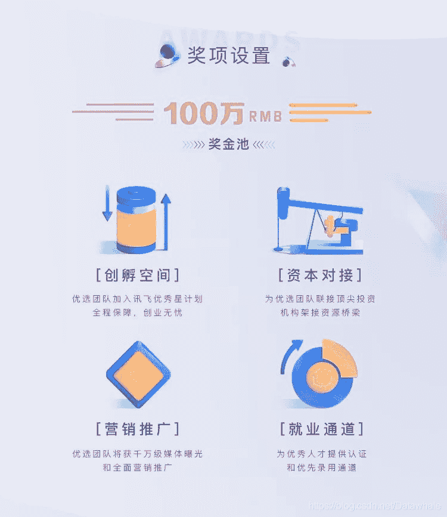

## 赛事背景

在科大讯飞9大赛题中，阿尔茨海默症作为其中之一，赋能医疗技术应用新场景。
痴呆症(Dementia)是一种慢性进行性疾病，患者主要表现为逐渐丧失日常生活自理能力，最常见的痴呆症种类是阿尔茨海默症 (Alzheimer’sdisease，AD)。由于没有治愈方法，在发病早期进行诊断和治疗十分重要。目前的诊断程序需要医疗专家进行全面检查，这需要大量的成本和时间。研究表明患者早期通常表现出语言障碍，故基于语音的自动检测筛查方法具有很大潜力。
赛事任务

为研究如何自动筛查出阿尔茨海默症，我们建立了一个普通话痴呆症检测数据库，为研究如何自动筛查出阿尔茨海默综合症患者。
看图说话任务取自波士顿失语症诊断测试(Diagnostic Aphasia Examination) [1]。任务要求主试者先向被试展示这幅图片然后说“告诉我你在这幅图里看到的正在发生的一切”。允许主试在被试无法说出很多内容的时候鼓励被试。每个音频文件都先被采集然后人工转出文本。音频中出现不属于看图说话任务的对话没有被转写。
看被试按医学诊断分为三类：
1.CTRL：健康
2.MCI：轻度认知障碍
[3.AD](http://3.AD)：可能是阿尔茨海默症或其他种类的痴呆症
比赛任务数据为看图说话的音频和对应文本。去除录音效果差，方言过多和测试中断等问题数据后，为了与国际研究匹配，又丢弃了小于40岁和受教育程度小于5年的样本。最终数据库中CTRL人数138，MCI人数179，AD人数84。
百万奖金领跑五大奖项

## 报名方式

[http://challenge.xfyun.cn/2019/gamedetail?type=detail/alzheimer?ch=dsyykl](http://challenge.xfyun.cn/2019/gamedetail?type=detail/alzheimer?ch=dsyykl)
奖项设置&赛程规则

初赛 6月21日——8月21日

1.  初赛截止成绩以团队在初赛时间段内最优成绩为准（不含测试排名）。
2.  初赛作品提交截止日期为８月20日17:00；初赛名次公布日期为8月21日10:00。
    复赛 8月21日——9月21日
3.  排名前20%的团队晋级复赛，大赛官网将公示团队信息。选手通过大赛官网下载新增的训练集和开发集，本地调试算法，在线提交结果。
4.  复赛成绩以参赛团队在复赛时间段内最优成绩为准。
5.  复赛作品提交截止日期为９月20日17:00；复赛名次公布日期为９月21日10:00。

决赛 10月24日

1.  前三名团队将受邀参加科大讯飞全球1024开发者节并于现场进行决赛。
2.  决赛以答辩（10min陈述+5min问答）的形式进行。
    根据复赛成绩和答辩成绩综合评分（复赛成绩占比70%，现场答辩分数占比30%）。
    3）各赛道TOP10选手将阶梯获得赛道奖金，第一名3万元、第二名2万元、第三名1万元、第四-第十名分别获得“算法菁英奖”2500元。
    其他奖项
    除对应奖金外，入围复赛的团队将获得定制Geek礼包、大赛入围证书、定制文化衫及科大讯飞全球1024开发者节通票等福利。

## 百万奖金领跑五大奖项

## 更多信息

【科大讯飞比赛组队&交流群】

识别下方二维码，添加Datawhale官方号

回复关键词：【科大讯飞】进群
