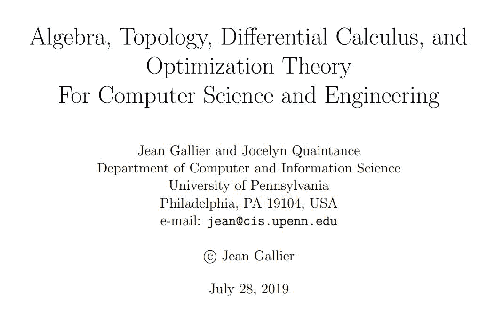
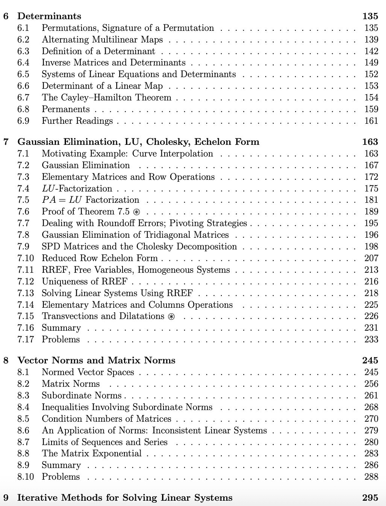
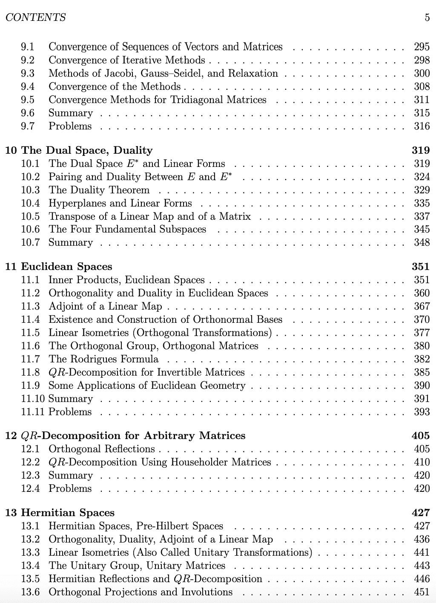
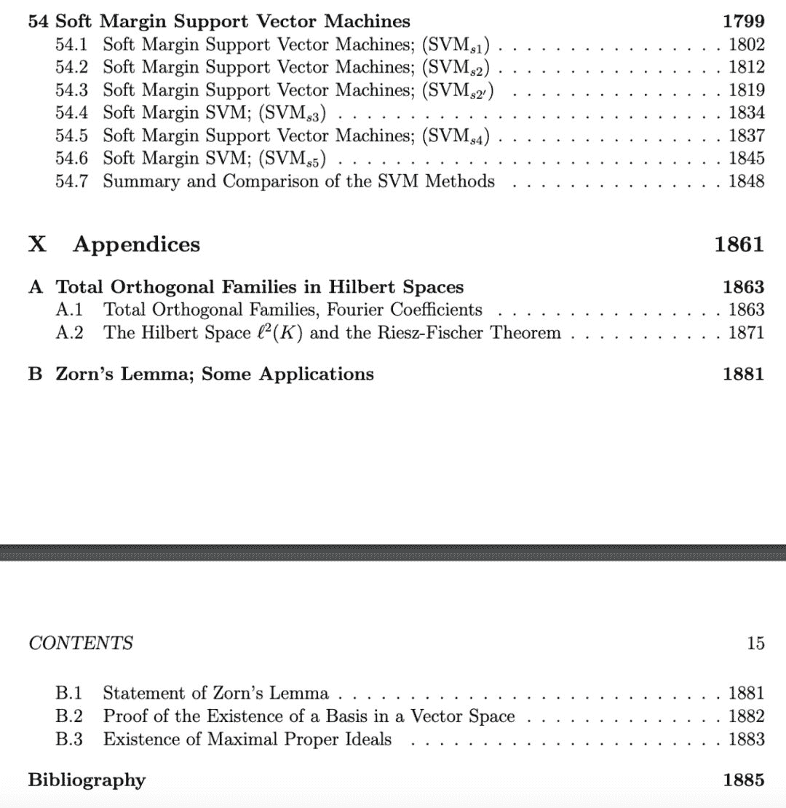

机器之心整理 

**机器之心编辑部**

> 学习计算机科学总共需要多少数学基础？ 大概 1900 页吧。 宾夕法尼亚大学计算机和信息科学系教授 Jean Gallier 的开源书籍《Algebra, Topology, Differential Calculus, and Optimization Theory For Computer Science and Engineering》用一本书的容量解决了所有问题。

这本书涵盖了计算机科学所需的线性代数、微分和最优化理论等问题，可谓详尽。

链接：http://www.cis.upenn.edu/~jean/math-basics.pdf

**为什么要读这本书？**

近年来，计算机科学、机器人学、机器学习和数据科学已经成为技术发展的重要推力。任何查看这些领域相关论文的人都会受到一些奇怪术语的困扰，如核 PCA、岭回归、套索回归、支持向量机（SVM）、拉格朗日乘数、KKT 条件等。这些奇怪的术语背后涉及的是大量有关最优化理论的「经典」线性代数知识。那么问题来了：要想理解并用好机器学习、计算机视觉等领域的工具，你就需要打好线性代数和最优化理论的知识基础。而且，你还需要学一些概率和统计方面的东西。

很多有关机器学习的书籍都在试图解决上述问题。如果你不了解拉格朗日对偶框架，那又从何理解领回归问题的对偶变量呢？同样地，如果你没有深刻理解拉格朗日框架，又怎么可能探讨 SVM 的对偶公式呢？

对这些问题避而不谈是一种省事的解决方式。如果你只是上述方法技巧的使用者，「食谱」类方法或许就足够了。但是，这种方法并不适用于那些真正想要从事研究并希望做出重大贡献的人。所以，作者认为，你还必须具有扎实的线性代数、最优化理论等方面的背景知识。

这会是一个问题，因为你需要投入大量的时间和精力来学习这些领域的知识，但作者相信坚持不懈的努力总会收到丰厚的回报。

**这本书讲了什么？**

这本书的主要目的是介绍线性代数和最优化理论的基础知识以及这些知识在机器学习、机器人学、计算机视觉等领域的应用。

该书包含以下 10 卷：

1\. 线性代数

2\. 仿射几何和射影几何

3\. 双线性形式的几何

4\. 几何：PID、UFD、诺特环、张量、PID 上的模块、规范形

5\. 拓扑和微分

6\. 最优化理论基础

7\. 线性优化

8\. 非线性优化

9\. 在机器学习中的应用

10\. 附录

从大纲来看，除了基础内容外，该书还探讨了一些对于应用非常重要的知识。

对于大部分内容，该书都提供了完整的证明，一是为了使该书自成体系，二是因为只有证明出来才能对内容有深刻的理解。但作者建议在第一次阅读时跳过那些证明过程，尤其是比较长或比较复杂的证明。

以下是本书的部分目录：

**作者**

本书作者 Jean Gallier 今年 70 岁，来自宾夕法尼亚大学。目前的研究方向主要为计算机图形学、计算机视觉、机器人技术等。他还曾发表过谐波分析与表征理论、线性代数和优化器的机器学习应用、关于微分几何和李氏群的说明等书籍。