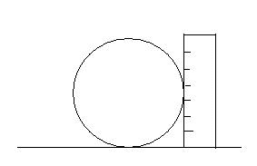
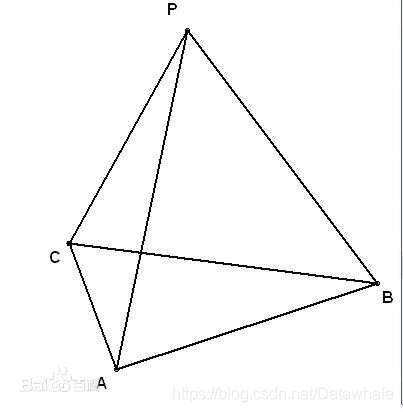

# 逻辑题目

逻辑题目现在也是面试中常考的题目,也不清楚面试出这种题目的意义,可能就是考察面试人员是否逻辑清晰. 这种题目没有什么好的方法,除非你见过原题,否则,只能根据所给出的条件慢慢分析,尽量不要用常规思路,希望大家要跳跃思维. 如果实在不行就给出一种解法,可能不是最优的,至少表示我们有逻辑.

## 1\. 猜数字

> **题目**:
> 两人玩游戏,在脑门上贴数字(正整数>=1),只看见对方的,看不见自己的,而且两人的数字相差1.

```
以下是两人的对话：
A：我不知道
B：我也不知道
A：我知道了
B：我也知道了
问A头上的字是多少，B头上的字是多少. 
```

**解析**: 只看见对方的,看不见自己的.

1.  假设A头上的数字是x(x>=1); B头上的数字是y(y>=1).
2.  条件1, A看到B头上的y,说不知道自己的是多少.
    确定y>=2, 这样的话x可以取两个值y+1,和y-1.
3.  条件2: B看到x后,说我也不知道,同理可以确定,x>=2, y取值是x-1和x+1.
4.  条件3, A说我知道了, 因为A的头上x取值是y-1和y+1, 尽然A说自己知道了, 肯定要排除y-1和y+1的其中的一个,现在有 x>=2, y>=2, 只有y=2的时候,y-1=1, 此时x只能是y+1=2, 如果x=1, B就可以直接知道自己的是2, A确定自己是3,之后,
5.  条件4, B说他也知道了, A是3, B是2和4,只有自己是2的时候,A才可能知道自己是3.

## 2\. 握手

> **题目**:
> 五队夫妇甲、乙、丙、丁、戊举行家庭聚会,每一个人都可能和其他人握手,但夫妇之间绝对不握手,聚会结束时,甲先生问其他人: 各握了几次手?
> 得到的答案是: 0、1、2、3、4、5、6、7、8，试问：甲太太握了几次手? 确定一点每一对夫妇一定会有一个人和其他夫妇握手.

**解析**:
每一对夫妇一定会有一个人和其他夫妇握手. 所有一对夫妇握手的次数和一定是8.
记0、1…8这9个人分别为A0、A1…A8。
首先，A8和A0是夫妇。因为A0没有和其他任何人握手，而A8握了别家的所有人的手。
继续推导，A1和A7是夫妇。因为A1已经和A8握过1次手，A7必须和除了A0和自己配偶以外的所有人握手，因此，A1和A7只能是夫妇。
同理，A2和A6是夫妇，A3和A5是夫妇，
最后，A4和甲是夫妇。题目中4只出现一次，因而甲和甲的夫人都握了4次手。

## 3\. 找出毒药

> **题目**:
> 实验室里有8瓶饮料，已知其中有且仅有一瓶有毒，小白鼠喝了有毒的饮料后，将会在24小时后毒发身亡。实验室的小李需要在24小时后知道有毒的饮料是哪瓶，他可以使用小白鼠试喝饮料，请问，小李最少需要用几只小白鼠试喝饮料?

**解析**:

将8个瓶子进行如下编码：
(000)_2=0
(001)_2=1
(010)_2=2
(011)_2=3
(100)_2=4
(101)_2=5
(110)_2=6
(111)_2=7
编码后的0/1位表示一个老鼠，0-7表示8个瓶子。按照3个二进制位中每位是否为1分类，即最低位为1的1、3、5、7号瓶子的药混起来给老鼠1吃，次低位为1的2、3、6、7号瓶子的药混起来给老鼠2吃，最高位为1的4、5、6、7号瓶子的药混起来给老鼠3吃.
24小时后，哪个老鼠死了，相应的位标为1。如最低老鼠1死了、次低老鼠2死了、最高老鼠3没死，那么就是011=5号瓶子有毒。
即：n只老鼠可以最多检验2^n个瓶子。所有8个饮料最多用三个小白鼠.

## 4\. 坏鸡蛋

> **题目**: 有十二个鸡蛋，有一个是坏的(重量与其余鸡蛋不同)请问用天平最少称几次,才能称出哪个鸡蛋是坏的?

**解析**：
题目中没有说明坏的蛋是比好的蛋重还是轻。本题可以将鸡蛋分成三份，每份四只。为表述方便，将鸡蛋编号为1到12。
第一次，取1234放在天平的左端，5678放在天平的右端。天平有两种情况，平衡或不平衡。
1）先分析天平平衡的情况：若平，则重量不同的蛋在剩下的4个中。
第二次用天平，任意取3个1到8号中的蛋放在天平的左端，从9到12号蛋中任意取3个（例如9，10，11）放在另右端，又有两种情况，平衡或不平衡
若平衡，则12号蛋为重量不同的蛋，第三次用天平，把12号蛋和其他任意一蛋比较，可以知道是轻还是重.
若不平衡，则可知重量不同的蛋在9，10，11这3个蛋中，并且可以知道他比其他蛋重还是轻，第三次用天平，任意取其中2蛋（例如9，10）放在天平两端，若平衡，则剩下的蛋（11号蛋）为要找的蛋，若不平衡，根据前面判断的该蛋是比较轻还是重可以判断天平上的其中一个蛋为要找的蛋.
2）下面分析第一次天平不平衡的情况。那么有左端重或者右端重两种情况，不妨假设左端重（如果是右端重也是一样的）。
现在第二次用天平，从左端任意拿下3个蛋（例如123），从右端拿3个蛋（例如567）放到左端，再从第一次称时剩下的4个蛋中任意拿3个（例如9，10，11）到右端，这时天平会出现3种情况：a）左端重，b）平衡，c）右端重。我们一个一个来分析。
a）左端重，那么要找的蛋肯定是4号蛋或者8号蛋。第三次用天平，把其中一蛋（例如4号蛋）放在天平左端，任意取其余10个蛋中的一个蛋放在右端，又有3种情况：
一）若平衡，则8号蛋为要找的蛋，并且根据第二次用天平的结果，可知比其余蛋轻。
二）若左端重，则4号蛋为要找的蛋，并且比其余蛋重。
三）若右端重，则4号蛋为要找的蛋，并且比其余蛋轻。
b）平衡，那么要找的蛋在从左端拿下的三个蛋（1，2，3）中，由于第一次用天平左端重，所以可知这个蛋比其余的蛋重，接下了来的分析和前面的一样，不再重复。
c）右端重，那么要找的蛋在从右端移到左端的3个蛋（5，6，7）中，并且由天平第一次左端重，第二次右端重可知，该蛋比其他蛋轻，接下来的分析同前面一样。
所以，需要称重三次。

## 5\. 测半径

> **题目**: 一个球、一把长度大约是球的直径2/3长度的直尺.你怎样测出球的半径?

**解析**:


## 6\. 过河

> **题目**: 有A、B、C、D四个人,要在夜里过一座桥。他们通过这座桥分别需要耗时1、2、5、10分钟,只有一支手电筒，并且同时最多只能两个人一起过桥. 请问,最短需要几分钟四人都能过桥?

**解析**:

```
A: 1
B: 2
C: 5
D: 10 
```

1.  AB过去(花费2分钟),A回来(花费1分钟),共1+2=3
2.  CD过去,让花费时间相近的人一起走,可以降低时间的浪费(花费10分钟), B回来(花费2分钟),共10+2=12
3.  AB一起过去(花费2分钟),ABCD全部过来共花费3+12+2=17分钟.

## 7\. 称石头

> **题目**: 给你8颗小石头和一架天平，其中有7颗石头重量一样，另外一个比这7颗略重。请问在最坏情况下，最少要称重几次，才能把这颗较重的石头找出来?

**解析**:

分为332.进行称重

首先任取8个石子中的6个进行称重,天平两边都是3个石子.

1.  如果重量相等
    再称剩下的两个石子即可找出重的.(2次)
2.  如果不相等.
    取较重的一边的任意2个称重,如果相等则剩下的1个是重的,如不相等则较重的一个是要找的石子.(2次)

最少两次称重可以找出重的石头.

## 8\. 倒水

> **题目**: 假设有一个池塘,里面有无穷多的水. 现有2个空水壶,容积分别为5升和6升. 问题是如何只用这2个水壶从池塘里取得3升的水.

**解析**:

1.  6升容器装满水, 将水把5升容器倒满, 则6升容器中剩下1升水.
2.  清空5升容器,并将6升容器中的1升水倒入5升容器中.
3.  6升容器装满水, 将水把5升容器倒满, 则6升容器中剩下2升水.
4.  清空5升容器,并将6升容器中的2升水倒入5升容器中.
5.  6升容器装满水, 将水把5升容器倒满, 则6升容器中剩下3升水.

## 9\. 绳子时间

> **题目**: 烧一根不均匀的绳子要用一个小时，如何用它来判断半个小时? 烧一根不均匀的绳子，从头烧到尾总共需要1个小时。现在有若干条材质相同的绳子，问如何用烧绳子的方法来计时45分钟呢?:

**解析**:
1\. 如何判断半个小时
将根绳子两头同时点燃,绳子全部烧完,就是半个小时.
2\. 如何计时45分钟,
选择使用两个绳子A和B,将绳子A两头点燃,绳子B一头点燃.
当绳子A烧完已经过去30分钟,此时点燃绳子B的另一端,直到绳子B烧完一共是45分钟.

## 10\. 植树

> **题目**: 怎么样种植4棵树木,使其中任意两棵树的距离相等?

**解析**：　
从三维空间考虑,画出一个空间正四面体,使其所有的边的长度相同．



# 参考(copy)

1.  [https://blog.csdn.net/linjcai/article/details/80868385](https://blog.csdn.net/linjcai/article/details/80868385)
2.  [https://www.julyedu.com/question/select/kp_id/1](https://www.julyedu.com/question/select/kp_id/1)
3.  [https://www.cnblogs.com/pang951189/p/7439670.html](https://www.cnblogs.com/pang951189/p/7439670.html)