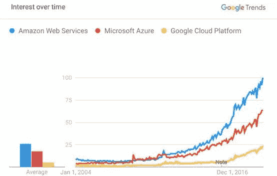

数据科学领域的劳动力市场正发生着快速的变化。曾经，能够搭建机器学习模型被认为是只有少数顶尖的数据科学家才能掌握的尖端技能，但如今，有一点基本编程经验的人就能根据教程完成Scikit-learn或者keras的模型训练。

顶着“本世纪最性感的职位”，行业内的招聘人员不得不面对大量的数据科学相关的求职申请，而这样火热的程度目前看不到降温的趋势，同时越来越多的数据科学相关的开发工具也变得更加易用。人们对数据科学家能给我们带来什么的期望已经改变，越来越多的公司逐渐认识到，训练机器学习模型只是在数据科学领域取得成功所需的很小一部分工作。

**这里，我们列举了四项成为伟大的数据科学家最有价值的品质：**

## **一、重点关注业务影响**

对于数据科学家而言，最常见的驱动力之一源自对于发现数据模式的好奇心：潜心于探索数据特征的探索、利用最新技术进行实验、系统性的测试并最终得到新的发现，这些工作都让数据科学家们感到兴奋。这种科学动机是数据科学家应该具备的。但如果它是唯一的动力，那也成了一个问题。

如果仅停留在数据层面，思路就会变的局限，最终迷失在数据统计的细节之中，忽略了具体应用场景和更大的公司业务背景。

顶尖的数据科学家懂得如何将他们的成果融入到公司整体的业务之中，并最终将其转化成商业价值。如果存在简单适用的技术，他们不会花费过多的时间去追求复杂的技术实现方式；在真正制定方案之前，他们会明确项目的意义并直击问题所在；他们会关注行动或者方案对整个团队的影响，并提前与相关人员进行沟通；他们会对新的项目和计划提供层出不穷的思路，并不介意自己在别人眼中是否过于“脑洞大开”；他们会对自己的方案帮助到更多的人感到自豪，而不是使用了更先进的技术。

数据科学目前仍是一个不规范的行业，学术教育与产业需求间存在着很大的代沟。顶尖的数据科学家无惧于走出“舒适区”，去面对更棘手的问题并最大限度地发挥其作用。

## **二、扎实的软件工程技能**

当设想数据科学家的理想形象时，浮现在人们脑海中常常是在工作在顶级大学中的著名的AI学科教授。在企业需要提升模型准确率去面对更激烈的竞争时，纳入这样的人才无疑是明智的。因为为了提高传统方法准确率最后剩余的几个百分点，必须去关注数学方法的细节，验证复杂的方案，甚至为了特定问题去定制化的研发统计学技术。

但在实际工作中，这种场景太少见了。对于大部分企业而言，标准模型的准确率已经足够，再投入大量时间和人力去把模型优化成最好、最先进的模型并不那么具备性价比。更重要的是尽早建立精度尚可的模型并建立模型与业务系统的回馈循环，可以让你能开始迭代并快速找到模型的最佳使用场景。纠结于准确率的细微差别通常并非一个数据科学项目成败的关键点，这也是在实际业务开发中，工程技能比科学技能更重要的原因。

通常，一个数据团队的运作流程是这样的：首先数据科学家建立解决方案的原型，并提供试错和意面式的代码（覆盖功能点但没有系统化的代码）；如果结果看起来还不错，代码就会交付给软件工程师，由软件工程师将这些草稿改写成可扩展的、高效的、可维护的代码。数据科学家并不要求像软件工程师那样提交产品级的代码，但如果数据科学家对软件工程更加熟悉，并且对可能发生的架构问题有所了解的话，整个工程会变的更加顺畅和高效。

随着越来越多的数据科学工作流程正在被全新的软件框架所替代，扎实的软件开发技能也成为了数据科学家们的必备技能之一。

## **三、谨慎的期望管理**

站在领域外的角度看，数据科学是一个边界模糊并且令人难以捉摸的领域。这是炒作还是世界正在经历革命性的变革？是否所有的数据科学项目都是机器学习项目？这些人的身份是科学家、工程师还是统计学家？他们是做什么的，软件产品还是可视化的仪表盘？为什么模型给我的结果是错的，有谁能修复这个bug么？他们现在只给了这么几行代码，过去的几个月他们都做了什么？

面对数据科学，很多事情都显得那么不清楚，而同一个企业中的不同的人于数据科学家的期待也不一样。

**对于数据科学家很重要的一点是：主动并持续与工作相关的人员进行沟通交流，明确工作预期，尽早消除误解，并让大家的认知达成一致。**

顶尖的数据科学家懂得面对不同背景、不同目标的人采用不同的沟通方式，因为各种因素都会造成对数据科学的不同预期。顶尖的数据科学家要能通过一种简单易懂的方式给零技术基础的人讲清楚复杂的数据处理方法，以便达成工作目标；他们知道什么时候去消除过于乐观的预期，什么时候该说服过于悲观的同事。最重要的是，他们强调数据科学固有的实验性质，当一个项目的成功仍不明朗时，他们不会过度承诺。

## **四、熟悉云服务**

云计算是数据科学工具的核心部分。在很多情况下，在本地服务器上运行Jupyter Notebook达到硬件资源极限后仍不足以完成任务。当需要在计算能力强大的GPU上训练机器学习模型、在分布式集群上并行化数据预处理、部署REST API来发布机器学习模型、管理和共享数据集或查询数据库以进行大规模分析时，云服务尤其重要。

**目前，最大的云服务提供商包括亚马逊云服务（AWS），微软的Azure和谷歌云平台（GCP）。**

考虑到大量的服务和平台之间的差异，云服务提供商提供的服务并不能胜任数据科学的全部方面。但重要的是要对云计算有一个基本的了解，以便在你需要他们的时候能够通过浏览文档来了解他们是如何工作的。至少，这可以让你提出更好的问题，并为友好的社区数据工程师制定更具体的要求。

**结语**

好了，对于那些希望从零开始组建数据科学团队的公司，我推荐他们去寻找那些务实的问题解决者，他们具有强大的工程技能和敏锐的业务价值洞察力。统计学技能的优势可以带来很多价值，但在很多应用场景中，它并非像以前那么重要，尤其对于创建初期的数据科学团队。

但目前而言，大多数公司更倾向于雇佣具有强大学术背景的数据科学家，比如数学或物理学博士。考虑到数据科学行业近年来的发展趋势，未来是否会有更大比例的软件工程师或技术产品经理转变为数据科学角色，将是一个有趣的问题。

原文标题：

What Separates Good from Great DataScientists?

原文链接：

https://towardsdatascience.com/what-separates-good-from-great-data-scientists-2906431455fd

