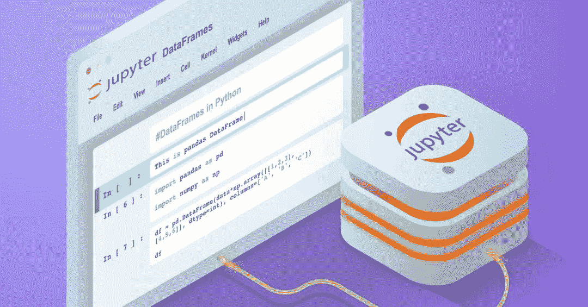
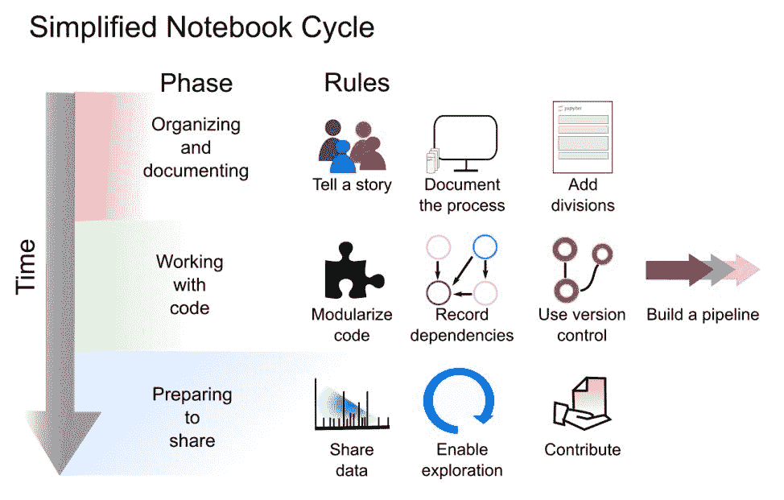

选自arXiv

**来源：机器之心，作者：Adam Rule、Amanda Birmingham等**

> 你真的是 Jupyter Notebook 高手吗，真的能将代码和文档打造成铁桶一般的整体吗？

Jupyter Notebook 是一个非常常用的代码编辑器，它非常适合做数据分析与代码展示，很多云服务也采用它作为代码编辑器。此外，因为用这种编辑器看代码比较轻松，文档描述和输出效果也能进一步帮助理解，很多研究者都会采用 Jupyter 作为解释研究实现的工具。

如果 Jupyter Notebook 写的好，那么研究实现及复现就更优美，如果再放到 Colab 等具有免费算力的工具上，那就比较完美了。

在机器之心之前介绍过的文章中，我们关注 Jupyter Notebook 的炫酷插件与主题风格，更强调工具本身的使用姿态。而一篇发在 arXiv 上的文章介绍了什么是展示实现代码的十大简单规则，我该又该如何利用它们构建 Jupyter 项目。这对于研究者和希望展示项目实现的开发者而言非常重要，我们可以像说故事一样介绍我们的实现。

论文链接：https://arxiv.org/pdf/1810.08055.pdf

下面，我们就以展示可复现性研究成果为目标，看看 Jupyter 要怎样写才比较合理。

**Jupyter Notebook 与研究的可复现性**

可复现性（Reproducibility）需要提供研究所用数据、软件、依赖项和计算环境（如硬件或云配置）的人类可读和机器可读的描述，以及介绍如何组合以上所有部分的文档。

之前分析人员通常将这些信息保存在单独的数据、分析、结果、配置和注释文件中（这些文件通常很难组合和共享），不过他们越来越多地使用计算型 notebook（如 Jupyter Notebooks 和 R Notebooks），在单个交互式和可移植文档中组合可执行代码、渲染可视化效果和描述性文本。

Jupyter Notebooks 大大降低了可复现性的困难，它使科学家能够轻松地编写混合了代码、结果和文本的共享计算叙述，从而支持可复现性研究。然而，像 Jupyter Notebook 这样的计算型 notebook 并没有解决实现可复现性的所有障碍，而且它们还引入了另一些独特的挑战，其中部分挑战源于它们的交互性。

考虑到在 Jupyter Notebooks 上发布可复现研究的技术和社会障碍，来自加州大学圣地亚哥分校和伯克利分校的研究者编制了一套规则、提示、工具和示例 notebook。这套规则专注于 Jupyter Notebooks，不过也适用于其他混合了实时代码和叙述性描述的文档。

下图 1 展示了在 notebook 开发周期不同阶段所应用的规则。

*图 1：**将十个简单规则应用于创建 Jupyter Notebooks 的工作流。**从上到下，该图描述了开发一个记录详尽、功能良好、用于可复现性研究的 Jupyter Notebooks 所需的三个不同的阶段。*

**规则 1：****为观众讲故事**

使用 Jupyter Notebooks 的一个主要好处是，它能将解释性文本与代码和结果交织在一起，创建计算性叙述 [8]。不要只保留零星的笔记，而是用解释性文字讲述一个引人入胜的故事，故事的开头介绍主题，中间介绍步骤，结尾解释结果。不仅要描述你做了什么，还要描述为什么要这样做、这些步骤是如何连接的，以及它们意味着什么。

如何讲述这个故事将取决于你的观众。你打算和实验室的非技术同事、另一个实验室的分析师、某一期刊的读者还是公众分享你的 notebook？你可能需要为每一类观众提供不同种类和级别的解释。

**规则 2：****记录过程，而不仅仅是结果**

计算型 notebook 的交互特性使得尝试和对比不同方法或参数更加快速和容易，以至于我们在执行这些交互式调研时往往无法将其记录下来。因此，这个建议变得更加重要：确保记录下所有的探索，甚至那些导致进入死胡同的探索！这些将帮助你记住做了什么和为什么做。

许多 notebook 用户等到分析结束、得到了可靠结果后，才添加这样的解释性文字。不要等，到那时你可能已经忘记了为什么选择某个特定参数值、从哪里复制了一段代码，或者中间结果的有趣之处是什么。如果你没有时间全面记录你此刻正在做什么或在想什么，那么留下简短的描述性笔记来提醒自己，在可以停下时抓紧把这些内容添加上。

**规则 3：****添加分割，使步骤更清晰**

notebook 是一个交互式的环境，所以它很容易编写和运行单行单元格。这有利于实验，但会让 notebook 凌乱不堪，充满难以理解的短小片段。那么，尝试让 notebook 中的每个单元格执行一个有意义的分析步骤，并且该步骤可以根据单元格中的代码或周围的 markdown 描述很容易地理解。

按单元格模块化代码，并在单元格上方用 markdown 标记。将每个单元格想象为一个段落、拥有一个函数或完成一个任务（例如，创建一个绘图）。避免长单元格（任何超过 100 行或一页的内容都太长了）。在代码注释中放入低级文档。使用描述性的 markdown header 将 notebook 分区，使其可以轻松导航和添加目录。将长 notebook 拆分为一系列 notebook，并保留一个 top-level index notebook，其中包含指向各个 notebook 的链接。

**规则 4：****模块化代码**

避免重复代码总是很好的做法，但是在 notebook 中，复制一个单元格、调整几行、将生成的代码粘贴到新单元格或其他 notebook 中并再次运行是特别容易的。这种试验形式很方便，但如果你想更改复制的代码的功能或修复其中的 bug，就会使 notebook 难以阅读，并且几乎不可能进行维护。因此你可以将要复制和重用的代码包装在一个函数中，这样就可以根据需要从任意多个单元格中调用该函数。如果你要在其他项目或 notebook 中重用代码，请考虑将其转换为模块、包或库，并遵循良好的软件开发实践（如单元测试）。

模块化不仅节省空间，支持维护，调试方便，还使增加交互性变得更加简单。

**规则 5：****记录依赖项**

未来重新生成分析时，不仅需要访问代码，还需要访问依赖项。计算科学的最佳实践是，从一开始就使用诸如 conda 的 environment.yml 或 pip 的 requirements.txt 之类的工具明确地管理依赖项，以列出所有相关的依赖项（包括它们的软件版本）。始终在这些依赖项创建的环境中工作，以确保不添加未记录的依赖项。

在 notebook 中，你可以使用 notebook 的扩展（如 watermark）显式打印依赖项。列出 notebook 中关键依赖项的版本（最好列在最下方），如果 notebook 与环境隔离使用，那么这将保证 notebook 中仍然包含关键信息，从而帮助读者复制结果。

**规则 6：****使用版本控制**

版本控制是 notebook 使用的一个重要辅助工具，因为 notebook 的交互特性使其很容易意外地更改或删除重要内容。此外，由于 notebook 中包含代码，代码不可避免会有 bug，因此确定 bug 引入与修复的时间（及其可能影响的分析）是科学计算中的一项关键能力。

但是，请注意，Jupyter Notebook 将每个单元格的代码和特定且广泛的元数据存储为 JSON 格式的文本文件。版本控制系统比较这些 JSON 文件中的差异，而不是用户友好型 notebook GUI（图形用户界面）中的差异。

**规则 7：****构建 pipeline**

记录初步探索性研究的 notebook 很少能被广泛推广，但一旦确定了某种稳定的分析方法，设计良好的 notebook 就可以通过 pipeline 推广到其他任务中，从而使用不同的输入数据和参数很容易地重复分析。记住这一点，从一开始就设计你的 notebook，以允许将来重新调整用途。把关键变量声明（尤其是在进行新的分析时会改变的变量）放在 notebook 的顶部，而不是埋在中间的某个地方。直接在 notebook 中执行准备步骤，如数据清理，并尽可能避免手动干预。

**规则 8：****分享和解释数据**

如果底层数据被锁定，那么访问清晰注释的 notebook 对可复现性也几乎没有用处。努力使你的数据或数据样本与 notebook 一起公开。notebook 可以很容易地提供输入数据和上游处理步骤的描述，这对于解释结果至关重要。

理想情况下，你可以在 notebook 中共享整个数据集。我们认识到许多数据集太大或太敏感，无法以这种方式共享。在这些情况下，考虑将大型和复杂的数据集分解为多个层次，这样即使原始数据太大，无法与已发布的 notebook 一起共享，或者受到隐私或其他访问问题的限制，也不会影响到可复现性。

**规则 9：****允许阅读、运行和探索 notebook**

如果你遵循了前面的规则，那么你的 notebook 应该能够捕获整个过程并易于阅读。但是其他人如何访问、运行和探索它们呢？你可以通过多种方式支持他人重用你的 notebook。首先，将 notebook 存储到一个具备清晰 README 文件的公共代码库中。

除了允许重用之外，你还要考虑如何利用 notebook 的独特结构来支持阅读和探索。至少，将所有 notebook 的静态 HTML/PDF 版本存储在出版物附带代码库的最终版本中。

**规则 10：****促进可复现和开放的研究**

显然，仅使用计算型 notebook 并不能保证研究的可复现。如果 notebook 的便利性和交互性让你满意，那你可以采取下一步行动，在实验室或工作场所宣传其可复现性。让实验室的同事试着运行你的 notebook，然后听他们解释在什么地方出了问题。也试着运行他们的 notebook，让他们知道你是否遇到了障碍。

将可复现性作为研究小组所有计算工作的关键要素，而不是在分析完成后才执行，或被期刊或评审人员要求后才思考。

