本文我们聊聊如何才能画出炫酷高大上的神经网络图，下面是常用的几种工具。

作者&编辑 | 言有三  

**1 **NN-SVG

这个工具可以非常方便的画出各种类型的图，是下面这位小哥哥开发的，来自于麻省理工学院弗兰克尔生物工程实验室, 该实验室开发可视化和机器学习工具用于分析生物数据。

github地址：https://github.com/zfrenchee

画图工具体验地址：http://alexlenail.me/NN-SVG/

可以绘制的图包括以节点形式展示的FCNN style，这个特别适合传统的全连接神经网络的绘制。

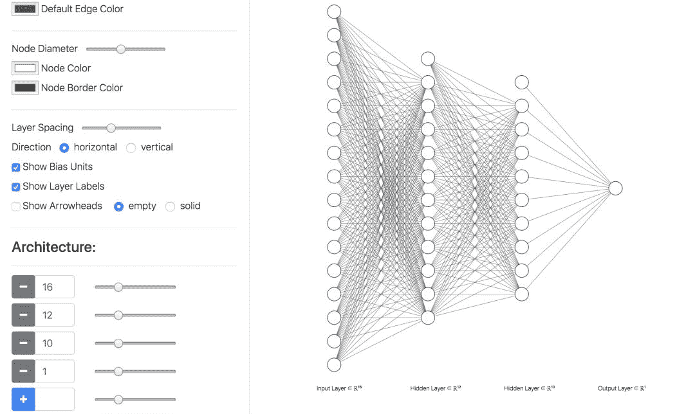

以平铺网络结构展示的LeNet style，用二维的方式，适合查看每一层featuremap的大小和通道数目。

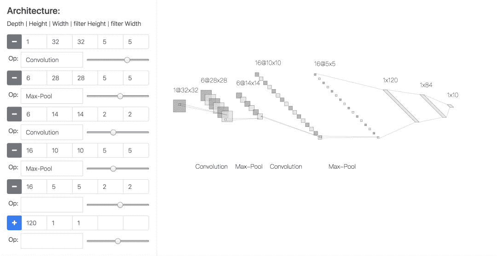

以三维block形式展现的AlexNet style，可以更加真实地展示卷积过程中高维数据的尺度的变化，目前只支持卷积层和全连接层。

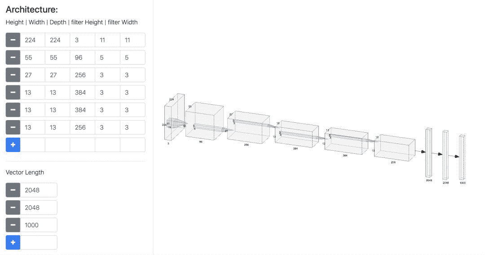

这个工具可以导出非常高清的SVG图，值得体验。

**2 PlotNeuralNet**

这个工具是萨尔大学计算机科学专业的一个学生开发的，一看就像计算机学院的嘛。

首先我们看看效果，其github链接如下，将近4000 star：

https://github.com/HarisIqbal88/PlotNeuralNet

看看人家这个fcn-8的可视化图，颜值奇高。

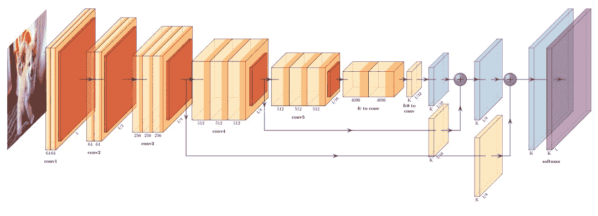

使用的门槛相对来说就高一些了，用LaTex语言编辑，所以可以发挥的空间就大了，你看下面这个softmax层，这就是会写代码的优势了。

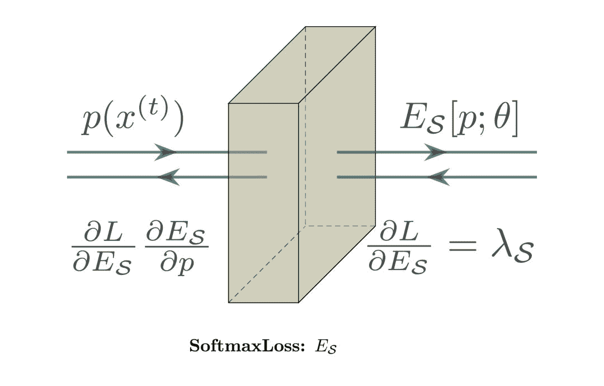

其中的一部分代码是这样的，会写吗。

\pic[shift={(0,0,0)}] at (0,0,0) {Box={name=crp1,caption=SoftmaxLoss: $E_\mathcal{S}$ ,%    

fill={rgb:blue,1.5;red,3.5;green,3.5;white,5},opacity=0.5,height=20,width=7,depth=20}};    

相似的工具还有：https://github.com/jettan/tikz_cnn

**3 **ConvNetDraw

ConvNetDraw是一个使用配置命令的CNN神经网络画图工具，开发者是香港的一位程序员，Cédric cbovar。

采用如下的语法直接配置网络，可以简单调整x，y，z等3个维度，github链接如下：

https://cbovar.github.io/ConvNetDraw/

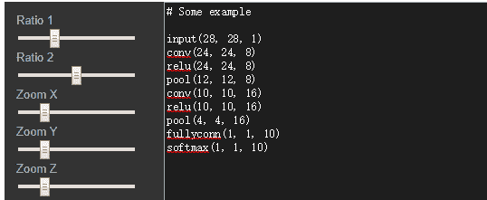

使用方法如上图所示，只需输入模型结构中各层的参数配置。

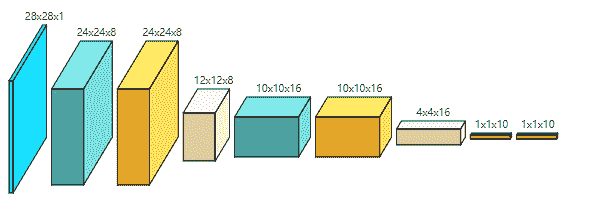

挺好用的不过它目标分辨率太低了，放大之后不清晰，达不到印刷的需求。

**4 Draw_Convnet**

这一个工具名叫draw_convnet，由Borealis公司的员工Gavin Weiguang Ding提供。

 简单直接，是纯用python代码画图的，

https://github.com/gwding/draw_convnet

看看画的图如下，核心工具是matplotlib，图不酷炫，但是好在规规矩矩，可以严格控制，论文用挺合适的。

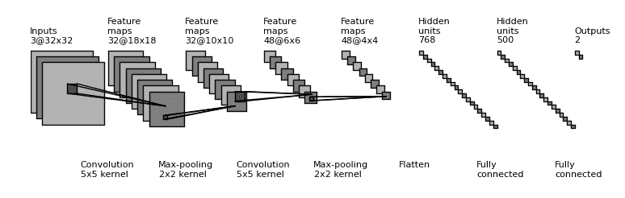

类似的工具还有：https://github.com/yu4u/convnet-drawer

**5 Netscope**

下面要说的是这个，我最常用的，caffe的网络结构可视化工具，大名鼎鼎的netscope，由斯坦福AILab的Saumitro Dasgupta开发，找不到照片就不放了，地址如下：

https://github.com/ethereon/netscope

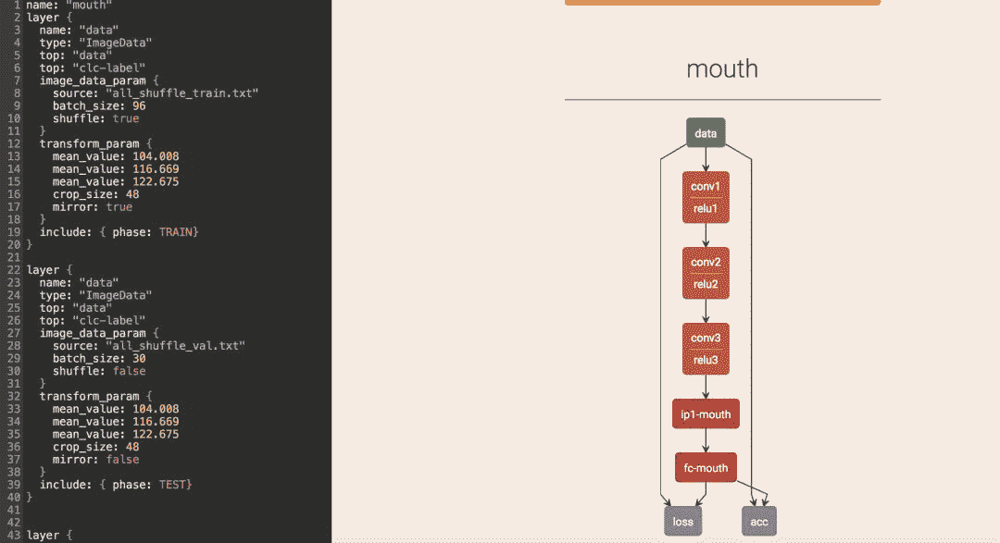 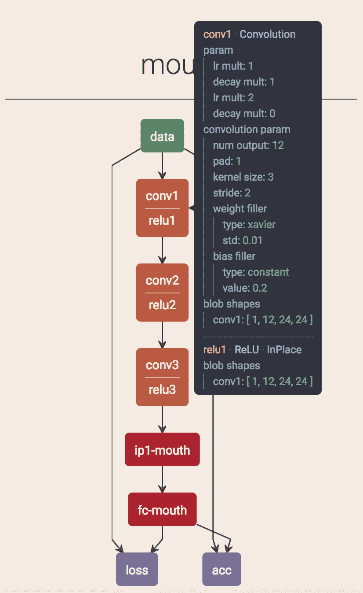

左边放配置文件，右边出图，非常方便进行网络参数的调整和可视化。这种方式好就好在各个网络层之间的连接非常的方便。

**其他**

再分享一个有意思的，不是画什么正经图，但是把权重都画出来了。

http://scs.ryerson.ca/~aharley/vis/conv/

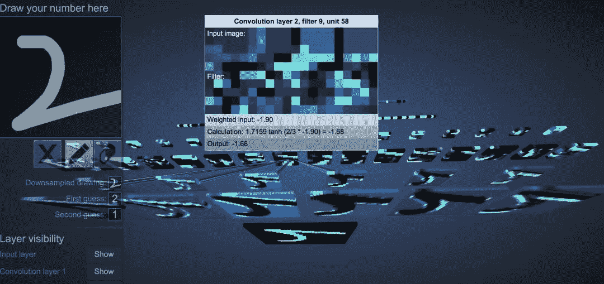 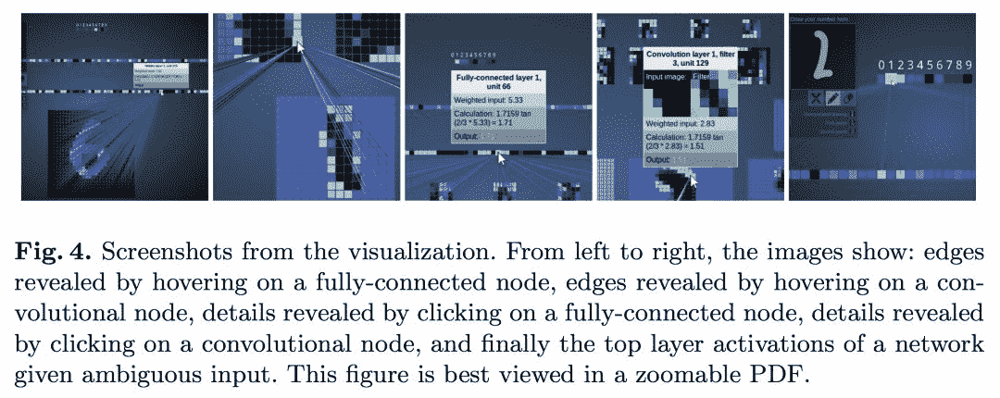

