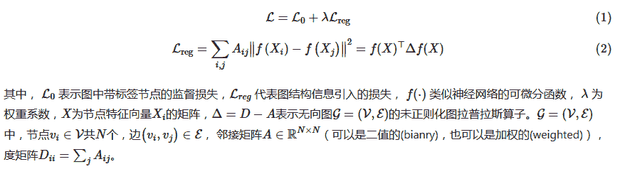
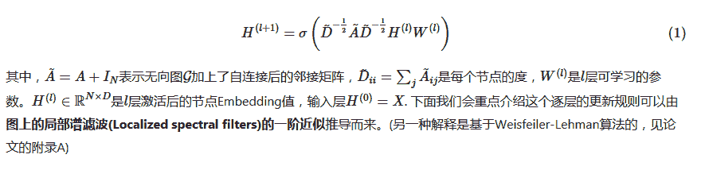
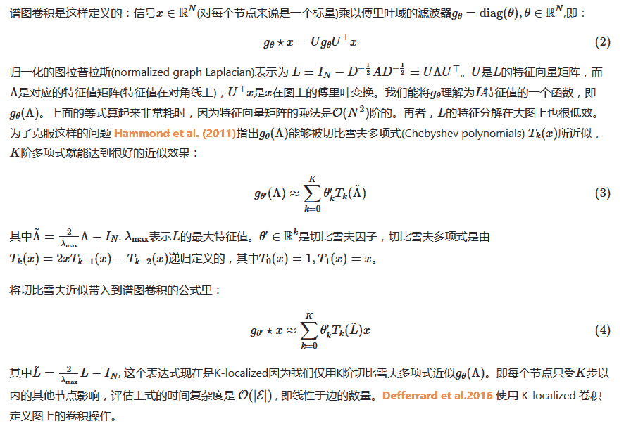
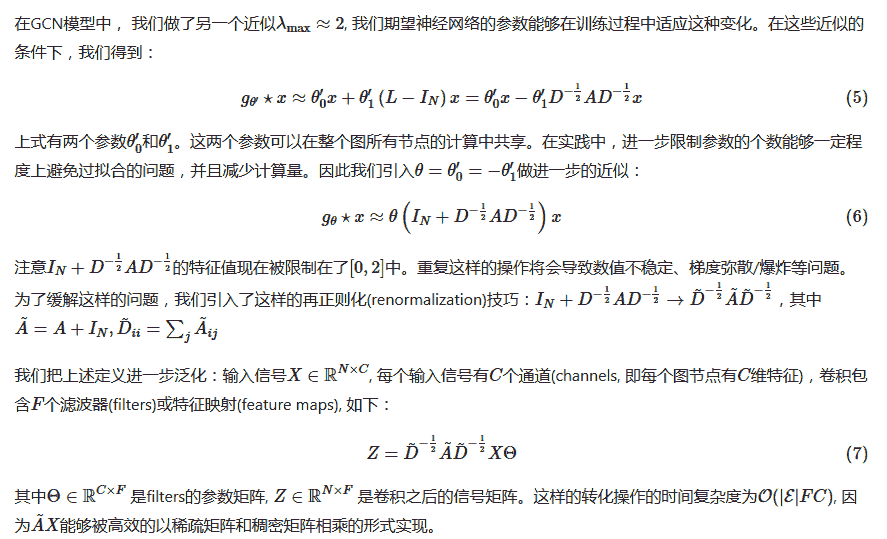
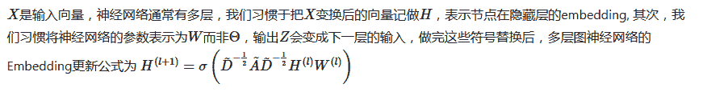
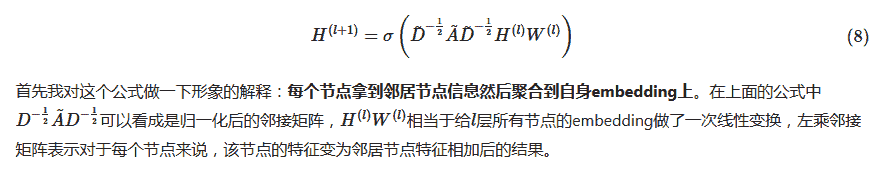
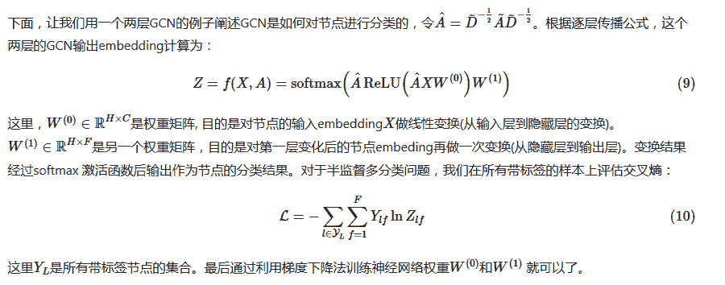

c点击上方“**Datawhal****e**”，选择“星标”公众号

第一时间获取价值内容

**【导读】**这是我们介绍图神经网络的第一篇文章，取自Kipf et al. 2017，文章中提出的模型叫Graph Convolutional Network(GCN)，个人认为可以看作是图神经网络的“开山之作”，因为GCN利用了近似的技巧推导出了一个简单而高效的模型，使得图像处理中的卷积操作能够简单得被用到图结构数据处理中来，后面各种图神经网络层出不穷，或多或少都受到这篇文章的启发。

目录

1、问题定义

2、图上的快速卷积近似

     a 谱图卷积(Spectral Graph Convolutions)

     b 逐层线性模型

3、半监督学习节点分类

     a 传播公式解释

     b 例子

4、后话

5、Reference

正文

**  1. ****问题定义**

考虑图（例如引文网络）中节点（例如文档）的分类问题，通常该图中只有一小部分节点有标签。这类问题可以划分到基于图的半监督学习问题中。为了对节点进行分类，首先我们可以利用节点自身的特征信息，除此之外，我们还可以利用图结构信息，因此一个典型的图半监督学习问题可以采用下面的学习策略：

这样的学习策略基于图中的相邻节点标签可能相同的假设。然而，这个假设可能会限制模型的能力，因为图的边不一定代表所连接节点相似。

因此，在这个工作中，作者不再显示的定义图结构信息的损失函数 Lreg, 而是使用神经网络模型f(X,A)直接对图结构进行编码，训练所有带标签的结点L0，来避免损失函数中的正则化项Lreg。

这篇文章的主要贡献是为图半监督分类任务设计了一个简单并且效果好的神经网络模型，这个模型由谱图卷积(spectral graph convolution)的一阶近似推导而来，具有理论基础。

**  2. 图上的快速卷积近似**

这一节介绍如何从谱图卷积推导出GCN的逐层更新模型，涉及到一些谱图理论的知识，可以安全的跳过这一节，后面我们会为谱图卷积出一个专栏的文章，详细讨论它们

这一节主要介绍图神经网络逐层更新(propagation)的理论推导。多层图卷积网络(Graph Convolutional Network, GCN)的逐层传播公式：

**2.a 谱图卷积(Spectral Graph Convolutions)**

**  2.b. 逐层线性模型**

现在假设我们限制K=1，即谱图卷积近似为一个关于L的线性函数。这种情况下，我们仍能通过堆叠多层来得到卷积的能力，但是这时候，我们不再受限于切比雪夫多项式参数的限制。我们期望这样的模型能够缓解当图中节点度分布差异较大时对局部结构过拟合问题，比如社交网络，引文网络，知识图谱等。另一方面，从计算的角度考虑，逐层线性模型使我们可以构建更深的模型。

**  3. ****半监督学习节点分类**

针对非欧几里得结构化数据表示问题，研究者们引入了图论中抽象意义上的图(Graph)来表示非欧几里得结构化数据。

** 3.a.传播公式解释**

上一节中，我们从谱图卷积理论中推导得到了GCN是如何逐层更新节点embedding的

** 3.b 例子**

** 4\. 后话**

实现时，由于GCN需要输入整个邻接矩阵A和特征矩阵X, 因此它是非常耗内存的，论文中作者做了优化，他们将A作为稀疏矩阵输入，然后通过实现稀疏矩阵和稠密矩阵相乘的GPU算子来加速计算，然而，即使这样，整个矩阵仍然存在这要被塞进内存和显存中的问题，当图规模变大的时候，这种方法是不可取的，在下一篇GraphSAGE的博文中，我们将会介绍如何巧妙的克服这样的问题。

** 5****.Reference**

<u>Semi-Supervised Classification with Graph Convolutional Networks</u>

